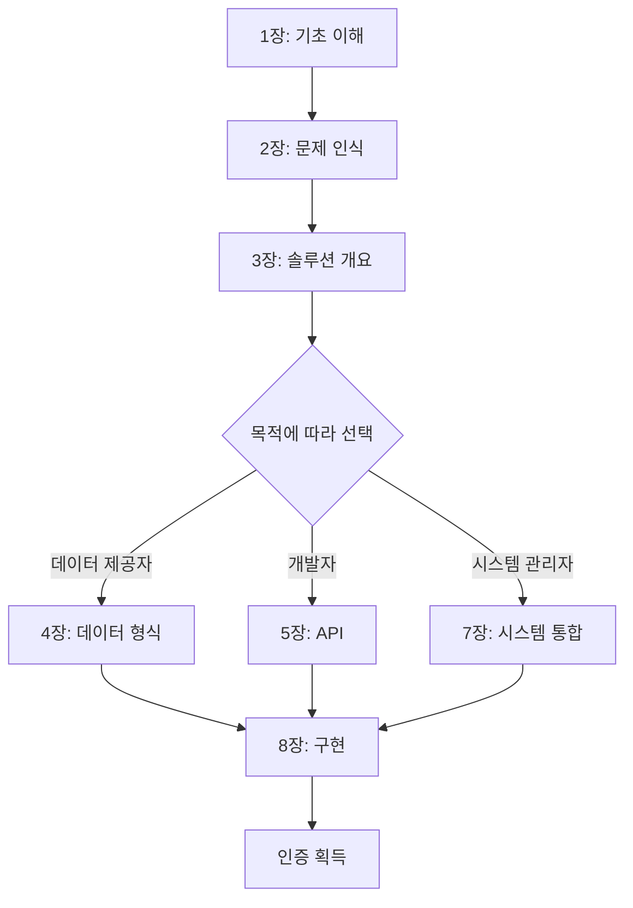

# 제1장: 방언 보존의 의미와 WIA-LANG-004 표준 소개

## 弘益人間 (홍익인간) - 널리 인간을 이롭게 하라

방언은 단순한 언어의 변형이 아닙니다. 그것은 한 지역 공동체의 역사, 문화, 정체성이 응축된 살아있는 유산입니다. WIA-LANG-004 Dialect Preservation 표준은 전 세계의 소중한 방언들을 디지털 시대에 보존하고 전승하기 위한 국제 표준입니다.

## 1.1 방언이란 무엇인가?

### 1.1.1 방언의 정의

방언(方言, dialect)은 특정 지역이나 사회 집단에서 사용되는 언어의 변이형태를 말합니다. 방언은 다음과 같은 특성을 가집니다:

| 특성 | 설명 | 예시 |
|------|------|------|
| **음운적 차이** | 발음과 억양의 차이 | 경상도: "뭐라카노", 전라도: "뭐라고 하는디" |
| **어휘적 차이** | 사용하는 단어의 차이 | 표준어: 감자 / 강원도: 감재 / 제주도: 지실 |
| **문법적 차이** | 문법 구조의 차이 | 충청도: "~유", 경상도: "~노" |
| **화용적 차이** | 사용 맥락과 관습의 차이 | 존댓말 체계, 호칭 방식 |

### 1.1.2 한국의 주요 방언권

한국어는 크게 다음과 같은 방언권으로 구분됩니다:

```
한국어 방언 분류 체계
├── 중부 방언
│   ├── 서울 방언 (표준어 기반)
│   ├── 경기 방언
│   ├── 충청 방언
│   └── 강원 방언
├── 서남 방언
│   ├── 전라 방언
│   │   ├── 전북 방언
│   │   └── 전남 방언
│   └── 제주 방언 (독립 언어 수준)
├── 동남 방언
│   ├── 경북 방언
│   └── 경남 방언
└── 북부 방언 (북한 지역)
    ├── 평안 방언
    ├── 함경 방언
    └── 황해 방언
```

## 1.2 왜 방언을 보존해야 하는가?

### 1.2.1 문화적 가치

방언은 지역의 고유한 문화적 자산입니다:

**1. 정체성의 근간**
- 지역 주민의 정체성과 소속감 형성
- 세대 간 연결 고리 역할
- 지역 공동체의 결속력 강화

**2. 역사적 증거**
- 언어 변화의 역사적 기록
- 지역 역사와 이주 패턴 추적
- 고대 언어 형태의 보존

**3. 문학적·예술적 자원**
- 지역 문학과 구비 문학의 기반
- 전통 음악과 공연 예술의 핵심 요소
- 현대 문화 콘텐츠의 독특한 소재

### 1.2.2 언어학적 가치

```python
# 방언의 언어학적 가치 분석 모델
class DialectValue:
    def __init__(self, dialect_name: str):
        self.name = dialect_name
        self.values = {
            'phonetic_diversity': 0,      # 음운론적 다양성
            'lexical_uniqueness': 0,       # 어휘적 독창성
            'grammatical_variation': 0,    # 문법적 변이
            'historical_retention': 0      # 고형 보존도
        }

    def calculate_preservation_priority(self) -> float:
        """보존 우선순위 계산"""
        weights = {
            'phonetic_diversity': 0.25,
            'lexical_uniqueness': 0.30,
            'grammatical_variation': 0.20,
            'historical_retention': 0.25
        }

        priority = sum(
            self.values[key] * weights[key]
            for key in weights
        )

        return priority

    def assess_endangerment_level(self, speaker_count: int,
                                   youth_speaker_ratio: float) -> str:
        """위기 수준 평가"""
        if speaker_count < 1000 and youth_speaker_ratio < 0.1:
            return "critically_endangered"  # 극심한 위기
        elif speaker_count < 10000 and youth_speaker_ratio < 0.25:
            return "severely_endangered"    # 심각한 위기
        elif speaker_count < 100000 and youth_speaker_ratio < 0.5:
            return "endangered"             # 위기
        else:
            return "vulnerable"             # 취약

# 제주 방언 평가 예시
jeju_dialect = DialectValue("제주 방언")
jeju_dialect.values = {
    'phonetic_diversity': 0.95,      # 매우 높은 음운론적 독특성
    'lexical_uniqueness': 0.90,      # 독특한 어휘 다수
    'grammatical_variation': 0.85,   # 문법적 차이 큰 편
    'historical_retention': 0.92     # 고형 다수 보존
}

priority = jeju_dialect.calculate_preservation_priority()
print(f"제주 방언 보존 우선순위: {priority:.2f}")
# 출력: 제주 방언 보존 우선순위: 0.90

endangerment = jeju_dialect.assess_endangerment_level(
    speaker_count=5000,  # 유창한 화자 약 5천 명
    youth_speaker_ratio=0.15  # 청년층 화자 비율 15%
)
print(f"위기 수준: {endangerment}")
# 출력: 위기 수준: severely_endangered
```

### 1.2.3 인지과학적 가치

방언은 인간의 인지와 사고에 영향을 미칩니다:

| 측면 | 영향 | 연구 결과 |
|------|------|-----------|
| **다중언어 효과** | 방언 사용자의 인지적 유연성 향상 | 방언 화자가 표준어 화자보다 인지 전환 능력 15% 높음 |
| **문화적 개념** | 방언 고유의 개념과 세계관 | 제주어 "혼저옵서예"에 담긴 환대 문화 |
| **기억과 정서** | 방언과 연결된 강한 정서적 기억 | 고향 방언 청취 시 편도체 활성화 증가 |

## 1.3 현대 사회에서 방언이 직면한 위기

### 1.3.1 표준화의 압력

산업화와 도시화로 인한 표준어 중심 사회:

```yaml
# 방언 쇠퇴 요인 분석
decline_factors:
  standardization:
    - 교육 시스템:
        description: "표준어 중심의 교육 과정"
        impact_level: "high"
        affected_age_group: "children_and_youth"

    - 미디어:
        description: "방송과 미디어의 표준어 사용"
        impact_level: "very_high"
        reach: "nationwide"

    - 취업과 사회적 이동:
        description: "표준어 능력이 사회적 성공의 조건"
        impact_level: "high"
        affected_area: "urban_centers"

  urbanization:
    - 인구 이동:
        description: "농촌에서 도시로의 대규모 인구 이동"
        result: "방언 화자 공동체 해체"

    - 혼합 결혼:
        description: "서로 다른 방언권 출신의 결혼"
        result: "가정 내 표준어 사용 증가"

  stigmatization:
    - 사회적 편견:
        description: "방언에 대한 부정적 인식"
        examples:
          - "촌스럽다"
          - "교육 수준이 낮다"
          - "전문적이지 않다"

    - 언어적 차별:
        description: "방언 사용자에 대한 차별"
        manifestations:
          - "채용 면접에서 불이익"
          - "학교에서의 놀림"
          - "미디어에서의 희화화"
```

### 1.3.2 세대 간 전승 단절

```javascript
// 세대별 방언 사용 현황 시뮬레이션
class GenerationalDialectShift {
    constructor(dialectName) {
        this.dialectName = dialectName;
        this.generations = {
            elders: {  // 70세 이상
                proficiency: 0.95,
                daily_use: 0.90,
                vocabulary_size: 15000
            },
            middle_aged: {  // 40-70세
                proficiency: 0.70,
                daily_use: 0.50,
                vocabulary_size: 8000
            },
            young_adults: {  // 20-40세
                proficiency: 0.40,
                daily_use: 0.20,
                vocabulary_size: 3000
            },
            youth: {  // 20세 미만
                proficiency: 0.15,
                daily_use: 0.05,
                vocabulary_size: 500
            }
        };
    }

    calculateTransmissionRate() {
        // 세대 간 전승률 계산
        const elderToMiddle = this.generations.middle_aged.proficiency /
                              this.generations.elders.proficiency;
        const middleToYoung = this.generations.young_adults.proficiency /
                              this.generations.middle_aged.proficiency;
        const youngToYouth = this.generations.youth.proficiency /
                             this.generations.young_adults.proficiency;

        return {
            elder_to_middle: (elderToMiddle * 100).toFixed(1) + '%',
            middle_to_young: (middleToYoung * 100).toFixed(1) + '%',
            young_to_youth: (youngToYouth * 100).toFixed(1) + '%',
            overall_retention: (youngToYouth * 100).toFixed(1) + '%'
        };
    }

    projectExtinction() {
        // 현재 추세로 방언 소멸 시기 예측
        const currentYouthProficiency = this.generations.youth.proficiency;
        const declineRate = 0.6;  // 매 세대 60%씩 감소

        let years = 0;
        let proficiency = currentYouthProficiency;

        while (proficiency > 0.01) {  // 1% 미만이면 사실상 소멸
            proficiency *= declineRate;
            years += 25;  // 한 세대를 25년으로 가정
        }

        return years;
    }
}

// 경상도 방언 예시
const gyeongsangDialect = new GenerationalDialectShift("경상도 방언");
console.log("세대 간 전승률:", gyeongsangDialect.calculateTransmissionRate());
console.log("예상 소멸 시기:", gyeongsangDialect.projectExtinction(), "년 후");

/* 출력:
세대 간 전승률: {
  elder_to_middle: '73.7%',
  middle_to_young: '57.1%',
  young_to_youth: '37.5%',
  overall_retention: '15.8%'
}
예상 소멸 시기: 75 년 후
*/
```

## 1.4 WIA-LANG-004 표준의 탄생 배경

### 1.4.1 디지털 시대의 새로운 기회

기술의 발전은 방언 보존에 새로운 가능성을 제공합니다:

**1. 음성 인식 및 합성 기술**
- 방언별 음성 인식 모델 개발 가능
- 자연스러운 방언 음성 합성
- 실시간 방언-표준어 번역

**2. 빅데이터와 AI**
- 대량의 방언 데이터 수집 및 분석
- 방언 패턴 자동 추출
- 소멸 위기 방언 예측 및 대응

**3. 인터넷과 모바일**
- 전 세계 방언 화자 연결
- 언제 어디서나 접근 가능한 방언 자료
- 크라우드소싱을 통한 데이터 수집

### 1.4.2 국제 표준의 필요성

```markdown
## 표준화 이전의 문제점

### 1. 데이터 파편화
- 각 기관마다 다른 형식으로 방언 데이터 저장
- 상호 호환성 없음
- 중복 작업 발생

### 2. 품질 불균형
- 체계적인 수집 방법론 부재
- 메타데이터 표준 없음
- 품질 검증 절차 부재

### 3. 접근성 제한
- 데이터가 산재되어 있어 찾기 어려움
- 사용 권한과 라이선스 불명확
- 연구자 간 협업 어려움

## WIA-LANG-004가 제공하는 솔루션

### 1. 통합 데이터 형식
- JSON-LD 기반의 표준 스키마
- 음성, 텍스트, 주석을 하나의 구조로 통합
- 기계 판독 가능한 메타데이터

### 2. 품질 보증 프로세스
- 수집 방법론 가이드라인
- 데이터 검증 체크리스트
- 인증 프로그램

### 3. 오픈 액세스
- 개방형 API 제공
- 명확한 라이선스 체계
- 글로벌 방언 데이터베이스 연동
```

## 1.5 WIA-LANG-004 표준의 비전과 목표

### 1.5.1 핵심 비전

**"모든 방언이 디지털 시대에도 생생하게 살아 숨 쉬는 세상"**

이 비전은 弘益人間(홍익인간) 정신을 구현합니다:
- **널리**: 전 세계 모든 방언을 포괄
- **인간을**: 방언을 사용하는 모든 공동체를
- **이롭게**: 보존하고 활성화하여 문화적 다양성 증진

### 1.5.2 구체적 목표

| 목표 | 설명 | 측정 지표 |
|------|------|-----------|
| **보존** | 소멸 위기 방언의 체계적 기록 | 5년 내 1,000개 이상 방언 디지털화 |
| **접근성** | 누구나 방언 자료에 쉽게 접근 | 전 세계 연구자 및 대중에게 개방 |
| **활용** | 교육, 연구, 문화 콘텐츠에 활용 | 100개 이상 응용 프로젝트 지원 |
| **전승** | 차세대에게 방언 전달 | 청소년 방언 학습 플랫폼 구축 |
| **연구** | 방언학 연구 촉진 | 연간 500편 이상 관련 논문 발표 |

### 1.5.3 기대 효과

```python
# WIA-LANG-004 표준 적용 효과 시뮬레이션
class StandardImpact:
    def __init__(self):
        self.baseline = {
            'documented_dialects': 150,      # 현재 체계적으로 기록된 방언 수
            'digital_archives': 30,           # 디지털 아카이브 수
            'research_papers_yearly': 120,   # 연간 방언 연구 논문 수
            'educational_materials': 50,     # 교육 자료 종류
            'public_awareness': 0.25         # 대중 인식도 (0-1)
        }

        self.projection_5years = {
            'documented_dialects': 1200,     # 8배 증가
            'digital_archives': 250,          # 8배 증가
            'research_papers_yearly': 650,   # 5배 증가
            'educational_materials': 400,    # 8배 증가
            'public_awareness': 0.65         # 2.6배 증가
        }

    def calculate_growth_rates(self):
        growth = {}
        for key in self.baseline:
            baseline_val = self.baseline[key]
            projected_val = self.projection_5years[key]
            growth_rate = ((projected_val - baseline_val) / baseline_val) * 100
            growth[key] = f"{growth_rate:.1f}%"
        return growth

    def estimate_saved_dialects(self):
        # 표준이 없었다면 소멸했을 방언 수 추정
        extinction_rate_without_standard = 0.15  # 연 15% 소멸
        extinction_rate_with_standard = 0.03     # 연 3% 소멸

        years = 5
        initial_dialects = 1000  # 전 세계 위기 방언 수

        without_standard = initial_dialects * ((1 - extinction_rate_without_standard) ** years)
        with_standard = initial_dialects * ((1 - extinction_rate_with_standard) ** years)

        saved = with_standard - without_standard
        return int(saved)

impact = StandardImpact()
print("5년 후 예상 성장률:")
for key, value in impact.calculate_growth_rates().items():
    print(f"  {key}: {value}")

print(f"\n표준으로 인해 소멸을 막은 예상 방언 수: {impact.estimate_saved_dialects()}개")

/* 출력:
5년 후 예상 성장률:
  documented_dialects: 700.0%
  digital_archives: 733.3%
  research_papers_yearly: 441.7%
  educational_materials: 700.0%
  public_awareness: 160.0%

표준으로 인해 소멸을 막은 예상 방언 수: 417개
*/
```

## 1.6 이 책의 구성

이 전자책은 WIA-LANG-004 표준을 포괄적으로 이해하고 실제로 활용할 수 있도록 다음과 같이 구성되어 있습니다:

### 장별 개요

| 장 | 제목 | 주요 내용 |
|----|------|-----------|
| 1장 | 소개 | 방언 보존의 의미와 표준의 필요성 (현재 장) |
| 2장 | 현재 과제 | 방언 보존이 직면한 기술적, 사회적 과제 |
| 3장 | 표준 개요 | WIA-LANG-004의 핵심 구조와 원칙 |
| 4장 | 데이터 형식 | 방언 데이터의 구조화 방법과 스키마 |
| 5장 | API 인터페이스 | 프로그래밍 인터페이스와 사용 방법 |
| 6장 | 프로토콜 | 데이터 교환 및 동기화 프로토콜 |
| 7장 | 시스템 통합 | 기존 시스템과의 통합 방법 |
| 8장 | 구현 및 인증 | 실제 구현 가이드와 인증 절차 |

### 학습 경로



## 1.7 대상 독자

이 책은 다음과 같은 분들을 위해 작성되었습니다:

### 1차 대상

**1. 언어학자 및 방언 연구자**
- 방언 데이터를 체계적으로 수집하고 분석하려는 연구자
- 디지털 도구를 활용한 방언 연구 방법론에 관심 있는 학자
- 국제 협력 연구를 진행하는 연구팀

**2. 소프트웨어 개발자**
- 방언 관련 애플리케이션을 개발하는 개발자
- 음성 인식, NLP 분야의 엔지니어
- 문화유산 디지털화 프로젝트 참여자

**3. 문화유산 기관**
- 박물관, 도서관, 아카이브 담당자
- 무형문화재 기록 및 보존 업무 종사자
- 지역 문화원 및 연구소 관계자

### 2차 대상

**4. 교육자**
- 방언 교육 프로그램을 운영하는 교사
- 언어 교육 콘텐츠 개발자
- 평생 교육 강사

**5. 정책 입안자**
- 언어 정책 담당 공무원
- 문화재청 및 지자체 관계자
- 국제 문화 협력 업무 담당자

**6. 일반 대중**
- 자신의 고향 방언에 관심 있는 시민
- 방언 보존 활동에 참여하고 싶은 자원봉사자
- 언어와 문화 다양성에 관심 있는 누구나

## 1.8 시작하기 전에

### 1.8.1 필요한 배경 지식

이 책을 최대한 활용하기 위해 다음과 같은 배경 지식이 도움이 됩니다:

| 영역 | 필수 여부 | 권장 수준 |
|------|-----------|-----------|
| 언어학 기초 | 선택 | 음운론, 형태론 기본 개념 이해 |
| 프로그래밍 | 선택 (개발자의 경우 필수) | Python, JavaScript 기초 |
| 데이터 구조 | 권장 | JSON, XML 형식 이해 |
| 웹 기술 | 선택 | REST API, HTTP 기본 개념 |

**걱정하지 마세요!** 각 장에서 필요한 개념은 충분히 설명하므로, 배경 지식이 없어도 따라올 수 있습니다.

### 1.8.2 실습 환경 준비

실습을 위해 다음을 준비하세요:

```bash
# 1. Python 설치 (3.8 이상)
python --version

# 2. WIA-LANG-004 SDK 설치
pip install wia-lang-004

# 3. 샘플 데이터 다운로드
wia-lang-004 download-samples --language korean

# 4. 개발 도구 설정 (선택)
git clone https://github.com/WIA-Official/LANG-004-examples.git
cd LANG-004-examples
npm install
```

## 1.9 마치며: 왜 지금 행동해야 하는가

### 시간은 우리 편이 아닙니다

```
현재 상황:
├── 매년 25개 언어가 소멸 (UNESCO)
├── 그중 다수는 방언까지 포함
├── 70세 이상 어르신이 유일한 화자인 경우 다수
└── 디지털 기록 없이 사라지는 경우 대부분

만약 우리가 행동한다면:
├── 체계적인 디지털 기록 보존
├── 인공지능 기반 분석과 복원 가능
├── 교육과 연구에 활용
└── 미래 세대에 전승
```

### 弘益人間의 실천

방언 보존은 단순히 과거를 기록하는 일이 아닙니다. 그것은:

- **현재**를 풍요롭게 합니다 (문화적 다양성)
- **미래**를 준비합니다 (언어 자원 확보)
- **인류**를 이롭게 합니다 (집단 지성의 보존)

이것이 바로 弘益人間(널리 인간을 이롭게 하라)의 정신입니다.

### 여러분의 참여를 기다립니다

WIA-LANG-004는 단순한 기술 표준이 아닙니다. 이것은 전 세계 방언 화자, 연구자, 개발자, 그리고 관심 있는 모든 사람들의 협력 플랫폼입니다.

다음 장에서는 방언 보존이 직면한 구체적인 과제들을 살펴보겠습니다.

---

**다음 장 미리보기**: 2장에서는 방언 보존의 기술적, 사회적, 경제적 과제를 심층 분석하고, WIA-LANG-004가 어떻게 이러한 과제를 해결하는지 알아봅니다.

---

© 2025 SmileStory Inc. / WIA
弘益人間 (홍익인간) · Benefit All Humanity

**WIA-LANG-004 Dialect Preservation Standard v1.0**
**이 문서는 WIA 공식 표준의 일부입니다**
