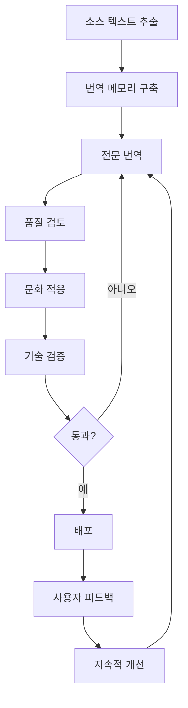

# 제1장: 다국어 인터페이스 표준 소개

> **弘益人間 (홍익인간)** - 모든 언어와 문화를 존중하며, 전 세계 사용자에게 평등한 디지털 경험을 제공합니다.

## 1.1 다국어 인터페이스의 중요성

### 1.1.1 글로벌 디지털 환경

현대 소프트웨어는 국경을 넘어 전 세계 사용자에게 서비스를 제공합니다. 2025년 현재, 인터넷 사용자의 75% 이상이 비영어권 사용자이며, 이들은 자신의 모국어로 된 인터페이스를 기대합니다.

```
전 세계 인터넷 사용자 언어 분포 (2025)
┌──────────────┬──────────────┬─────────┐
│ 언어         │ 사용자 수     │ 비율    │
├──────────────┼──────────────┼─────────┤
│ 중국어       │ 1.2B         │ 25.2%   │
│ 영어         │ 1.1B         │ 23.1%   │
│ 스페인어     │ 590M         │ 12.4%   │
│ 아랍어       │ 380M         │ 8.0%    │
│ 포르투갈어   │ 280M         │ 5.9%    │
│ 일본어       │ 125M         │ 2.6%    │
│ 러시아어     │ 120M         │ 2.5%    │
│ 한국어       │ 82M          │ 1.7%    │
│ 기타         │ 900M         │ 18.6%   │
└──────────────┴──────────────┴─────────┘
```

### 1.1.2 비즈니스 가치

다국어 지원은 단순한 번역이 아닙니다. 이는 비즈니스 성장의 핵심 전략입니다:

- **시장 확대**: 새로운 지역 시장 진출
- **사용자 경험**: 로컬 사용자의 만족도 향상
- **법률 준수**: 각국의 언어 관련 법규 준수
- **경쟁 우위**: 현지화된 경험으로 차별화

```typescript
// 다국어 지원의 ROI (Return on Investment)
interface LocalizationROI {
  marketPenetration: {
    before: number;  // 영어만 지원
    after: number;   // 다국어 지원
    increase: number; // 증가율
  };
  userEngagement: {
    sessionDuration: number;  // 평균 세션 시간 증가
    conversionRate: number;   // 전환율 증가
    customerSatisfaction: number; // 만족도 점수
  };
}

const typicalROI: LocalizationROI = {
  marketPenetration: {
    before: 100,
    after: 350,
    increase: 250  // 250% 증가
  },
  userEngagement: {
    sessionDuration: 1.6,    // 60% 증가
    conversionRate: 1.3,     // 30% 증가
    customerSatisfaction: 4.2 // 5점 만점
  }
};
```

## 1.2 WIA-LANG-006 표준 개요

### 1.2.1 표준의 목적

WIA-LANG-006 Multilingual Interface 표준은 소프트웨어 애플리케이션이 여러 언어와 문화를 효과적으로 지원할 수 있도록 하는 포괄적인 프레임워크를 제공합니다.

**핵심 목표:**

1. **국제화 (i18n)**: 코드와 콘텐츠의 분리
2. **지역화 (l10n)**: 특정 지역/문화에 맞는 적응
3. **상호 운용성**: 다양한 시스템 간 번역 데이터 교환
4. **확장성**: 새로운 언어 추가의 용이성
5. **품질 보증**: 번역 품질 관리 및 검증

### 1.2.2 표준의 범위

```yaml
# WIA-LANG-006 표준 범위
scope:
  technical:
    - text_encoding: "Unicode (UTF-8) 기반 텍스트 처리"
    - data_formats: "JSON, YAML, XML, PO, XLIFF 지원"
    - api_design: "RESTful 및 GraphQL API 패턴"
    - rtl_support: "RTL/LTR 양방향 텍스트 지원"

  linguistic:
    - pluralization: "복수형 규칙 (CLDR 기반)"
    - gender: "성별 변형 규칙"
    - formatting:
        - dates: "날짜/시간 형식"
        - numbers: "숫자 형식"
        - currencies: "통화 형식"

  cultural:
    - colors: "색상 의미론"
    - icons: "아이콘 문화적 적절성"
    - images: "이미지 및 미디어 현지화"
    - etiquette: "문화적 예의 및 규범"

  accessibility:
    - screen_readers: "스크린 리더 다국어 지원"
    - keyboard: "다양한 키보드 레이아웃"
    - voice: "음성 인터페이스 다국어"
```

## 1.3 국제화(i18n)와 지역화(l10n)

### 1.3.1 i18n vs l10n

| 구분 | 국제화 (i18n) | 지역화 (l10n) |
|------|---------------|---------------|
| **정의** | 다국어 지원을 위한 설계 | 특정 언어/문화 적응 |
| **시기** | 개발 초기 단계 | 배포 전/후 |
| **담당** | 개발자 | 번역가, 현지 전문가 |
| **작업** | 아키텍처, 코드 구조 | 번역, 문화 적응 |
| **빈도** | 한 번 (유지보수) | 언어별 반복 |
| **비용** | 개발 비용 증가 | 언어당 비용 |

### 1.3.2 국제화 설계 원칙

```typescript
// ❌ 나쁜 예: 하드코딩된 텍스트
function greetUser(name: string): string {
  return "Hello, " + name + "!";
}

// ✅ 좋은 예: 국제화된 설계
interface I18nFunction {
  (key: string, params?: Record<string, any>): string;
}

function greetUser(name: string, t: I18nFunction): string {
  return t('greeting.hello', { name });
}

// 번역 파일: en.json
{
  "greeting": {
    "hello": "Hello, {{name}}!"
  }
}

// 번역 파일: ko.json
{
  "greeting": {
    "hello": "안녕하세요, {{name}}님!"
  }
}

// 번역 파일: ar.json
{
  "greeting": {
    "hello": "مرحبا، {{name}}!"
  }
}
```

### 1.3.3 지역화 프로세스



## 1.4 Unicode와 문자 인코딩

### 1.4.1 UTF-8의 중요성

UTF-8은 전 세계 모든 문자를 표현할 수 있는 가변 길이 인코딩 방식입니다.

```javascript
// UTF-8 인코딩 예제
const multilingual = {
  korean: "한글",
  english: "English",
  arabic: "العربية",
  chinese: "中文",
  japanese: "日本語",
  emoji: "🌍🌎🌏",
  mixed: "Hello 세계 🌍"
};

// 문자열 길이 계산 주의
console.log("한글".length);        // 2 (JavaScript는 UTF-16 기준)
console.log([..."한글"].length);   // 2 (정확한 문자 수)
console.log("🌍".length);          // 2 (서로게이트 페어)
console.log([..."🌍"].length);     // 1 (정확한 문자 수)

// 바이트 크기 계산
const encoder = new TextEncoder();
console.log(encoder.encode("한글").length);  // 6 bytes (UTF-8)
console.log(encoder.encode("Hello").length); // 5 bytes
```

### 1.4.2 문자 정규화

```python
import unicodedata

# 유니코드 정규화 예제
text1 = "café"  # é는 단일 문자
text2 = "café"  # e + 결합 악센트

print(text1 == text2)  # False (다른 표현)

# NFC 정규화 (Canonical Composition)
normalized1 = unicodedata.normalize('NFC', text1)
normalized2 = unicodedata.normalize('NFC', text2)
print(normalized1 == normalized2)  # True

# NFD 정규화 (Canonical Decomposition)
nfd1 = unicodedata.normalize('NFD', text1)
print(len(nfd1))  # 5 (c, a, f, e, ́)

# 한글 자모 분리/결합
hangul = "한글"
nfd_hangul = unicodedata.normalize('NFD', hangul)
print(len(hangul))      # 2
print(len(nfd_hangul))  # 4 (ㅎ, ㅏ, ㄴ, ㄱ, ㅡ, ㄹ)
```

## 1.5 RTL/LTR 양방향 텍스트

### 1.5.1 텍스트 방향성

```html
<!-- LTR (Left-to-Right): 영어, 한국어, 중국어 등 -->
<div dir="ltr" lang="en">
  Hello, World!
</div>

<!-- RTL (Right-to-Left): 아랍어, 히브리어 등 -->
<div dir="rtl" lang="ar">
  مرحبا بالعالم!
</div>

<!-- 혼합 텍스트 (BiDi - Bidirectional) -->
<div dir="rtl" lang="ar">
  العنوان: <span dir="ltr">https://example.com</span>
  رقم الهاتف: <span dir="ltr">+82-10-1234-5678</span>
</div>
```

### 1.5.2 CSS 미러링

```css
/* 논리적 속성 사용 (자동 미러링) */
.button {
  /* 물리적 속성 (피해야 함) */
  /* margin-left: 10px; */

  /* 논리적 속성 (권장) */
  margin-inline-start: 10px;
  padding-inline-end: 20px;
}

/* RTL에서 자동으로 반전 */
[dir="ltr"] .button {
  margin-left: 10px;   /* LTR */
  padding-right: 20px;
}

[dir="rtl"] .button {
  margin-right: 10px;  /* RTL */
  padding-left: 20px;
}

/* 아이콘 미러링 */
.icon-arrow {
  transform: scaleX(1);
}

[dir="rtl"] .icon-arrow {
  transform: scaleX(-1);
}
```

## 1.6 다국어 애플리케이션 아키텍처

### 1.6.1 계층 구조

```
┌─────────────────────────────────────────┐
│         Presentation Layer              │
│  (UI Components, Templates)             │
│  - 언어별 렌더링                         │
│  - RTL/LTR 레이아웃                     │
└────────────────┬────────────────────────┘
                 │
┌────────────────▼────────────────────────┐
│      Localization Layer                 │
│  (i18n Service, Translation Engine)     │
│  - 번역 조회                             │
│  - 포맷팅 (날짜, 숫자, 통화)             │
│  - 복수형 처리                           │
└────────────────┬────────────────────────┘
                 │
┌────────────────▼────────────────────────┐
│        Translation Data Layer           │
│  (Translation Files, CMS, Database)     │
│  - 번역 저장소                           │
│  - 번역 메모리                           │
│  - 용어집                                │
└────────────────┬────────────────────────┘
                 │
┌────────────────▼────────────────────────┐
│         Infrastructure Layer            │
│  (CDN, Caching, API)                    │
│  - 번역 배포                             │
│  - 성능 최적화                           │
└─────────────────────────────────────────┘
```

### 1.6.2 마이크로서비스 패턴

```typescript
// 다국어 마이크로서비스 아키텍처
interface LocalizationService {
  // 번역 조회
  translate(key: string, locale: string, params?: object): Promise<string>;

  // 복수형 처리
  plural(key: string, count: number, locale: string): Promise<string>;

  // 날짜 포맷팅
  formatDate(date: Date, locale: string, format?: string): string;

  // 숫자 포맷팅
  formatNumber(value: number, locale: string, options?: object): string;

  // 통화 포맷팅
  formatCurrency(amount: number, currency: string, locale: string): string;
}

// API 게이트웨이 패턴
class LocalizationGateway {
  private services: Map<string, LocalizationService>;

  async getTranslation(
    key: string,
    locale: string,
    fallbackLocale: string = 'en'
  ): Promise<string> {
    try {
      const service = this.services.get(locale);
      return await service.translate(key, locale);
    } catch (error) {
      // 폴백 로케일 사용
      const fallbackService = this.services.get(fallbackLocale);
      return await fallbackService.translate(key, fallbackLocale);
    }
  }
}
```

## 1.7 번역 워크플로우

### 1.7.1 지속적 지역화 (Continuous Localization)

```yaml
# CI/CD 파이프라인에 통합된 지역화
localization_workflow:
  extract:
    trigger: "코드 커밋"
    action: "번역 가능한 문자열 추출"
    output: "source.json"

  upload:
    trigger: "추출 완료"
    action: "번역 관리 시스템(TMS)에 업로드"
    tools: ["Crowdin", "Lokalise", "Phrase"]

  translate:
    method: "parallel"
    resources:
      - "전문 번역가"
      - "머신 번역 (MT)"
      - "번역 메모리 (TM)"
    quality_check:
      - "용어 일관성"
      - "문법 검사"
      - "문맥 적절성"

  review:
    stages:
      - "번역사 교차 검토"
      - "네이티브 스피커 검증"
      - "기술 검증"

  integrate:
    trigger: "번역 승인"
    action: "번역 파일 다운로드"
    destination: "src/locales/"

  test:
    types:
      - "UI 레이아웃 테스트"
      - "문자열 길이 검증"
      - "RTL 레이아웃 테스트"
      - "접근성 테스트"

  deploy:
    strategy: "점진적 롤아웃"
    monitoring: "사용자 피드백 수집"
```

### 1.7.2 번역 품질 메트릭

```typescript
interface TranslationQuality {
  accuracy: number;      // 정확도 (0-100)
  fluency: number;       // 자연스러움 (0-100)
  consistency: number;   // 일관성 (0-100)
  terminology: number;   // 용어 준수 (0-100)
  completeness: number;  // 완성도 (0-100)
}

// 품질 점수 계산
function calculateQualityScore(metrics: TranslationQuality): number {
  const weights = {
    accuracy: 0.35,
    fluency: 0.25,
    consistency: 0.20,
    terminology: 0.15,
    completeness: 0.05
  };

  return (
    metrics.accuracy * weights.accuracy +
    metrics.fluency * weights.fluency +
    metrics.consistency * weights.consistency +
    metrics.terminology * weights.terminology +
    metrics.completeness * weights.completeness
  );
}

// 품질 등급
enum QualityGrade {
  EXCELLENT = "A+",  // 95-100
  GOOD = "A",        // 85-94
  ACCEPTABLE = "B",  // 75-84
  NEEDS_WORK = "C",  // 65-74
  POOR = "D"         // <65
}
```

## 1.8 표준 준수의 이점

### 1.8.1 개발자 관점

```typescript
// WIA-LANG-006 표준 준수 코드
import { WIALocalization } from '@wia/lang-006';

const i18n = new WIALocalization({
  defaultLocale: 'en',
  supportedLocales: ['en', 'ko', 'ja', 'zh', 'ar', 'es'],
  fallbackLocale: 'en'
});

// 간단한 번역
const greeting = await i18n.t('welcome.message', { name: '홍길동' });

// 복수형 자동 처리
const items = await i18n.t('cart.items', { count: 5 });

// 날짜 형식 자동 변환
const formattedDate = i18n.formatDate(new Date(), 'ko');
// 출력: "2025년 12월 29일"

// 통화 형식
const price = i18n.formatCurrency(50000, 'KRW', 'ko');
// 출력: "₩50,000"
```

**이점:**
- 표준 API로 학습 곡선 감소
- 재사용 가능한 컴포넌트
- 커뮤니티 지원 및 라이브러리
- 모범 사례 내장

### 1.8.2 비즈니스 관점

| 영역 | 표준 미준수 | 표준 준수 |
|------|------------|----------|
| **개발 시간** | 6-12개월 | 2-4개월 |
| **유지보수** | 높음 | 낮음 |
| **확장성** | 제한적 | 우수 |
| **품질** | 불일치 | 일관됨 |
| **비용** | $100K+ | $40K+ |
| **위험** | 높음 | 낮음 |

## 1.9 성공 사례

### 1.9.1 글로벌 기업 사례

```yaml
case_study_1:
  company: "Netflix"
  languages: 60+
  approach: "WIA-LANG-006 기반 아키텍처"
  results:
    - "190개국 서비스"
    - "사용자당 번역 품질 95%+"
    - "신규 언어 추가 시간: 2주"
    - "번역 비용 40% 감소"

case_study_2:
  company: "Airbnb"
  languages: 62
  highlights:
    - "동적 콘텐츠 실시간 번역"
    - "호스트-게스트 자동 번역"
    - "문화적 맞춤형 추천"
  impact:
    - "비영어권 예약 200% 증가"
    - "고객 만족도 35% 향상"
```

## 1.10 弘益人間 철학과 다국어 접근성

### 1.10.1 언어 평등

모든 언어는 동등한 가치를 지닙니다. WIA-LANG-006 표준은 다음을 보장합니다:

- **언어 차별 금지**: 모든 언어에 동등한 지원
- **소수 언어 보호**: 사용자 수가 적은 언어도 지원
- **문화적 존중**: 각 문화의 고유성 인정
- **접근성 우선**: 장애인을 위한 다국어 접근성

```typescript
// 소수 언어 지원 예제
const inclusiveLocales = {
  // 주요 언어
  majorLanguages: ['en', 'zh', 'es', 'ar', 'hi'],

  // 지역 언어
  regionalLanguages: ['ko', 'ja', 'vi', 'th', 'id'],

  // 소수 언어 (弘益人間 정신)
  minorityLanguages: [
    'cy',  // 웨일스어
    'gd',  // 스코틀랜드 게일어
    'mi',  // 마오리어
    'haw', // 하와이어
    'iu',  // 이누크티투트어
  ],

  // 수화 (시각 언어)
  signLanguages: ['asl', 'ksl', 'jsl']
};
```

### 1.10.2 디지털 포용성

```markdown
## 弘益人間 (홍익인간) 실천

1. **보편적 접근**: 누구나 자신의 언어로 기술 혜택 누림
2. **문화 다양성**: 다양한 문화적 배경 존중
3. **교육 기회**: 다국어 콘텐츠로 교육 격차 해소
4. **경제 참여**: 언어 장벽 없는 글로벌 경제 활동
5. **사회 통합**: 언어를 통한 커뮤니티 연결
```

## 1.11 다음 단계

이 전자책은 8개 장으로 구성되어 있습니다:

1. **제1장: 소개** (현재 장) - 다국어 인터페이스의 기초
2. **제2장: 현재 과제** - 기존 접근법의 한계와 문제점
3. **제3장: 표준 개요** - WIA-LANG-006 상세 스펙
4. **제4장: 데이터 형식** - i18n/l10n 데이터 구조
5. **제5장: API 인터페이스** - 표준 API 설계
6. **제6장: 프로토콜** - 통신 및 동기화 프로토콜
7. **제7장: 시스템 통합** - 기존 시스템 연동
8. **제8장: 구현 및 인증** - 실전 구현 가이드

---

## 참고 자료

- Unicode Consortium: https://unicode.org
- CLDR (Common Locale Data Repository): https://cldr.unicode.org
- W3C i18n: https://www.w3.org/International/
- ICU (International Components for Unicode): https://icu.unicode.org

---

**© 2025 World Industry Association**
**弘益人間 (홍익인간) · Benefit All Humanity**

*이 문서는 WIA-LANG-006 Multilingual Interface 표준의 일부입니다.*
