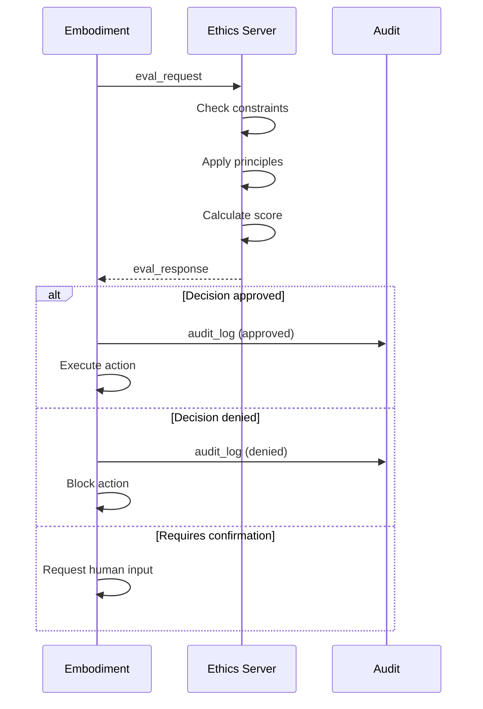
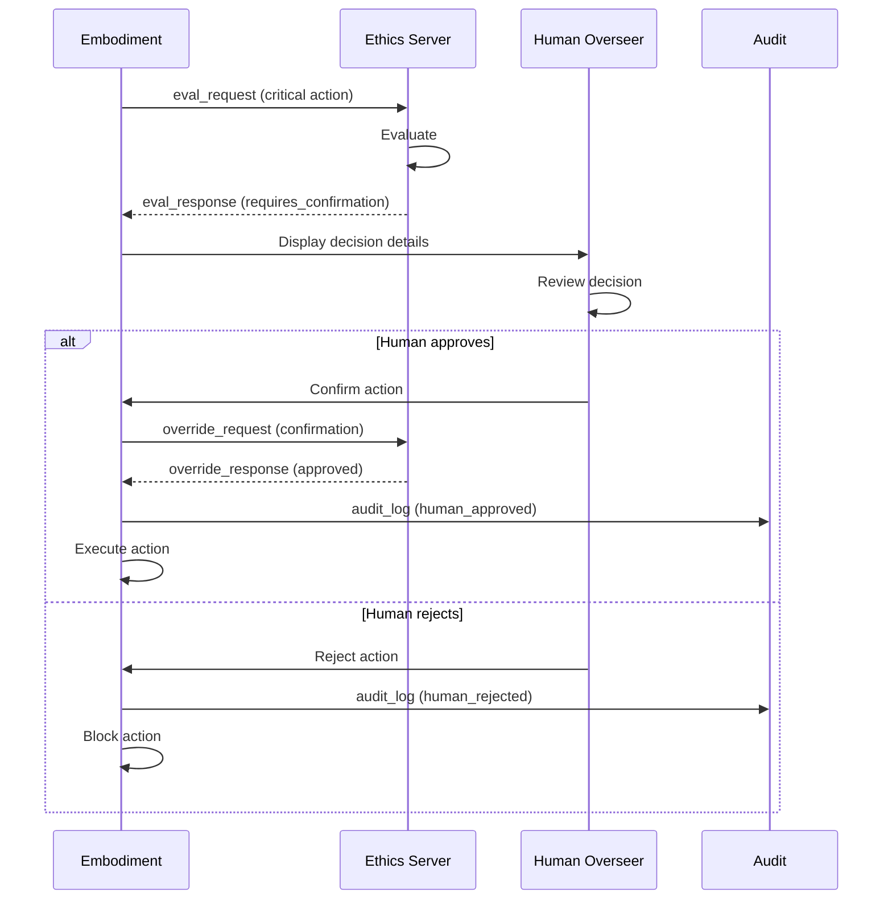
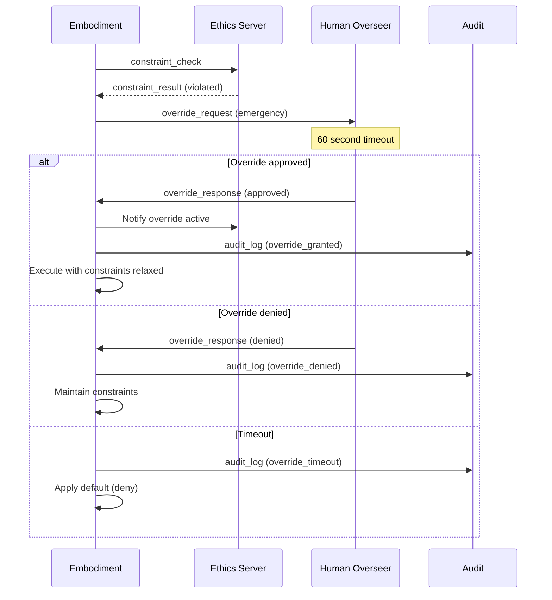
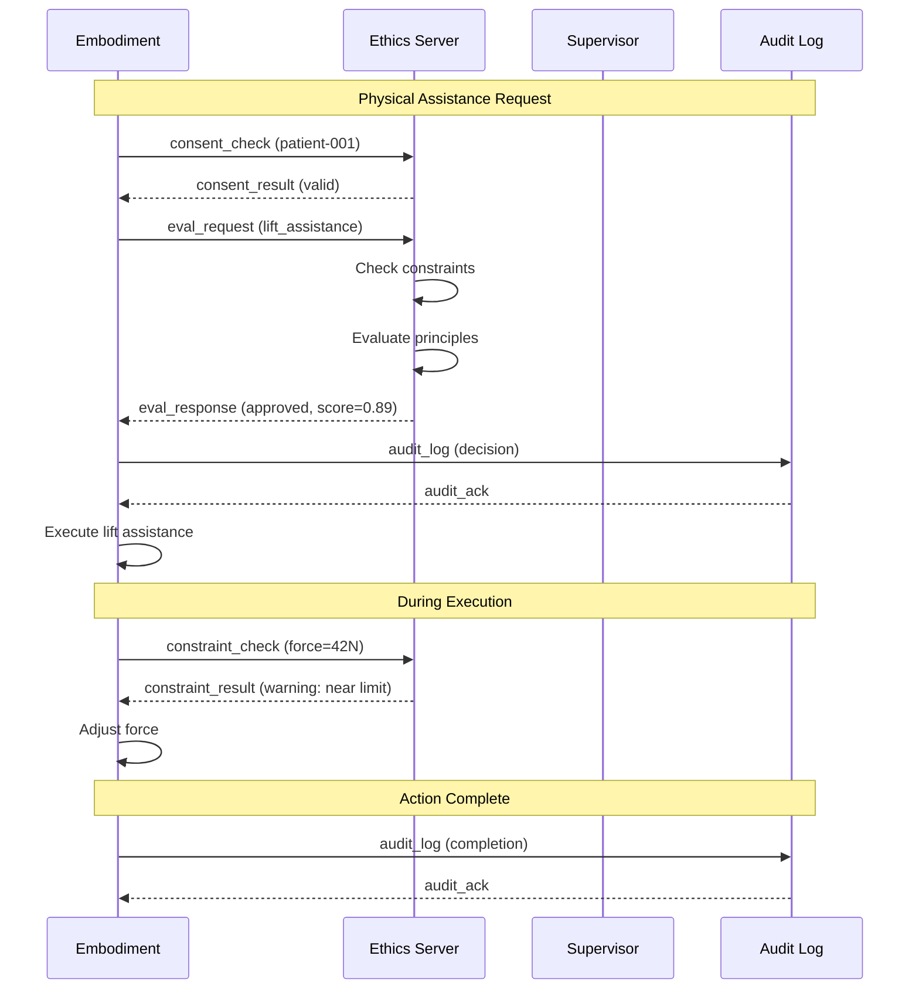

# WIA AI Embodiment Ethics Communication Protocol
## Phase 3 Specification

---

**Version**: 1.0.0
**Status**: Draft
**Date**: 2025-01
**Authors**: WIA Standards Committee
**License**: MIT

---

## Table of Contents

1. [Overview](#overview)
2. [Terminology](#terminology)
3. [Protocol Architecture](#protocol-architecture)
4. [Message Format](#message-format)
5. [Message Types](#message-types)
6. [Ethical Decision Flow](#ethical-decision-flow)
7. [Override Protocol](#override-protocol)
8. [Error Handling](#error-handling)
9. [Security](#security)
10. [Examples](#examples)

---

## Overview

### 1.1 Purpose

The WIA AI Embodiment Ethics Communication Protocol defines standardized communication for ethical decision-making in AI-powered physical systems. This protocol ensures reliable, auditable, and secure exchange of ethical evaluations, constraints, and human oversight decisions.

**Core Objectives**:
- Define message formats for ethical communication
- Establish human-in-the-loop decision protocols
- Implement audit trail mechanisms
- Support real-time ethical constraint enforcement
- Enable multi-party ethical oversight

### 1.2 Scope

| Component | Description |
|-----------|-------------|
| Message Format | Ethical message structure |
| Decision Flow | Ethical evaluation sequences |
| Override Protocol | Human intervention mechanism |
| Audit Protocol | Decision logging requirements |
| Consent Protocol | Consent verification flow |

---

## Terminology

| Term | Definition |
|------|------------|
| **Ethics Client** | System requesting ethical evaluation |
| **Ethics Server** | Ethical evaluation service |
| **Overseer** | Human ethical oversight authority |
| **Evaluation Request** | Request for ethical assessment |
| **Ethical Decision** | Result of ethical evaluation |
| **Override Request** | Human intervention request |
| **Audit Record** | Logged ethical decision |

---

## Protocol Architecture

### 3.1 Layer Model

```
┌──────────────────────────────────────────────────────────────┐
│                    Application Layer                          │
│           (Embodiment Control, AI Decision Making)           │
├──────────────────────────────────────────────────────────────┤
│                    Ethics API Layer (Phase 2)                 │
│                  (WiaEthics Interface)                        │
├──────────────────────────────────────────────────────────────┤
│                    Ethics Protocol Layer (Phase 3)            │
│             (Message Format, Decision Flow)                   │
├──────────────────────────────────────────────────────────────┤
│                    Transport Layer                            │
│              (HTTPS / WebSocket / Message Queue)              │
└──────────────────────────────────────────────────────────────┘
```

### 3.2 Communication Patterns

```
┌─────────────┐     ┌─────────────┐     ┌─────────────┐
│ Embodiment  │     │   Ethics    │     │   Human     │
│  (Client)   │     │   Engine    │     │  Overseer   │
└──────┬──────┘     └──────┬──────┘     └──────┬──────┘
       │                   │                   │
       │ ─── eval_request ──────────────────► │
       │                   │                   │
       │                   │ ◄─ constraint check
       │                   │                   │
       │ ◄── eval_result ─ │                   │
       │                   │                   │
       │ ─── override_request ───────────────►│
       │                   │                   │
       │ ◄───────────────── override_response ─│
       │                   │                   │
       │ ─── audit_log ──► │                   │
       │                   │                   │
```

---

## Message Format

### 4.1 Base Message Structure

All WIA AI Embodiment Ethics messages follow this structure:

```json
{
  "protocol": "wia-embodiment-ethics",
  "version": "1.0.0",
  "messageId": "uuid-v4-string",
  "timestamp": 1704110400000,
  "type": "message_type",
  "priority": 5,
  "embodimentId": "embodiment-uuid",
  "payload": {},
  "audit": {
    "logRequired": true,
    "retentionDays": 365
  }
}
```

### 4.2 Field Definitions

| Field | Type | Required | Description |
|-------|------|:--------:|-------------|
| `protocol` | string | Y | Protocol identifier |
| `version` | string | Y | Protocol version |
| `messageId` | string | Y | Unique message ID |
| `timestamp` | number | Y | Unix timestamp (ms) |
| `type` | string | Y | Message type |
| `priority` | number | N | Priority (0-10) |
| `embodimentId` | string | Y | Embodiment identifier |
| `payload` | object | Y | Message data |
| `audit` | object | N | Audit requirements |

### 4.3 JSON Schema

```json
{
  "$schema": "http://json-schema.org/draft-07/schema#",
  "$id": "https://wia.live/ai-embodiment-ethics/protocol/v1/message.schema.json",
  "title": "WIA AI Embodiment Ethics Protocol Message",
  "type": "object",
  "required": ["protocol", "version", "messageId", "timestamp", "type", "embodimentId", "payload"],
  "properties": {
    "protocol": {
      "type": "string",
      "const": "wia-embodiment-ethics"
    },
    "version": {
      "type": "string",
      "pattern": "^\\d+\\.\\d+\\.\\d+$"
    },
    "messageId": {
      "type": "string",
      "format": "uuid"
    },
    "timestamp": {
      "type": "integer",
      "minimum": 0
    },
    "type": {
      "type": "string",
      "enum": [
        "eval_request", "eval_response",
        "constraint_check", "constraint_result",
        "override_request", "override_response",
        "consent_check", "consent_result",
        "audit_log", "audit_ack",
        "framework_update", "framework_ack",
        "error", "heartbeat"
      ]
    },
    "priority": {
      "type": "integer",
      "minimum": 0,
      "maximum": 10
    },
    "embodimentId": {
      "type": "string"
    },
    "payload": {
      "type": "object"
    },
    "audit": {
      "type": "object",
      "properties": {
        "logRequired": { "type": "boolean" },
        "retentionDays": { "type": "integer" }
      }
    }
  }
}
```

---

## Message Types

### 5.1 Message Type Summary

| Type | Direction | Priority | Description |
|------|-----------|:--------:|-------------|
| `eval_request` | C → S | 7 | Ethical evaluation request |
| `eval_response` | S → C | 7 | Evaluation result |
| `constraint_check` | C → S | 8 | Check specific constraint |
| `constraint_result` | S → C | 8 | Constraint check result |
| `override_request` | C → O | 9 | Human override request |
| `override_response` | O → C | 9 | Override decision |
| `consent_check` | C → S | 6 | Consent verification |
| `consent_result` | S → C | 6 | Consent status |
| `audit_log` | C → S | 5 | Log ethical decision |
| `audit_ack` | S → C | 5 | Audit acknowledgment |
| `framework_update` | S → C | 4 | Framework change notification |
| `error` | Both | 8 | Error notification |

### 5.2 Evaluation Messages

#### eval_request

```json
{
  "protocol": "wia-embodiment-ethics",
  "version": "1.0.0",
  "messageId": "550e8400-e29b-41d4-a716-446655440100",
  "timestamp": 1704110400000,
  "type": "eval_request",
  "priority": 7,
  "embodimentId": "emb-001",
  "payload": {
    "requestId": "eval-001",
    "evaluationType": "action",
    "action": {
      "actionId": "action-001",
      "actionType": "physical_contact",
      "parameters": {
        "contactType": "assistance",
        "targetId": "human-001",
        "force": 25.0
      }
    },
    "context": {
      "environment": "hospital_room",
      "humanPresent": true,
      "consentObtained": true,
      "urgency": "normal"
    },
    "constraints": ["c-001", "c-002", "c-003"],
    "timeout": 5000
  },
  "audit": {
    "logRequired": true,
    "retentionDays": 365
  }
}
```

#### eval_response

```json
{
  "protocol": "wia-embodiment-ethics",
  "version": "1.0.0",
  "messageId": "550e8400-e29b-41d4-a716-446655440101",
  "timestamp": 1704110400050,
  "type": "eval_response",
  "priority": 7,
  "embodimentId": "emb-001",
  "payload": {
    "requestId": "eval-001",
    "result": "approved",
    "ethicalScore": 0.89,
    "principleScores": [
      { "principleId": "human_safety", "score": 0.95, "weight": 1.0 },
      { "principleId": "beneficence", "score": 0.85, "weight": 0.9 },
      { "principleId": "autonomy", "score": 0.88, "weight": 0.85 }
    ],
    "constraintResults": [
      { "constraintId": "c-001", "satisfied": true },
      { "constraintId": "c-002", "satisfied": true },
      { "constraintId": "c-003", "satisfied": true, "warning": "Near threshold" }
    ],
    "explanation": "Action approved. Human safety maintained, consent verified.",
    "conditions": [],
    "processingTimeMs": 45
  }
}
```

### 5.3 Constraint Messages

#### constraint_check

```json
{
  "protocol": "wia-embodiment-ethics",
  "version": "1.0.0",
  "messageId": "550e8400-e29b-41d4-a716-446655440200",
  "timestamp": 1704110400100,
  "type": "constraint_check",
  "priority": 8,
  "embodimentId": "emb-001",
  "payload": {
    "checkId": "chk-001",
    "constraintIds": ["c-001"],
    "context": {
      "variable": "applied_force",
      "value": 45.0,
      "target": "human"
    }
  }
}
```

#### constraint_result

```json
{
  "protocol": "wia-embodiment-ethics",
  "version": "1.0.0",
  "messageId": "550e8400-e29b-41d4-a716-446655440201",
  "timestamp": 1704110400105,
  "type": "constraint_result",
  "priority": 8,
  "embodimentId": "emb-001",
  "payload": {
    "checkId": "chk-001",
    "results": [
      {
        "constraintId": "c-001",
        "satisfied": false,
        "violation": {
          "type": "threshold_exceeded",
          "actual": 45.0,
          "limit": 40.0,
          "severity": "critical"
        },
        "action": "deny"
      }
    ],
    "overrideAvailable": true
  }
}
```

### 5.4 Override Messages

#### override_request

```json
{
  "protocol": "wia-embodiment-ethics",
  "version": "1.0.0",
  "messageId": "550e8400-e29b-41d4-a716-446655440300",
  "timestamp": 1704110400200,
  "type": "override_request",
  "priority": 9,
  "embodimentId": "emb-001",
  "payload": {
    "overrideId": "ovr-001",
    "constraintId": "c-001",
    "requesterId": "operator-001",
    "requesterRole": "senior_operator",
    "reason": "Emergency medical procedure",
    "context": {
      "emergency": true,
      "emergencyType": "medical",
      "beneficiary": "patient-001",
      "alternativesConsidered": ["wait", "manual_procedure"],
      "alternativeRejectionReasons": ["Time critical", "Not feasible"]
    },
    "requestedDuration": 300,
    "timeout": 60000
  }
}
```

#### override_response

```json
{
  "protocol": "wia-embodiment-ethics",
  "version": "1.0.0",
  "messageId": "550e8400-e29b-41d4-a716-446655440301",
  "timestamp": 1704110400210,
  "type": "override_response",
  "priority": 9,
  "embodimentId": "emb-001",
  "payload": {
    "overrideId": "ovr-001",
    "decision": "approved",
    "approverId": "supervisor-001",
    "approverRole": "ethics_officer",
    "conditions": [
      "Must be supervised by medical staff",
      "Maximum duration 5 minutes",
      "Continuous monitoring required"
    ],
    "validUntil": 1704110700000,
    "auditNote": "Approved for emergency medical procedure"
  }
}
```

### 5.5 Consent Messages

#### consent_check

```json
{
  "protocol": "wia-embodiment-ethics",
  "version": "1.0.0",
  "messageId": "550e8400-e29b-41d4-a716-446655440400",
  "timestamp": 1704110400300,
  "type": "consent_check",
  "priority": 6,
  "embodimentId": "emb-001",
  "payload": {
    "checkId": "consent-chk-001",
    "subjectId": "patient-001",
    "requiredScope": ["physical_assistance", "health_monitoring"],
    "action": "lift_assistance"
  }
}
```

#### consent_result

```json
{
  "protocol": "wia-embodiment-ethics",
  "version": "1.0.0",
  "messageId": "550e8400-e29b-41d4-a716-446655440401",
  "timestamp": 1704110400305,
  "type": "consent_result",
  "priority": 6,
  "embodimentId": "emb-001",
  "payload": {
    "checkId": "consent-chk-001",
    "valid": true,
    "consentId": "consent-abc123",
    "consentType": "informed",
    "scopeCovered": ["physical_assistance", "health_monitoring"],
    "expiresAt": 1735689600000,
    "restrictions": ["No facial recording"]
  }
}
```

### 5.6 Audit Messages

#### audit_log

```json
{
  "protocol": "wia-embodiment-ethics",
  "version": "1.0.0",
  "messageId": "550e8400-e29b-41d4-a716-446655440500",
  "timestamp": 1704110400400,
  "type": "audit_log",
  "priority": 5,
  "embodimentId": "emb-001",
  "payload": {
    "auditId": "audit-001",
    "eventType": "ethical_decision",
    "decision": {
      "requestId": "eval-001",
      "actionId": "action-001",
      "outcome": "approved",
      "ethicalScore": 0.89
    },
    "context": {
      "environment": "hospital_room",
      "humanInvolved": true,
      "consentVerified": true
    },
    "accountability": {
      "aiSystem": "emb-001",
      "operator": "operator-001",
      "supervisor": null
    },
    "timestamp": 1704110400050
  }
}
```

---

## Ethical Decision Flow

### 6.1 Standard Evaluation Flow



### 6.2 Human-in-the-Loop Flow



### 6.3 Emergency Override Flow



---

## Override Protocol

### 7.1 Override Levels

| Level | Authority Required | Max Duration | Review Required |
|-------|-------------------|--------------|-----------------|
| 1 - Minor | Operator | 5 minutes | No |
| 2 - Moderate | Supervisor | 30 minutes | Within 24h |
| 3 - Significant | Ethics Officer | 2 hours | Immediate |
| 4 - Critical | Ethics Board | 24 hours | Before activation |

### 7.2 Override Constraints

| Constraint Type | Override Allowed | Conditions |
|-----------------|------------------|------------|
| Life safety | No | Never overridable |
| Physical harm prevention | Level 4 only | Medical emergency |
| Privacy protection | Level 3+ | Legal requirement |
| Consent requirement | Level 2+ | Emergency + documentation |
| Operational limits | Level 1+ | Justification required |

### 7.3 Override Audit Requirements

All overrides must log:
- Override request details
- Justification provided
- Approver identity and role
- Time-bounded validity
- Actions taken during override
- Post-override review outcome

---

## Error Handling

### 8.1 Error Codes

#### Evaluation Errors (1xxx)

| Code | Name | Description |
|------|------|-------------|
| 1001 | `EVAL_TIMEOUT` | Evaluation timed out |
| 1002 | `FRAMEWORK_ERROR` | Framework not available |
| 1003 | `CONTEXT_INCOMPLETE` | Missing context data |
| 1004 | `PRINCIPLE_CONFLICT` | Unresolvable conflict |

#### Override Errors (2xxx)

| Code | Name | Description |
|------|------|-------------|
| 2001 | `OVERRIDE_UNAUTHORIZED` | Insufficient authority |
| 2002 | `OVERRIDE_TIMEOUT` | Override request expired |
| 2003 | `OVERRIDE_REJECTED` | Override denied |
| 2004 | `OVERRIDE_NOT_ALLOWED` | Constraint non-overridable |

#### Consent Errors (3xxx)

| Code | Name | Description |
|------|------|-------------|
| 3001 | `CONSENT_NOT_FOUND` | No consent record |
| 3002 | `CONSENT_EXPIRED` | Consent has expired |
| 3003 | `CONSENT_INSUFFICIENT` | Scope not covered |

### 8.2 Error Message

```json
{
  "protocol": "wia-embodiment-ethics",
  "version": "1.0.0",
  "messageId": "550e8400-e29b-41d4-a716-446655440999",
  "timestamp": 1704110400500,
  "type": "error",
  "priority": 8,
  "embodimentId": "emb-001",
  "payload": {
    "code": 2001,
    "name": "OVERRIDE_UNAUTHORIZED",
    "message": "Operator role insufficient for Level 3 override",
    "details": {
      "requestedLevel": 3,
      "requesterRole": "operator",
      "requiredRole": "ethics_officer"
    },
    "relatedMessageId": "550e8400-e29b-41d4-a716-446655440300"
  }
}
```

---

## Security

### 9.1 Transport Security

- TLS 1.3 required for all communications
- Certificate validation mandatory
- Mutual TLS for override communications

### 9.2 Message Authentication

```json
{
  "protocol": "wia-embodiment-ethics",
  "messageId": "...",
  "auth": {
    "token": "jwt-token",
    "signature": "hmac-sha256-signature",
    "timestamp": 1704110400000
  },
  "payload": {}
}
```

### 9.3 Override Authorization

Override messages require enhanced authentication:

```json
{
  "type": "override_request",
  "payload": {
    "authorization": {
      "token": "elevated-access-token",
      "biometricConfirmation": true,
      "secondFactorVerified": true
    }
  }
}
```

### 9.4 Audit Trail Integrity

Audit records use cryptographic chaining:

```json
{
  "auditId": "audit-002",
  "previousAuditHash": "sha256-hash-of-previous",
  "recordHash": "sha256-hash-of-current",
  "timestamp": 1704110400500
}
```

---

## Examples

### 10.1 Complete Ethical Evaluation Session



---

<div align="center">

**WIA AI Embodiment Ethics Communication Protocol v1.0.0**

**弘益人間 (홍익인간)** - Benefit All Humanity

---

**© 2025 WIA Standards Committee**

**MIT License**

</div>
