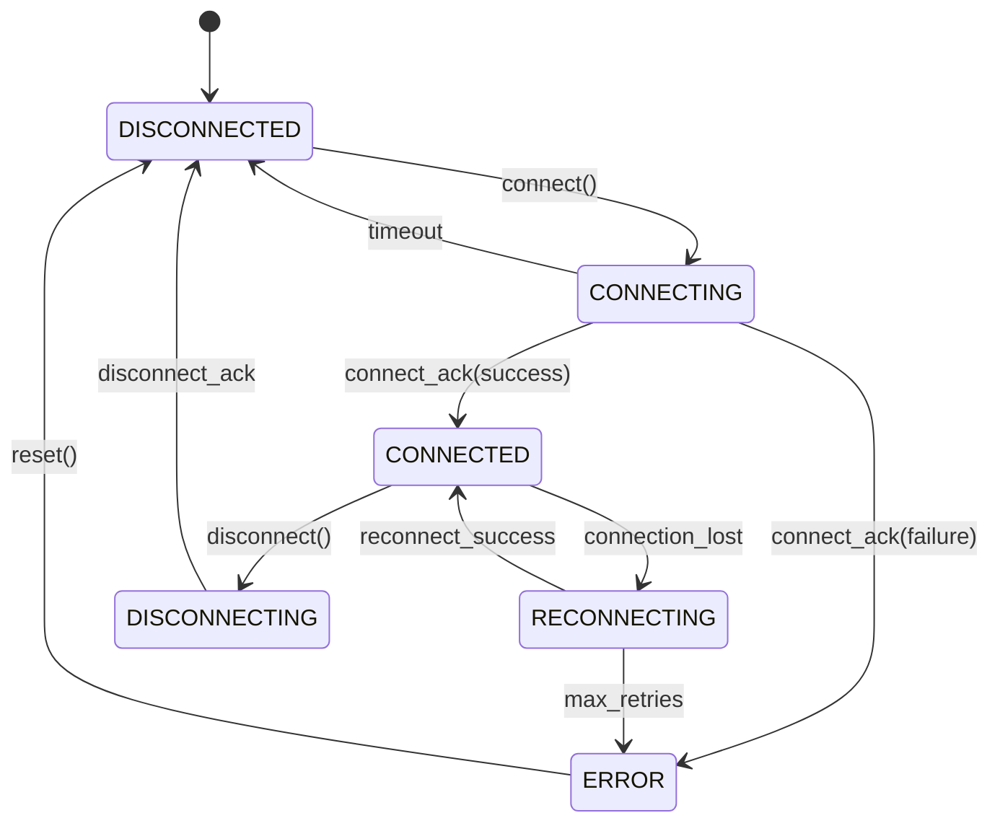
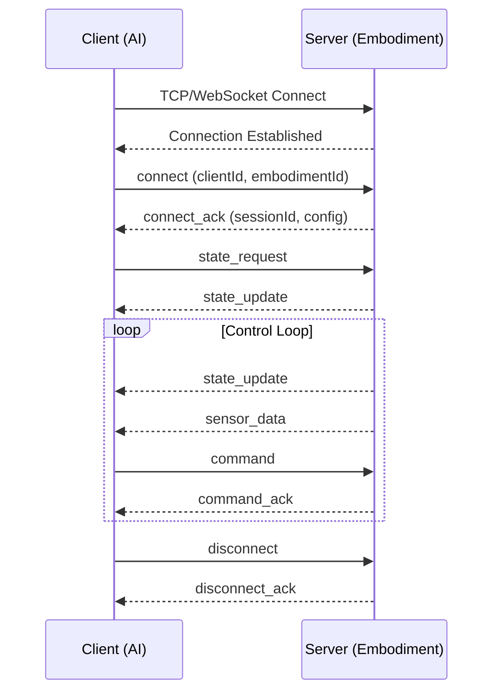
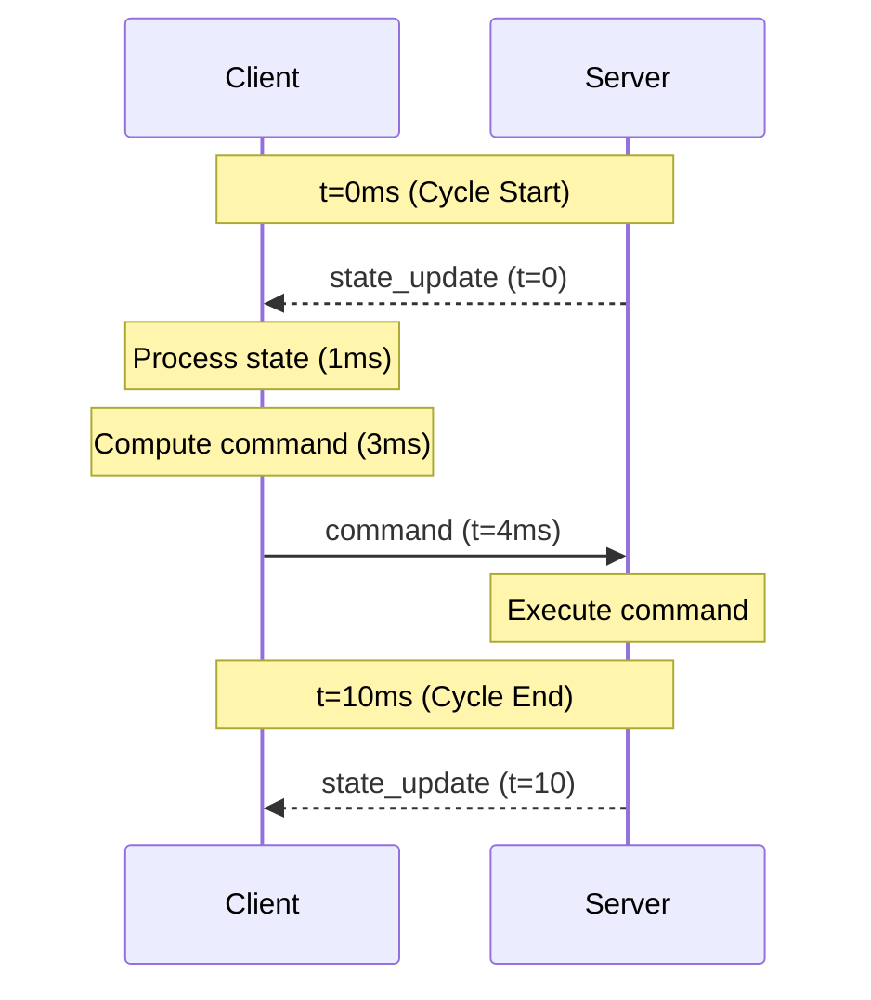
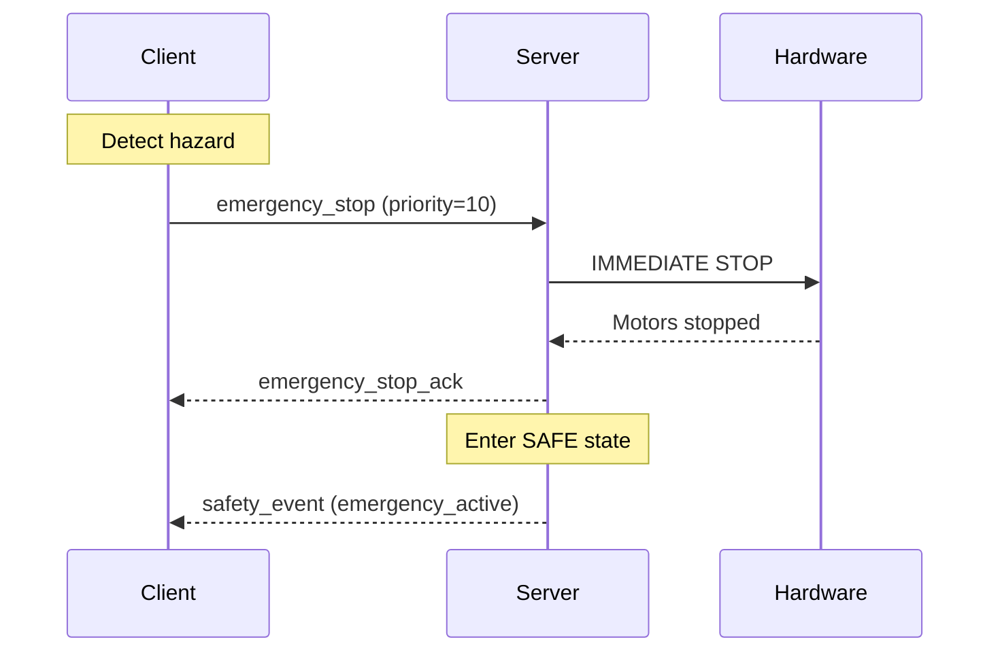
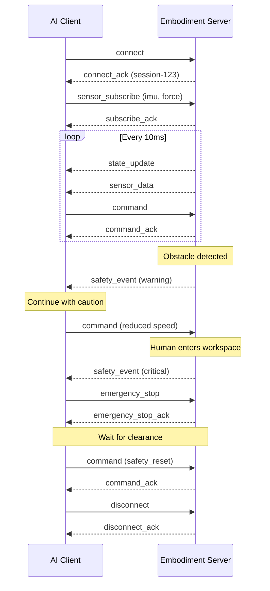

# WIA AI Embodiment Communication Protocol
## Phase 3 Specification

---

**Version**: 1.0.0
**Status**: Draft
**Date**: 2025-01
**Authors**: WIA Standards Committee
**License**: MIT

---

## Table of Contents

1. [Overview](#overview)
2. [Terminology](#terminology)
3. [Protocol Architecture](#protocol-architecture)
4. [Message Format](#message-format)
5. [Message Types](#message-types)
6. [Connection Management](#connection-management)
7. [Real-Time Control Protocol](#real-time-control-protocol)
8. [Safety Protocol](#safety-protocol)
9. [Error Handling](#error-handling)
10. [Transport Layer](#transport-layer)
11. [Security](#security)
12. [Examples](#examples)

---

## Overview

### 1.1 Purpose

The WIA AI Embodiment Communication Protocol defines the standardized communication mechanisms between AI systems and physical embodiments. This protocol ensures reliable, real-time, and safety-critical data exchange for robotic control applications.

**Core Objectives**:
- Define low-latency communication for real-time control
- Establish reliable message delivery with acknowledgment
- Implement safety-critical message prioritization
- Support multiple transport layers (WebSocket, ROS2, DDS)
- Enable multi-embodiment coordination

### 1.2 Scope

| Component | Description |
|-----------|-------------|
| Message Format | Standardized message structure |
| Message Types | Control, state, safety messages |
| Connection | Connection lifecycle management |
| Real-Time | Low-latency control protocol |
| Safety | Safety-critical communication |

### 1.3 Related Documents

| Document | Description |
|----------|-------------|
| PHASE-1-DATA-FORMAT.md | Data structure definitions |
| PHASE-2-API-INTERFACE.md | API specifications |
| PHASE-4-INTEGRATION.md | Ecosystem integration |

---

## Terminology

| Term | Definition |
|------|------------|
| **Client** | AI control system (decision maker) |
| **Server** | Embodiment control system (physical) |
| **Message** | Atomic unit of communication |
| **Payload** | Message data content |
| **Session** | Connected client-server pair |
| **Control Cycle** | Single sensing-command iteration |
| **QoS** | Quality of Service parameters |

---

## Protocol Architecture

### 3.1 Layer Model

```
┌──────────────────────────────────────────────────────────────┐
│                    Application Layer                          │
│              (AI Control, Motion Planning)                    │
├──────────────────────────────────────────────────────────────┤
│                    API Layer (Phase 2)                        │
│              (WiaEmbodiment Interface)                        │
├──────────────────────────────────────────────────────────────┤
│                    Protocol Layer (Phase 3)                   │
│              (Message Format, Handlers)                       │
├──────────────────────────────────────────────────────────────┤
│                    Transport Layer                            │
│         (WebSocket / ROS2 / DDS / CAN)                       │
├──────────────────────────────────────────────────────────────┤
│                    Physical Layer                             │
│         (Ethernet / Wireless / Fieldbus)                     │
└──────────────────────────────────────────────────────────────┘
```

### 3.2 Communication Patterns

```
┌─────────────┐                           ┌─────────────┐
│  AI System  │                           │ Embodiment  │
│  (Client)   │                           │  (Server)   │
└──────┬──────┘                           └──────┬──────┘
       │                                         │
       │ ────── Command Message ──────────────► │
       │                                         │
       │ ◄────── Command ACK ─────────────────  │
       │                                         │
       │ ◄────── State Update ────────────────  │
       │                                         │
       │ ◄────── Sensor Stream ───────────────  │
       │                                         │
       │ ◄────── Safety Alert ────────────────  │
       │                                         │
       │ ────── Emergency Stop ──────────────► │
       │                                         │
```

---

## Message Format

### 4.1 Base Message Structure

All WIA AI Embodiment messages follow this structure:

```json
{
  "protocol": "wia-embodiment",
  "version": "1.0.0",
  "messageId": "uuid-v4-string",
  "timestamp": 1704110400000,
  "sequence": 12345,
  "type": "message_type",
  "priority": 5,
  "qos": {
    "reliability": "reliable",
    "deadline_ms": 10
  },
  "payload": {}
}
```

### 4.2 Field Definitions

| Field | Type | Required | Description |
|-------|------|:--------:|-------------|
| `protocol` | string | Y | Protocol identifier ("wia-embodiment") |
| `version` | string | Y | Protocol version (SemVer) |
| `messageId` | string | Y | Unique message ID (UUID v4) |
| `timestamp` | number | Y | Unix timestamp (ms) |
| `sequence` | number | Y | Message sequence number |
| `type` | string | Y | Message type |
| `priority` | number | N | Priority (0-10, 10=highest) |
| `qos` | object | N | Quality of Service |
| `payload` | object | Y | Message data |

### 4.3 JSON Schema

```json
{
  "$schema": "http://json-schema.org/draft-07/schema#",
  "$id": "https://wia.live/ai-embodiment/protocol/v1/message.schema.json",
  "title": "WIA AI Embodiment Protocol Message",
  "type": "object",
  "required": ["protocol", "version", "messageId", "timestamp", "sequence", "type", "payload"],
  "properties": {
    "protocol": {
      "type": "string",
      "const": "wia-embodiment"
    },
    "version": {
      "type": "string",
      "pattern": "^\\d+\\.\\d+\\.\\d+$"
    },
    "messageId": {
      "type": "string",
      "format": "uuid"
    },
    "timestamp": {
      "type": "integer",
      "minimum": 0
    },
    "sequence": {
      "type": "integer",
      "minimum": 0
    },
    "type": {
      "type": "string",
      "enum": [
        "connect", "connect_ack", "disconnect", "disconnect_ack",
        "command", "command_ack", "command_batch",
        "state_update", "state_request",
        "sensor_data", "sensor_subscribe", "sensor_unsubscribe",
        "safety_event", "emergency_stop", "emergency_stop_ack",
        "heartbeat", "heartbeat_ack",
        "error"
      ]
    },
    "priority": {
      "type": "integer",
      "minimum": 0,
      "maximum": 10,
      "default": 5
    },
    "qos": {
      "type": "object",
      "properties": {
        "reliability": { "enum": ["best_effort", "reliable"] },
        "deadline_ms": { "type": "integer", "minimum": 1 }
      }
    },
    "payload": {
      "type": "object"
    }
  }
}
```

---

## Message Types

### 5.1 Message Type Summary

| Type | Direction | Priority | Description |
|------|-----------|:--------:|-------------|
| `connect` | C → S | 5 | Connection request |
| `connect_ack` | S → C | 5 | Connection response |
| `disconnect` | Both | 5 | Disconnect request |
| `command` | C → S | 7 | Actuator command |
| `command_ack` | S → C | 6 | Command acknowledgment |
| `command_batch` | C → S | 7 | Multiple commands |
| `state_update` | S → C | 5 | State broadcast |
| `sensor_data` | S → C | 4 | Sensor readings |
| `safety_event` | S → C | 9 | Safety notification |
| `emergency_stop` | C → S | 10 | E-stop command |
| `heartbeat` | Both | 3 | Connection keepalive |
| `error` | Both | 8 | Error notification |

### 5.2 Connection Messages

#### connect

```json
{
  "protocol": "wia-embodiment",
  "version": "1.0.0",
  "messageId": "550e8400-e29b-41d4-a716-446655440000",
  "timestamp": 1704110400000,
  "sequence": 1,
  "type": "connect",
  "payload": {
    "clientId": "ai-controller-001",
    "clientName": "Motion Planner",
    "clientVersion": "1.0.0",
    "embodimentId": "emb-001",
    "controlMode": "position",
    "safetyMode": "collaborative",
    "capabilities": ["position_control", "force_sensing"],
    "options": {
      "controlRate": 100,
      "stateRate": 100,
      "sensorRate": 50
    }
  }
}
```

#### connect_ack

```json
{
  "protocol": "wia-embodiment",
  "version": "1.0.0",
  "messageId": "550e8400-e29b-41d4-a716-446655440001",
  "timestamp": 1704110400010,
  "sequence": 1,
  "type": "connect_ack",
  "payload": {
    "success": true,
    "sessionId": "session-abc123",
    "embodiment": {
      "id": "emb-001",
      "type": "humanoid_robot",
      "name": "HumanoidX-1",
      "joints": 24,
      "dof": 24
    },
    "serverVersion": "1.0.0",
    "config": {
      "maxControlRate": 1000,
      "maxStateRate": 100,
      "maxSensorRate": 100
    }
  }
}
```

### 5.3 Command Messages

#### command

```json
{
  "protocol": "wia-embodiment",
  "version": "1.0.0",
  "messageId": "550e8400-e29b-41d4-a716-446655440100",
  "timestamp": 1704110400100,
  "sequence": 100,
  "type": "command",
  "priority": 7,
  "qos": {
    "reliability": "reliable",
    "deadline_ms": 10
  },
  "payload": {
    "commandId": "cmd-001",
    "actuatorId": "right_shoulder_pitch",
    "commandType": "position",
    "targetValue": 0.8,
    "durationMs": 500,
    "interpolation": "cubic",
    "constraints": {
      "maxVelocity": 1.0,
      "maxAcceleration": 2.0
    }
  }
}
```

#### command_batch

```json
{
  "protocol": "wia-embodiment",
  "version": "1.0.0",
  "messageId": "550e8400-e29b-41d4-a716-446655440101",
  "timestamp": 1704110400100,
  "sequence": 101,
  "type": "command_batch",
  "priority": 7,
  "payload": {
    "batchId": "batch-001",
    "executionMode": "synchronized",
    "commands": [
      {
        "actuatorId": "right_shoulder_pitch",
        "commandType": "position",
        "targetValue": 0.8,
        "durationMs": 500
      },
      {
        "actuatorId": "right_elbow_pitch",
        "commandType": "position",
        "targetValue": 1.2,
        "durationMs": 500
      }
    ]
  }
}
```

### 5.4 State Messages

#### state_update

```json
{
  "protocol": "wia-embodiment",
  "version": "1.0.0",
  "messageId": "550e8400-e29b-41d4-a716-446655440200",
  "timestamp": 1704110400200,
  "sequence": 200,
  "type": "state_update",
  "payload": {
    "embodimentId": "emb-001",
    "operationalMode": "active",
    "joints": [
      {
        "jointId": "right_shoulder_pitch",
        "position": 0.75,
        "velocity": 0.1,
        "torque": 12.5,
        "temperature": 42.0
      }
    ],
    "powerStatus": {
      "batteryLevel": 85.5,
      "voltage": 48.2
    }
  }
}
```

### 5.5 Safety Messages

#### safety_event

```json
{
  "protocol": "wia-embodiment",
  "version": "1.0.0",
  "messageId": "550e8400-e29b-41d4-a716-446655440300",
  "timestamp": 1704110400300,
  "sequence": 300,
  "type": "safety_event",
  "priority": 9,
  "payload": {
    "eventType": "human_proximity",
    "severity": "warning",
    "details": {
      "distance": 0.35,
      "threshold": 0.3,
      "direction": { "x": 0.8, "y": 0.6, "z": 0.0 }
    },
    "action": "reduce_speed",
    "currentSafetyMode": "collaborative"
  }
}
```

#### emergency_stop

```json
{
  "protocol": "wia-embodiment",
  "version": "1.0.0",
  "messageId": "550e8400-e29b-41d4-a716-446655440400",
  "timestamp": 1704110400400,
  "sequence": 400,
  "type": "emergency_stop",
  "priority": 10,
  "payload": {
    "reason": "collision_detected",
    "source": "ai_controller",
    "immediate": true
  }
}
```

---

## Connection Management

### 6.1 Connection States



### 6.2 Connection Sequence



### 6.3 Heartbeat Protocol

- Interval: 1000ms (configurable)
- Timeout: 3000ms (3 missed heartbeats)
- Recovery: Automatic reconnection

```json
{
  "type": "heartbeat",
  "payload": {
    "sequence": 100,
    "clientTimestamp": 1704110400000
  }
}
```

```json
{
  "type": "heartbeat_ack",
  "payload": {
    "sequence": 100,
    "clientTimestamp": 1704110400000,
    "serverTimestamp": 1704110400002,
    "latencyMs": 2
  }
}
```

---

## Real-Time Control Protocol

### 7.1 Control Loop Timing

| Parameter | Default | Range | Description |
|-----------|---------|-------|-------------|
| Control Rate | 100 Hz | 1-1000 Hz | Command frequency |
| State Rate | 100 Hz | 1-1000 Hz | State update frequency |
| Sensor Rate | 50 Hz | 1-500 Hz | Sensor data frequency |
| Command Deadline | 10 ms | 1-100 ms | Command delivery deadline |

### 7.2 Synchronization



### 7.3 QoS Policies

| Policy | Best Effort | Reliable |
|--------|-------------|----------|
| Delivery | May drop | Guaranteed |
| Order | May reorder | In order |
| Use case | Sensor data | Commands |

---

## Safety Protocol

### 8.1 Safety Priorities

| Priority | Level | Messages | Latency |
|:--------:|-------|----------|---------|
| 10 | EMERGENCY | emergency_stop | < 1ms |
| 9 | CRITICAL | safety_event (critical) | < 5ms |
| 8 | HIGH | safety_event (warning) | < 10ms |
| 7 | NORMAL | command | < 10ms |
| 5 | DEFAULT | state_update | < 20ms |

### 8.2 Emergency Stop Sequence



### 8.3 Safety Recovery

```json
{
  "type": "command",
  "payload": {
    "commandId": "reset-001",
    "commandType": "safety_reset",
    "confirmation": "CONFIRM_RESET",
    "targetMode": "reduced"
  }
}
```

---

## Error Handling

### 9.1 Error Codes

#### Connection Errors (1xxx)

| Code | Name | Description |
|------|------|-------------|
| 1001 | `CONNECTION_REFUSED` | Server rejected connection |
| 1002 | `CONNECTION_TIMEOUT` | Connection timed out |
| 1003 | `SESSION_EXPIRED` | Session no longer valid |
| 1004 | `PROTOCOL_VERSION_MISMATCH` | Incompatible versions |

#### Command Errors (2xxx)

| Code | Name | Description |
|------|------|-------------|
| 2001 | `COMMAND_REJECTED` | Command not accepted |
| 2002 | `COMMAND_TIMEOUT` | Execution timeout |
| 2003 | `INVALID_ACTUATOR` | Unknown actuator |
| 2004 | `OUT_OF_RANGE` | Value outside limits |
| 2005 | `SEQUENCE_ERROR` | Wrong sequence number |

#### Safety Errors (3xxx)

| Code | Name | Description |
|------|------|-------------|
| 3001 | `SAFETY_VIOLATION` | Safety limit exceeded |
| 3002 | `EMERGENCY_ACTIVE` | E-stop engaged |
| 3003 | `COLLISION_IMMINENT` | Collision predicted |

### 9.2 Error Message

```json
{
  "type": "error",
  "priority": 8,
  "payload": {
    "code": 2004,
    "name": "OUT_OF_RANGE",
    "message": "Target position exceeds joint limits",
    "details": {
      "actuatorId": "right_elbow_pitch",
      "requested": 3.5,
      "min": -2.0,
      "max": 2.5
    },
    "relatedMessageId": "550e8400-e29b-41d4-a716-446655440100",
    "recoverable": true
  }
}
```

---

## Transport Layer

### 10.1 WebSocket (Primary)

**URL Format:**
```
wss://host:port/wia-embodiment/v1
```

**Default Port:** 8766

**Subprotocol:** `wia-embodiment-v1`

### 10.2 ROS2 (Alternative)

**Topic Structure:**
```
/wia_embodiment/{embodiment_id}/state
/wia_embodiment/{embodiment_id}/commands
/wia_embodiment/{embodiment_id}/sensors
/wia_embodiment/{embodiment_id}/safety
```

**Message Types:**
- `wia_msgs/EmbodimentState`
- `wia_msgs/ActuatorCommand`
- `wia_msgs/SensorData`

### 10.3 DDS (Real-Time)

For strict real-time requirements:
- Domain ID: 42
- QoS: Reliable, Volatile
- History: Keep Last (10)

---

## Security

### 11.1 Transport Security

- TLS 1.3 required for WebSocket
- Certificate pinning recommended
- Mutual TLS for industrial deployments

### 11.2 Message Authentication

```json
{
  "protocol": "wia-embodiment",
  "messageId": "...",
  "auth": {
    "sessionId": "session-abc123",
    "signature": "hmac-sha256-signature",
    "nonce": "random-nonce"
  },
  "payload": {}
}
```

### 11.3 Command Authorization

Safety-critical commands require additional confirmation:

```json
{
  "type": "command",
  "payload": {
    "commandType": "safety_override",
    "authorization": {
      "token": "override-token-xxx",
      "reason": "Maintenance procedure",
      "operator": "tech-001"
    }
  }
}
```

---

## Examples

### 12.1 Complete Control Session



---

<div align="center">

**WIA AI Embodiment Communication Protocol v1.0.0**

**弘益人間 (홍익인간)** - Benefit All Humanity

---

**© 2025 WIA Standards Committee**

**MIT License**

</div>
