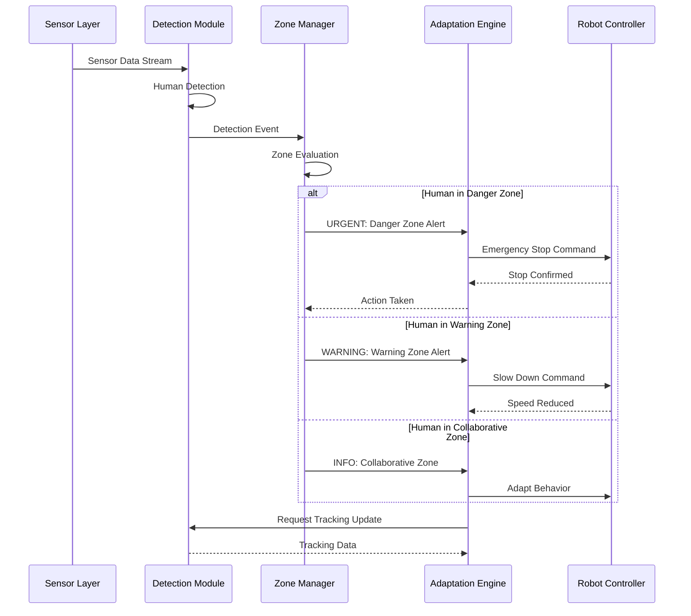
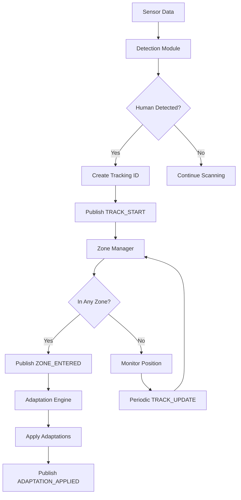
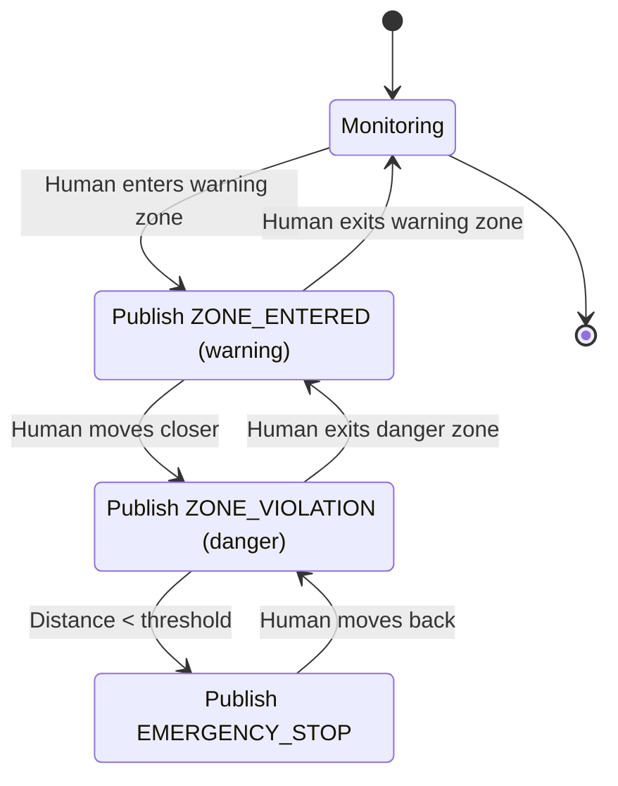
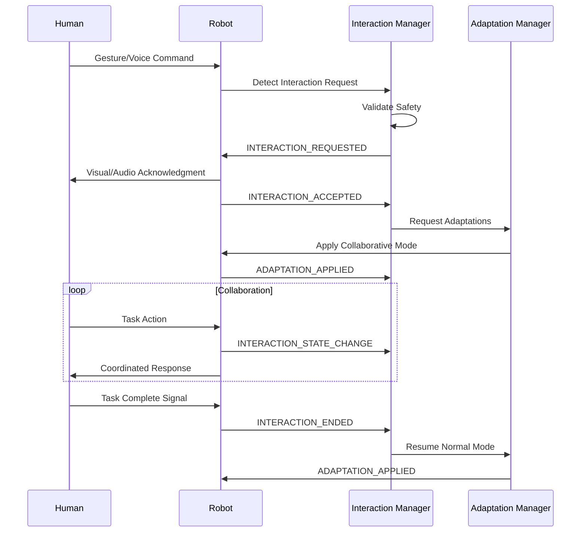
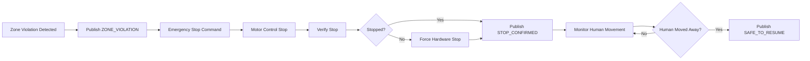
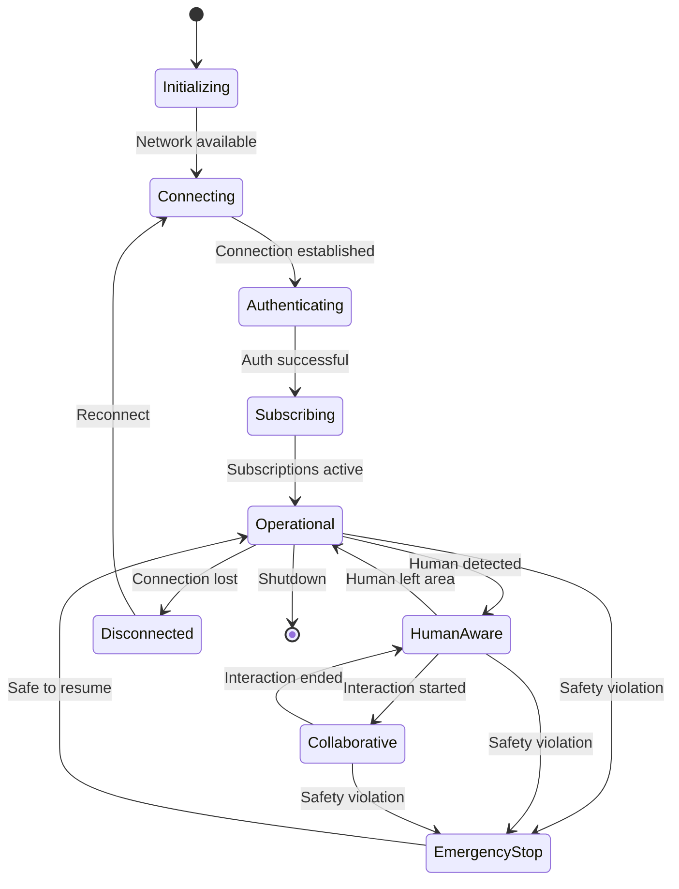

# WIA AI-Human Coexistence Phase 3: Communication Protocol

**Version:** 1.0.0
**Status:** Draft
**Date:** 2025-01
**Primary Color:** #10B981 (Emerald)

---

## Table of Contents

1. [Overview](#1-overview)
2. [Protocol Architecture](#2-protocol-architecture)
3. [Message Formats](#3-message-formats)
   - 3.1 [Human Tracking Messages](#31-human-tracking-messages)
   - 3.2 [Zone Alert Messages](#32-zone-alert-messages)
   - 3.3 [Interaction Messages](#33-interaction-messages)
   - 3.4 [Behavioral Adaptation Messages](#34-behavioral-adaptation-messages)
4. [Communication Flows](#4-communication-flows)
5. [Real-time Streaming Protocol](#5-real-time-streaming-protocol)
6. [Safety Protocol](#6-safety-protocol)
7. [Protocol State Machine](#7-protocol-state-machine)
8. [Quality of Service](#8-quality-of-service)

---

## 1. Overview

WIA AI-Human Coexistence Protocol은 AI 시스템 간, 그리고 AI와 모니터링 시스템 간의 실시간 통신을 위한 프로토콜을 정의합니다.

### Protocol Stack

```
┌─────────────────────────────────────┐
│   Application Layer                 │
│   (Human Tracking, Zone Management) │
├─────────────────────────────────────┤
│   Message Layer                     │
│   (JSON, Protocol Buffers)          │
├─────────────────────────────────────┤
│   Transport Layer                   │
│   (WebSocket, MQTT, gRPC)           │
├─────────────────────────────────────┤
│   Security Layer                    │
│   (TLS 1.3, mTLS)                   │
├─────────────────────────────────────┤
│   Network Layer                     │
│   (TCP/IP, UDP)                     │
└─────────────────────────────────────┘
```

### Supported Transports

| Transport | Use Case | Latency | Reliability |
|-----------|----------|---------|-------------|
| WebSocket | Real-time web clients | < 50ms | High |
| MQTT | IoT sensors, edge devices | < 100ms | Medium |
| gRPC | Device-to-device | < 20ms | Very High |
| HTTP/2 | REST API fallback | < 200ms | High |

---

## 2. Protocol Architecture

### 2.1 Message Exchange Pattern



### 2.2 Topic Hierarchy (MQTT)

```
wia/coexistence/{device_id}/
├── detection/
│   ├── humans          # Human detection events
│   ├── tracking        # Tracking updates
│   └── lost            # Tracking lost events
├── zones/
│   ├── status          # Zone status updates
│   ├── alerts          # Zone violation alerts
│   └── config          # Zone configuration changes
├── interaction/
│   ├── started         # Interaction started
│   ├── updates         # Interaction state updates
│   └── ended           # Interaction ended
├── adaptation/
│   ├── evaluated       # Adaptation evaluation
│   ├── applied         # Adaptation applied
│   └── performance     # Performance metrics
└── safety/
    ├── warnings        # Safety warnings
    ├── violations      # Safety violations
    └── emergency       # Emergency events
```

---

## 3. Message Formats

### 3.1 Human Tracking Messages

#### TRACK_START
새로운 인간 추적이 시작될 때 발행됩니다.

**Topic:** `wia/coexistence/{device_id}/detection/humans`

**Payload:**
```json
{
  "message_type": "TRACK_START",
  "message_id": "msg-20250115-001",
  "timestamp": "2025-01-15T14:30:45.123Z",
  "device_id": "robot-001",
  "data": {
    "tracking_id": "track-20250115-001",
    "human_id": "human-001",
    "initial_position": {
      "x": 2.5,
      "y": 3.2,
      "z": 0.0
    },
    "confidence": 0.95,
    "attributes": {
      "is_vulnerable": false,
      "age_estimate": "adult"
    }
  },
  "qos": 1,
  "priority": "normal"
}
```

#### TRACK_UPDATE
추적 중인 인간의 위치가 업데이트될 때 발행됩니다.

**Topic:** `wia/coexistence/{device_id}/detection/tracking`

**Payload:**
```json
{
  "message_type": "TRACK_UPDATE",
  "message_id": "msg-20250115-002",
  "timestamp": "2025-01-15T14:30:46.123Z",
  "device_id": "robot-001",
  "data": {
    "tracking_id": "track-20250115-001",
    "human_id": "human-001",
    "position": {
      "x": 2.6,
      "y": 3.3,
      "z": 0.0
    },
    "velocity": {
      "vx": 0.8,
      "vy": 0.1,
      "speed": 0.806
    },
    "confidence": 0.94,
    "tracking_quality": "stable"
  },
  "qos": 0,
  "priority": "normal"
}
```

#### TRACK_LOST
추적이 손실될 때 발행됩니다.

**Topic:** `wia/coexistence/{device_id}/detection/lost`

**Payload:**
```json
{
  "message_type": "TRACK_LOST",
  "message_id": "msg-20250115-003",
  "timestamp": "2025-01-15T14:31:00.123Z",
  "device_id": "robot-001",
  "data": {
    "tracking_id": "track-20250115-001",
    "human_id": "human-001",
    "last_known_position": {
      "x": 2.8,
      "y": 3.5,
      "z": 0.0
    },
    "total_duration_seconds": 15.0,
    "reason": "left_sensor_range"
  },
  "qos": 1,
  "priority": "normal"
}
```

### 3.2 Zone Alert Messages

#### ZONE_ENTERED
인간이 근접 구역에 진입할 때 발행됩니다.

**Topic:** `wia/coexistence/{device_id}/zones/alerts`

**Payload:**
```json
{
  "message_type": "ZONE_ENTERED",
  "message_id": "msg-20250115-004",
  "timestamp": "2025-01-15T14:30:47.123Z",
  "device_id": "robot-001",
  "data": {
    "alert_id": "alert-20250115-001",
    "human_id": "human-001",
    "zone_type": "warning",
    "entry_position": {
      "x": 1.4,
      "y": 0.5,
      "z": 0.0
    },
    "distance_to_device_m": 1.5,
    "urgency": "medium",
    "recommended_action": "slow_down"
  },
  "qos": 1,
  "priority": "high"
}
```

#### ZONE_VIOLATION
위험 구역 침범 시 발행됩니다.

**Topic:** `wia/coexistence/{device_id}/safety/violations`

**Payload:**
```json
{
  "message_type": "ZONE_VIOLATION",
  "message_id": "msg-20250115-005",
  "timestamp": "2025-01-15T14:30:48.123Z",
  "device_id": "robot-001",
  "data": {
    "violation_id": "viol-20250115-001",
    "human_id": "human-001",
    "zone_type": "danger",
    "violation_position": {
      "x": 0.4,
      "y": 0.1,
      "z": 0.0
    },
    "distance_to_device_m": 0.42,
    "urgency": "critical",
    "required_action": "emergency_stop",
    "response_time_budget_ms": 100
  },
  "qos": 2,
  "priority": "urgent"
}
```

#### ZONE_EXITED
인간이 근접 구역을 벗어날 때 발행됩니다.

**Topic:** `wia/coexistence/{device_id}/zones/alerts`

**Payload:**
```json
{
  "message_type": "ZONE_EXITED",
  "message_id": "msg-20250115-006",
  "timestamp": "2025-01-15T14:30:55.123Z",
  "device_id": "robot-001",
  "data": {
    "alert_id": "alert-20250115-001",
    "human_id": "human-001",
    "zone_type": "warning",
    "exit_position": {
      "x": 3.2,
      "y": 1.5,
      "z": 0.0
    },
    "time_in_zone_seconds": 8.0,
    "recommended_action": "resume_normal"
  },
  "qos": 1,
  "priority": "normal"
}
```

### 3.3 Interaction Messages

#### INTERACTION_REQUESTED
인간 또는 AI가 상호작용을 요청할 때 발행됩니다.

**Topic:** `wia/coexistence/{device_id}/interaction/started`

**Payload:**
```json
{
  "message_type": "INTERACTION_REQUESTED",
  "message_id": "msg-20250115-007",
  "timestamp": "2025-01-15T14:31:00.123Z",
  "device_id": "robot-001",
  "data": {
    "interaction_id": "interact-20250115-001",
    "human_id": "human-001",
    "initiated_by": "human",
    "interaction_type": "collaborative_work",
    "requested_channels": ["verbal", "visual"],
    "task_context": {
      "task_id": "task-001",
      "task_type": "object_handover"
    }
  },
  "qos": 1,
  "priority": "high"
}
```

#### INTERACTION_ACCEPTED
상호작용 요청이 수락될 때 발행됩니다.

**Payload:**
```json
{
  "message_type": "INTERACTION_ACCEPTED",
  "message_id": "msg-20250115-008",
  "timestamp": "2025-01-15T14:31:01.123Z",
  "device_id": "robot-001",
  "data": {
    "interaction_id": "interact-20250115-001",
    "acceptance_time": "2025-01-15T14:31:01.123Z",
    "active_channels": ["verbal", "visual", "projection"],
    "estimated_duration_seconds": 120,
    "safety_parameters": {
      "minimum_distance_m": 1.0,
      "max_approach_speed_ms": 0.3
    }
  },
  "qos": 1,
  "priority": "high"
}
```

#### INTERACTION_STATE_CHANGE
상호작용 상태가 변경될 때 발행됩니다.

**Topic:** `wia/coexistence/{device_id}/interaction/updates`

**Payload:**
```json
{
  "message_type": "INTERACTION_STATE_CHANGE",
  "message_id": "msg-20250115-009",
  "timestamp": "2025-01-15T14:31:30.123Z",
  "device_id": "robot-001",
  "data": {
    "interaction_id": "interact-20250115-001",
    "previous_phase": "initiating",
    "current_phase": "active",
    "human_state": {
      "attention_level": "focused",
      "engagement_score": 0.85
    },
    "collaboration_state": {
      "handover_state": "approaching",
      "sync_status": "synchronized"
    }
  },
  "qos": 0,
  "priority": "normal"
}
```

### 3.4 Behavioral Adaptation Messages

#### ADAPTATION_REQUIRED
행동 적응이 필요할 때 발행됩니다.

**Topic:** `wia/coexistence/{device_id}/adaptation/evaluated`

**Payload:**
```json
{
  "message_type": "ADAPTATION_REQUIRED",
  "message_id": "msg-20250115-010",
  "timestamp": "2025-01-15T14:30:47.500Z",
  "device_id": "robot-001",
  "data": {
    "adaptation_id": "adapt-20250115-001",
    "trigger_event": {
      "event_type": "human_entered_warning_zone",
      "human_id": "human-001"
    },
    "recommended_adaptations": [
      {
        "adaptation_type": "speed_reduction",
        "priority": 1,
        "from_value": 1.5,
        "to_value": 0.3,
        "unit": "m/s"
      },
      {
        "adaptation_type": "trajectory_modification",
        "priority": 2,
        "parameter": "path_clearance",
        "adjustment": "+1.0m"
      }
    ],
    "urgency": "medium",
    "response_time_budget_ms": 500
  },
  "qos": 1,
  "priority": "high"
}
```

#### ADAPTATION_APPLIED
행동 적응이 적용될 때 발행됩니다.

**Topic:** `wia/coexistence/{device_id}/adaptation/applied`

**Payload:**
```json
{
  "message_type": "ADAPTATION_APPLIED",
  "message_id": "msg-20250115-011",
  "timestamp": "2025-01-15T14:30:48.000Z",
  "device_id": "robot-001",
  "data": {
    "adaptation_id": "adapt-20250115-001",
    "applied_adaptations": [
      {
        "adaptation_type": "speed_reduction",
        "applied_value": 0.3,
        "application_time": "2025-01-15T14:30:47.850Z"
      }
    ],
    "new_behavioral_mode": "human_aware",
    "latency_ms": 350,
    "performance_impact": {
      "speed_reduction_percent": 80,
      "efficiency_reduction_percent": 25
    }
  },
  "qos": 1,
  "priority": "normal"
}
```

---

## 4. Communication Flows

### 4.1 Human Detection Flow



### 4.2 Zone Alert Flow



### 4.3 Collaborative Interaction Flow



### 4.4 Emergency Stop Flow



---

## 5. Real-time Streaming Protocol

### 5.1 WebSocket Protocol

**Connection Handshake:**
```javascript
// Client connection
const ws = new WebSocket('wss://api.wia-standards.org/ai-human-coexistence/v1/stream');

// Send authentication
ws.send(JSON.stringify({
  type: 'auth',
  token: 'YOUR_API_KEY',
  device_id: 'robot-001'
}));

// Subscribe to topics
ws.send(JSON.stringify({
  type: 'subscribe',
  topics: [
    'detection/humans',
    'zones/alerts',
    'safety/violations'
  ],
  options: {
    update_frequency_hz: 10,
    include_predictions: true
  }
}));
```

**Heartbeat Protocol:**
```json
{
  "type": "heartbeat",
  "timestamp": "2025-01-15T14:30:45.123Z",
  "device_id": "robot-001",
  "status": "online",
  "uptime_seconds": 3600
}
```

### 5.2 MQTT Protocol

**Connection Parameters:**
```yaml
broker: mqtt.wia-standards.org
port: 8883
protocol: mqtts
client_id: robot-001
clean_session: false
keepalive: 60
qos_default: 1
```

**Subscription:**
```python
import paho.mqtt.client as mqtt

def on_connect(client, userdata, flags, rc):
    # Subscribe to all coexistence topics for this device
    client.subscribe("wia/coexistence/robot-001/#", qos=1)

    # Subscribe to broadcast alerts
    client.subscribe("wia/coexistence/+/safety/emergency", qos=2)

def on_message(client, userdata, msg):
    payload = json.loads(msg.payload)
    handle_message(payload)

client = mqtt.Client(client_id="robot-001")
client.on_connect = on_connect
client.on_message = on_message
client.tls_set()
client.connect("mqtt.wia-standards.org", 8883, 60)
client.loop_forever()
```

### 5.3 gRPC Streaming

```protobuf
service HumanCoexistence {
  // Bidirectional streaming for real-time detection
  rpc StreamDetection(stream DetectionRequest) returns (stream DetectionResponse);

  // Server streaming for zone alerts
  rpc StreamZoneAlerts(ZoneAlertRequest) returns (stream ZoneAlert);

  // Bidirectional streaming for interactions
  rpc StreamInteraction(stream InteractionMessage) returns (stream InteractionMessage);
}

message DetectionRequest {
  string device_id = 1;
  google.protobuf.Timestamp timestamp = 2;
  SensorData sensor_data = 3;
}

message DetectionResponse {
  string detection_id = 1;
  google.protobuf.Timestamp timestamp = 2;
  repeated HumanDetection humans = 3;
  int32 processing_time_ms = 4;
}
```

---

## 6. Safety Protocol

### 6.1 Priority Levels

| Priority | QoS | Max Latency | Use Case |
|----------|-----|-------------|----------|
| URGENT | 2 | 50ms | Danger zone violation, emergency stop |
| HIGH | 1 | 200ms | Warning zone alerts, safety warnings |
| NORMAL | 1 | 500ms | Tracking updates, interaction events |
| LOW | 0 | 1000ms | Statistics, logs |

### 6.2 Emergency Protocol

**Emergency Stop Message:**
```json
{
  "message_type": "EMERGENCY_STOP",
  "message_id": "emergency-20250115-001",
  "timestamp": "2025-01-15T14:30:48.123Z",
  "device_id": "robot-001",
  "data": {
    "reason": "danger_zone_violation",
    "human_id": "human-001",
    "distance_m": 0.42,
    "required_action": "immediate_stop",
    "override_allowed": false
  },
  "qos": 2,
  "priority": "urgent",
  "ack_required": true,
  "timeout_ms": 100
}
```

**Stop Acknowledgment:**
```json
{
  "message_type": "STOP_ACKNOWLEDGED",
  "message_id": "ack-20250115-001",
  "timestamp": "2025-01-15T14:30:48.180Z",
  "device_id": "robot-001",
  "data": {
    "emergency_id": "emergency-20250115-001",
    "stop_confirmed": true,
    "stop_latency_ms": 57,
    "current_velocity_ms": 0.0,
    "brake_status": "engaged"
  },
  "qos": 2,
  "priority": "urgent"
}
```

### 6.3 Watchdog Protocol

```json
{
  "message_type": "WATCHDOG",
  "message_id": "watchdog-20250115-001",
  "timestamp": "2025-01-15T14:30:50.000Z",
  "device_id": "robot-001",
  "data": {
    "system_health": "normal",
    "last_detection_age_ms": 150,
    "last_zone_check_age_ms": 100,
    "communication_latency_ms": 45,
    "safety_systems_active": true,
    "emergency_stop_armed": true
  },
  "qos": 1,
  "priority": "high",
  "interval_ms": 1000
}
```

---

## 7. Protocol State Machine

### 7.1 Device State Machine



### 7.2 Message State Tracking

```typescript
interface MessageState {
  message_id: string;
  state: 'pending' | 'sent' | 'delivered' | 'acknowledged' | 'failed';
  sent_at?: string;
  delivered_at?: string;
  acknowledged_at?: string;
  retry_count: number;
  max_retries: number;
}
```

---

## 8. Quality of Service

### 8.1 QoS Levels

| QoS Level | Description | Delivery Guarantee | Use Case |
|-----------|-------------|-------------------|----------|
| 0 | At most once | Best effort | Frequent updates, statistics |
| 1 | At least once | Acknowledged | Important events, state changes |
| 2 | Exactly once | Guaranteed once | Safety-critical, emergency |

### 8.2 Message Retention

```json
{
  "retention_policy": {
    "emergency_messages": {
      "retain": true,
      "duration_hours": 24
    },
    "tracking_updates": {
      "retain": false
    },
    "interaction_logs": {
      "retain": true,
      "duration_hours": 72
    },
    "statistics": {
      "retain": false
    }
  }
}
```

### 8.3 Performance Metrics

| Metric | Target | Maximum |
|--------|--------|---------|
| End-to-end latency | < 50ms | 200ms |
| Detection update rate | 10 Hz | 30 Hz |
| Message loss rate | < 0.1% | 1% |
| Reconnection time | < 1s | 5s |

---

**Document Version**: 1.0.0
**Last Updated**: 2025-01
**Status**: Draft

---

<div align="center">

**WIA AI-Human Coexistence Communication Protocol**

Harmonious AI-Human Interaction in Shared Spaces

**弘益人間 (홍익인간)** - Benefit All Humanity

</div>
