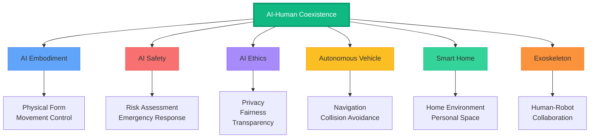
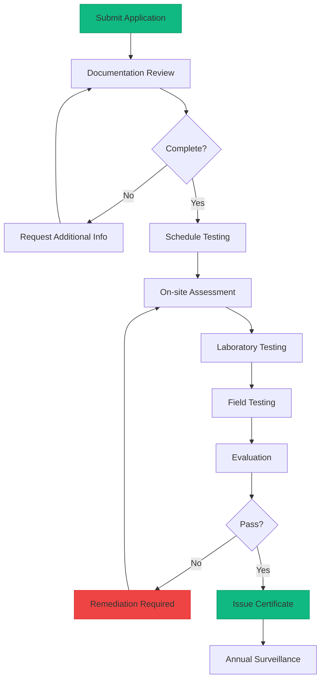

# WIA AI-Human Coexistence Phase 4: Integration & Certification

**Version:** 1.0.0
**Status:** Draft
**Date:** 2025-01
**Primary Color:** #10B981 (Emerald)

---

## Table of Contents

1. [Overview](#1-overview)
2. [WIA Standards Integration](#2-wia-standards-integration)
   - 2.1 [AI Embodiment Integration](#21-ai-embodiment-integration)
   - 2.2 [AI Safety Integration](#22-ai-safety-integration)
   - 2.3 [AI Ethics Integration](#23-ai-ethics-integration)
   - 2.4 [Autonomous Vehicle Integration](#24-autonomous-vehicle-integration)
3. [Certification Levels](#3-certification-levels)
   - 3.1 [Bronze Level](#31-bronze-level)
   - 3.2 [Silver Level](#32-silver-level)
   - 3.3 [Gold Level](#33-gold-level)
   - 3.4 [Platinum Level](#34-platinum-level)
4. [Compliance Checklist](#4-compliance-checklist)
5. [Testing & Validation](#5-testing--validation)
6. [Certification Process](#6-certification-process)
7. [Implementation Guidelines](#7-implementation-guidelines)
8. [Case Studies](#8-case-studies)

---

## 1. Overview

WIA AI-Human Coexistence Phase 4는 다른 WIA 표준과의 통합, 인증 수준, 그리고 구현 가이드라인을 정의합니다. 이 문서는 AI 시스템이 인간과 안전하고 윤리적으로 상호작용하기 위한 완전한 프레임워크를 제공합니다.

### Integration Philosophy



---

## 2. WIA Standards Integration

### 2.1 AI Embodiment Integration

#### Physical Form Awareness

AI-Human Coexistence는 AI Embodiment 표준과 통합하여 AI의 물리적 형태와 인간 상호작용을 조율합니다.

**Integration Schema:**
```json
{
  "$schema": "https://wia-standards.org/ai-human-coexistence/embodiment-integration.schema.json",
  "integration_id": "embodiment-int-001",
  "embodiment_profile": {
    "physical_form": "mobile_robot",
    "dimensions": {
      "height_cm": 120,
      "width_cm": 60,
      "depth_cm": 50,
      "weight_kg": 45
    },
    "motion_capabilities": {
      "max_speed_ms": 1.5,
      "max_acceleration_ms2": 0.5,
      "turning_radius_m": 0.8,
      "can_reverse": true
    },
    "safety_features": {
      "emergency_stop": true,
      "collision_sensors": true,
      "proximity_sensors": true,
      "soft_surfaces": true
    }
  },
  "coexistence_adaptations": {
    "proximity_zones": {
      "danger_zone_radius_m": 0.5,
      "warning_zone_radius_m": 1.5,
      "collaborative_zone_radius_m": 3.0,
      "adjustment_factors": {
        "height_factor": 1.0,
        "width_factor": 1.2,
        "speed_factor": 1.5
      }
    },
    "behavioral_constraints": {
      "max_approach_speed_ms": 0.3,
      "min_passing_distance_m": 1.0,
      "max_rotation_speed_deg_s": 45
    }
  }
}
```

**TypeScript Integration Example:**
```typescript
import { AIEmbodimentClient } from '@wia-standards/ai-embodiment';
import { AIHumanCoexistenceClient } from '@wia-standards/ai-human-coexistence';

class IntegratedRobot {
  private embodiment: AIEmbodimentClient;
  private coexistence: AIHumanCoexistenceClient;

  constructor() {
    this.embodiment = new AIEmbodimentClient({
      deviceId: 'robot-001',
      physicalProfile: this.getPhysicalProfile()
    });

    this.coexistence = new AIHumanCoexistenceClient({
      deviceId: 'robot-001',
      embodimentProfile: this.embodiment.getProfile()
    });
  }

  async adaptToHumanPresence(humanDetection: HumanDetection) {
    // Get physical constraints from embodiment
    const constraints = await this.embodiment.getMotionConstraints();

    // Calculate safe zones based on physical form
    const zones = this.coexistence.calculateProximityZones({
      robotDimensions: constraints.dimensions,
      maxSpeed: constraints.max_speed_ms,
      humanPosition: humanDetection.position
    });

    // Apply behavioral adaptations
    const adaptations = await this.coexistence.adaptation.evaluate({
      current_state: await this.embodiment.getCurrentState(),
      detected_humans: [humanDetection],
      physical_constraints: constraints
    });

    // Execute motion commands through embodiment
    await this.embodiment.motion.setConstraints({
      max_speed: adaptations.max_speed_ms,
      safe_zones: zones,
      emergency_stop_distance: zones.danger_zone.radius_m
    });
  }
}
```

### 2.2 AI Safety Integration

#### Risk Assessment Framework

**Integration Schema:**
```json
{
  "$schema": "https://wia-standards.org/ai-human-coexistence/safety-integration.schema.json",
  "safety_integration_id": "safety-int-001",
  "risk_assessment": {
    "hazard_identification": {
      "collision_risk": {
        "probability": "medium",
        "severity": "high",
        "risk_level": "significant",
        "mitigation": "proximity_zones"
      },
      "pinch_points": {
        "probability": "low",
        "severity": "medium",
        "risk_level": "moderate",
        "mitigation": "soft_surfaces"
      },
      "psychological_stress": {
        "probability": "medium",
        "severity": "low",
        "risk_level": "acceptable",
        "mitigation": "predictable_behavior"
      }
    },
    "safety_integrity_level": "SIL-2",
    "safety_functions": [
      {
        "function_id": "SF-001",
        "name": "Emergency Stop on Danger Zone Violation",
        "performance_level": "PLd",
        "reaction_time_ms": 50,
        "reliability": 0.9999
      },
      {
        "function_id": "SF-002",
        "name": "Speed Reduction on Warning Zone Entry",
        "performance_level": "PLc",
        "reaction_time_ms": 200,
        "reliability": 0.999
      },
      {
        "function_id": "SF-003",
        "name": "Human Tracking Continuity",
        "performance_level": "PLc",
        "max_tracking_loss_ms": 500,
        "reliability": 0.998
      }
    ]
  },
  "fail_safe_mechanisms": {
    "sensor_failure": "emergency_stop",
    "communication_loss": "safe_mode_operation",
    "power_loss": "mechanical_brake_engage",
    "software_error": "default_to_conservative_zones"
  }
}
```

**Python Safety Integration Example:**
```python
from wia_standards import AISafetyClient, AIHumanCoexistenceClient

class SafeCoexistenceSystem:
    def __init__(self):
        self.safety = AISafetyClient(device_id='robot-001')
        self.coexistence = AIHumanCoexistenceClient(device_id='robot-001')

    async def continuous_safety_monitoring(self):
        """Integrate safety monitoring with coexistence"""
        while True:
            # Get human detections
            detection = await self.coexistence.detection.scan()

            # Perform safety risk assessment
            risk_assessment = await self.safety.assess_risk({
                'humans_detected': detection['humans'],
                'robot_state': await self.get_robot_state(),
                'environmental_factors': await self.get_environment()
            })

            # If risk is elevated, apply safety adaptations
            if risk_assessment['risk_level'] in ['high', 'critical']:
                await self.apply_safety_adaptations(risk_assessment)

            # Log safety events
            await self.safety.log_event({
                'timestamp': datetime.now().isoformat(),
                'risk_level': risk_assessment['risk_level'],
                'humans_in_proximity': len(detection['humans']),
                'actions_taken': risk_assessment['mitigation_actions']
            })

    async def apply_safety_adaptations(self, risk_assessment):
        """Apply safety-driven behavioral adaptations"""
        adaptations = []

        if risk_assessment['hazards']['collision_risk'] == 'high':
            adaptations.append({
                'type': 'emergency_stop',
                'priority': 1
            })

        elif risk_assessment['hazards']['collision_risk'] == 'medium':
            adaptations.append({
                'type': 'speed_reduction',
                'parameter': 'max_velocity',
                'value': 0.3,
                'priority': 2
            })

        await self.coexistence.adaptation.apply(
            device_id='robot-001',
            adaptations=adaptations
        )
```

### 2.3 AI Ethics Integration

#### Ethical Guidelines Implementation

**Integration Schema:**
```json
{
  "$schema": "https://wia-standards.org/ai-human-coexistence/ethics-integration.schema.json",
  "ethics_integration_id": "ethics-int-001",
  "ethical_principles": {
    "privacy": {
      "data_minimization": true,
      "anonymization": "automatic",
      "retention_policy": {
        "detection_data": "immediate_deletion_after_processing",
        "tracking_data": "30_minutes_rolling_window",
        "interaction_logs": "24_hours_anonymized",
        "facial_data": "never_stored"
      },
      "consent_model": {
        "explicit_consent_required": false,
        "consent_exemption": "safety_critical_operation",
        "opt_out_available": true,
        "notification_provided": true
      }
    },
    "fairness": {
      "equal_treatment": true,
      "bias_monitoring": {
        "enabled": true,
        "metrics": ["detection_accuracy_by_demographic", "response_time_by_group"],
        "alert_threshold": 0.1
      },
      "vulnerable_protection": {
        "children": "enhanced_safety_zones",
        "elderly": "slower_approach_speed",
        "disabled": "adaptive_communication",
        "default": "equal_baseline"
      }
    },
    "transparency": {
      "operation_visibility": true,
      "intent_communication": "always",
      "status_indicators": ["led", "display", "audio"],
      "explainability": {
        "decision_logging": true,
        "human_readable_explanations": true
      }
    },
    "accountability": {
      "audit_trail": true,
      "incident_reporting": "automatic",
      "human_oversight": "available_on_request",
      "liability_framework": "operator_responsible"
    }
  },
  "ethical_decision_framework": {
    "priority_order": [
      "human_safety",
      "vulnerable_protection",
      "privacy_preservation",
      "fair_treatment",
      "transparency",
      "efficiency"
    ],
    "conflict_resolution": "safety_first_always"
  }
}
```

### 2.4 Autonomous Vehicle Integration

**Integration Schema:**
```json
{
  "$schema": "https://wia-standards.org/ai-human-coexistence/auto-integration.schema.json",
  "auto_integration_id": "auto-int-001",
  "vehicle_context": {
    "vehicle_type": "autonomous_shuttle",
    "operating_domain": {
      "environments": ["pedestrian_zone", "mixed_traffic", "warehouse"],
      "speed_range_ms": [0, 5.0],
      "weather_conditions": ["clear", "light_rain"]
    }
  },
  "pedestrian_interaction": {
    "detection_zones": {
      "critical_zone_m": 2.0,
      "warning_zone_m": 5.0,
      "awareness_zone_m": 15.0
    },
    "crossing_prediction": {
      "enabled": true,
      "look_ahead_seconds": 3.0,
      "confidence_threshold": 0.8
    },
    "yielding_behavior": {
      "yield_to_pedestrians": "always",
      "yield_distance_m": 3.0,
      "resume_after_clear_seconds": 2.0
    }
  },
  "communication_with_pedestrians": {
    "visual_signals": {
      "led_matrix": true,
      "projection": true,
      "colors": {
        "safe_to_cross": "#10B981",
        "do_not_cross": "#EF4444",
        "yielding": "#FBBF24"
      }
    },
    "audio_signals": {
      "approach_warning": true,
      "yielding_announcement": true,
      "volume_adaptive": true
    }
  }
}
```

---

## 3. Certification Levels

### 3.1 Bronze Level

**기본 인간 감지 및 안전**

#### Requirements

| Category | Requirement | Verification Method |
|----------|-------------|---------------------|
| Detection | Detect humans within 5m | Sensor testing |
| Proximity | Maintain 1m minimum distance | Physical testing |
| Speed | Limit speed to 0.5 m/s near humans | Motion capture |
| Emergency Stop | Stop within 1 second | Response time test |
| Communication | Visual indicators (LED) | Visual inspection |

#### Capabilities

✓ Basic human detection (confidence > 0.7)
✓ Simple proximity zones (danger, safe)
✓ Emergency stop functionality
✓ Basic visual communication
✓ Manual override available

#### Badge
```
┌─────────────────────────┐
│   WIA CERTIFIED         │
│   AI-Human Coexistence  │
│                         │
│      🥉 BRONZE          │
│                         │
│   Basic Safety          │
│   Version 1.0.0         │
└─────────────────────────┘
```

### 3.2 Silver Level

**향상된 추적 및 적응 행동**

#### Requirements

| Category | Requirement | Verification Method |
|----------|-------------|---------------------|
| Detection | Multi-person detection (up to 10) | Stress testing |
| Tracking | Continuous tracking with <500ms loss | Tracking accuracy test |
| Proximity | Four-zone system (danger/warning/collaborative/safe) | Zone validation |
| Adaptation | Dynamic speed and path adjustment | Behavioral testing |
| Communication | Multi-modal (visual + audio) | Integration testing |
| Vulnerability | Detect and protect children, elderly | Scenario testing |
| Intent | Basic intent prediction | Predictive accuracy |

#### Capabilities

✓ Multi-person tracking
✓ Four-zone proximity management
✓ Behavioral adaptation to human presence
✓ Vulnerable person detection
✓ Multi-modal communication
✓ Basic intent prediction
✓ Interaction logging

#### Badge
```
┌─────────────────────────┐
│   WIA CERTIFIED         │
│   AI-Human Coexistence  │
│                         │
│      🥈 SILVER          │
│                         │
│   Enhanced Awareness    │
│   Version 1.0.0         │
└─────────────────────────┘
```

### 3.3 Gold Level

**고급 협업 및 사회적 인식**

#### Requirements

| Category | Requirement | Verification Method |
|----------|-------------|---------------------|
| Detection | High-precision detection (confidence > 0.9) | Accuracy benchmarking |
| Tracking | Multi-modal sensor fusion | Sensor fusion testing |
| Proximity | Dynamic zone adjustment | Adaptive testing |
| Adaptation | Predictive behavioral adaptation | Prediction validation |
| Communication | Full multi-modal + projection | Communication effectiveness |
| Collaboration | Active human-robot collaboration | Task completion tests |
| Social Awareness | Understand social context and norms | Scenario-based testing |
| Intent Prediction | Advanced intent with 5s horizon | Predictive model validation |
| Privacy | Anonymization and data protection | Privacy audit |
| Ethics | Fairness and bias monitoring | Ethical compliance audit |

#### Capabilities

✓ High-precision multi-sensor detection
✓ Advanced predictive tracking
✓ Dynamic proximity zone adjustment
✓ Proactive behavioral adaptation
✓ Full collaborative interaction
✓ Social context understanding
✓ Cultural norm adaptation
✓ Advanced intent prediction
✓ Privacy-preserving operation
✓ Fairness and bias monitoring
✓ Comprehensive audit trails

#### Badge
```
┌─────────────────────────┐
│   WIA CERTIFIED         │
│   AI-Human Coexistence  │
│                         │
│      🥇 GOLD            │
│                         │
│   Advanced Collaboration│
│   Version 1.0.0         │
└─────────────────────────┘
```

### 3.4 Platinum Level

**최고 수준의 조화로운 공존**

#### Requirements

| Category | Requirement | Verification Method |
|----------|-------------|---------------------|
| Detection | 99%+ accuracy, all conditions | Comprehensive testing |
| Tracking | Predictive multi-modal tracking | Advanced validation |
| Proximity | AI-optimized dynamic zones | Performance benchmarking |
| Adaptation | Real-time learning and adaptation | Adaptive learning tests |
| Communication | Natural language + full multimodal | NLU evaluation |
| Collaboration | Seamless joint task execution | Complex task testing |
| Social Intelligence | Full social and emotional awareness | Social AI evaluation |
| Intent Prediction | Multi-person intent with 10s horizon | Advanced prediction tests |
| Privacy | Zero-knowledge protocols | Cryptographic verification |
| Ethics | Proactive ethical decision-making | Ethics board review |
| Integration | Full WIA ecosystem integration | Cross-standard testing |
| Reliability | 99.99% uptime, fault tolerance | Reliability engineering |

#### Capabilities

✓ Near-perfect detection and tracking
✓ AI-optimized adaptive zones
✓ Real-time learning from interactions
✓ Natural language understanding
✓ Emotional intelligence
✓ Seamless collaborative workflows
✓ Full social context awareness
✓ Multi-person intent prediction
✓ Zero-knowledge privacy
✓ Proactive ethical reasoning
✓ Complete WIA integration
✓ Autonomous safety management
✓ Self-diagnostics and recovery

#### Badge
```
┌─────────────────────────┐
│   WIA CERTIFIED         │
│   AI-Human Coexistence  │
│                         │
│     💎 PLATINUM         │
│                         │
│  Harmonious Coexistence │
│   Version 1.0.0         │
└─────────────────────────┘
```

---

## 4. Compliance Checklist

### 4.1 Core Requirements (All Levels)

- [ ] **CR-01**: Human detection system implemented
- [ ] **CR-02**: Emergency stop functionality verified
- [ ] **CR-03**: Minimum safety distance maintained (1m)
- [ ] **CR-04**: Visual status indicators present
- [ ] **CR-05**: Manual override mechanism available
- [ ] **CR-06**: Safety zone violations logged
- [ ] **CR-07**: API authentication implemented
- [ ] **CR-08**: Error handling implemented
- [ ] **CR-09**: Privacy policy defined
- [ ] **CR-10**: Incident reporting mechanism active

### 4.2 Detection & Tracking (Silver+)

- [ ] **DT-01**: Multi-person detection (≥10 simultaneous)
- [ ] **DT-02**: Tracking continuity <500ms loss
- [ ] **DT-03**: Sensor fusion implemented
- [ ] **DT-04**: Position accuracy ±5cm
- [ ] **DT-05**: Velocity estimation accuracy ±0.1 m/s
- [ ] **DT-06**: Occlusion handling implemented
- [ ] **DT-07**: Re-identification after tracking loss
- [ ] **DT-08**: Tracking quality metrics reported

### 4.3 Proximity Zones (Silver+)

- [ ] **PZ-01**: Four-zone system implemented (danger/warning/collaborative/safe)
- [ ] **PZ-02**: Zone radii configurable
- [ ] **PZ-03**: Zone violations detected within 100ms
- [ ] **PZ-04**: Dynamic zone adjustment for vulnerable persons
- [ ] **PZ-05**: Zone status published real-time
- [ ] **PZ-06**: Emergency stop on danger zone violation
- [ ] **PZ-07**: Speed limiting on warning zone entry
- [ ] **PZ-08**: Zone configuration validated on startup

### 4.4 Behavioral Adaptation (Silver+)

- [ ] **BA-01**: Speed reduction based on proximity
- [ ] **BA-02**: Trajectory modification to maintain clearance
- [ ] **BA-03**: Adaptation latency <500ms
- [ ] **BA-04**: Predictability mode for human comfort
- [ ] **BA-05**: Communication activation on approach
- [ ] **BA-06**: Behavioral mode transitions logged
- [ ] **BA-07**: Performance impact measured
- [ ] **BA-08**: Adaptation effectiveness validated

### 4.5 Vulnerability Protection (Silver+)

- [ ] **VP-01**: Child detection (age estimation)
- [ ] **VP-02**: Elderly detection (mobility assessment)
- [ ] **VP-03**: Disability detection (mobility aids)
- [ ] **VP-04**: Enhanced safety zones for vulnerable persons (1.5-2.0x)
- [ ] **VP-05**: Reduced approach speed (≤0.2 m/s)
- [ ] **VP-06**: Guardian detection and notification
- [ ] **VP-07**: Absolute yielding priority
- [ ] **VP-08**: Continuous monitoring required

### 4.6 Intent Prediction (Gold+)

- [ ] **IP-01**: Intent prediction model deployed
- [ ] **IP-02**: Prediction horizon ≥5 seconds
- [ ] **IP-03**: Trajectory prediction accuracy >80%
- [ ] **IP-04**: Alternative intent hypotheses generated
- [ ] **IP-05**: Behavioral cues analyzed (gaze, gesture, motion)
- [ ] **IP-06**: Contextual factors incorporated
- [ ] **IP-07**: Collision probability estimated
- [ ] **IP-08**: Recommended actions generated

### 4.7 Social Awareness (Gold+)

- [ ] **SA-01**: Social context detection implemented
- [ ] **SA-02**: Personal space norms respected
- [ ] **SA-03**: Cultural adaptations available
- [ ] **SA-04**: Group interaction recognition
- [ ] **SA-05**: Crowd density assessment
- [ ] **SA-06**: Social norm violation detection
- [ ] **SA-07**: Etiquette rules followed
- [ ] **SA-08**: Environmental context considered

### 4.8 Communication (Gold+)

- [ ] **CM-01**: Multi-modal communication (verbal, visual, gestural)
- [ ] **CM-02**: Natural language understanding
- [ ] **CM-03**: Intent communication before actions
- [ ] **CM-04**: Adaptive communication based on context
- [ ] **CM-05**: Communication effectiveness measured
- [ ] **CM-06**: Accessibility features (audio for vision-impaired)
- [ ] **CM-07**: Projection for path visualization
- [ ] **CM-08**: Message acknowledgment verification

### 4.9 Privacy & Ethics (Gold+)

- [ ] **PE-01**: Data minimization practiced
- [ ] **PE-02**: Anonymization automated
- [ ] **PE-03**: Retention policies enforced
- [ ] **PE-04**: Opt-out mechanism available
- [ ] **PE-05**: Bias monitoring active
- [ ] **PE-06**: Fairness metrics tracked
- [ ] **PE-07**: Transparent decision-making
- [ ] **PE-08**: Audit trail complete
- [ ] **PE-09**: Privacy impact assessment completed
- [ ] **PE-10**: Ethical review board approval

### 4.10 Integration & Reliability (Platinum)

- [ ] **IR-01**: WIA Embodiment integration
- [ ] **IR-02**: WIA Safety integration
- [ ] **IR-03**: WIA Ethics integration
- [ ] **IR-04**: WIA Autonomous Vehicle integration (if applicable)
- [ ] **IR-05**: 99.99% uptime achieved
- [ ] **IR-06**: Fault tolerance mechanisms active
- [ ] **IR-07**: Self-diagnostics implemented
- [ ] **IR-08**: Automatic recovery from failures
- [ ] **IR-09**: Real-time learning enabled
- [ ] **IR-10**: Continuous improvement metrics

---

## 5. Testing & Validation

### 5.1 Test Scenarios

#### Scenario 1: Single Person Approach
```yaml
test_id: TS-001
description: Single person walking toward robot
setup:
  - Robot stationary
  - Person starts 10m away
  - Walking speed: 1.0 m/s
validation:
  - Detection occurs at >5m distance
  - Warning zone alert at 1.5m
  - Speed reduced before entering warning zone
  - Minimum distance maintained >1.0m
  - Emergency stop if <0.5m
```

#### Scenario 2: Child in Play Area
```yaml
test_id: TS-002
description: Child running near robot
setup:
  - Robot moving at 0.5 m/s
  - Child (age 6-8) running erratically
validation:
  - Child identified as vulnerable
  - Safety zones expanded 1.5x
  - Robot speed reduced to <0.2 m/s
  - Continuous tracking maintained
  - Guardian notification sent
```

#### Scenario 3: Collaborative Task
```yaml
test_id: TS-003
description: Human-robot collaborative object handover
setup:
  - Robot delivering package
  - Human ready to receive
validation:
  - Interaction request detected
  - Collaborative zone entered
  - Communication channels activated
  - Synchronized approach
  - Safe handover distance maintained
  - Task completion confirmed
```

### 5.2 Performance Benchmarks

| Metric | Bronze | Silver | Gold | Platinum |
|--------|--------|--------|------|----------|
| Detection Accuracy | >70% | >85% | >90% | >99% |
| Tracking Continuity | 2s | 0.5s | 0.2s | 0.05s |
| Emergency Stop Time | 1s | 500ms | 200ms | 50ms |
| Adaptation Latency | 1s | 500ms | 200ms | 100ms |
| Multi-person Capacity | 1 | 10 | 50 | 200 |
| Intent Prediction Accuracy | N/A | >60% | >80% | >95% |

---

## 6. Certification Process

### 6.1 Application Steps



### 6.2 Required Documentation

- [ ] System architecture diagrams
- [ ] Safety analysis (FMEA, HAZOP)
- [ ] Risk assessment report
- [ ] Privacy impact assessment
- [ ] Ethical review board approval
- [ ] Test plans and results
- [ ] User manuals and training materials
- [ ] Maintenance procedures
- [ ] Incident response plan

### 6.3 Certification Validity

- **Initial Certification**: 3 years
- **Annual Surveillance**: Required
- **Re-certification**: Every 3 years
- **Version Updates**: Re-assessment required for major changes

---

## 7. Implementation Guidelines

### 7.1 Minimum Viable Implementation (Bronze)

```typescript
import { AIHumanCoexistenceClient } from '@wia-standards/ai-human-coexistence';

class BronzeLevelRobot {
  private client: AIHumanCoexistenceClient;
  private isEmergencyStopped: boolean = false;

  async initialize() {
    this.client = new AIHumanCoexistenceClient({
      apiKey: process.env.WIA_API_KEY,
      deviceId: 'robot-001',
      certificationLevel: 'bronze'
    });

    // Configure basic zones
    await this.client.zones.configure({
      danger_zone: { radius_m: 0.5, max_speed_ms: 0.0 },
      safe_zone: { radius_m: 5.0, max_speed_ms: 0.5 }
    });
  }

  async mainLoop() {
    while (true) {
      // Detect humans
      const detection = await this.client.detection.scan({
        sensor_data: await this.getSensorData(),
        scan_options: { confidence_threshold: 0.7 }
      });

      // Check zones
      const zoneStatus = await this.client.zones.getStatus();

      // Emergency stop if danger zone violated
      if (zoneStatus.zone_occupancy.danger_zone.count > 0) {
        await this.emergencyStop();
      }
      // Slow down if safe zone occupied
      else if (zoneStatus.zone_occupancy.safe_zone.count > 0) {
        await this.setSpeed(0.3);
      } else {
        await this.setSpeed(0.5);
      }

      await this.sleep(100); // 10 Hz update
    }
  }

  async emergencyStop() {
    this.isEmergencyStopped = true;
    await this.setSpeed(0.0);
    await this.client.safety.logEvent({
      event_type: 'emergency_stop',
      reason: 'danger_zone_violation'
    });
  }
}
```

### 7.2 Production-Ready Implementation (Gold)

See full example in repository: `/examples/gold-level-implementation.ts`

---

## 8. Case Studies

### 8.1 Warehouse Robot (Silver Certified)

**Organization**: LogiTech Automation
**Robot Type**: Autonomous mobile robot (AMR)
**Environment**: Warehouse with 50+ workers

**Implementation**:
- Multi-sensor fusion (LiDAR + cameras)
- Four-zone proximity system
- Vulnerable worker detection (high-visibility vests)
- Multi-modal communication (LED + speaker)

**Results**:
- 0 collisions in 12 months
- 99.2% uptime
- 30% increase in human comfort scores
- 15% increase in operational efficiency

### 8.2 Hospital Service Robot (Gold Certified)

**Organization**: HealthCare Robotics Inc.
**Robot Type**: Service robot for meal delivery
**Environment**: Hospital corridors and patient rooms

**Implementation**:
- Advanced intent prediction for patients and staff
- Privacy-preserving operation (no facial recognition)
- Cultural sensitivity (quiet hours, emergency priorities)
- Full collaborative interaction with staff

**Results**:
- 100% patient safety record
- 95% staff satisfaction
- 40% reduction in delivery time
- Privacy compliance 100%

---

**Document Version**: 1.0.0
**Last Updated**: 2025-01
**Status**: Draft

---

<div align="center">

**WIA AI-Human Coexistence Integration & Certification**

Harmonious AI-Human Interaction in Shared Spaces

**弘益人間 (홍익인간)** - Benefit All Humanity

</div>
