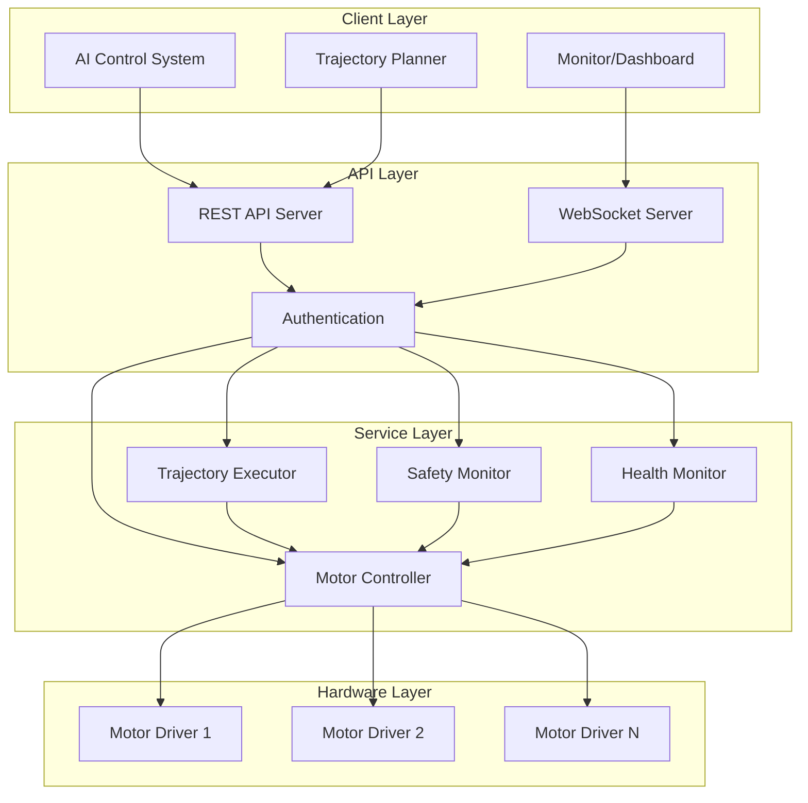

# WIA AI Motor Control - Phase 2: API Interface Specification

**Version**: 1.0.0
**Status**: Draft
**Date**: 2025-01
**Primary Color**: #F59E0B (Amber)

---

## 1. Overview

### 1.1 Purpose

This specification defines the REST API and programmatic interfaces for AI motor control systems. The API provides standardized endpoints for motor configuration, trajectory execution, real-time control, and status monitoring across robotic platforms.

### 1.2 Design Goals

1. **RESTful Design**: Standard HTTP methods and status codes
2. **Real-time Capable**: WebSocket support for low-latency control
3. **Type-Safe**: Comprehensive TypeScript/Python SDKs
4. **Async-First**: Non-blocking operations with async/await
5. **Multi-Motor**: Coordinated control of motor groups

### 1.3 API Architecture



### 1.4 Base URL

```
Production:  https://api.motor-control.wia.dev/v1
Development: http://localhost:8080/api/v1
```

---

## 2. Authentication

### 2.1 API Key Authentication

```http
GET /api/v1/motors
Authorization: Bearer <api_key>
```

### 2.2 OAuth 2.0 (Optional)

```http
POST /oauth/token
Content-Type: application/json

{
  "grant_type": "client_credentials",
  "client_id": "your_client_id",
  "client_secret": "your_client_secret"
}
```

---

## 3. Motor Management API

### 3.1 List Motors

Get all available motors in the system.

**Endpoint**: `GET /motors`

**Response**: 200 OK

```json
{
  "motors": [
    {
      "motor_id": "shoulder_pitch",
      "name": "Right Shoulder Pitch",
      "type": "servo",
      "manufacturer": "Dynamixel",
      "model": "XM540-W270",
      "status": "enabled",
      "position": 0.0,
      "temperature": 38.5,
      "online": true
    },
    {
      "motor_id": "shoulder_roll",
      "name": "Right Shoulder Roll",
      "type": "servo",
      "manufacturer": "Dynamixel",
      "model": "XM430-W350",
      "status": "enabled",
      "position": 0.0,
      "temperature": 35.2,
      "online": true
    }
  ],
  "total_count": 2
}
```

### 3.2 Get Motor Details

Get detailed information about a specific motor.

**Endpoint**: `GET /motors/{motor_id}`

**Response**: 200 OK

```json
{
  "motor_id": "shoulder_pitch",
  "name": "Right Shoulder Pitch",
  "type": "servo",
  "manufacturer": "Dynamixel",
  "model": "XM540-W270",
  "firmware_version": "45.0",
  "serial_number": "SN12345678",
  "capabilities": {
    "max_position": 180.0,
    "min_position": -180.0,
    "max_velocity": 120.0,
    "max_torque": 6.9,
    "max_acceleration": 360.0,
    "resolution": 0.088,
    "control_modes": ["position", "velocity", "torque", "impedance"]
  },
  "current_state": {
    "position": 45.2,
    "velocity": 0.0,
    "torque": 0.15,
    "current": 0.3,
    "voltage": 12.0,
    "temperature": 38.5,
    "enabled": true,
    "fault": false,
    "calibrated": true,
    "homed": true
  },
  "safety_limits": {
    "min_position": -90.0,
    "max_position": 90.0,
    "max_velocity": 60.0,
    "max_torque": 5.0,
    "max_temperature": 75.0
  },
  "health": {
    "overall_score": 95,
    "hours_operated": 1250.5,
    "cycles_completed": 458920,
    "maintenance_due": false
  }
}
```

### 3.3 Configure Motor

Update motor configuration and parameters.

**Endpoint**: `PUT /motors/{motor_id}/config`

**Request Body**:

```json
{
  "control_mode": "position",
  "pid_gains": {
    "kp": 50.0,
    "ki": 0.1,
    "kd": 2.5,
    "feedforward": 0.0
  },
  "safety_limits": {
    "min_position": -90.0,
    "max_position": 90.0,
    "max_velocity": 60.0,
    "max_torque": 5.0
  },
  "filter_config": {
    "type": "lowpass",
    "cutoff_frequency": 50.0,
    "order": 2
  }
}
```

**Response**: 200 OK

```json
{
  "motor_id": "shoulder_pitch",
  "status": "configured",
  "message": "Motor configuration updated successfully"
}
```

### 3.4 Enable/Disable Motor

**Endpoint**: `POST /motors/{motor_id}/enable`

**Request Body**:

```json
{
  "enabled": true
}
```

**Response**: 200 OK

---

## 4. Command API

### 4.1 Send Single Motor Command

**Endpoint**: `POST /motors/{motor_id}/command`

**Request Body**:

```json
{
  "control_mode": "position",
  "setpoint": 45.0,
  "velocity_limit": 60.0,
  "acceleration_limit": 120.0,
  "torque_limit": 4.0,
  "priority": 50
}
```

**Response**: 202 Accepted

```json
{
  "command_id": "cmd_1234567890",
  "motor_id": "shoulder_pitch",
  "status": "accepted",
  "estimated_completion_ms": 750
}
```

### 4.2 Send Multi-Motor Command

Coordinate multiple motors simultaneously.

**Endpoint**: `POST /motors/command/multi`

**Request Body**:

```json
{
  "command_id": "multi_cmd_001",
  "sync_mode": "simultaneous",
  "motors": [
    {
      "motor_id": "shoulder_pitch",
      "control_mode": "position",
      "setpoint": 45.0,
      "velocity_limit": 60.0
    },
    {
      "motor_id": "shoulder_roll",
      "control_mode": "position",
      "setpoint": 15.0,
      "velocity_limit": 60.0
    },
    {
      "motor_id": "elbow",
      "control_mode": "position",
      "setpoint": 90.0,
      "velocity_limit": 90.0
    }
  ],
  "coordination": {
    "type": "linear_interpolation",
    "total_duration_ms": 2000
  }
}
```

**Response**: 202 Accepted

### 4.3 Emergency Stop

**Endpoint**: `POST /motors/emergency-stop`

**Request Body**:

```json
{
  "motor_ids": ["shoulder_pitch", "shoulder_roll", "elbow"],
  "stop_mode": "immediate"
}
```

**Response**: 200 OK

---

## 5. Trajectory API

### 5.1 Create Trajectory

**Endpoint**: `POST /trajectories`

**Request Body**:

```json
{
  "trajectory_id": "traj_pick_001",
  "motor_id": "gripper_axis",
  "type": "spline",
  "waypoints": [
    {"position": 0.0, "velocity": 0.0, "time": 0.0},
    {"position": 45.0, "velocity": 30.0, "time": 1.5},
    {"position": 90.0, "velocity": 0.0, "time": 3.0}
  ],
  "timing": {
    "interpolation": "quintic"
  },
  "constraints": {
    "max_velocity": 60.0,
    "max_acceleration": 120.0,
    "max_jerk": 500.0
  }
}
```

**Response**: 201 Created

```json
{
  "trajectory_id": "traj_pick_001",
  "status": "created",
  "estimated_duration_ms": 3000
}
```

### 5.2 Execute Trajectory

**Endpoint**: `POST /trajectories/{trajectory_id}/execute`

**Request Body**:

```json
{
  "start_time": 1704067200000,
  "loop": false,
  "notify_on_complete": true
}
```

**Response**: 202 Accepted

```json
{
  "execution_id": "exec_001",
  "trajectory_id": "traj_pick_001",
  "status": "executing",
  "start_time": 1704067200000,
  "estimated_completion": 1704067203000
}
```

### 5.3 Get Trajectory Status

**Endpoint**: `GET /trajectories/{trajectory_id}/status`

**Response**: 200 OK

```json
{
  "trajectory_id": "traj_pick_001",
  "execution_id": "exec_001",
  "status": "executing",
  "progress_percent": 45.5,
  "current_waypoint": 1,
  "total_waypoints": 3,
  "elapsed_ms": 1365,
  "remaining_ms": 1635
}
```

### 5.4 Cancel Trajectory

**Endpoint**: `POST /trajectories/{trajectory_id}/cancel`

**Response**: 200 OK

### 5.5 List Trajectories

**Endpoint**: `GET /trajectories`

**Query Parameters**:
- `motor_id`: Filter by motor
- `status`: Filter by status (created, executing, completed, cancelled)
- `limit`: Page size (default: 50)
- `offset`: Page offset (default: 0)

**Response**: 200 OK

---

## 6. Monitoring API

### 6.1 Get Motor Status

**Endpoint**: `GET /motors/{motor_id}/status`

**Response**: 200 OK

```json
{
  "motor_id": "shoulder_pitch",
  "timestamp": 1704067200000,
  "position": 44.95,
  "velocity": 12.3,
  "torque": 8.5,
  "current": 2.1,
  "temperature": 42.5,
  "status": {
    "enabled": true,
    "fault": false,
    "in_motion": true,
    "at_target": false
  }
}
```

### 6.2 Get System Health

**Endpoint**: `GET /system/health`

**Response**: 200 OK

```json
{
  "overall_status": "healthy",
  "motors": {
    "total": 6,
    "enabled": 6,
    "faulted": 0,
    "warning": 1
  },
  "performance": {
    "avg_latency_ms": 2.5,
    "command_rate_hz": 100.0,
    "cpu_usage_percent": 35.2,
    "memory_usage_mb": 512
  },
  "uptime_hours": 168.5
}
```

### 6.3 Stream Real-time Data

**Endpoint**: WebSocket `ws://api/v1/motors/{motor_id}/stream`

**Message Format**:

```json
{
  "type": "feedback",
  "motor_id": "shoulder_pitch",
  "timestamp": 1704067200000,
  "position": 44.95,
  "velocity": 12.3,
  "torque": 8.5,
  "temperature": 42.5
}
```

---

## 7. TypeScript SDK

### 7.1 Installation

```bash
npm install @wia/motor-control
```

### 7.2 Basic Usage

```typescript
import { MotorControlClient, ControlMode } from '@wia/motor-control';

// Initialize client
const client = new MotorControlClient({
  baseUrl: 'https://api.motor-control.wia.dev/v1',
  apiKey: 'your_api_key'
});

// List motors
const motors = await client.motors.list();
console.log('Available motors:', motors);

// Get motor details
const motor = await client.motors.get('shoulder_pitch');
console.log('Motor details:', motor);

// Configure motor
await client.motors.configure('shoulder_pitch', {
  control_mode: ControlMode.Position,
  pid_gains: {
    kp: 50.0,
    ki: 0.1,
    kd: 2.5
  },
  safety_limits: {
    min_position: -90,
    max_position: 90,
    max_velocity: 60,
    max_torque: 5.0
  }
});

// Send command
const command = await client.motors.command('shoulder_pitch', {
  control_mode: ControlMode.Position,
  setpoint: 45.0,
  velocity_limit: 60.0,
  torque_limit: 4.0
});
console.log('Command accepted:', command.command_id);

// Multi-motor command
const multiCmd = await client.motors.commandMulti({
  sync_mode: 'simultaneous',
  motors: [
    { motor_id: 'shoulder_pitch', setpoint: 45.0 },
    { motor_id: 'shoulder_roll', setpoint: 15.0 },
    { motor_id: 'elbow', setpoint: 90.0 }
  ],
  coordination: {
    type: 'linear_interpolation',
    total_duration_ms: 2000
  }
});
```

### 7.3 Trajectory Execution

```typescript
import { TrajectoryType, InterpolationType } from '@wia/motor-control';

// Create trajectory
const trajectory = await client.trajectories.create({
  trajectory_id: 'traj_001',
  motor_id: 'gripper_axis',
  type: TrajectoryType.Spline,
  waypoints: [
    { position: 0.0, velocity: 0.0, time: 0.0 },
    { position: 45.0, velocity: 30.0, time: 1.5 },
    { position: 90.0, velocity: 0.0, time: 3.0 }
  ],
  timing: {
    interpolation: InterpolationType.Quintic
  },
  constraints: {
    max_velocity: 60.0,
    max_acceleration: 120.0,
    max_jerk: 500.0
  }
});

// Execute trajectory
const execution = await client.trajectories.execute('traj_001', {
  start_time: Date.now(),
  notify_on_complete: true
});

// Monitor progress
const status = await client.trajectories.getStatus('traj_001');
console.log(`Progress: ${status.progress_percent}%`);
```

### 7.4 Real-time Streaming

```typescript
// Subscribe to motor feedback
const stream = client.motors.stream('shoulder_pitch');

stream.on('feedback', (data) => {
  console.log('Position:', data.position);
  console.log('Velocity:', data.velocity);
  console.log('Torque:', data.torque);
});

stream.on('fault', (fault) => {
  console.error('Motor fault:', fault);
});

// Start streaming
await stream.start();

// Stop streaming
await stream.stop();
```

### 7.5 Error Handling

```typescript
import { MotorControlError, ErrorCode } from '@wia/motor-control';

try {
  await client.motors.command('shoulder_pitch', {
    control_mode: ControlMode.Position,
    setpoint: 200.0  // Out of range!
  });
} catch (error) {
  if (error instanceof MotorControlError) {
    switch (error.code) {
      case ErrorCode.LIMIT_EXCEEDED:
        console.error('Command exceeds safety limits');
        break;
      case ErrorCode.MOTOR_NOT_FOUND:
        console.error('Motor not found');
        break;
      case ErrorCode.MOTOR_DISABLED:
        console.error('Motor is disabled');
        break;
      default:
        console.error('Motor control error:', error.message);
    }
  }
}
```

---

## 8. Python SDK

### 8.1 Installation

```bash
pip install wia-motor-control
```

### 8.2 Basic Usage

```python
import asyncio
from wia_motor_control import MotorControlClient, ControlMode

async def main():
    # Initialize client
    client = MotorControlClient(
        base_url='https://api.motor-control.wia.dev/v1',
        api_key='your_api_key'
    )

    # List motors
    motors = await client.motors.list()
    print(f'Available motors: {motors}')

    # Get motor details
    motor = await client.motors.get('shoulder_pitch')
    print(f'Motor details: {motor}')

    # Configure motor
    await client.motors.configure('shoulder_pitch', {
        'control_mode': ControlMode.POSITION,
        'pid_gains': {
            'kp': 50.0,
            'ki': 0.1,
            'kd': 2.5
        },
        'safety_limits': {
            'min_position': -90,
            'max_position': 90,
            'max_velocity': 60,
            'max_torque': 5.0
        }
    })

    # Send command
    command = await client.motors.command('shoulder_pitch', {
        'control_mode': ControlMode.POSITION,
        'setpoint': 45.0,
        'velocity_limit': 60.0,
        'torque_limit': 4.0
    })
    print(f'Command accepted: {command.command_id}')

    # Multi-motor command
    multi_cmd = await client.motors.command_multi({
        'sync_mode': 'simultaneous',
        'motors': [
            {'motor_id': 'shoulder_pitch', 'setpoint': 45.0},
            {'motor_id': 'shoulder_roll', 'setpoint': 15.0},
            {'motor_id': 'elbow', 'setpoint': 90.0}
        ],
        'coordination': {
            'type': 'linear_interpolation',
            'total_duration_ms': 2000
        }
    })

asyncio.run(main())
```

### 8.3 Trajectory Execution

```python
from wia_motor_control import TrajectoryType, InterpolationType

async def execute_trajectory():
    client = MotorControlClient(api_key='your_api_key')

    # Create trajectory
    trajectory = await client.trajectories.create({
        'trajectory_id': 'traj_001',
        'motor_id': 'gripper_axis',
        'type': TrajectoryType.SPLINE,
        'waypoints': [
            {'position': 0.0, 'velocity': 0.0, 'time': 0.0},
            {'position': 45.0, 'velocity': 30.0, 'time': 1.5},
            {'position': 90.0, 'velocity': 0.0, 'time': 3.0}
        ],
        'timing': {
            'interpolation': InterpolationType.QUINTIC
        },
        'constraints': {
            'max_velocity': 60.0,
            'max_acceleration': 120.0,
            'max_jerk': 500.0
        }
    })

    # Execute trajectory
    execution = await client.trajectories.execute('traj_001', {
        'start_time': int(time.time() * 1000),
        'notify_on_complete': True
    })

    # Monitor progress
    while True:
        status = await client.trajectories.get_status('traj_001')
        print(f'Progress: {status.progress_percent}%')

        if status.status == 'completed':
            break

        await asyncio.sleep(0.1)

asyncio.run(execute_trajectory())
```

### 8.4 Real-time Streaming

```python
async def stream_motor_data():
    client = MotorControlClient(api_key='your_api_key')

    # Subscribe to motor feedback
    async with client.motors.stream('shoulder_pitch') as stream:
        async for data in stream:
            print(f'Position: {data.position}')
            print(f'Velocity: {data.velocity}')
            print(f'Torque: {data.torque}')

            if data.status.fault:
                print('Motor fault detected!')
                break

asyncio.run(stream_motor_data())
```

---

## 9. WebSocket Protocol

### 9.1 Connection

```javascript
const ws = new WebSocket('ws://api/v1/motors/shoulder_pitch/stream');

ws.onopen = () => {
  console.log('Connected to motor stream');

  // Subscribe to feedback
  ws.send(JSON.stringify({
    type: 'subscribe',
    channels: ['feedback', 'status', 'health']
  }));
};

ws.onmessage = (event) => {
  const data = JSON.parse(event.data);
  console.log('Received:', data);
};
```

### 9.2 Message Types

**Feedback Message**:
```json
{
  "type": "feedback",
  "motor_id": "shoulder_pitch",
  "timestamp": 1704067200000,
  "position": 44.95,
  "velocity": 12.3,
  "torque": 8.5
}
```

**Status Change**:
```json
{
  "type": "status",
  "motor_id": "shoulder_pitch",
  "timestamp": 1704067200000,
  "enabled": true,
  "fault": false
}
```

**Command Result**:
```json
{
  "type": "command_result",
  "command_id": "cmd_123",
  "status": "completed",
  "final_position": 45.02,
  "error": 0.02
}
```

---

## 10. Rate Limits

| Endpoint Type | Rate Limit |
|--------------|------------|
| Command API | 1000 req/min |
| Query API | 10000 req/min |
| Configuration | 100 req/min |
| WebSocket | 1000 msg/sec per connection |

---

## 11. Error Codes

| Code | Description |
|------|-------------|
| 400 | Bad Request - Invalid parameters |
| 401 | Unauthorized - Invalid API key |
| 403 | Forbidden - Insufficient permissions |
| 404 | Not Found - Motor or resource not found |
| 409 | Conflict - Motor busy or locked |
| 422 | Unprocessable - Command exceeds limits |
| 429 | Too Many Requests - Rate limit exceeded |
| 500 | Internal Server Error |
| 503 | Service Unavailable - Motor offline |

---

## 12. Version History

| Version | Date | Changes |
|---------|------|---------|
| 1.0.0 | 2025-01 | Initial specification |

---

**Document Version**: 1.0.0
**Last Updated**: 2025-01
**Author**: WIA AI Motor Control Working Group

---

弘益人間 - *Benefit All Humanity*
