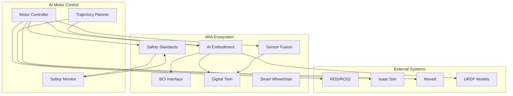
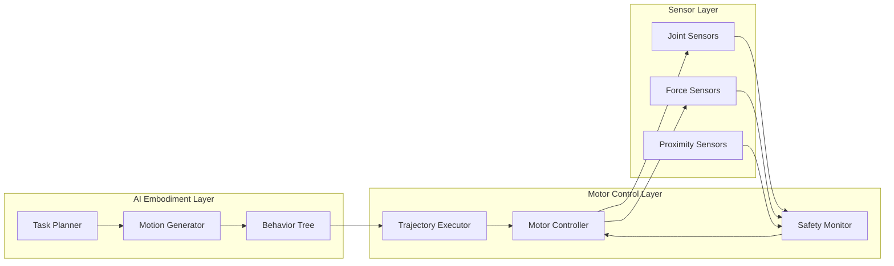
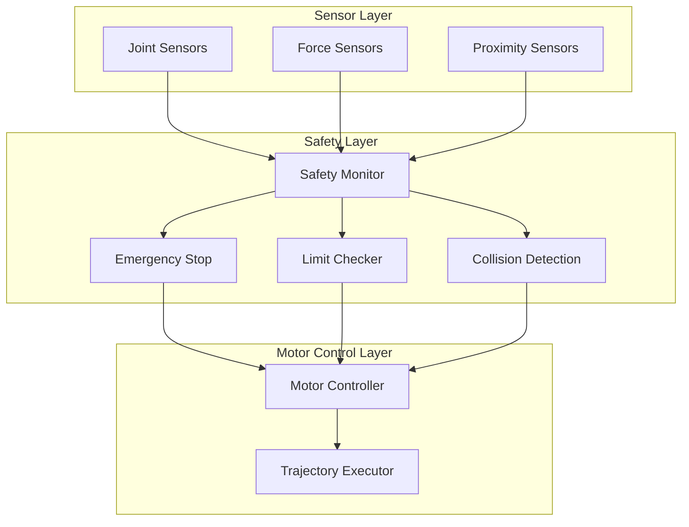
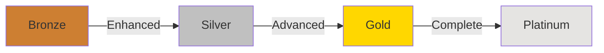

# WIA AI Motor Control - Phase 4: Ecosystem Integration Specification

**Version**: 1.0.0
**Status**: Draft
**Date**: 2025-01
**Primary Color**: #F59E0B (Amber)

---

## 1. Overview

### 1.1 Purpose

This specification defines how AI motor control systems integrate with the broader WIA ecosystem, including AI Embodiment, Sensor Fusion, Safety Standards, and other robotic platforms. It establishes certification levels and compliance requirements for interoperable motor control systems.

### 1.2 Integration Scope



### 1.3 Integration Principles

| Principle | Description |
|-----------|-------------|
| **Modularity** | Each component can be replaced independently |
| **Interoperability** | Works with multiple robot platforms |
| **Safety First** | Safety protocols integrated at every level |
| **Real-time Capable** | Maintains real-time performance across integrations |
| **Standardized** | Uses WIA standard data formats and protocols |

---

## 2. AI Embodiment Integration

### 2.1 Embodiment Architecture

AI Embodiment provides high-level motion planning and behavior generation for motor control systems.



### 2.2 Task-to-Motion Interface

**Endpoint**: `POST /embodiment/task`

```typescript
interface TaskRequest {
  task_id: string;
  task_type: 'pick' | 'place' | 'move' | 'grasp' | 'release' | 'custom';
  parameters: {
    target_position?: Vector3D;
    target_orientation?: Quaternion;
    approach_vector?: Vector3D;
    grasp_force?: number;
    speed?: number;
  };
  constraints: {
    collision_avoidance: boolean;
    joint_limits: boolean;
    force_limits: boolean;
    max_velocity?: number;
    max_acceleration?: number;
  };
  priority: number;
}

interface TaskResponse {
  task_id: string;
  status: 'accepted' | 'rejected' | 'planning';
  trajectory_id?: string;
  estimated_duration_ms?: number;
  motor_commands?: MotorCommand[];
}
```

### 2.3 Motion Planning Integration

```python
from wia_embodiment import MotionPlanner
from wia_motor_control import MotorController

# Initialize components
planner = MotionPlanner(robot_model='ur5e')
controller = MotorController()

# Plan motion
task = {
    'type': 'pick',
    'target_position': [0.5, 0.3, 0.2],
    'target_orientation': [0, 0, 0, 1],
    'grasp_force': 10.0
}

# Generate trajectory
trajectory = await planner.plan_task(task)

# Execute on motors
for motor_id, waypoints in trajectory.items():
    await controller.execute_trajectory(motor_id, waypoints)
```

### 2.4 Behavior Tree Integration

```typescript
import { BehaviorTree, Sequence, Selector, Action } from 'wia-embodiment';
import { MotorController } from 'wia-motor-control';

const controller = new MotorController();

// Define pick-and-place behavior
const pickAndPlace = new Sequence([
  new Action('MoveToPreGrasp', async () => {
    await controller.moveToPosition('arm', preGraspPosition);
  }),
  new Action('ApproachObject', async () => {
    await controller.moveToPosition('arm', graspPosition);
  }),
  new Action('CloseGripper', async () => {
    await controller.setGripperForce('gripper', 10.0);
  }),
  new Action('LiftObject', async () => {
    await controller.moveToPosition('arm', liftPosition);
  }),
  new Action('MoveToPlace', async () => {
    await controller.moveToPosition('arm', placePosition);
  }),
  new Action('OpenGripper', async () => {
    await controller.setGripperForce('gripper', 0.0);
  }),
  new Action('Retract', async () => {
    await controller.moveToPosition('arm', homePosition);
  })
]);

// Execute behavior tree
await pickAndPlace.execute();
```

---

## 3. Sensor Fusion Integration

### 3.1 Multi-Sensor Feedback

Motor control systems integrate with various sensors for enhanced performance and safety.

```typescript
interface SensorFusionConfig {
  sensors: {
    joint_encoders: boolean;
    force_torque: boolean;
    imu: boolean;
    proximity: boolean;
    vision: boolean;
    tactile: boolean;
  };
  fusion_algorithm: 'kalman' | 'particle_filter' | 'complementary';
  update_rate_hz: number;
  latency_compensation: boolean;
}

interface FusedState {
  timestamp: number;
  joint_positions: number[];
  joint_velocities: number[];
  joint_accelerations: number[];
  end_effector_pose: Pose;
  applied_forces: Vector3D;
  contact_detected: boolean;
  obstacle_distance: number;
  sensor_health: Record<string, number>;
}
```

### 3.2 Force-Torque Integration

```python
from wia_sensor_fusion import ForceTorqueSensor
from wia_motor_control import ImpedanceController

# Initialize force-torque sensor
ft_sensor = ForceTorqueSensor(sensor_id='wrist_ft')

# Initialize impedance controller
impedance_ctrl = ImpedanceController(
    motor_id='wrist_roll',
    stiffness=100.0,
    damping=20.0
)

# Reactive force control loop
async def force_control_loop():
    while True:
        # Read force-torque sensor
        force_data = await ft_sensor.read()

        # Adjust impedance based on contact force
        if force_data.force_magnitude > 5.0:
            # Reduce stiffness on contact
            await impedance_ctrl.set_stiffness(50.0)
        else:
            # Normal stiffness
            await impedance_ctrl.set_stiffness(100.0)

        # Compensate for external forces
        await impedance_ctrl.compensate_force(force_data.force)

        await asyncio.sleep(0.01)  # 100 Hz update rate
```

### 3.3 Vision-Guided Control

```typescript
import { VisionSystem } from 'wia-sensor-fusion';
import { MotorController } from 'wia-motor-control';

const vision = new VisionSystem({ camera_id: 'eye_in_hand' });
const motors = new MotorController();

// Visual servoing
async function visualServo(target: ObjectPose) {
  const controller = new VisualServoController({
    kp: 0.5,
    ki: 0.01,
    kd: 0.1
  });

  while (true) {
    // Get current object pose from vision
    const currentPose = await vision.detectObject(target.object_id);

    // Calculate error
    const error = controller.calculateError(currentPose, target);

    // Generate velocity commands
    const velocityCmd = controller.computeVelocity(error);

    // Send to motors
    await motors.setCartesianVelocity(velocityCmd);

    // Check convergence
    if (error.magnitude < 0.001) {
      break;
    }

    await sleep(10); // 100 Hz control loop
  }

  await motors.stop();
}
```

---

## 4. Safety Standards Integration

### 4.1 Safety Architecture



### 4.2 Safety Compliance

**ISO 13849-1 Performance Levels**:

| Level | Description | Risk Reduction | MTTFd |
|-------|-------------|----------------|-------|
| PLa | Low | 3x to 10x | Low |
| PLb | Medium | 10x to 30x | Low to Medium |
| PLc | Medium-High | 30x to 100x | Medium |
| PLd | High | 100x to 1000x | Medium to High |
| PLe | Very High | > 1000x | High |

### 4.3 Safety Monitoring

```typescript
interface SafetyMonitor {
  // Position limits
  checkPositionLimits(motor_id: string, position: number): SafetyStatus;

  // Velocity limits
  checkVelocityLimits(motor_id: string, velocity: number): SafetyStatus;

  // Torque limits
  checkTorqueLimits(motor_id: string, torque: number): SafetyStatus;

  // Collision detection
  detectCollision(force_data: ForceData): CollisionEvent | null;

  // Singularity avoidance
  checkSingularity(joint_positions: number[]): SafetyStatus;

  // Emergency stop
  triggerEmergencyStop(reason: string): void;

  // Safety reset
  resetSafety(auth_token: string): void;
}

interface SafetyStatus {
  is_safe: boolean;
  violation_type?: 'position' | 'velocity' | 'torque' | 'collision' | 'singularity';
  severity: 'info' | 'warning' | 'error' | 'critical';
  action_required: 'none' | 'reduce_speed' | 'stop' | 'emergency_stop';
  message: string;
}
```

### 4.4 Fault Detection and Recovery

```python
from wia_safety import FaultDetector, RecoveryManager
from wia_motor_control import MotorController

# Initialize components
fault_detector = FaultDetector()
recovery_mgr = RecoveryManager()
motors = MotorController()

# Fault detection loop
async def safety_monitor():
    while True:
        # Check all motors
        for motor_id in motors.get_motor_ids():
            status = await motors.get_status(motor_id)

            # Detect faults
            faults = fault_detector.check(motor_id, status)

            for fault in faults:
                if fault.severity == 'critical':
                    # Emergency stop
                    await motors.emergency_stop_all()
                    await recovery_mgr.enter_safe_state()

                elif fault.severity == 'error':
                    # Attempt recovery
                    recovery_action = recovery_mgr.get_action(fault)
                    await recovery_action.execute(motors)

                elif fault.severity == 'warning':
                    # Log warning
                    logger.warning(f"Motor {motor_id}: {fault.message}")

        await asyncio.sleep(0.01)  # 100 Hz monitoring
```

---

## 5. External Platform Integration

### 5.1 ROS/ROS2 Integration

```yaml
# ROS2 Configuration
ros2_bridge:
  enabled: true
  topics:
    command:
      topic: /motor_control/command
      message_type: wia_motor_msgs/MotorCommand
      qos: reliable
    feedback:
      topic: /motor_control/feedback
      message_type: wia_motor_msgs/MotorFeedback
      qos: best_effort
    trajectory:
      topic: /motor_control/trajectory
      message_type: trajectory_msgs/JointTrajectory
      qos: reliable
  services:
    configure: /motor_control/configure
    enable: /motor_control/enable
    emergency_stop: /motor_control/emergency_stop
```

**ROS2 Message Definition**:

```msg
# wia_motor_msgs/MotorCommand.msg
std_msgs/Header header
string motor_id
uint8 control_mode
float64 setpoint
float64 velocity_limit
float64 acceleration_limit
float64 torque_limit
wia_motor_msgs/PIDGains pid_gains
```

### 5.2 MoveIt Integration

```python
import moveit_commander
from wia_motor_control import MotorController

# Initialize MoveIt
moveit_commander.roscpp_initialize([])
robot = moveit_commander.RobotCommander()
scene = moveit_commander.PlanningSceneInterface()
group = moveit_commander.MoveGroupCommander("manipulator")

# Initialize WIA motor controller
wia_motors = MotorController()

# Execute MoveIt trajectory on WIA motors
def execute_moveit_trajectory(trajectory):
    # Convert MoveIt trajectory to WIA format
    wia_trajectories = convert_trajectory(trajectory)

    # Execute on each motor
    for motor_id, waypoints in wia_trajectories.items():
        wia_motors.execute_trajectory(motor_id, waypoints)
```

### 5.3 Isaac Sim Integration

```python
from omni.isaac.core import World
from wia_motor_control import MotorController

# Initialize Isaac Sim world
world = World(stage_units_in_meters=1.0)

# Initialize WIA motor controller
wia_motors = MotorController()

# Sync Isaac Sim with physical motors
async def sync_loop():
    while True:
        # Get motor states
        motor_states = await wia_motors.get_all_states()

        # Update Isaac Sim
        for motor_id, state in motor_states.items():
            articulation = world.scene.get_object(motor_id)
            articulation.set_joint_positions([state.position])
            articulation.set_joint_velocities([state.velocity])

        # Get commands from Isaac Sim
        for motor_id in wia_motors.get_motor_ids():
            articulation = world.scene.get_object(motor_id)
            target_position = articulation.get_joint_target_positions()[0]

            # Send to physical motors
            await wia_motors.command(motor_id, {
                'control_mode': 'position',
                'setpoint': target_position
            })

        await asyncio.sleep(0.01)  # 100 Hz sync
```

---

## 6. Certification Levels

### 6.1 Certification Overview

WIA AI Motor Control systems can achieve four certification levels based on compliance with standards and capabilities.



### 6.2 Bronze Certification

**Requirements**: Basic motor control with minimal safety features

| Category | Requirement | Status |
|----------|-------------|--------|
| **Data Format** | Implement Phase 1 schemas | Required |
| **API** | REST API for basic commands | Required |
| **Protocol** | UDP or TCP communication | Required |
| **Safety** | Position limits | Required |
| **Motors** | Control 1-3 motors | Required |
| **Feedback** | 10 Hz minimum | Required |
| **Documentation** | API documentation | Required |

**Checklist**:

- [ ] Implement MotorCommand schema (Phase 1)
- [ ] Implement MotorFeedback schema (Phase 1)
- [ ] Implement basic REST API endpoints
- [ ] Support position control mode
- [ ] Implement position limit checking
- [ ] Provide motor status API
- [ ] 10 Hz feedback rate minimum
- [ ] Command latency < 100ms
- [ ] Basic error handling
- [ ] API documentation available

**Use Cases**: Simple pick-and-place, basic positioning, educational robots

### 6.3 Silver Certification

**Requirements**: Multi-motor coordination with enhanced safety

| Category | Requirement | Status |
|----------|-------------|--------|
| **Data Format** | Full Phase 1 compliance | Required |
| **API** | Full Phase 2 REST API + WebSocket | Required |
| **Protocol** | Real-time protocol (UDP/EtherCAT) | Required |
| **Safety** | Position, velocity, torque limits | Required |
| **Control Modes** | Position, velocity, torque | Required |
| **Motors** | Control 4-10 motors | Required |
| **Feedback** | 100 Hz minimum | Required |
| **Trajectory** | Basic trajectory execution | Required |
| **PID** | Configurable PID gains | Required |
| **Integration** | One WIA standard integration | Required |

**Checklist**:

- [ ] All Bronze requirements met
- [ ] Implement Trajectory schema (Phase 1)
- [ ] Multi-motor command support
- [ ] WebSocket real-time streaming
- [ ] Position control with PID
- [ ] Velocity control with PID
- [ ] Torque control
- [ ] Trajectory execution API
- [ ] 100 Hz feedback rate
- [ ] Command latency < 20ms
- [ ] Velocity and torque limit checking
- [ ] Emergency stop implementation
- [ ] Heartbeat protocol
- [ ] Error recovery mechanisms
- [ ] Integration with one WIA standard (e.g., Sensor Fusion)
- [ ] Safety monitoring (position, velocity, torque)
- [ ] Motor health monitoring
- [ ] Command queuing
- [ ] Multi-motor synchronization
- [ ] Configuration API

**Use Cases**: Industrial pick-and-place, assembly robots, multi-axis CNC

### 6.4 Gold Certification

**Requirements**: Advanced control with AI integration and comprehensive safety

| Category | Requirement | Status |
|----------|-------------|--------|
| **Data Format** | Phase 1 + Binary format | Required |
| **API** | Full Phase 2 API + SDK | Required |
| **Protocol** | Full Phase 3 protocol | Required |
| **Safety** | ISO 13849-1 PLd compliance | Required |
| **Control Modes** | All modes including impedance | Required |
| **Motors** | Control 10-50 motors | Required |
| **Feedback** | 500 Hz minimum | Required |
| **Trajectory** | Advanced trajectory planning | Required |
| **AI Integration** | AI Embodiment integration | Required |
| **Sensor Fusion** | Multi-sensor integration | Required |
| **External** | ROS2 or MoveIt integration | Required |

**Checklist**:

- [ ] All Silver requirements met
- [ ] Binary protocol implementation (Phase 3)
- [ ] Impedance control mode
- [ ] Admittance control mode
- [ ] Hybrid position/force control
- [ ] Gravity compensation
- [ ] 500 Hz feedback rate
- [ ] Command latency < 5ms
- [ ] TypeScript SDK
- [ ] Python SDK
- [ ] Advanced trajectory planning (spline, quintic)
- [ ] Multi-waypoint trajectories
- [ ] Trajectory constraints (velocity, acceleration, jerk)
- [ ] AI Embodiment integration
- [ ] Sensor Fusion integration
- [ ] Force-torque sensor support
- [ ] Vision-guided control support
- [ ] Collision detection
- [ ] Singularity avoidance
- [ ] ROS2 bridge or MoveIt integration
- [ ] ISO 13849-1 PLd safety compliance
- [ ] Fault detection and recovery
- [ ] Time synchronization (PTP)
- [ ] QoS priority levels
- [ ] Performance monitoring
- [ ] Digital Twin integration

**Use Cases**: Collaborative robots, surgical robots, advanced manipulation

### 6.5 Platinum Certification

**Requirements**: Complete ecosystem integration with highest safety standards

| Category | Requirement | Status |
|----------|-------------|--------|
| **Data Format** | Full Phase 1 compliance | Required |
| **API** | Full Phase 2 + Custom extensions | Required |
| **Protocol** | Full Phase 3 + EtherCAT | Required |
| **Safety** | ISO 13849-1 PLe compliance | Required |
| **Control Modes** | All modes + Custom | Required |
| **Motors** | Control 50+ motors | Required |
| **Feedback** | 1000 Hz minimum | Required |
| **AI Integration** | Full AI Embodiment + BCI | Required |
| **Sensor Fusion** | Comprehensive multi-modal | Required |
| **External** | ROS2 + MoveIt + Isaac Sim | Required |
| **Certification** | Third-party safety certification | Required |

**Checklist**:

- [ ] All Gold requirements met
- [ ] EtherCAT protocol support
- [ ] CAN bus support
- [ ] 1000 Hz feedback rate
- [ ] Command latency < 1ms
- [ ] Sub-microsecond time sync
- [ ] Custom control modes
- [ ] Full AI Embodiment integration
- [ ] BCI integration support
- [ ] Smart Wheelchair integration
- [ ] Multi-modal sensor fusion
- [ ] Visual servoing
- [ ] Tactile feedback integration
- [ ] Adaptive impedance control
- [ ] Learning-based control
- [ ] ROS2 integration
- [ ] MoveIt integration
- [ ] Isaac Sim integration
- [ ] URDF model support
- [ ] ISO 13849-1 PLe compliance
- [ ] IEC 61508 SIL 3 compliance
- [ ] Third-party safety certification
- [ ] Redundant safety systems
- [ ] Fail-safe mechanisms
- [ ] Comprehensive diagnostics
- [ ] Performance benchmarking
- [ ] Real-time operating system (RTOS)
- [ ] Hardware acceleration support
- [ ] Cloud integration
- [ ] Fleet management

**Use Cases**: Autonomous surgical robots, space robotics, humanoid robots

---

## 7. Compliance Testing

### 7.1 Test Suites

```typescript
interface ComplianceTest {
  test_id: string;
  name: string;
  category: 'data_format' | 'api' | 'protocol' | 'safety' | 'performance';
  certification_level: 'bronze' | 'silver' | 'gold' | 'platinum';
  description: string;
  test_procedure: string;
  pass_criteria: string;
  status: 'pending' | 'passed' | 'failed' | 'skipped';
}
```

### 7.2 Performance Tests

| Test | Metric | Bronze | Silver | Gold | Platinum |
|------|--------|--------|--------|------|----------|
| Command Latency | ms | < 100 | < 20 | < 5 | < 1 |
| Feedback Rate | Hz | 10 | 100 | 500 | 1000 |
| Position Accuracy | degrees | ± 1.0 | ± 0.1 | ± 0.01 | ± 0.001 |
| Velocity Tracking | % | ± 10 | ± 5 | ± 2 | ± 1 |
| Torque Control | % | N/A | ± 10 | ± 5 | ± 2 |
| Multi-Motor Sync | ms | N/A | < 10 | < 1 | < 0.1 |

### 7.3 Safety Tests

| Test | Description | Required Level |
|------|-------------|----------------|
| Position Limit Enforcement | Verify motors stop at limits | Bronze+ |
| Velocity Limit Enforcement | Verify velocity constraints | Silver+ |
| Torque Limit Enforcement | Verify torque constraints | Silver+ |
| Emergency Stop Response | E-stop latency < 100ms | Silver+ |
| Collision Detection | Detect unexpected forces | Gold+ |
| Fault Recovery | Automatic recovery from faults | Gold+ |
| Redundant Safety | Dual-channel safety | Platinum |
| Safe State Entry | Enter safe state on failure | Platinum |

---

## 8. Integration Examples

### 8.1 Complete System Integration

```typescript
import { MotorController } from 'wia-motor-control';
import { AIEmbodiment } from 'wia-embodiment';
import { SensorFusion } from 'wia-sensor-fusion';
import { SafetyMonitor } from 'wia-safety';

// Initialize all components
const motors = new MotorController({
  transport: 'udp',
  address: 'localhost',
  port: 8080
});

const embodiment = new AIEmbodiment({
  robot_model: 'ur5e',
  planner: 'ompl'
});

const sensors = new SensorFusion({
  sensors: ['joint_encoders', 'force_torque', 'vision']
});

const safety = new SafetyMonitor({
  performance_level: 'PLd',
  emergency_stop_latency_ms: 50
});

// Connect components
motors.on('feedback', (feedback) => {
  sensors.update('joint_encoders', feedback);
  safety.checkLimits(feedback);
});

sensors.on('fused_state', (state) => {
  embodiment.updateState(state);
});

safety.on('violation', async (violation) => {
  if (violation.severity === 'critical') {
    await motors.emergencyStop();
  }
});

embodiment.on('trajectory', async (trajectory) => {
  await motors.executeTrajectory(trajectory);
});

// Start system
await motors.connect();
await embodiment.start();
await sensors.start();
await safety.start();

// Execute high-level task
await embodiment.executeTask({
  type: 'pick',
  target: { x: 0.5, y: 0.3, z: 0.2 },
  force: 10.0
});
```

---

## 9. Migration Guide

### 9.1 Upgrading from Bronze to Silver

1. **Add Multi-Motor Support**
   ```typescript
   // Before (Bronze)
   await motors.command('motor1', { setpoint: 45 });

   // After (Silver)
   await motors.commandMulti({
     motors: [
       { motor_id: 'motor1', setpoint: 45 },
       { motor_id: 'motor2', setpoint: 30 }
     ],
     sync_mode: 'simultaneous'
   });
   ```

2. **Implement WebSocket Streaming**
3. **Add Trajectory Support**
4. **Enhance Safety Monitoring**

### 9.2 Upgrading from Silver to Gold

1. **Implement Binary Protocol**
2. **Add Impedance Control**
3. **Integrate AI Embodiment**
4. **Add Sensor Fusion**
5. **Achieve 500 Hz Feedback**

---

## 10. Version History

| Version | Date | Changes |
|---------|------|---------|
| 1.0.0 | 2025-01 | Initial specification with certification levels |

---

**Document Version**: 1.0.0
**Last Updated**: 2025-01
**Author**: WIA AI Motor Control Working Group

---

弘益人間 - *Benefit All Humanity*
