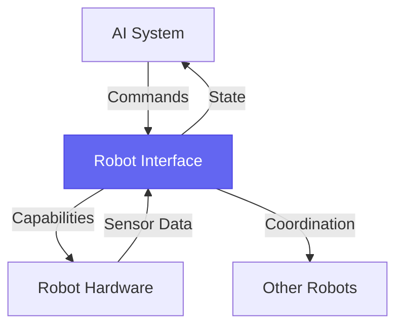

# WIA AI Robot Interface - Phase 1: Data Format Standard

**Version**: 1.0.0
**Status**: Draft
**Date**: 2025-01
**Primary Color**: #6366F1 (Indigo)

---

## Table of Contents

1. [Overview](#overview)
2. [Robot Capability Descriptors](#robot-capability-descriptors)
3. [Command Data Structures](#command-data-structures)
4. [Robot State Representation](#robot-state-representation)
5. [Sensor Abstraction Layer](#sensor-abstraction-layer)
6. [Multi-Robot Coordination Data](#multi-robot-coordination-data)
7. [Hardware Abstraction Layer](#hardware-abstraction-layer)
8. [Validation Rules](#validation-rules)
9. [Schema Registry](#schema-registry)

---

## Overview

### 1.1 Purpose

The WIA AI Robot Interface standard defines a unified data format for communication between AI systems and diverse robot platforms. This enables AI-driven control, perception, and decision-making across heterogeneous robotic systems.

**Core Objectives**:
- Standardize robot capability description
- Define unified command interfaces
- Establish sensor data abstraction
- Enable multi-robot coordination
- Support ROS2 compatibility

### 1.2 Design Principles



### 1.3 Scope

This specification covers:
- Robot capability descriptors and registration
- Command message formats for motion, manipulation, perception
- Robot state representation (kinematic, dynamic, task)
- Sensor data abstraction (vision, LIDAR, tactile, proprioceptive)
- Multi-robot coordination primitives
- Hardware abstraction layer definitions

---

## Robot Capability Descriptors

### 2.1 RobotDescriptor

The fundamental data structure describing a robot's identity and capabilities.

```json
{
  "$schema": "https://wia-standards.org/robot-interface/robot-descriptor.schema.json",
  "robot_id": "mobile-manipulator-001",
  "robot_name": "Fetch Research Robot",
  "robot_type": "mobile_manipulator",
  "manufacturer": "Fetch Robotics",
  "model": "Fetch",
  "firmware_version": "3.2.1",
  "interface_version": "1.0.0",
  "registered_at": "2025-01-15T10:00:00Z",
  "last_heartbeat": "2025-01-15T14:30:00Z",
  "status": "operational",
  "capabilities": {
    "mobility": {
      "type": "differential_drive",
      "max_linear_velocity": 1.0,
      "max_angular_velocity": 2.0,
      "obstacle_avoidance": true,
      "navigation": "slam",
      "workspace": {
        "type": "planar",
        "max_range": 100.0,
        "units": "meters"
      }
    },
    "manipulation": {
      "type": "serial_manipulator",
      "dof": 7,
      "end_effector": "parallel_gripper",
      "payload_kg": 5.0,
      "reach_m": 0.8,
      "workspace": {
        "type": "spherical",
        "radius": 0.8,
        "units": "meters"
      }
    },
    "perception": {
      "cameras": [
        {
          "camera_id": "head_camera",
          "type": "rgb_depth",
          "resolution": [1920, 1080],
          "fov_degrees": 69,
          "frame_rate": 30,
          "position": {"x": 0.3, "y": 0.0, "z": 1.4}
        }
      ],
      "lidars": [
        {
          "lidar_id": "base_scan",
          "type": "2d",
          "range_m": 25.0,
          "fov_degrees": 270,
          "angular_resolution": 0.25
        }
      ],
      "force_torque": true,
      "tactile": false
    },
    "ai_capabilities": {
      "onboard_compute": {
        "gpu": "NVIDIA Jetson AGX",
        "ram_gb": 32,
        "can_run_models": ["detection", "segmentation", "slam"]
      },
      "supported_frameworks": ["ros2", "pytorch", "tensorflow"]
    }
  },
  "safety_features": {
    "emergency_stop": true,
    "collision_detection": true,
    "force_limiting": true,
    "safety_zones": ["collaborative", "industrial"]
  },
  "network": {
    "ip_address": "192.168.1.100",
    "protocols": ["http", "websocket", "mqtt", "ros2_dds"],
    "security": {
      "tls": true,
      "authentication": "jwt"
    }
  }
}
```

### 2.2 Robot Types

| Type | Description | Example Platforms |
|------|-------------|-------------------|
| `mobile_base` | Wheeled/tracked mobile platform | TurtleBot, Clearpath Jackal |
| `mobile_manipulator` | Mobile base + arm | Fetch, PR2, HSR |
| `fixed_manipulator` | Stationary robotic arm | UR5, Franka Emika Panda |
| `humanoid` | Bipedal human-like robot | Atlas, Pepper, Nao |
| `quadruped` | Four-legged robot | Spot, ANYmal |
| `aerial` | Drone/UAV | DJI, Parrot, custom quadcopters |
| `underwater` | ROV/AUV | BlueROV2, REMUS |
| `specialized` | Task-specific robots | Surgical, agricultural, inspection |

### 2.3 Capability Schema

```typescript
interface RobotCapabilities {
  mobility?: MobilityCapability;
  manipulation?: ManipulationCapability;
  perception: PerceptionCapability;
  ai_capabilities: AICapability;
  custom?: Record<string, any>;
}

interface MobilityCapability {
  type: 'differential_drive' | 'omnidirectional' | 'ackermann' |
        'legged' | 'aerial' | 'underwater';
  max_linear_velocity: number;  // m/s
  max_angular_velocity: number; // rad/s
  obstacle_avoidance: boolean;
  navigation: 'slam' | 'gps' | 'visual' | 'hybrid' | 'none';
  workspace: Workspace;
}

interface ManipulationCapability {
  type: 'serial_manipulator' | 'parallel_manipulator' | 'continuum';
  dof: number;
  end_effector: 'parallel_gripper' | 'suction' | 'magnetic' |
                'custom' | 'none';
  payload_kg: number;
  reach_m: number;
  workspace: Workspace;
  joint_limits?: JointLimit[];
}

interface PerceptionCapability {
  cameras: CameraSensor[];
  lidars?: LidarSensor[];
  imus?: IMUSensor[];
  force_torque: boolean;
  tactile: boolean;
  gps?: boolean;
  custom_sensors?: Sensor[];
}
```

---

## Command Data Structures

### 3.1 Unified Command Message

All robot commands follow a standardized envelope format:

```json
{
  "$schema": "https://wia-standards.org/robot-interface/command.schema.json",
  "command_id": "cmd-8f7e6d5c-4b3a-2918-7654-3210fedcba98",
  "robot_id": "mobile-manipulator-001",
  "timestamp": "2025-01-15T14:30:00.123Z",
  "command_type": "navigation",
  "priority": "normal",
  "timeout_ms": 30000,
  "payload": {
    "goal": {
      "position": {"x": 5.0, "y": 3.0, "z": 0.0},
      "orientation": {"w": 1.0, "x": 0.0, "y": 0.0, "z": 0.0}
    },
    "frame_id": "map",
    "tolerance": {
      "position": 0.1,
      "orientation": 0.05
    },
    "max_velocity": 0.5,
    "obstacle_avoidance": true
  },
  "metadata": {
    "task_id": "task-123",
    "user_id": "ai-planner-001",
    "context": "delivery_mission"
  }
}
```

### 3.2 Navigation Commands

```typescript
interface NavigationCommand {
  command_type: 'navigation';
  payload: {
    goal: Pose3D;
    frame_id: string;
    path?: Pose3D[];
    tolerance: {
      position: number;
      orientation: number;
    };
    max_velocity?: number;
    obstacle_avoidance: boolean;
    planner?: 'global' | 'local' | 'hybrid';
  };
}
```

**Example - Go to location**:

```json
{
  "command_type": "navigation",
  "payload": {
    "goal": {
      "position": {"x": 10.0, "y": 5.0, "z": 0.0},
      "orientation": {"w": 0.707, "x": 0.0, "y": 0.0, "z": 0.707}
    },
    "frame_id": "map",
    "tolerance": {"position": 0.2, "orientation": 0.1},
    "max_velocity": 0.8,
    "obstacle_avoidance": true
  }
}
```

### 3.3 Manipulation Commands

```typescript
interface ManipulationCommand {
  command_type: 'manipulation';
  payload: {
    target: Pose3D | JointState;
    frame_id: string;
    motion_type: 'joint' | 'cartesian' | 'trajectory';
    gripper_action?: 'open' | 'close' | 'grasp';
    force_limit?: number;
    velocity_scaling?: number;
    planning_time?: number;
  };
}
```

**Example - Pick object**:

```json
{
  "command_type": "manipulation",
  "payload": {
    "target": {
      "position": {"x": 0.5, "y": 0.2, "z": 0.8},
      "orientation": {"w": 1.0, "x": 0.0, "y": 0.0, "z": 0.0}
    },
    "frame_id": "base_link",
    "motion_type": "cartesian",
    "gripper_action": "grasp",
    "force_limit": 50.0,
    "velocity_scaling": 0.3
  }
}
```

### 3.4 Perception Commands

```json
{
  "command_type": "perception",
  "payload": {
    "task": "object_detection",
    "target_classes": ["bottle", "cup", "box"],
    "confidence_threshold": 0.7,
    "roi": {
      "min": {"x": 0, "y": 0},
      "max": {"x": 1920, "y": 1080}
    },
    "output_format": "bounding_boxes"
  }
}
```

### 3.5 Command Priority Levels

```typescript
enum CommandPriority {
  EMERGENCY = 'emergency',    // E-stop, collision avoidance
  HIGH = 'high',              // Safety-critical operations
  NORMAL = 'normal',          // Standard tasks
  LOW = 'low',                // Background tasks
  BACKGROUND = 'background'   // Non-critical logging
}
```

---

## Robot State Representation

### 4.1 Comprehensive Robot State

```json
{
  "$schema": "https://wia-standards.org/robot-interface/state.schema.json",
  "robot_id": "mobile-manipulator-001",
  "timestamp": "2025-01-15T14:30:00.500Z",
  "state_version": 1523,
  "operational_state": "executing",
  "kinematic_state": {
    "base_pose": {
      "position": {"x": 5.2, "y": 3.1, "z": 0.0},
      "orientation": {"w": 0.998, "x": 0.0, "y": 0.0, "z": 0.062},
      "frame_id": "map",
      "covariance": [0.01, 0, 0, 0, 0, 0,
                     0, 0.01, 0, 0, 0, 0,
                     0, 0, 0.01, 0, 0, 0,
                     0, 0, 0, 0.001, 0, 0,
                     0, 0, 0, 0, 0.001, 0,
                     0, 0, 0, 0, 0, 0.001]
    },
    "base_velocity": {
      "linear": {"x": 0.3, "y": 0.0, "z": 0.0},
      "angular": {"x": 0.0, "y": 0.0, "z": 0.1}
    },
    "joint_state": {
      "names": ["shoulder_pan", "shoulder_lift", "elbow", "wrist_1",
                "wrist_2", "wrist_3", "gripper"],
      "positions": [0.0, -1.57, 1.57, 0.0, 0.0, 0.0, 0.04],
      "velocities": [0.0, 0.1, -0.1, 0.0, 0.0, 0.0, 0.0],
      "efforts": [0.5, 15.2, 8.3, 1.2, 0.8, 0.3, 5.0]
    }
  },
  "dynamic_state": {
    "battery": {
      "percentage": 78.5,
      "voltage": 48.2,
      "current": -2.3,
      "temperature": 35.2,
      "time_remaining_minutes": 142,
      "charging": false
    },
    "cpu_usage": 45.2,
    "memory_usage": 62.1,
    "disk_usage": 38.5,
    "network_usage": {
      "upload_mbps": 1.2,
      "download_mbps": 0.8
    },
    "temperature_sensors": {
      "motors": [32.1, 33.5, 31.8, 29.4, 30.2, 28.9],
      "cpu": 52.3,
      "gpu": 48.7
    }
  },
  "task_state": {
    "current_task_id": "task-123",
    "task_status": "in_progress",
    "progress_percentage": 45.0,
    "current_action": "navigating_to_waypoint",
    "actions_completed": 3,
    "actions_total": 7
  },
  "safety_state": {
    "emergency_stop_active": false,
    "collision_detected": false,
    "safety_zone": "collaborative",
    "obstacle_proximity_m": 1.2,
    "force_readings": [2.1, -1.3, 0.8, 0.2, -0.5, 0.3],
    "warnings": [],
    "errors": []
  }
}
```

### 4.2 Operational States

```typescript
enum OperationalState {
  INITIALIZING = 'initializing',
  IDLE = 'idle',
  EXECUTING = 'executing',
  PAUSED = 'paused',
  ERROR = 'error',
  EMERGENCY_STOP = 'emergency_stop',
  MAINTENANCE = 'maintenance',
  CHARGING = 'charging',
  OFFLINE = 'offline'
}
```

### 4.3 Task Status

```typescript
interface TaskState {
  current_task_id: string | null;
  task_status: 'queued' | 'in_progress' | 'completed' |
               'failed' | 'cancelled';
  progress_percentage: number;
  current_action: string;
  actions_completed: number;
  actions_total: number;
  estimated_completion?: string; // ISO 8601
}
```

---

## Sensor Abstraction Layer

### 5.1 Unified Sensor Data

```json
{
  "$schema": "https://wia-standards.org/robot-interface/sensor-data.schema.json",
  "robot_id": "mobile-manipulator-001",
  "timestamp": "2025-01-15T14:30:00.123Z",
  "sensors": {
    "cameras": [
      {
        "sensor_id": "head_camera",
        "timestamp": "2025-01-15T14:30:00.100Z",
        "frame_id": "head_camera_optical_frame",
        "image": {
          "encoding": "rgb8",
          "width": 1920,
          "height": 1080,
          "data_url": "data:image/jpeg;base64,/9j/4AAQSkZJRg...",
          "compressed": true
        },
        "depth": {
          "encoding": "32FC1",
          "width": 1920,
          "height": 1080,
          "min_range": 0.5,
          "max_range": 10.0,
          "data_url": "s3://robot-data/depth/frame_12345.bin"
        },
        "camera_info": {
          "k": [1000, 0, 960, 0, 1000, 540, 0, 0, 1],
          "d": [0.0, 0.0, 0.0, 0.0, 0.0],
          "r": [1, 0, 0, 0, 1, 0, 0, 0, 1],
          "p": [1000, 0, 960, 0, 0, 1000, 540, 0, 0, 0, 1, 0]
        }
      }
    ],
    "lidars": [
      {
        "sensor_id": "base_scan",
        "timestamp": "2025-01-15T14:30:00.105Z",
        "frame_id": "base_laser_link",
        "angle_min": -2.356,
        "angle_max": 2.356,
        "angle_increment": 0.00436,
        "range_min": 0.1,
        "range_max": 25.0,
        "ranges": [2.3, 2.4, 2.5, 2.6],
        "intensities": [100, 105, 98, 102]
      }
    ],
    "imu": {
      "sensor_id": "base_imu",
      "timestamp": "2025-01-15T14:30:00.120Z",
      "frame_id": "base_imu_link",
      "orientation": {"w": 0.998, "x": 0.01, "y": 0.02, "z": 0.05},
      "angular_velocity": {"x": 0.001, "y": -0.002, "z": 0.1},
      "linear_acceleration": {"x": 0.05, "y": 0.02, "z": 9.81}
    },
    "force_torque": {
      "sensor_id": "wrist_ft",
      "timestamp": "2025-01-15T14:30:00.118Z",
      "frame_id": "wrist_ft_link",
      "force": {"x": 2.1, "y": -1.3, "z": 8.5},
      "torque": {"x": 0.2, "y": -0.5, "z": 0.1}
    }
  }
}
```

### 5.2 Camera Sensor Definition

```typescript
interface CameraSensor {
  sensor_id: string;
  timestamp: string;
  frame_id: string;
  image?: {
    encoding: 'rgb8' | 'bgr8' | 'mono8' | 'mono16';
    width: number;
    height: number;
    data_url: string;
    compressed: boolean;
  };
  depth?: {
    encoding: '32FC1' | '16UC1';
    width: number;
    height: number;
    min_range: number;
    max_range: number;
    data_url: string;
  };
  camera_info: CameraIntrinsics;
}
```

### 5.3 LIDAR Sensor Definition

```typescript
interface LidarSensor {
  sensor_id: string;
  timestamp: string;
  frame_id: string;
  angle_min: number;
  angle_max: number;
  angle_increment: number;
  range_min: number;
  range_max: number;
  ranges: number[];
  intensities?: number[];
}
```

---

## Multi-Robot Coordination Data

### 6.1 Robot Discovery Message

```json
{
  "$schema": "https://wia-standards.org/robot-interface/discovery.schema.json",
  "message_type": "robot_announcement",
  "robot_id": "mobile-manipulator-001",
  "timestamp": "2025-01-15T14:30:00Z",
  "announcement": {
    "robot_descriptor": {
      "robot_id": "mobile-manipulator-001",
      "robot_name": "Fetch Research Robot",
      "robot_type": "mobile_manipulator",
      "capabilities_summary": ["navigation", "manipulation", "perception"]
    },
    "network_info": {
      "endpoints": {
        "http": "http://192.168.1.100:8080",
        "websocket": "ws://192.168.1.100:8081",
        "mqtt": "mqtt://192.168.1.100:1883"
      },
      "discovery_protocol": "mdns",
      "service_name": "_wia-robot._tcp"
    },
    "availability": {
      "status": "available",
      "current_task": null,
      "accepting_tasks": true
    }
  }
}
```

### 6.2 Task Allocation Message

```json
{
  "message_type": "task_allocation",
  "coordinator_id": "ai-fleet-manager-001",
  "timestamp": "2025-01-15T14:31:00Z",
  "allocation": {
    "task_id": "warehouse-task-456",
    "allocated_robots": [
      {
        "robot_id": "mobile-manipulator-001",
        "role": "picker",
        "subtasks": ["navigate_to_shelf", "pick_item", "navigate_to_station"]
      },
      {
        "robot_id": "mobile-base-002",
        "role": "carrier",
        "subtasks": ["wait_at_station", "receive_item", "deliver_to_dock"]
      }
    ],
    "coordination_constraints": {
      "synchronization_points": [
        {
          "point_id": "handoff_station",
          "robots": ["mobile-manipulator-001", "mobile-base-002"],
          "max_time_difference_s": 30
        }
      ],
      "spatial_constraints": {
        "min_distance_m": 0.5,
        "right_of_way": "mobile-manipulator-001"
      }
    }
  }
}
```

### 6.3 Inter-Robot Communication

```typescript
interface CoordinationMessage {
  message_type: 'coordination';
  sender_robot_id: string;
  recipient_robot_ids: string[];
  timestamp: string;
  payload: {
    intent: 'request_path_clearance' | 'claim_resource' |
            'sync_arrival' | 'handoff_ready';
    data: Record<string, any>;
    priority: CommandPriority;
  };
}
```

---

## Hardware Abstraction Layer

### 7.1 Actuator Abstraction

```json
{
  "actuator_id": "shoulder_pan_motor",
  "actuator_type": "rotary_joint",
  "control_mode": "position",
  "hardware_interface": {
    "type": "ethercat",
    "slave_id": 1,
    "vendor_id": "0x00000539",
    "product_code": "0x02200301"
  },
  "physical_properties": {
    "gear_ratio": 100.0,
    "encoder_resolution": 131072,
    "torque_constant": 0.052,
    "max_torque_nm": 50.0,
    "max_velocity_rad_s": 3.14
  },
  "limits": {
    "position_min": -3.14,
    "position_max": 3.14,
    "velocity_max": 2.0,
    "acceleration_max": 5.0,
    "torque_max": 40.0
  }
}
```

### 7.2 Sensor Hardware Abstraction

```typescript
interface SensorHardware {
  sensor_id: string;
  sensor_type: 'camera' | 'lidar' | 'imu' | 'force_torque' |
               'tactile' | 'gps' | 'custom';
  hardware_interface: {
    type: 'usb' | 'ethernet' | 'can' | 'spi' | 'i2c';
    address: string;
    protocol?: string;
  };
  driver: {
    name: string;
    version: string;
    parameters?: Record<string, any>;
  };
  transform: {
    parent_frame: string;
    translation: Vector3D;
    rotation: Quaternion;
  };
}
```

---

## Validation Rules

### 8.1 Message Validation

All messages MUST:
1. Include valid `robot_id` (UUID v4 format)
2. Include `timestamp` in ISO 8601 format with millisecond precision
3. Conform to JSON Schema for the message type
4. Use SI units unless otherwise specified
5. Include `$schema` reference for validation

### 8.2 Coordinate Frames

1. **Position**: meters (m)
2. **Orientation**: quaternion (w, x, y, z) - unit quaternion
3. **Velocity**: m/s (linear), rad/s (angular)
4. **Force**: Newtons (N)
5. **Torque**: Newton-meters (Nm)
6. **Angles**: radians (rad) for computation, degrees (°) for display

### 8.3 Timestamp Requirements

```typescript
// Valid timestamp formats
const validFormats = [
  "2025-01-15T14:30:00.123Z",           // UTC with milliseconds
  "2025-01-15T14:30:00.123456Z",        // UTC with microseconds
  "2025-01-15T14:30:00+09:00"           // With timezone
];

// Unix timestamp (milliseconds since epoch) also accepted
const unixTimestamp = 1736951400123;
```

---

## Schema Registry

### 9.1 Available Schemas

| Schema | URI | Version |
|--------|-----|---------|
| Robot Descriptor | `https://wia-standards.org/robot-interface/robot-descriptor.schema.json` | 1.0.0 |
| Command | `https://wia-standards.org/robot-interface/command.schema.json` | 1.0.0 |
| State | `https://wia-standards.org/robot-interface/state.schema.json` | 1.0.0 |
| Sensor Data | `https://wia-standards.org/robot-interface/sensor-data.schema.json` | 1.0.0 |
| Discovery | `https://wia-standards.org/robot-interface/discovery.schema.json` | 1.0.0 |
| Coordination | `https://wia-standards.org/robot-interface/coordination.schema.json` | 1.0.0 |

### 9.2 Schema Versioning

Schemas follow semantic versioning:
- **Major**: Breaking changes
- **Minor**: Backward-compatible additions
- **Patch**: Bug fixes, clarifications

### 9.3 Example Schema Validation (Python)

```python
import jsonschema
import requests

# Load schema
schema_url = "https://wia-standards.org/robot-interface/command.schema.json"
schema = requests.get(schema_url).json()

# Validate message
message = {
    "command_id": "cmd-123",
    "robot_id": "mobile-manipulator-001",
    # ... rest of command
}

jsonschema.validate(instance=message, schema=schema)
```

---

## References

1. [ROS 2 Design](https://design.ros2.org/) - Robot Operating System 2
2. [IEEE 1872.2-2021](https://standards.ieee.org/ieee/1872.2/10354/) - Autonomous Robotics Ontology
3. [ISO 8373:2021](https://www.iso.org/standard/75539.html) - Robots and robotic devices — Vocabulary
4. [JSON Schema Specification](https://json-schema.org/specification.html)
5. [OpenAPI 3.1](https://spec.openapis.org/oas/v3.1.0) - API Specification

---

**Document Version**: 1.0.0
**Last Updated**: 2025-01
**Status**: Draft

---

<div align="center" style="color: #6366F1;">

**WIA AI Robot Interface - Phase 1: Data Format Standard**

Universal Robot Communication for AI Systems

弘益人間 - Benefit All Humanity

</div>
