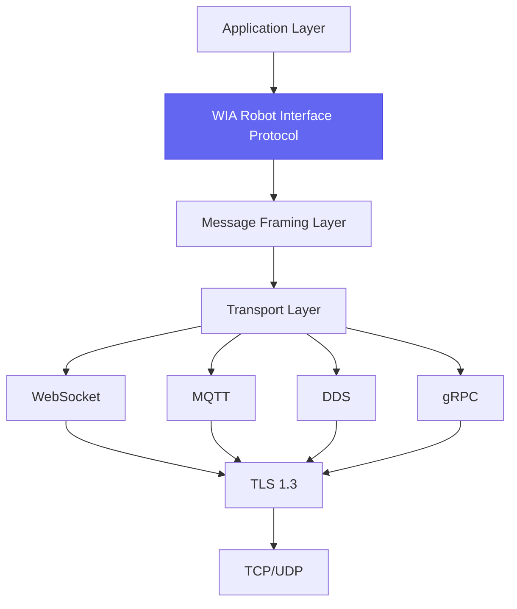
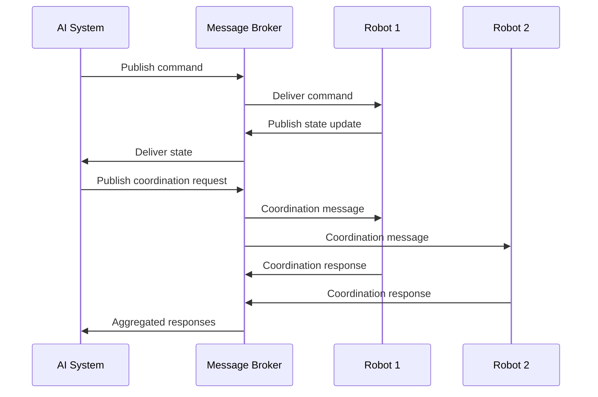
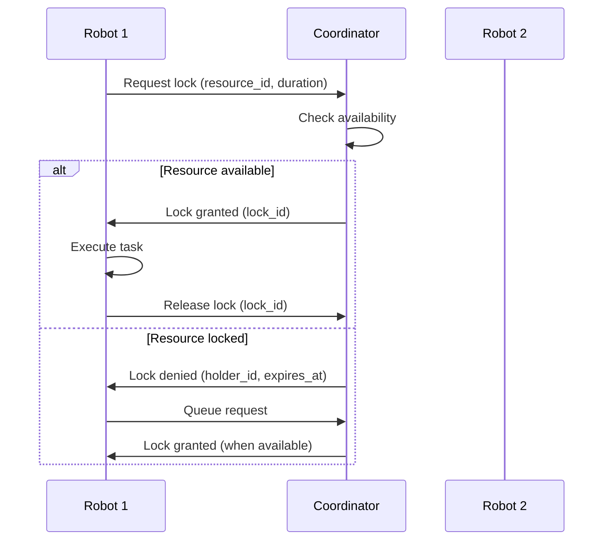
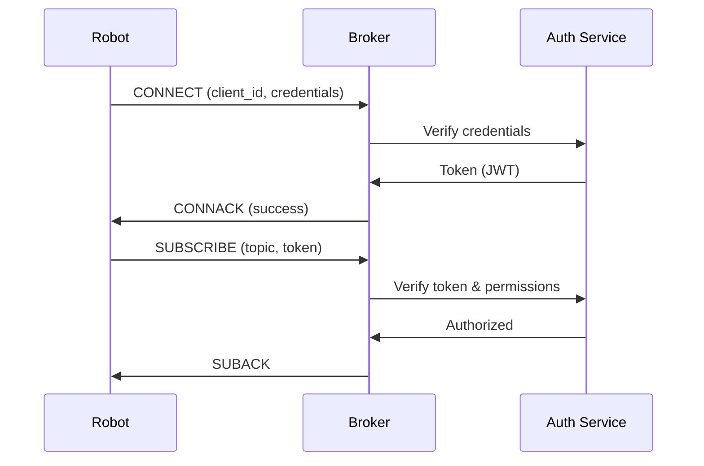
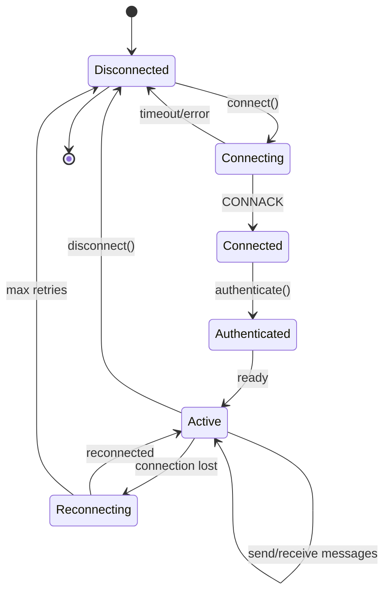
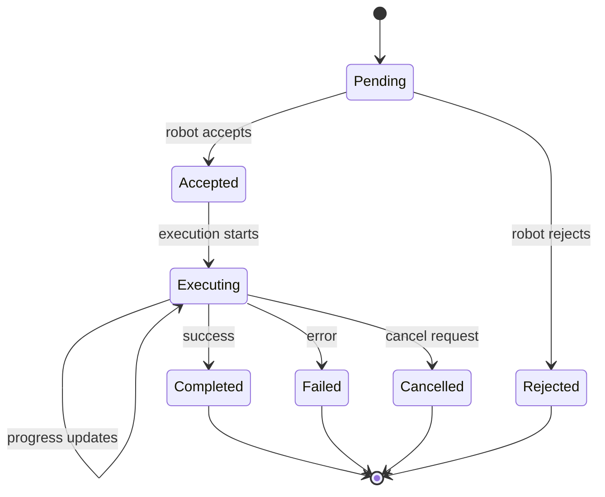
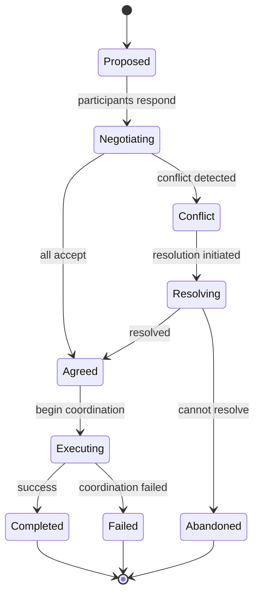

# WIA AI Robot Interface - Phase 3: Communication Protocol Standard

**Version**: 1.0.0
**Status**: Draft
**Date**: 2025-01
**Primary Color**: #6366F1 (Indigo)

---

## Table of Contents

1. [Overview](#overview)
2. [Message Protocol Specification](#message-protocol-specification)
3. [Robot-AI Messaging Patterns](#robot-ai-messaging-patterns)
4. [Multi-Robot Coordination Protocol](#multi-robot-coordination-protocol)
5. [State Synchronization](#state-synchronization)
6. [Quality of Service (QoS)](#quality-of-service-qos)
7. [Network Topology](#network-topology)
8. [Security & Encryption](#security--encryption)
9. [Protocol State Machines](#protocol-state-machines)

---

## Overview

### 1.1 Purpose

Phase 3 defines the communication protocols for reliable, real-time messaging between AI systems and robots. This includes point-to-point communication, multi-robot coordination, and state synchronization mechanisms.

**Protocol Objectives**:
- Low-latency command delivery (< 10ms)
- Reliable state synchronization
- Multi-robot coordination primitives
- Scalable pub/sub architecture
- Fault tolerance and recovery
- Security and authentication

### 1.2 Protocol Stack



### 1.3 Transport Options

| Transport | Use Case | Latency | Reliability | Scalability |
|-----------|----------|---------|-------------|-------------|
| **WebSocket** | 1:1 AI-Robot | < 5ms | High | Medium |
| **MQTT** | Pub/Sub coordination | < 10ms | Medium-High | High |
| **DDS** | Real-time robot swarms | < 1ms | Very High | Very High |
| **gRPC** | Streaming sensor data | < 5ms | High | High |

### 1.4 Message Flow Architecture



---

## Message Protocol Specification

### 2.1 Protocol Message Envelope

All protocol messages use this wrapper:

```json
{
  "protocol_version": "1.0.0",
  "message_id": "msg-8f7e6d5c-4b3a-2918-7654-3210fedcba98",
  "timestamp": "2025-01-15T14:30:00.123456Z",
  "sender": {
    "id": "ai-system-001",
    "type": "ai_controller"
  },
  "recipient": {
    "id": "mobile-manipulator-001",
    "type": "robot"
  },
  "message_type": "command_request",
  "priority": "normal",
  "qos": {
    "reliability": "reliable",
    "delivery_mode": "at_least_once"
  },
  "payload": {
    /* Message-specific payload */
  },
  "metadata": {
    "correlation_id": "task-123",
    "ttl_ms": 5000,
    "reply_to": "ai-system-001/responses"
  }
}
```

### 2.2 Message Types

```typescript
enum MessageType {
  // Command messages
  COMMAND_REQUEST = 'command_request',
  COMMAND_RESPONSE = 'command_response',
  COMMAND_STATUS = 'command_status',
  COMMAND_CANCEL = 'command_cancel',

  // State messages
  STATE_UPDATE = 'state_update',
  STATE_REQUEST = 'state_request',
  STATE_SNAPSHOT = 'state_snapshot',

  // Coordination messages
  COORDINATION_REQUEST = 'coordination_request',
  COORDINATION_RESPONSE = 'coordination_response',
  COORDINATION_SYNC = 'coordination_sync',
  COORDINATION_CONFLICT = 'coordination_conflict',

  // Discovery messages
  ROBOT_ANNOUNCE = 'robot_announce',
  ROBOT_QUERY = 'robot_query',
  ROBOT_HEARTBEAT = 'robot_heartbeat',

  // Event messages
  EVENT_NOTIFICATION = 'event_notification',
  ALERT = 'alert',
  ERROR = 'error'
}
```

### 2.3 Message Framing

**Binary Frame Format**:

```
┌─────────────────────────────────────────────────────────────┐
│ Version (1 byte) │ Flags (1 byte) │ Length (4 bytes)        │
├─────────────────────────────────────────────────────────────┤
│ Message ID (16 bytes UUID)                                  │
├─────────────────────────────────────────────────────────────┤
│ Timestamp (8 bytes Unix microseconds)                       │
├─────────────────────────────────────────────────────────────┤
│ Message Type (2 bytes)                                      │
├─────────────────────────────────────────────────────────────┤
│ Priority (1 byte) │ QoS (1 byte)  │ Reserved (2 bytes)     │
├─────────────────────────────────────────────────────────────┤
│ Payload (variable length, JSON or Protocol Buffers)         │
└─────────────────────────────────────────────────────────────┘
```

**Flags**:
- Bit 0: Compressed (gzip)
- Bit 1: Encrypted (AES-256)
- Bit 2: Signed (HMAC-SHA256)
- Bit 3: Fragmented
- Bits 4-7: Reserved

### 2.4 Compression & Serialization

```typescript
interface MessageOptions {
  serialization: 'json' | 'protobuf' | 'msgpack';
  compression: 'none' | 'gzip' | 'lz4' | 'zstd';
  encryption: boolean;
  signature: boolean;
}

// Example configuration
const options: MessageOptions = {
  serialization: 'protobuf',  // For high-frequency messages
  compression: 'lz4',         // Fast compression
  encryption: true,           // Always encrypt
  signature: true             // Sign critical commands
};
```

---

## Robot-AI Messaging Patterns

### 3.1 Request-Response Pattern

**Command Execution**:

```typescript
// AI sends command
const commandRequest = {
  message_type: 'command_request',
  payload: {
    command_id: 'cmd-12345',
    command_type: 'navigation',
    payload: { /* navigation params */ }
  },
  metadata: {
    reply_to: 'ai-system-001/cmd-responses',
    correlation_id: 'cmd-12345'
  }
};

// Robot responds with acknowledgment
const commandResponse = {
  message_type: 'command_response',
  payload: {
    command_id: 'cmd-12345',
    status: 'accepted',
    estimated_duration_ms: 15000
  },
  metadata: {
    correlation_id: 'cmd-12345'
  }
};

// Robot sends status updates
const commandStatus = {
  message_type: 'command_status',
  payload: {
    command_id: 'cmd-12345',
    status: 'executing',
    progress: 0.45
  }
};

// Final completion
const commandComplete = {
  message_type: 'command_status',
  payload: {
    command_id: 'cmd-12345',
    status: 'completed',
    result: { /* execution result */ }
  }
};
```

### 3.2 Publish-Subscribe Pattern

**State Updates**:

```typescript
// Robot publishes state on topic
const topic = 'robots/mobile-manipulator-001/state';
const stateUpdate = {
  message_type: 'state_update',
  payload: {
    robot_id: 'mobile-manipulator-001',
    kinematic_state: { /* ... */ },
    battery: { /* ... */ }
  }
};

// Multiple AI systems can subscribe
await mqttClient.subscribe('robots/+/state');
```

**Topic Hierarchy**:

```
robots/
├── {robot_id}/
│   ├── state
│   ├── sensors/
│   │   ├── cameras/{camera_id}
│   │   ├── lidars/{lidar_id}
│   │   └── imu
│   ├── commands
│   ├── events
│   └── heartbeat
│
fleets/
├── {fleet_id}/
│   ├── coordination
│   ├── status
│   └── tasks
│
system/
├── discovery
├── announcements
└── alerts
```

### 3.3 Streaming Pattern

**Sensor Data Streaming**:

```typescript
// gRPC streaming
service RobotSensorStream {
  rpc StreamCamera (CameraRequest) returns (stream CameraFrame);
  rpc StreamLidar (LidarRequest) returns (stream LidarScan);
  rpc StreamState (StateRequest) returns (stream RobotState);
}

// Client usage
const stream = client.streamCamera({
  robot_id: 'mobile-manipulator-001',
  camera_id: 'head_camera',
  rate_hz: 30
});

for await (const frame of stream) {
  processFrame(frame);
}
```

### 3.4 Event-Driven Pattern

```typescript
// Robot publishes events
const event = {
  message_type: 'event_notification',
  payload: {
    event_type: 'task_completed',
    task_id: 'task-123',
    result: 'success',
    details: { /* ... */ }
  }
};

// AI system subscribes to events
await mqttClient.subscribe('robots/mobile-manipulator-001/events');
```

---

## Multi-Robot Coordination Protocol

### 4.1 Coordination Message Format

```json
{
  "message_type": "coordination_request",
  "payload": {
    "coordination_id": "coord-abc123",
    "coordination_type": "resource_allocation",
    "initiator_robot_id": "mobile-manipulator-001",
    "participant_robot_ids": [
      "mobile-base-002",
      "mobile-base-003"
    ],
    "resource": {
      "type": "spatial",
      "location": {"x": 5.0, "y": 3.0, "z": 0.0},
      "radius_m": 1.5,
      "duration_s": 30
    },
    "priority": "normal",
    "timeout_ms": 5000
  }
}
```

### 4.2 Resource Locking Protocol

**Distributed Lock Acquisition**:



**Lock Message Format**:

```typescript
interface ResourceLockRequest {
  message_type: 'coordination_request';
  payload: {
    coordination_type: 'resource_lock';
    resource_id: string;
    requester_id: string;
    duration_ms: number;
    priority: number;
  };
}

interface ResourceLockResponse {
  message_type: 'coordination_response';
  payload: {
    lock_granted: boolean;
    lock_id?: string;
    expires_at?: string;
    holder_id?: string;
  };
}
```

### 4.3 Synchronization Primitives

**Barrier Synchronization**:

```json
{
  "coordination_type": "barrier_sync",
  "barrier_id": "handoff-barrier-001",
  "participant_robot_ids": [
    "mobile-manipulator-001",
    "mobile-base-002"
  ],
  "sync_location": {
    "position": {"x": 5.0, "y": 3.0, "z": 0.0},
    "tolerance_m": 0.2
  },
  "max_wait_time_s": 60,
  "action_on_sync": "begin_handoff"
}
```

**Arrival Notification**:

```json
{
  "message_type": "coordination_sync",
  "payload": {
    "barrier_id": "handoff-barrier-001",
    "robot_id": "mobile-manipulator-001",
    "status": "arrived",
    "timestamp": "2025-01-15T14:30:00Z"
  }
}
```

### 4.4 Conflict Resolution

**Conflict Detection**:

```json
{
  "message_type": "coordination_conflict",
  "payload": {
    "conflict_id": "conflict-xyz789",
    "conflict_type": "path_intersection",
    "involved_robots": [
      "mobile-base-002",
      "mobile-base-003"
    ],
    "conflict_location": {"x": 10.0, "y": 5.0, "z": 0.0},
    "estimated_collision_time": "2025-01-15T14:30:05Z",
    "resolution_strategy": "priority_based"
  }
}
```

**Resolution Strategies**:

| Strategy | Description | Use Case |
|----------|-------------|----------|
| `priority_based` | Higher priority robot proceeds | Emergency tasks |
| `first_come_first_served` | First to request proceeds | Fair allocation |
| `negotiate` | Robots negotiate alternative paths | Complex scenarios |
| `centralized` | Central planner resolves | Fleet coordination |

### 4.5 Task Handoff Protocol

```typescript
interface TaskHandoff {
  handoff_id: string;
  from_robot_id: string;
  to_robot_id: string;
  task_id: string;
  handoff_data: {
    object_description?: string;
    location: Pose3D;
    expected_weight_kg?: number;
    verification_method: 'force_torque' | 'vision' | 'tactile';
  };
  stages: [
    {
      stage: 'approach',
      status: 'completed',
      timestamp: '2025-01-15T14:30:00Z'
    },
    {
      stage: 'align',
      status: 'in_progress',
      timestamp: '2025-01-15T14:30:05Z'
    },
    {
      stage: 'transfer',
      status: 'pending'
    },
    {
      stage: 'verify',
      status: 'pending'
    }
  ];
}
```

---

## State Synchronization

### 5.1 State Update Frequency

| State Component | Update Rate | Transport | QoS |
|----------------|-------------|-----------|-----|
| Kinematic State | 10-100 Hz | WebSocket/DDS | Best effort |
| Task State | 1-10 Hz | MQTT | At least once |
| Battery State | 0.1 Hz | MQTT | At least once |
| Sensor Data | Varies | gRPC stream | Best effort |
| Safety State | 100 Hz | DDS | Reliable |

### 5.2 Delta Encoding

For high-frequency updates, use delta encoding:

```json
{
  "message_type": "state_update",
  "encoding": "delta",
  "base_version": 1000,
  "delta_version": 1001,
  "changes": {
    "kinematic_state.base_pose.position.x": 5.21,
    "kinematic_state.base_velocity.linear.x": 0.31,
    "battery.percentage": 78.4
  }
}
```

### 5.3 State Snapshot Request

```json
{
  "message_type": "state_request",
  "payload": {
    "robot_id": "mobile-manipulator-001",
    "request_full_snapshot": true,
    "components": ["kinematic", "battery", "task"]
  }
}
```

### 5.4 State Versioning

```typescript
interface VersionedState {
  robot_id: string;
  state_version: number;  // Monotonically increasing
  vector_clock?: {        // For distributed systems
    [robot_id: string]: number;
  };
  timestamp: string;
  state: RobotState;
  checksum: string;       // For integrity verification
}
```

### 5.5 Conflict-Free Replicated Data Types (CRDTs)

For multi-writer scenarios:

```typescript
interface CRDTState {
  state_type: 'lww_register' | 'g_counter' | 'pn_counter';
  value: any;
  metadata: {
    timestamp: string;
    writer_id: string;
    causal_context?: Record<string, number>;
  };
}
```

---

## Quality of Service (QoS)

### 6.1 QoS Levels

```typescript
enum QoSReliability {
  BEST_EFFORT = 0,      // Fire and forget
  AT_MOST_ONCE = 1,     // No acknowledgment
  AT_LEAST_ONCE = 2,    // Acknowledged delivery
  EXACTLY_ONCE = 3      // Guaranteed single delivery
}

enum QoSDurability {
  VOLATILE = 0,         // Memory only
  TRANSIENT_LOCAL = 1,  // Process restart
  TRANSIENT = 2,        // System restart
  PERSISTENT = 3        // Disk storage
}

interface QoSPolicy {
  reliability: QoSReliability;
  durability: QoSDurability;
  history_depth: number;
  deadline_ms?: number;
  lifespan_ms?: number;
}
```

### 6.2 Message Priorities

```typescript
enum MessagePriority {
  EMERGENCY = 0,     // E-stop, safety critical
  HIGH = 1,          // Important commands
  NORMAL = 2,        // Standard operations
  LOW = 3,           // Monitoring, logging
  BACKGROUND = 4     // Analytics, diagnostics
}
```

### 6.3 Priority-Based Routing

```typescript
// Messages with higher priority bypass queues
interface PriorityQueue {
  emergency: Message[];    // Process immediately
  high: Message[];         // Max latency 10ms
  normal: Message[];       // Max latency 100ms
  low: Message[];          // Max latency 1s
  background: Message[];   // Best effort
}
```

### 6.4 Bandwidth Management

```typescript
interface BandwidthAllocation {
  total_bandwidth_mbps: number;
  allocations: {
    commands: { percent: 10, max_mbps: 1 },
    state_updates: { percent: 20, max_mbps: 2 },
    sensor_data: { percent: 60, max_mbps: 6 },
    coordination: { percent: 5, max_mbps: 0.5 },
    overhead: { percent: 5, max_mbps: 0.5 }
  };
}
```

---

## Network Topology

### 6.1 Star Topology (Single AI Controller)

```
        ┌──────────────┐
        │ AI System    │
        └──────┬───────┘
               │
        ┌──────┴───────┐
        │ Message      │
        │ Broker       │
        └──────┬───────┘
               │
    ┌──────────┼──────────┐
    │          │          │
┌───▼───┐  ┌──▼────┐  ┌──▼────┐
│Robot 1│  │Robot 2│  │Robot 3│
└───────┘  └───────┘  └───────┘
```

### 6.2 Mesh Topology (Distributed)

```
┌─────────┐     ┌─────────┐
│ Robot 1 │◄───►│ Robot 2 │
└────┬────┘     └────┬────┘
     │               │
     │    ┌─────────┐│
     └───►│ Robot 3 │◄┘
          └────┬────┘
               │
          ┌────▼────┐
          │AI System│
          └─────────┘
```

### 6.3 Hierarchical Topology (Fleet Management)

```
         ┌──────────────┐
         │ Fleet Manager│
         └──────┬───────┘
                │
    ┌───────────┼───────────┐
    │           │           │
┌───▼──────┐ ┌─▼────────┐ ┌▼─────────┐
│ Area A   │ │ Area B   │ │ Area C   │
│Controller│ │Controller│ │Controller│
└───┬──────┘ └─┬────────┘ └┬─────────┘
    │          │            │
  ┌─┴─┐      ┌─┴─┐        ┌─┴─┐
  │R1 │      │R3 │        │R5 │
  └───┘      └───┘        └───┘
  ┌───┐      ┌───┐        ┌───┐
  │R2 │      │R4 │        │R6 │
  └───┘      └───┘        └───┘
```

---

## Security & Encryption

### 7.1 Transport Layer Security

```typescript
interface TLSConfiguration {
  tls_version: '1.3';
  cipher_suites: [
    'TLS_AES_256_GCM_SHA384',
    'TLS_CHACHA20_POLY1305_SHA256'
  ];
  certificate_verification: 'required';
  client_certificates: 'mutual_tls';
}
```

### 7.2 Message-Level Encryption

```typescript
interface EncryptedMessage {
  encrypted: true;
  algorithm: 'AES-256-GCM';
  key_id: 'key-abc123';
  iv: 'base64-encoded-iv';
  ciphertext: 'base64-encoded-data';
  auth_tag: 'base64-encoded-tag';
}
```

### 7.3 Message Signing

```typescript
interface SignedMessage {
  signed: true;
  signature_algorithm: 'HMAC-SHA256' | 'Ed25519';
  signature: 'base64-encoded-signature';
  signer_id: 'ai-system-001';
  timestamp: '2025-01-15T14:30:00Z';
}
```

### 7.4 Authentication Flow



---

## Protocol State Machines

### 8.1 Connection State Machine



### 8.2 Command Execution State Machine



### 8.3 Coordination State Machine



---

## Performance Requirements

### 9.1 Latency Targets

| Message Type | Target Latency | Max Latency |
|--------------|---------------|-------------|
| Emergency Stop | < 1ms | 5ms |
| Safety Commands | < 5ms | 10ms |
| Motion Commands | < 10ms | 50ms |
| State Updates | < 10ms | 100ms |
| Sensor Data | < 20ms | 200ms |
| Coordination | < 50ms | 500ms |
| Discovery | < 100ms | 1000ms |

### 9.2 Throughput Targets

| Data Stream | Messages/sec | Bandwidth |
|-------------|--------------|-----------|
| Joint States | 100-1000 | 10-100 KB/s |
| Camera Images | 30 | 5-50 MB/s |
| LIDAR Scans | 10-40 | 100 KB - 1 MB/s |
| IMU Data | 100-1000 | 10-100 KB/s |
| Commands | 1-100 | < 10 KB/s |

### 9.3 Reliability Targets

- **Message Delivery**: 99.99% for critical commands
- **Connection Uptime**: 99.9% availability
- **Reconnection Time**: < 1 second
- **Message Ordering**: Guaranteed for same sender
- **Duplicate Detection**: 100% for exactly-once QoS

---

## References

1. [MQTT Version 5.0](https://docs.oasis-open.org/mqtt/mqtt/v5.0/mqtt-v5.0.html)
2. [DDS Specification](https://www.omg.org/spec/DDS/)
3. [gRPC Protocol](https://grpc.io/docs/what-is-grpc/core-concepts/)
4. [WebSocket RFC 6455](https://tools.ietf.org/html/rfc6455)
5. [AMQP 1.0](https://www.amqp.org/resources/specifications)

---

**Document Version**: 1.0.0
**Last Updated**: 2025-01
**Status**: Draft

---

<div align="center" style="color: #6366F1;">

**WIA AI Robot Interface - Phase 3: Communication Protocol Standard**

Real-Time, Reliable Robot Coordination

弘益人間 - Benefit All Humanity

</div>
