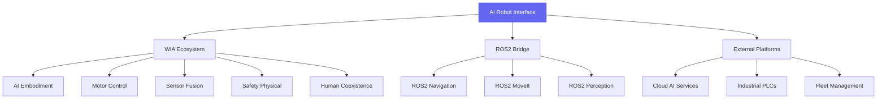
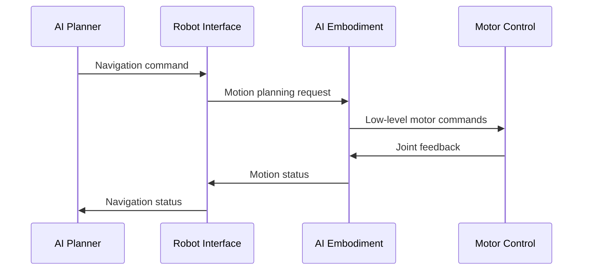
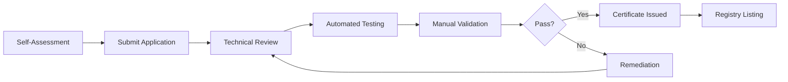

# WIA AI Robot Interface - Phase 4: Integration & Certification

**Version**: 1.0.0
**Status**: Draft
**Date**: 2025-01
**Primary Color**: #6366F1 (Indigo)

---

## Table of Contents

1. [Overview](#overview)
2. [WIA Standard Integrations](#wia-standard-integrations)
3. [ROS2 Bridge Integration](#ros2-bridge-integration)
4. [External Platform Integration](#external-platform-integration)
5. [Migration Strategies](#migration-strategies)
6. [Certification Levels](#certification-levels)
7. [Compliance Checklist](#compliance-checklist)
8. [Reference Implementations](#reference-implementations)
9. [Testing & Validation](#testing--validation)
10. [Best Practices](#best-practices)

---

## Overview

### 1.1 Purpose

Phase 4 defines integration patterns for connecting AI Robot Interface implementations with the broader WIA ecosystem, ROS2, and external platforms. It establishes certification requirements and provides migration paths from existing robot systems.

**Integration Objectives**:
- Seamless WIA ecosystem integration
- ROS2 bidirectional compatibility
- Industrial protocol support
- Cloud platform connectivity
- Legacy system migration
- Certification and compliance

### 1.2 Integration Architecture



### 1.3 Ecosystem Position

```
┌─────────────────────────────────────────────────────────────┐
│                    AI Application Layer                      │
│        (Task Planning, Decision Making, Learning)           │
├─────────────────────────────────────────────────────────────┤
│              WIA AI Robot Interface (Phase 4)                │
├──────────────┬──────────────┬──────────────┬────────────────┤
│ WIA          │ ROS2         │ Industrial   │ Cloud          │
│ Embodiment   │ Navigation   │ Protocols    │ Services       │
│ Motor Ctrl   │ MoveIt       │ OPC-UA       │ AWS RoboMaker  │
│ Sensor Fusion│ Perception   │ EtherCAT     │ Azure IoT      │
│ Safety       │ Control      │ Modbus       │ Google Cloud   │
└──────────────┴──────────────┴──────────────┴────────────────┘
```

---

## WIA Standard Integrations

### 2.1 AI Embodiment Integration

The Robot Interface acts as the high-level control layer for AI Embodiment systems.

**Integration Flow**:



**Data Mapping**:

```typescript
// Robot Interface to Embodiment
interface RobotToEmbodimentMapping {
  // Navigation command → Motion plan
  navigationCommand: NavigationCommand;

  toEmbodimentMotion(): EmbodimentMotionPlan {
    return {
      embodiment_id: this.robot_id,
      motion_type: 'base_navigation',
      target_pose: this.navigationCommand.goal,
      constraints: {
        max_velocity: this.navigationCommand.max_velocity || 1.0,
        max_acceleration: 2.0,
        obstacle_avoidance: this.navigationCommand.obstacle_avoidance
      }
    };
  }
}
```

**TypeScript Integration**:

```typescript
import { WiaRobotInterface } from '@wia/robot-interface';
import { WiaEmbodiment } from '@wia/embodiment';

const robotInterface = new WiaRobotInterface({
  robot_id: 'mobile-manipulator-001'
});

const embodiment = new WiaEmbodiment({
  embodiment_id: 'mobile-manipulator-001'
});

// Connect embodiment as execution backend
robotInterface.useEmbodimentController(embodiment);

// Commands automatically route through embodiment
await robotInterface.sendCommand({
  command_type: 'navigation',
  payload: { goal: { position: { x: 5, y: 3, z: 0 } } }
});
```

### 2.2 Motor Control Integration

Direct integration with WIA Motor Control for actuator-level commands.

**Motor Mapping**:

```json
{
  "robot_id": "mobile-manipulator-001",
  "motor_mappings": [
    {
      "joint_name": "shoulder_pan",
      "motor_id": "motor_001",
      "motor_controller": "wia-motor-control",
      "control_mode": "position",
      "gear_ratio": 100.0
    },
    {
      "joint_name": "shoulder_lift",
      "motor_id": "motor_002",
      "motor_controller": "wia-motor-control",
      "control_mode": "torque",
      "gear_ratio": 120.0
    }
  ]
}
```

**Python Integration**:

```python
from wia_robot_interface import WiaRobotInterface
from wia_motor_control import WiaMotorControl

robot = WiaRobotInterface(robot_id='mobile-manipulator-001')
motor_control = WiaMotorControl(bus_type='ethercat')

# Link motor control
robot.use_motor_controller(motor_control)

# Joint commands automatically mapped to motors
await robot.send_manipulation_command({
    'target': {'joint_positions': [0.0, -1.57, 1.57, 0.0, 0.0, 0.0]},
    'motion_type': 'joint'
})
```

### 2.3 Sensor Fusion Integration

Integrate multi-modal sensor data through WIA Sensor Fusion.

**Sensor Data Flow**:

```
┌──────────────┐
│ Raw Sensors  │
│ - Camera     │
│ - LIDAR      │
│ - IMU        │
└──────┬───────┘
       │
       ▼
┌──────────────┐
│ WIA Sensor   │
│ Fusion       │
└──────┬───────┘
       │ Fused Data
       ▼
┌──────────────┐
│ Robot        │
│ Interface    │
└──────────────┘
```

**Configuration**:

```json
{
  "sensor_fusion": {
    "provider": "wia-sensor-fusion",
    "fusion_algorithms": {
      "localization": {
        "sensors": ["imu", "lidar", "visual_odometry"],
        "algorithm": "extended_kalman_filter",
        "update_rate_hz": 100
      },
      "object_detection": {
        "sensors": ["camera", "lidar"],
        "algorithm": "early_fusion",
        "update_rate_hz": 10
      }
    }
  }
}
```

### 2.4 Safety Physical Integration

Critical integration for robot safety enforcement.

**Safety Architecture**:

```
┌─────────────────────────────────────────┐
│ Level 0: Hardware E-Stop                 │ ← Emergency override
├─────────────────────────────────────────┤
│ Level 1: WIA Safety Physical             │ ← Safety controller
├─────────────────────────────────────────┤
│ Level 2: Robot Interface Safety Layer    │ ← Command validation
├─────────────────────────────────────────┤
│ Level 3: AI Planner Safety Constraints   │ ← Planning bounds
└─────────────────────────────────────────┘
```

**Safety Event Handling**:

```typescript
import { WiaSafetyPhysical } from '@wia/safety-physical';

const robotInterface = new WiaRobotInterface({ robot_id: 'robot-001' });
const safetyController = new WiaSafetyPhysical();

// Link safety controller
robotInterface.useSafetyController(safetyController);

// Safety events automatically handled
robotInterface.on('safety_violation', async (event) => {
  // Escalate to safety controller
  await safetyController.handleViolation(event);

  // Emergency stop if critical
  if (event.severity === 'critical') {
    await robotInterface.emergencyStop();
  }
});

// Safety constraints enforced automatically
await robotInterface.sendCommand({
  command_type: 'navigation',
  payload: { /* ... */ }
  // Automatically checked against safety zones, velocity limits, etc.
});
```

### 2.5 Human Coexistence Integration

Enable safe human-robot collaboration.

**Proximity-Based Speed Adjustment**:

```typescript
import { WiaHumanCoexistence } from '@wia/human-coexistence';

const robotInterface = new WiaRobotInterface({ robot_id: 'robot-001' });
const coexistence = new WiaHumanCoexistence();

robotInterface.useHumanCoexistence(coexistence);

// Automatic speed adjustment based on human proximity
coexistence.on('human_detected', (detection) => {
  const safetyZone = calculateSafetyZone(detection.distance);

  robotInterface.setSafetyConstraints({
    max_velocity: safetyZone.max_velocity,
    max_acceleration: safetyZone.max_acceleration,
    safety_zone: safetyZone.type
  });
});

// Zones: danger (< 0.5m), warning (0.5-1.5m), collaborative (1.5-3m), safe (> 3m)
```

---

## ROS2 Bridge Integration

### 3.1 ROS2 Bridge Architecture

```
┌─────────────────────────────────────────────────────────┐
│                  WIA Robot Interface                     │
└───────────────────────┬─────────────────────────────────┘
                        │
            ┌───────────┴───────────┐
            │   WIA-ROS2 Bridge     │
            └───────────┬───────────┘
                        │
┌───────────────────────┴─────────────────────────────────┐
│                      ROS2 Ecosystem                      │
├──────────────┬──────────────┬───────────────────────────┤
│ nav2         │ moveit2      │ perception                │
│ (Navigation) │ (Manipulation)│ (Vision, LIDAR)          │
└──────────────┴──────────────┴───────────────────────────┘
```

### 3.2 Topic Mappings

**WIA → ROS2**:

| WIA Topic | ROS2 Topic | Message Type |
|-----------|------------|--------------|
| `robots/{id}/state` | `/robot_state` | `sensor_msgs/JointState` |
| `robots/{id}/sensors/camera` | `/camera/image_raw` | `sensor_msgs/Image` |
| `robots/{id}/sensors/scan` | `/scan` | `sensor_msgs/LaserScan` |
| `robots/{id}/commands` | `/cmd_vel` | `geometry_msgs/Twist` |

**ROS2 → WIA**:

| ROS2 Topic | WIA Topic | Conversion |
|------------|-----------|------------|
| `/goal_pose` | `robots/{id}/commands` | Goal → NavigationCommand |
| `/joint_trajectory` | `robots/{id}/commands` | Trajectory → ManipulationCommand |
| `/move_base_simple/goal` | `robots/{id}/commands` | PoseStamped → NavigationCommand |

### 3.3 ROS2 Node Implementation

**Package Structure**:

```
wia_robot_interface_ros2/
├── package.xml
├── CMakeLists.txt
├── launch/
│   └── robot_interface_bridge.launch.py
├── config/
│   └── robot_config.yaml
└── src/
    ├── wia_robot_interface_node.cpp
    ├── bridge.cpp
    └── converters.cpp
```

**Launch File**:

```python
from launch import LaunchDescription
from launch_ros.actions import Node
from launch.actions import DeclareLaunchArgument
from launch.substitutions import LaunchConfiguration

def generate_launch_description():
    return LaunchDescription([
        DeclareLaunchArgument(
            'robot_id',
            default_value='mobile-manipulator-001',
            description='WIA Robot ID'
        ),
        DeclareLaunchArgument(
            'wia_api_key',
            description='WIA API Key'
        ),

        Node(
            package='wia_robot_interface_ros2',
            executable='robot_interface_bridge',
            name='wia_robot_interface',
            parameters=[{
                'robot_id': LaunchConfiguration('robot_id'),
                'wia_api_key': LaunchConfiguration('wia_api_key'),
                'state_publish_rate': 10.0,
                'sensor_publish_rate': 30.0,
                'command_timeout': 5.0
            }],
            remappings=[
                ('cmd_vel', '/cmd_vel'),
                ('joint_states', '/joint_states'),
                ('scan', '/scan'),
                ('camera/image_raw', '/camera/image_raw')
            ]
        )
    ])
```

**Bridge Node**:

```cpp
#include <rclcpp/rclcpp.hpp>
#include <geometry_msgs/msg/twist.hpp>
#include <sensor_msgs/msg/joint_state.hpp>
#include <wia_robot_interface/wia_client.hpp>

class WiaRobotInterfaceBridge : public rclcpp::Node {
public:
  WiaRobotInterfaceBridge() : Node("wia_robot_interface") {
    // Initialize WIA client
    std::string robot_id = this->declare_parameter("robot_id", "");
    std::string api_key = this->declare_parameter("wia_api_key", "");

    wia_client_ = std::make_shared<WiaRobotClient>(api_key);
    robot_ = wia_client_->getRobot(robot_id);

    // ROS2 publishers
    joint_state_pub_ = this->create_publisher<sensor_msgs::msg::JointState>(
      "joint_states", 10);

    // ROS2 subscribers
    cmd_vel_sub_ = this->create_subscription<geometry_msgs::msg::Twist>(
      "cmd_vel", 10,
      std::bind(&WiaRobotInterfaceBridge::cmdVelCallback, this, std::placeholders::_1));

    // WIA state subscription
    robot_->onStateUpdate([this](const RobotState& state) {
      publishJointStates(state);
    });

    robot_->connect();
  }

private:
  void cmdVelCallback(const geometry_msgs::msg::Twist::SharedPtr msg) {
    // Convert ROS2 Twist to WIA NavigationCommand
    NavigationCommand cmd;
    cmd.command_type = "velocity";
    cmd.payload.linear = {msg->linear.x, msg->linear.y, msg->linear.z};
    cmd.payload.angular = {msg->angular.x, msg->angular.y, msg->angular.z};

    robot_->sendCommand(cmd);
  }

  void publishJointStates(const RobotState& state) {
    sensor_msgs::msg::JointState joint_msg;
    joint_msg.header.stamp = this->now();
    joint_msg.name = state.kinematic_state.joint_state.names;
    joint_msg.position = state.kinematic_state.joint_state.positions;
    joint_msg.velocity = state.kinematic_state.joint_state.velocities;
    joint_msg.effort = state.kinematic_state.joint_state.efforts;

    joint_state_pub_->publish(joint_msg);
  }

  std::shared_ptr<WiaRobotClient> wia_client_;
  std::shared_ptr<Robot> robot_;
  rclcpp::Publisher<sensor_msgs::msg::JointState>::SharedPtr joint_state_pub_;
  rclcpp::Subscription<geometry_msgs::msg::Twist>::SharedPtr cmd_vel_sub_;
};
```

### 3.4 Nav2 Integration

**Navigation Stack Integration**:

```yaml
# nav2_params.yaml
bt_navigator:
  ros__parameters:
    use_sim_time: False
    global_frame: map
    robot_base_frame: base_link

controller_server:
  ros__parameters:
    controller_frequency: 10.0
    FollowPath:
      plugin: "dwb_core::DWBLocalPlanner"
      # Commands sent via WIA Robot Interface

global_costmap:
  global_costmap:
    ros__parameters:
      update_frequency: 1.0
      publish_frequency: 1.0
      # Obstacle data from WIA sensor fusion
```

### 3.5 MoveIt2 Integration

**Motion Planning**:

```python
from moveit_py import MoveItPy
from wia_robot_interface import WiaRobotInterface

# Initialize WIA Robot Interface
robot = WiaRobotInterface(robot_id='mobile-manipulator-001')

# Initialize MoveIt
moveit = MoveItPy(node_name="moveit_py")
arm = moveit.get_planning_component("arm")

# Plan motion
arm.set_start_state_to_current_state()
arm.set_goal_state(configuration_name="home")
plan = arm.plan()

# Execute via WIA Robot Interface
if plan:
    trajectory = plan.trajectory
    await robot.send_manipulation_command({
        'motion_type': 'trajectory',
        'trajectory': convert_moveit_trajectory(trajectory)
    })
```

---

## External Platform Integration

### 4.1 Cloud Platform Integration

**AWS RoboMaker Integration**:

```typescript
import { WiaRobotInterface } from '@wia/robot-interface';
import { RoboMakerClient } from '@aws-sdk/client-robomaker';

const robot = new WiaRobotInterface({ robot_id: 'robot-001' });
const robomaker = new RoboMakerClient({ region: 'us-west-2' });

// Sync robot state to AWS
robot.onStateUpdate(async (state) => {
  await robomaker.updateRobotDeployment({
    robot: robot.robot_id,
    deploymentConfig: {
      downloadConditionFile: state
    }
  });
});
```

**Azure IoT Hub Integration**:

```python
from wia_robot_interface import WiaRobotInterface
from azure.iot.device import IoTHubDeviceClient

robot = WiaRobotInterface(robot_id='robot-001')
azure_client = IoTHubDeviceClient.create_from_connection_string(conn_str)

# Forward telemetry
@robot.on_state_update
async def forward_to_azure(state):
    await azure_client.send_message(json.dumps(state))

await azure_client.connect()
await robot.connect()
```

**Google Cloud Robotics Integration**:

```typescript
import { CloudRoboticsClient } from '@google-cloud/robotics';

const robotics = new CloudRoboticsClient();
const robot = new WiaRobotInterface({ robot_id: 'robot-001' });

// Register robot with Cloud Robotics
await robotics.createRobot({
  parent: 'projects/my-project/locations/us-central1',
  robotId: robot.robot_id,
  robot: {
    type: robot.robot_type,
    // WIA Robot Interface as data source
  }
});
```

### 4.2 Industrial Protocol Integration

**OPC-UA Server**:

```typescript
import { OPCUAServer, Variant, DataType } from 'node-opcua';
import { WiaRobotInterface } from '@wia/robot-interface';

const server = new OPCUAServer({ port: 4840 });
const robot = new WiaRobotInterface({ robot_id: 'robot-001' });

// Expose robot state as OPC-UA variables
const namespace = server.engine.addressSpace.getOwnNamespace();

const robotNode = namespace.addObject({
  browseName: 'Robot',
  organizedBy: server.engine.addressSpace.rootFolder.objects
});

const batteryVar = namespace.addVariable({
  browseName: 'BatteryLevel',
  dataType: 'Double',
  parent: robotNode
});

// Update from WIA
robot.onStateUpdate((state) => {
  batteryVar.setValueFromSource({
    value: new Variant({
      dataType: DataType.Double,
      value: state.battery.percentage
    })
  });
});

await server.start();
```

**Modbus TCP Integration**:

```python
from pymodbus.server.sync import StartTcpServer
from pymodbus.datastore import ModbusSlaveContext, ModbusServerContext
from wia_robot_interface import WiaRobotInterface

robot = WiaRobotInterface(robot_id='robot-001')

# Map robot state to Modbus registers
# Register 0: Battery level (0-100)
# Register 1: Operational state (0-9)
# Register 2-4: Position X, Y, Z

@robot.on_state_update
def update_modbus_registers(state):
    store.setValues(3, 0, [int(state.battery.percentage)])
    store.setValues(3, 1, [state.operational_state_code])
    store.setValues(3, 2, [
        int(state.kinematic_state.base_pose.position.x * 1000),
        int(state.kinematic_state.base_pose.position.y * 1000),
        int(state.kinematic_state.base_pose.position.z * 1000)
    ])

# Start Modbus server
store = ModbusSlaveContext()
context = ModbusServerContext(slaves=store, single=True)
StartTcpServer(context, address=("0.0.0.0", 502))
```

### 4.3 Fleet Management System Integration

**Integration with Third-Party FMS**:

```typescript
import { WiaRobotInterface } from '@wia/robot-interface';
import { FleetManagerClient } from './fleet-manager';

const fleet = new FleetManagerClient({ fleet_id: 'warehouse-alpha' });
const robots = [];

// Register multiple robots
for (const robotId of ['robot-001', 'robot-002', 'robot-003']) {
  const robot = new WiaRobotInterface({ robot_id: robotId });
  await robot.connect();
  robots.push(robot);

  // Report to fleet manager
  robot.onStateUpdate((state) => {
    fleet.updateRobotStatus(robotId, state);
  });
}

// Receive tasks from fleet manager
fleet.on('task_assigned', async (task) => {
  const robot = robots.find(r => r.robot_id === task.robot_id);
  await robot.sendCommand(task.command);
});
```

---

## Migration Strategies

### 5.1 From Proprietary Robot APIs

**Step 1: Analysis & Mapping**

```typescript
// Document existing API
interface ProprietaryRobotAPI {
  moveToPosition(x: number, y: number): Promise<void>;
  getCurrentPosition(): Position;
  getBatteryLevel(): number;
}

// Create adapter
class WiaAdapter implements ProprietaryRobotAPI {
  constructor(private wiaRobot: WiaRobotInterface) {}

  async moveToPosition(x: number, y: number): Promise<void> {
    await this.wiaRobot.sendCommand({
      command_type: 'navigation',
      payload: {
        goal: {
          position: { x, y, z: 0 },
          orientation: { w: 1, x: 0, y: 0, z: 0 }
        }
      }
    });
  }

  getCurrentPosition(): Position {
    const state = this.wiaRobot.getCurrentState();
    return state.kinematic_state.base_pose.position;
  }

  getBatteryLevel(): number {
    return this.wiaRobot.getCurrentState().battery.percentage;
  }
}
```

**Step 2: Gradual Migration**

```typescript
// Phase 1: Adapter pattern (no code changes)
const robot = new WiaAdapter(new WiaRobotInterface({ robot_id: 'robot-001' }));

// Phase 2: Parallel operation (validate)
const legacyRobot = new ProprietaryRobot();
const wiaRobot = new WiaRobotInterface({ robot_id: 'robot-001' });

await Promise.all([
  legacyRobot.moveToPosition(5, 3),
  wiaRobot.sendCommand({ /* ... */ })
]);

// Phase 3: Full migration
const robot = new WiaRobotInterface({ robot_id: 'robot-001' });
```

### 5.2 From ROS1 to WIA

**ROS1 to WIA Bridge**:

```python
#!/usr/bin/env python
import rospy
from geometry_msgs.msg import PoseStamped
from wia_robot_interface import WiaRobotInterface
import asyncio

class ROS1ToWiaBridge:
    def __init__(self):
        rospy.init_node('ros1_wia_bridge')

        self.robot = WiaRobotInterface(robot_id='robot-001')
        asyncio.run(self.robot.connect())

        # ROS1 subscribers
        rospy.Subscriber('/move_base_simple/goal', PoseStamped,
                        self.goal_callback)

        # Publish WIA state to ROS1
        self.state_pub = rospy.Publisher('/wia/robot_state',
                                         RobotState, queue_size=10)

        self.robot.on_state_update(self.publish_state)

    def goal_callback(self, msg):
        asyncio.run(self.robot.send_command({
            'command_type': 'navigation',
            'payload': {
                'goal': {
                    'position': {
                        'x': msg.pose.position.x,
                        'y': msg.pose.position.y,
                        'z': msg.pose.position.z
                    },
                    'orientation': {
                        'w': msg.pose.orientation.w,
                        'x': msg.pose.orientation.x,
                        'y': msg.pose.orientation.y,
                        'z': msg.pose.orientation.z
                    }
                }
            }
        }))

    def publish_state(self, state):
        # Convert WIA state to ROS1 message
        ros_state = convert_to_ros1(state)
        self.state_pub.publish(ros_state)

if __name__ == '__main__':
    bridge = ROS1ToWiaBridge()
    rospy.spin()
```

---

## Certification Levels

### 6.1 Certification Tiers

```
┌─────────────────────────────────────────────────────────────┐
│                      PLATINUM                                │
│           Full WIA Ecosystem Compliance                      │
│   • All Phase 1-4 requirements met                          │
│   • All WIA standard integrations                           │
│   • ROS2 full compatibility                                 │
│   • Multi-robot coordination                                │
│   • Safety certification (ISO 10218 / ISO 15066)            │
│   • Real-time guarantee (< 10ms command latency)            │
│   • 99.99% uptime SLA                                       │
│   • Cloud integration                                        │
├─────────────────────────────────────────────────────────────┤
│                        GOLD                                  │
│              Advanced Integration                            │
│   • Phase 1-3 full compliance                               │
│   • Core WIA integrations (Embodiment, Motor, Safety)       │
│   • ROS2 bridge functional                                  │
│   • Multi-robot coordination (basic)                        │
│   • Safety validation                                        │
│   • < 50ms command latency                                  │
│   • 99.9% uptime                                             │
├─────────────────────────────────────────────────────────────┤
│                       SILVER                                 │
│              Standard Compliance                             │
│   • Phase 1-2 full compliance                               │
│   • Phase 3 partial (WebSocket/MQTT)                        │
│   • Basic WIA integration (Motor or Embodiment)             │
│   • ROS2 bridge (limited)                                   │
│   • < 100ms command latency                                 │
│   • 99% uptime                                               │
├─────────────────────────────────────────────────────────────┤
│                       BRONZE                                 │
│              Basic Compliance                                │
│   • Phase 1 data format compliance                          │
│   • Phase 2 REST API (core endpoints)                       │
│   • Functional testing passed                               │
│   • < 500ms command latency                                 │
└─────────────────────────────────────────────────────────────┘
```

### 6.2 Certification Requirements Matrix

| Requirement | Bronze | Silver | Gold | Platinum |
|-------------|:------:|:------:|:----:|:--------:|
| **Phase 1 Compliance** | ✓ | ✓ | ✓ | ✓ |
| Phase 2 REST API | Partial | ✓ | ✓ | ✓ |
| Phase 2 WebSocket | - | ✓ | ✓ | ✓ |
| Phase 3 Protocol | - | Partial | ✓ | ✓ |
| Phase 4 Integration | - | - | ✓ | ✓ |
| **WIA Integrations** |
| AI Embodiment | - | Optional | ✓ | ✓ |
| Motor Control | - | Optional | ✓ | ✓ |
| Sensor Fusion | - | - | ✓ | ✓ |
| Safety Physical | - | - | ✓ | ✓ |
| Human Coexistence | - | - | Optional | ✓ |
| **External Integration** |
| ROS2 Bridge | - | Basic | Full | Full |
| Multi-Robot Coord | - | - | Basic | Full |
| Cloud Platform | - | - | - | ✓ |
| Industrial Protocols | - | - | Optional | ✓ |
| **Performance** |
| Command Latency | < 500ms | < 100ms | < 50ms | < 10ms |
| State Update Rate | 1 Hz | 10 Hz | 50 Hz | 100 Hz |
| Uptime SLA | 95% | 99% | 99.9% | 99.99% |
| **Documentation** | Basic | Standard | Complete | Complete + Training |
| **Support** | Community | Email | Priority | 24/7 Dedicated |

### 6.3 Certification Process

**Timeline**: 4-8 weeks



**Steps**:

1. **Self-Assessment** (1 week)
   - Complete compliance checklist
   - Run automated test suite
   - Prepare documentation
   - Submit application

2. **Technical Review** (2-3 weeks)
   - WIA technical committee review
   - Code inspection (for open-source)
   - Architecture review
   - Security audit

3. **Automated Testing** (1 week)
   - Conformance test suite
   - Performance benchmarks
   - Integration tests
   - Load testing

4. **Manual Validation** (1-2 weeks)
   - Safety testing (if applicable)
   - Interoperability testing
   - Real-world scenario testing
   - Documentation review

5. **Certification Issue** (1 week)
   - Certificate generation
   - Registry listing
   - Badge issuance
   - Announcement

---

## Compliance Checklist

### 7.1 Phase 1 Compliance (Data Format)

- [ ] All messages conform to Phase 1 JSON schemas
- [ ] Robot descriptor includes all required fields
- [ ] Capability descriptors accurate and complete
- [ ] Command messages validated against schemas
- [ ] State representation follows specification
- [ ] Sensor data abstraction implemented
- [ ] Coordinate frames properly defined
- [ ] Timestamp format correct (ISO 8601 with ms precision)
- [ ] UUID v4 format for all IDs
- [ ] Schema validation passes 100%
- [ ] Units are SI standard
- [ ] Enumerations match specification

### 7.2 Phase 2 Compliance (API Interface)

- [ ] All required REST endpoints implemented
- [ ] Robot discovery API functional
- [ ] Command dispatch API working
- [ ] State monitoring API operational
- [ ] Sensor data API accessible
- [ ] Multi-robot coordination API (if claimed)
- [ ] WebSocket real-time interface functional
- [ ] Authentication (JWT) implemented
- [ ] Authorization scopes enforced
- [ ] Rate limiting configured
- [ ] Error codes properly implemented
- [ ] API documentation complete (OpenAPI 3.1)
- [ ] SDK available (TypeScript, Python, or ROS2)
- [ ] CORS configured correctly
- [ ] HTTPS/TLS enforced

### 7.3 Phase 3 Compliance (Protocol)

- [ ] Message protocol specification followed
- [ ] All message types implemented
- [ ] Message framing correct
- [ ] Priority handling functional
- [ ] QoS policies enforced
- [ ] Connection state machine correct
- [ ] Heartbeat protocol working
- [ ] Reconnection logic robust
- [ ] Multi-robot coordination protocol (if claimed)
- [ ] State synchronization functional
- [ ] Resource locking implemented (if multi-robot)
- [ ] Transport layer security (TLS 1.3)
- [ ] Message compression supported
- [ ] Binary serialization option (Protobuf/MessagePack)

### 7.4 Phase 4 Compliance (Integration)

- [ ] WIA Embodiment integration tested
- [ ] WIA Motor Control integration tested
- [ ] WIA Sensor Fusion integration tested
- [ ] WIA Safety Physical integration tested
- [ ] WIA Human Coexistence integration (if claimed)
- [ ] ROS2 bridge functional
- [ ] Topic mappings correct
- [ ] Message conversions validated
- [ ] Navigation stack integration (if claimed)
- [ ] Manipulation integration (if claimed)
- [ ] Cloud platform integration (if claimed)
- [ ] Industrial protocol support (if claimed)
- [ ] Migration tools available
- [ ] Integration documentation complete

### 7.5 Safety & Security Compliance

- [ ] Emergency stop < 100ms response time
- [ ] Safety zones properly enforced
- [ ] Collision detection functional
- [ ] Force limiting implemented (if manipulator)
- [ ] Safety event logging enabled
- [ ] TLS 1.3 enforced for all connections
- [ ] Certificate validation required
- [ ] API key / JWT authentication
- [ ] Authorization checks on all endpoints
- [ ] Input validation on all commands
- [ ] SQL injection prevention
- [ ] XSS attack prevention
- [ ] Rate limiting prevents DoS
- [ ] Security audit completed
- [ ] CVE monitoring process

### 7.6 Performance Requirements

- [ ] Command latency meets tier requirement
- [ ] State update rate meets tier requirement
- [ ] Sensor data streaming functional
- [ ] No message drops under normal load
- [ ] Memory usage stable over 24 hours
- [ ] CPU usage acceptable (< 80%)
- [ ] Network bandwidth within limits
- [ ] Concurrent connection limit met
- [ ] Load testing passed (1000 msgs/sec)
- [ ] Stress testing passed
- [ ] Recovery from failures < 1 second

### 7.7 Documentation Requirements

- [ ] README with quick start guide
- [ ] API reference documentation
- [ ] Integration guides for each WIA standard
- [ ] ROS2 bridge setup guide
- [ ] Example code (TypeScript & Python)
- [ ] Configuration templates
- [ ] Troubleshooting guide
- [ ] Architecture diagrams
- [ ] Deployment guide
- [ ] Security best practices
- [ ] Change log maintained
- [ ] License clearly stated

### 7.8 Testing Requirements

- [ ] Unit tests (> 80% coverage)
- [ ] Integration tests
- [ ] End-to-end tests
- [ ] Performance benchmarks
- [ ] Load tests
- [ ] Security tests
- [ ] Regression test suite
- [ ] Continuous integration setup
- [ ] Automated test reporting
- [ ] Test data provided

---

## Reference Implementations

### 8.1 Complete TypeScript Implementation

```typescript
import {
  WiaRobotInterface,
  WiaEmbodiment,
  WiaMotorControl,
  WiaSensorFusion,
  WiaSafetyPhysical,
  WiaHumanCoexistence
} from '@wia/ecosystem';

async function initializeRobot() {
  // Core robot interface
  const robot = new WiaRobotInterface({
    robot_id: 'mobile-manipulator-001',
    api_key: process.env.WIA_API_KEY,
    environment: 'production'
  });

  // Embodiment integration
  const embodiment = new WiaEmbodiment({
    embodiment_id: 'mobile-manipulator-001',
    control_rate_hz: 100
  });
  await embodiment.connect();
  robot.useEmbodimentController(embodiment);

  // Motor control integration
  const motorControl = new WiaMotorControl({
    bus_type: 'ethercat',
    slaves: [/* motor configs */]
  });
  await motorControl.connect();
  robot.useMotorController(motorControl);

  // Sensor fusion integration
  const sensorFusion = new WiaSensorFusion({
    sensors: ['imu', 'lidar', 'camera'],
    fusion_rate_hz: 100
  });
  await sensorFusion.configure();
  robot.useSensorFusion(sensorFusion);

  // Safety integration
  const safety = new WiaSafetyPhysical({
    mode: 'collaborative',
    emergency_stop_pin: 17
  });
  await safety.initialize();
  robot.useSafetyController(safety);

  // Human coexistence
  const coexistence = new WiaHumanCoexistence({
    detection_method: 'lidar_vision_fusion',
    safety_zones: [
      { type: 'danger', distance: 0.5 },
      { type: 'warning', distance: 1.5 },
      { type: 'collaborative', distance: 3.0 }
    ]
  });
  await coexistence.start();
  robot.useHumanCoexistence(coexistence);

  // Connect and register
  await robot.connect();
  console.log('Robot fully initialized and certified!');

  return robot;
}

// Usage
const robot = await initializeRobot();

// Send navigation command
await robot.sendCommand({
  command_type: 'navigation',
  payload: {
    goal: { position: { x: 5.0, y: 3.0, z: 0.0 } }
  }
});

// Monitor state
robot.onStateUpdate((state) => {
  console.log(`Battery: ${state.battery.percentage}%`);
  console.log(`Position: (${state.kinematic_state.base_pose.position.x},
                          ${state.kinematic_state.base_pose.position.y})`);
});
```

### 8.2 Complete Python Implementation

```python
from wia_ecosystem import (
    WiaRobotInterface,
    WiaEmbodiment,
    WiaMotorControl,
    WiaSensorFusion,
    WiaSafetyPhysical,
    WiaHumanCoexistence
)
import asyncio
import os

async def initialize_robot():
    # Core robot interface
    robot = WiaRobotInterface(
        robot_id='mobile-manipulator-001',
        api_key=os.getenv('WIA_API_KEY'),
        environment='production'
    )

    # Embodiment integration
    embodiment = WiaEmbodiment(
        embodiment_id='mobile-manipulator-001',
        control_rate_hz=100
    )
    await embodiment.connect()
    robot.use_embodiment_controller(embodiment)

    # Motor control integration
    motor_control = WiaMotorControl(
        bus_type='ethercat',
        slaves=[/* motor configs */]
    )
    await motor_control.connect()
    robot.use_motor_controller(motor_control)

    # Sensor fusion integration
    sensor_fusion = WiaSensorFusion(
        sensors=['imu', 'lidar', 'camera'],
        fusion_rate_hz=100
    )
    await sensor_fusion.configure()
    robot.use_sensor_fusion(sensor_fusion)

    # Safety integration
    safety = WiaSafetyPhysical(
        mode='collaborative',
        emergency_stop_pin=17
    )
    await safety.initialize()
    robot.use_safety_controller(safety)

    # Human coexistence
    coexistence = WiaHumanCoexistence(
        detection_method='lidar_vision_fusion',
        safety_zones=[
            {'type': 'danger', 'distance': 0.5},
            {'type': 'warning', 'distance': 1.5},
            {'type': 'collaborative', 'distance': 3.0}
        ]
    )
    await coexistence.start()
    robot.use_human_coexistence(coexistence)

    # Connect and register
    await robot.connect()
    print('Robot fully initialized and certified!')

    return robot

# Usage
async def main():
    robot = await initialize_robot()

    # Send navigation command
    await robot.send_command({
        'command_type': 'navigation',
        'payload': {
            'goal': {'position': {'x': 5.0, 'y': 3.0, 'z': 0.0}}
        }
    })

    # Monitor state
    @robot.on_state_update
    def handle_state(state):
        print(f"Battery: {state['battery']['percentage']}%")
        print(f"Position: ({state['kinematic_state']['base_pose']['position']['x']}, "
              f"{state['kinematic_state']['base_pose']['position']['y']})")

    # Keep running
    await asyncio.Event().wait()

asyncio.run(main())
```

---

## Testing & Validation

### 9.1 Automated Test Suite

```bash
# Install WIA test suite
npm install -g @wia/robot-interface-test-suite

# Run conformance tests
wia-test conformance --robot-id mobile-manipulator-001 \
                     --api-key $WIA_API_KEY \
                     --level gold

# Run performance tests
wia-test performance --duration 3600 \
                     --command-rate 10 \
                     --state-rate 100

# Generate certification report
wia-test report --output certification-report.pdf
```

### 9.2 Integration Test Examples

```typescript
import { expect } from 'chai';
import { WiaRobotInterface } from '@wia/robot-interface';

describe('WIA Robot Interface Integration Tests', () => {
  let robot: WiaRobotInterface;

  before(async () => {
    robot = new WiaRobotInterface({ robot_id: 'test-robot-001' });
    await robot.connect();
  });

  it('should send navigation command and receive completion', async () => {
    const command = await robot.sendCommand({
      command_type: 'navigation',
      payload: { goal: { position: { x: 1, y: 1, z: 0 } } }
    });

    expect(command.status).to.equal('accepted');

    // Wait for completion
    const result = await command.waitForCompletion(30000);
    expect(result.status).to.equal('completed');
  });

  it('should stream state updates at 10Hz', async () => {
    const updates = [];

    robot.onStateUpdate((state) => {
      updates.push(state);
    });

    await new Promise(resolve => setTimeout(resolve, 1000));

    expect(updates.length).to.be.greaterThan(8);
    expect(updates.length).to.be.lessThan(12);
  });

  after(async () => {
    await robot.disconnect();
  });
});
```

---

## Best Practices

### 10.1 Performance Optimization

1. **Use WebSocket for high-frequency data**
   ```typescript
   robot.subscribe(['state', 'sensors'], { rate_hz: 100 });
   ```

2. **Batch commands when possible**
   ```typescript
   await robot.sendBatchCommands([cmd1, cmd2, cmd3], { execution: 'parallel' });
   ```

3. **Compress large sensor data**
   ```typescript
   robot.configure({ compression: 'lz4', serialization: 'protobuf' });
   ```

4. **Use delta encoding for state updates**
   ```typescript
   robot.configure({ state_encoding: 'delta' });
   ```

### 10.2 Security Best Practices

1. **Always use TLS/HTTPS**
2. **Rotate API keys regularly**
3. **Implement rate limiting**
4. **Validate all inputs**
5. **Use least-privilege access**
6. **Enable audit logging**
7. **Monitor for anomalies**

### 10.3 Reliability Patterns

1. **Implement exponential backoff**
   ```typescript
   robot.configure({ reconnect: { strategy: 'exponential', max_attempts: 10 } });
   ```

2. **Use circuit breakers**
3. **Implement health checks**
4. **Monitor command timeouts**
5. **Log all errors**

---

## References

1. [WIA AI Embodiment Standard](../ai-embodiment/)
2. [WIA Motor Control Standard](../motor-control/)
3. [ROS2 Documentation](https://docs.ros.org/en/humble/)
4. [ISO 10218-1:2011](https://www.iso.org/standard/51330.html) - Robots and robotic devices — Safety requirements
5. [ISO 15066:2016](https://www.iso.org/standard/62996.html) - Collaborative robots

---

**Document Version**: 1.0.0
**Last Updated**: 2025-01
**Status**: Draft

---

<div align="center" style="color: #6366F1;">

**WIA AI Robot Interface - Phase 4: Integration & Certification**

Building the Future of Intelligent Robotics

弘益人間 - Benefit All Humanity

</div>
