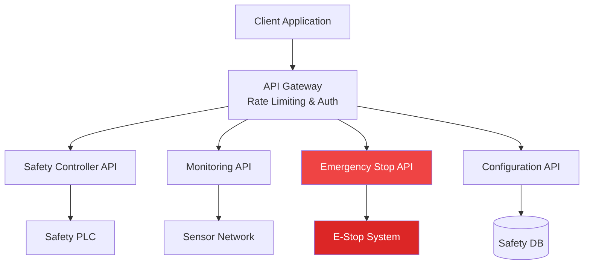

# WIA AI Safety Physical - Phase 2: API Interface Specification

**Version:** 1.0.0
**Status:** Draft
**Last Updated:** 2025-01
**Primary Color:** #EF4444 (Red - Safety)

## 1. Overview

This specification defines REST and WebSocket APIs for configuring, monitoring, and controlling safety systems in AI-enabled physical environments. All APIs follow safety-critical design principles with redundancy, validation, and fail-safe mechanisms.

### 1.1 API Architecture



### 1.2 Base URL

```
Production: https://api.wia-safety.io/v1
Development: https://dev-api.wia-safety.io/v1
Local: http://localhost:8443/api/v1
```

### 1.3 Authentication

All API requests require JWT Bearer token authentication with role-based access control (RBAC).

```http
Authorization: Bearer <JWT_TOKEN>
X-Safety-Certification: <CERTIFICATION_LEVEL>
X-Request-ID: <UNIQUE_REQUEST_ID>
```

---

## 2. Safety Zone Management API

### 2.1 Create Safety Zone

**Endpoint:** `POST /safety-zones`

**Request Body:**
```json
{
  "name": "Assembly Station A",
  "type": "collaborative",
  "geometry": {
    "type": "box",
    "center": { "x": 2.0, "y": 0.0, "z": 1.0 },
    "dimensions": { "length": 4.0, "width": 3.0, "height": 2.5 },
    "orientation": { "x": 0, "y": 0, "z": 0, "w": 1 }
  },
  "safetyLevel": "SIL3",
  "constraints": {
    "maxVelocity": { "linear": 0.25, "angular": 0.52 },
    "maxForce": 150,
    "maxPower": 80,
    "minSeparationDistance": 0.5
  },
  "monitoring": {
    "frequency": 100,
    "sensors": ["lidar", "camera", "force_torque"]
  }
}
```

**Response: 201 Created**
```json
{
  "id": "zone-abc123",
  "name": "Assembly Station A",
  "status": "active",
  "createdAt": "2025-01-15T10:30:00Z",
  "validationResults": {
    "geometryValid": true,
    "constraintsValid": true,
    "noOverlaps": true,
    "complianceChecks": {
      "ISO10218": "pass",
      "ISO13849": "pass"
    }
  },
  "activationTime": "2025-01-15T10:30:05Z"
}
```

### 2.2 List Safety Zones

**Endpoint:** `GET /safety-zones`

**Query Parameters:**
- `type`: Filter by zone type (protective, warning, collaborative, etc.)
- `safetyLevel`: Filter by SIL level
- `active`: Boolean to show only active zones
- `page`: Page number (default: 1)
- `limit`: Results per page (default: 20, max: 100)

**Response: 200 OK**
```json
{
  "zones": [
    {
      "id": "zone-abc123",
      "name": "Assembly Station A",
      "type": "collaborative",
      "safetyLevel": "SIL3",
      "status": "active",
      "humanPresence": true
    }
  ],
  "pagination": {
    "page": 1,
    "limit": 20,
    "total": 15,
    "totalPages": 1
  }
}
```

### 2.3 Update Safety Zone

**Endpoint:** `PUT /safety-zones/{zoneId}`

**Request Body:** Same as Create, with optional fields

**Response: 200 OK**
```json
{
  "id": "zone-abc123",
  "message": "Safety zone updated successfully",
  "changesAppliedAt": "2025-01-15T11:00:00Z",
  "previousVersion": "v1",
  "currentVersion": "v2",
  "requiresSystemReset": false
}
```

### 2.4 Delete Safety Zone

**Endpoint:** `DELETE /safety-zones/{zoneId}`

**Response: 200 OK**
```json
{
  "id": "zone-abc123",
  "message": "Safety zone deactivated",
  "deactivatedAt": "2025-01-15T12:00:00Z",
  "status": "archived"
}
```

---

## 3. Force and Velocity Limits API

### 3.1 Set Velocity Limits

**Endpoint:** `POST /limits/velocity`

**Request Body:**
```json
{
  "profileName": "Collaborative Mode",
  "limits": {
    "linear": {
      "x": 0.5,
      "y": 0.5,
      "z": 0.3,
      "magnitude": 0.6
    },
    "angular": {
      "roll": 0.52,
      "pitch": 0.52,
      "yaw": 1.04
    },
    "contextual": {
      "noHuman": 2.0,
      "humanDetected": 0.5,
      "collaborative": 0.25,
      "emergency": 5.0
    }
  },
  "validFrom": "2025-01-15T13:00:00Z",
  "compliance": ["ISO10218-1", "ISO/TS15066"]
}
```

**Response: 201 Created**
```json
{
  "id": "limit-vel-001",
  "profileName": "Collaborative Mode",
  "status": "active",
  "appliedAt": "2025-01-15T13:00:00Z",
  "validationStatus": "compliant"
}
```

### 3.2 Set Force Limits

**Endpoint:** `POST /limits/force`

**Request Body:**
```json
{
  "profileName": "Human Collaborative",
  "limits": {
    "transient": {
      "skull": 130,
      "forehead": 130,
      "face": 65,
      "neck": 150,
      "back": 210,
      "chest": 140,
      "upperArm": 150,
      "hand": 140
    },
    "quasiStatic": {
      "chest": 140,
      "abdomen": 110,
      "hand": 95
    },
    "gripForce": 500
  },
  "validFrom": "2025-01-15T13:00:00Z"
}
```

**Response: 201 Created**
```json
{
  "id": "limit-force-001",
  "status": "active",
  "complianceCheck": {
    "ISO_TS_15066": "pass",
    "allLimitsValid": true
  }
}
```

### 3.3 Get Active Limits

**Endpoint:** `GET /limits/active`

**Response: 200 OK**
```json
{
  "velocity": {
    "id": "limit-vel-001",
    "profileName": "Collaborative Mode",
    "currentLimits": {
      "linear": { "magnitude": 0.6 },
      "angular": { "yaw": 1.04 }
    }
  },
  "force": {
    "id": "limit-force-001",
    "profileName": "Human Collaborative",
    "activeBodyRegions": ["chest", "upperArm", "hand"]
  },
  "appliedAt": "2025-01-15T13:00:00Z"
}
```

---

## 4. Collision Detection API

### 4.1 Configure Collision Detection

**Endpoint:** `POST /collision-detection/config`

**Request Body:**
```json
{
  "enabled": true,
  "methods": ["force_torque", "vision", "proximity"],
  "sensitivity": "high",
  "thresholds": {
    "forceThreshold": 10.0,
    "velocityThreshold": 0.1,
    "proximityWarning": 0.5,
    "proximityCritical": 0.2
  },
  "responseActions": {
    "warning": "speed_reduction",
    "critical": "protective_stop",
    "emergency": "emergency_stop_category_1"
  },
  "predictionEnabled": true,
  "predictionHorizon": 2.0
}
```

**Response: 200 OK**
```json
{
  "configId": "collision-config-001",
  "status": "active",
  "appliedAt": "2025-01-15T14:00:00Z",
  "estimatedResponseTime": 45
}
```

### 4.2 Get Collision Events

**Endpoint:** `GET /collision-detection/events`

**Query Parameters:**
- `severity`: Filter by severity (info, warning, critical, emergency)
- `startTime`: ISO 8601 timestamp
- `endTime`: ISO 8601 timestamp
- `limit`: Max results (default: 50)

**Response: 200 OK**
```json
{
  "events": [
    {
      "id": "collision-7f8e9d2c",
      "timestamp": "2025-01-15T14:30:22.123Z",
      "severity": "critical",
      "detectionMethod": "force_torque",
      "location": {
        "point": { "x": 1.2, "y": 0.5, "z": 0.8 },
        "bodyPart": "upperArm"
      },
      "impact": {
        "force": 142.5,
        "pressure": 18.3
      },
      "response": {
        "action": "protective_stop",
        "responseTime": 45
      }
    }
  ],
  "summary": {
    "total": 5,
    "bySeverity": {
      "warning": 3,
      "critical": 2
    }
  }
}
```

### 4.3 Acknowledge Collision Event

**Endpoint:** `POST /collision-detection/events/{eventId}/acknowledge`

**Request Body:**
```json
{
  "acknowledgedBy": "operator-123",
  "notes": "Human safety verified, no injury",
  "clearForRecovery": true
}
```

**Response: 200 OK**
```json
{
  "eventId": "collision-7f8e9d2c",
  "acknowledged": true,
  "acknowledgedAt": "2025-01-15T14:32:00Z",
  "recoveryAuthorized": true
}
```

---

## 5. Emergency Stop API

### 5.1 Emergency Stop (High Priority)

**Endpoint:** `POST /emergency/stop`

**Priority:** CRITICAL - Bypasses rate limiting

**Request Body:**
```json
{
  "category": "cat_1",
  "trigger": {
    "source": "manual",
    "reason": "Human safety concern",
    "triggerId": "api-emergency-001"
  },
  "scope": "global"
}
```

**Response: 200 OK**
```json
{
  "emergencyId": "emergency-001",
  "status": "emergency_stop_category_1",
  "triggeredAt": "2025-01-15T15:00:00.050Z",
  "responseTime": 50,
  "systemStatus": {
    "motorsEnabled": false,
    "brakesEngaged": true,
    "powerAvailable": true
  },
  "acknowledgmentRequired": true
}
```

### 5.2 Get Emergency Status

**Endpoint:** `GET /emergency/status`

**Response: 200 OK**
```json
{
  "currentState": "emergency_stop_category_1",
  "active": true,
  "triggeredAt": "2025-01-15T15:00:00.050Z",
  "trigger": {
    "source": "manual",
    "reason": "Human safety concern"
  },
  "recovery": {
    "automatic": false,
    "requiresReset": true,
    "authorizationRequired": true,
    "authorizedPersonnel": ["safety-officer", "supervisor"]
  }
}
```

### 5.3 Reset Emergency Stop

**Endpoint:** `POST /emergency/reset`

**Request Body:**
```json
{
  "authorizedBy": "safety-officer-001",
  "authorizationCode": "RESET-2025-001",
  "safetyChecklist": {
    "hazardRemoved": true,
    "personnelClear": true,
    "systemIntegrityVerified": true,
    "sensorsCalibrated": true
  }
}
```

**Response: 200 OK**
```json
{
  "resetId": "reset-001",
  "status": "safe_state",
  "resetAt": "2025-01-15T15:10:00Z",
  "nextState": "recovery",
  "systemChecks": {
    "allSensorsFunctional": true,
    "motorsReady": true,
    "safetyCircuitIntact": true
  }
}
```

### 5.4 Resume Operation

**Endpoint:** `POST /emergency/resume`

**Request Body:**
```json
{
  "mode": "normal",
  "speedProfile": "gradual",
  "initialVelocityLimit": 0.1
}
```

**Response: 200 OK**
```json
{
  "status": "normal",
  "resumedAt": "2025-01-15T15:15:00Z",
  "operationalMode": "normal",
  "message": "System resumed to normal operation"
}
```

---

## 6. Safety Monitoring API

### 6.1 Get Real-Time Metrics (WebSocket)

**WebSocket Endpoint:** `wss://api.wia-safety.io/v1/monitoring/stream`

**Message Format:**
```json
{
  "type": "safety_metrics",
  "timestamp": 1704067200123,
  "metrics": {
    "currentVelocity": {
      "linear": { "x": 0.15, "y": 0.02, "z": 0.0 },
      "angular": { "x": 0.0, "y": 0.0, "z": 0.1 }
    },
    "currentForce": {
      "applied": { "x": 5.2, "y": 1.3, "z": -2.1 },
      "magnitude": 5.8
    },
    "separationDistance": {
      "minimum": 0.85,
      "location": { "x": 1.5, "y": 0.5, "z": 1.0 },
      "human": true
    },
    "performanceLimits": {
      "velocityUtilization": 0.25,
      "forceUtilization": 0.04,
      "powerUtilization": 0.15
    }
  },
  "status": "safe",
  "violations": []
}
```

### 6.2 Get Safety History

**Endpoint:** `GET /monitoring/history`

**Query Parameters:**
- `startTime`: ISO 8601 timestamp
- `endTime`: ISO 8601 timestamp
- `metric`: Specific metric (velocity, force, separation)
- `interval`: Aggregation interval (1s, 10s, 1m, 1h)

**Response: 200 OK**
```json
{
  "metrics": [
    {
      "timestamp": "2025-01-15T16:00:00Z",
      "avgVelocity": 0.18,
      "maxForce": 45.2,
      "minSeparation": 0.62,
      "violations": 0
    }
  ],
  "aggregation": {
    "interval": "1m",
    "count": 60
  }
}
```

### 6.3 Get Safety Violations

**Endpoint:** `GET /monitoring/violations`

**Response: 200 OK**
```json
{
  "violations": [
    {
      "id": "violation-001",
      "timestamp": "2025-01-15T16:05:32Z",
      "type": "velocity_exceeded",
      "severity": "warning",
      "message": "Linear velocity exceeded collaborative limit",
      "value": 0.28,
      "limit": 0.25,
      "duration": 150,
      "resolved": true,
      "resolvedAt": "2025-01-15T16:05:32.150Z"
    }
  ],
  "summary": {
    "total": 12,
    "active": 0,
    "resolved": 12
  }
}
```

---

## 7. Risk Assessment API

### 7.1 Create Risk Assessment

**Endpoint:** `POST /risk-assessment`

**Request Body:**
```json
{
  "taskId": "task-assembly-001",
  "taskDescription": "Collaborative assembly of components",
  "factors": {
    "severity": 3,
    "frequency": 4,
    "probability": 2,
    "avoidability": 2
  },
  "hazards": [
    {
      "type": "collision",
      "description": "Robot arm contact with operator",
      "bodyRegion": "upperArm"
    }
  ],
  "mitigations": [
    {
      "measure": "Reduced velocity in collaborative zone",
      "effectiveness": 0.8,
      "implemented": true
    },
    {
      "measure": "Force limiting per ISO/TS 15066",
      "effectiveness": 0.9,
      "implemented": true
    }
  ]
}
```

**Response: 201 Created**
```json
{
  "id": "risk-assessment-001",
  "taskId": "task-assembly-001",
  "riskLevel": "medium",
  "riskScore": 42,
  "createdAt": "2025-01-15T17:00:00Z",
  "residualRisk": "low",
  "approvalRequired": false
}
```

### 7.2 Get Risk Assessment

**Endpoint:** `GET /risk-assessment/{assessmentId}`

**Response: 200 OK**
```json
{
  "id": "risk-assessment-001",
  "taskId": "task-assembly-001",
  "riskLevel": "medium",
  "riskScore": 42,
  "factors": {
    "severity": 3,
    "frequency": 4,
    "probability": 2,
    "avoidability": 2
  },
  "mitigations": [
    {
      "measure": "Reduced velocity in collaborative zone",
      "effectiveness": 0.8,
      "implemented": true
    }
  ],
  "residualRisk": "low",
  "status": "approved"
}
```

---

## 8. Configuration API

### 8.1 Get Safety Configuration

**Endpoint:** `GET /config`

**Response: 200 OK**
```json
{
  "systemId": "safety-system-001",
  "version": "1.0.0",
  "safetyLevel": "SIL3",
  "complianceStandards": [
    "ISO10218-1",
    "ISO10218-2",
    "ISO/TS15066",
    "ISO13849-1"
  ],
  "globalSettings": {
    "emergencyStopCategory": "cat_1",
    "defaultVelocityLimit": 0.25,
    "collisionDetectionEnabled": true,
    "humanProximityMonitoring": true
  },
  "certificationLevel": "Gold"
}
```

### 8.2 Update Safety Configuration

**Endpoint:** `PUT /config`

**Request Body:**
```json
{
  "globalSettings": {
    "emergencyStopCategory": "cat_1",
    "defaultVelocityLimit": 0.2,
    "collisionDetectionEnabled": true
  },
  "requiresApproval": true,
  "approvedBy": "safety-engineer-001"
}
```

**Response: 200 OK**
```json
{
  "status": "updated",
  "appliedAt": "2025-01-15T18:00:00Z",
  "previousVersion": "1.0.0",
  "currentVersion": "1.1.0",
  "requiresSystemRestart": true
}
```

---

## 9. TypeScript SDK Example

```typescript
import { WIASafetyClient } from '@wia/safety-client';

// Initialize client
const safetyClient = new WIASafetyClient({
  baseUrl: 'https://api.wia-safety.io/v1',
  apiKey: process.env.WIA_SAFETY_API_KEY,
  certificationLevel: 'SIL3'
});

// Create safety zone
async function createCollaborativeZone() {
  const zone = await safetyClient.safetyZones.create({
    name: 'Assembly Station A',
    type: 'collaborative',
    geometry: {
      type: 'box',
      center: { x: 2.0, y: 0.0, z: 1.0 },
      dimensions: { length: 4.0, width: 3.0, height: 2.5 }
    },
    safetyLevel: 'SIL3',
    constraints: {
      maxVelocity: { linear: 0.25, angular: 0.52 },
      maxForce: 150
    }
  });

  console.log(`Zone created: ${zone.id}`);
  return zone;
}

// Monitor safety metrics via WebSocket
async function monitorSafety() {
  const stream = safetyClient.monitoring.stream();

  stream.on('metrics', (data) => {
    if (data.status === 'warning' || data.status === 'alarm') {
      console.warn('Safety violation detected:', data.violations);
    }

    if (data.separationDistance.minimum < 0.3) {
      console.error('Critical proximity detected!');
      triggerEmergencyStop();
    }
  });

  await stream.connect();
}

// Emergency stop
async function triggerEmergencyStop() {
  const response = await safetyClient.emergency.stop({
    category: 'cat_1',
    trigger: {
      source: 'automatic',
      reason: 'Critical human proximity detected'
    }
  });

  console.log(`Emergency stop executed in ${response.responseTime}ms`);
}

// Handle collision events
async function handleCollisionEvents() {
  const events = await safetyClient.collisionDetection.getEvents({
    severity: 'critical',
    limit: 10
  });

  for (const event of events.events) {
    console.log(`Collision at ${event.timestamp}:`, event.impact);

    // Acknowledge event
    await safetyClient.collisionDetection.acknowledge(event.id, {
      acknowledgedBy: 'operator-123',
      notes: 'Safety verified',
      clearForRecovery: true
    });
  }
}
```

---

## 10. Python SDK Example

```python
from wia_safety import WIASafetyClient, SafetyZone, EmergencyStop

# Initialize client
client = WIASafetyClient(
    base_url='https://api.wia-safety.io/v1',
    api_key=os.environ['WIA_SAFETY_API_KEY'],
    certification_level='SIL3'
)

# Create safety zone
def create_collaborative_zone():
    zone = client.safety_zones.create(
        name='Assembly Station A',
        type='collaborative',
        geometry={
            'type': 'box',
            'center': {'x': 2.0, 'y': 0.0, 'z': 1.0},
            'dimensions': {'length': 4.0, 'width': 3.0, 'height': 2.5}
        },
        safety_level='SIL3',
        constraints={
            'max_velocity': {'linear': 0.25, 'angular': 0.52},
            'max_force': 150
        }
    )
    print(f"Zone created: {zone.id}")
    return zone

# Monitor safety metrics
def monitor_safety():
    def on_metrics(data):
        if data['status'] in ['warning', 'alarm']:
            print(f"Safety violation: {data['violations']}")

        if data['separation_distance']['minimum'] < 0.3:
            print("Critical proximity detected!")
            trigger_emergency_stop()

    client.monitoring.stream(callback=on_metrics)

# Emergency stop
def trigger_emergency_stop():
    response = client.emergency.stop(
        category='cat_1',
        trigger={
            'source': 'automatic',
            'reason': 'Critical human proximity detected'
        }
    )
    print(f"Emergency stop executed in {response['response_time']}ms")

# Get collision events
def handle_collision_events():
    events = client.collision_detection.get_events(
        severity='critical',
        limit=10
    )

    for event in events['events']:
        print(f"Collision at {event['timestamp']}: {event['impact']}")

        # Acknowledge event
        client.collision_detection.acknowledge(
            event['id'],
            acknowledged_by='operator-123',
            notes='Safety verified',
            clear_for_recovery=True
        )

if __name__ == '__main__':
    zone = create_collaborative_zone()
    monitor_safety()
```

---

## 11. Error Codes

| Code | Description | HTTP Status |
|------|-------------|-------------|
| SAFETY_001 | Invalid safety zone geometry | 400 |
| SAFETY_002 | Force limit exceeds ISO/TS 15066 | 400 |
| SAFETY_003 | Velocity limit exceeds ISO 10218 | 400 |
| SAFETY_004 | Emergency stop already active | 409 |
| SAFETY_005 | Insufficient authorization | 403 |
| SAFETY_006 | Safety system unavailable | 503 |
| SAFETY_007 | Collision detection disabled | 409 |
| SAFETY_008 | Invalid emergency category | 400 |
| SAFETY_009 | Reset authorization failed | 403 |
| SAFETY_010 | System in unsafe state | 500 |

---

## 12. Rate Limiting

| Endpoint Category | Rate Limit | Notes |
|-------------------|------------|-------|
| Emergency API | Unlimited | Critical safety functions |
| Monitoring API | 1000 req/min | Real-time data access |
| Configuration API | 100 req/hour | System configuration |
| Standard API | 500 req/min | General operations |

---

## 13. Revision History

| Version | Date | Author | Description |
|---------|------|--------|-------------|
| 1.0.0 | 2025-01 | WIA | Initial specification |

---

<div align="center" style="margin-top: 2em; padding-top: 1em; border-top: 2px solid #EF4444;">

**弘益人間**
*Broadly benefiting humanity through safe AI-physical interaction*

</div>
