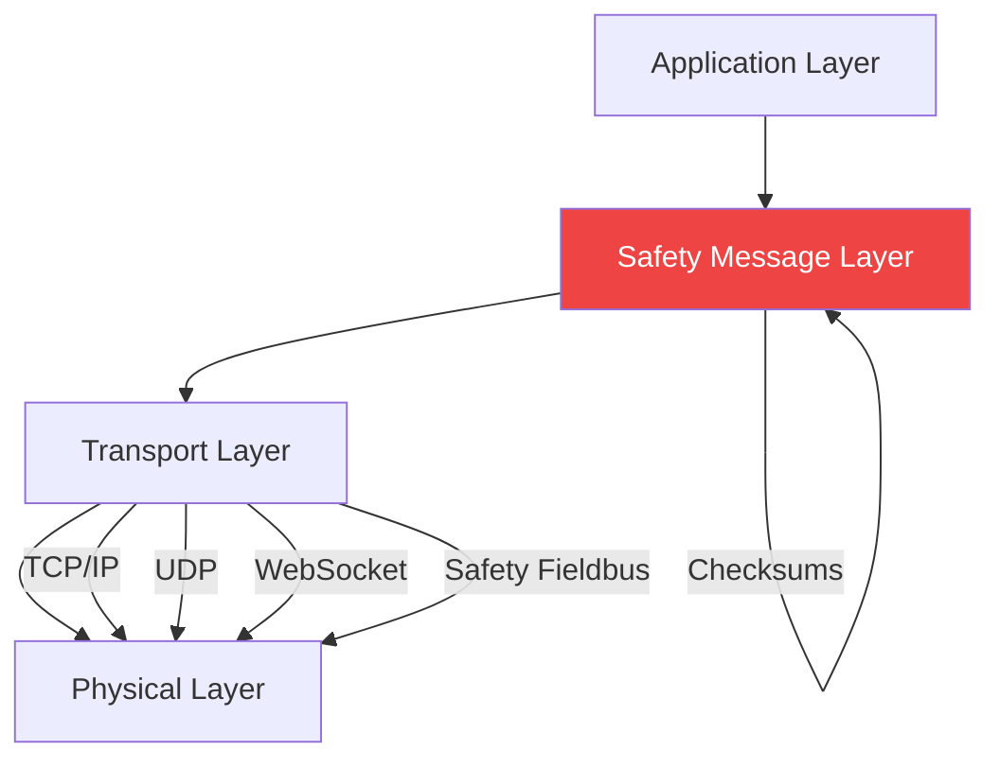
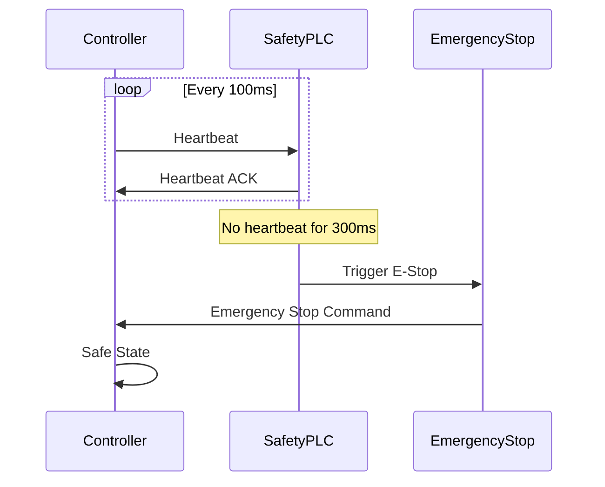
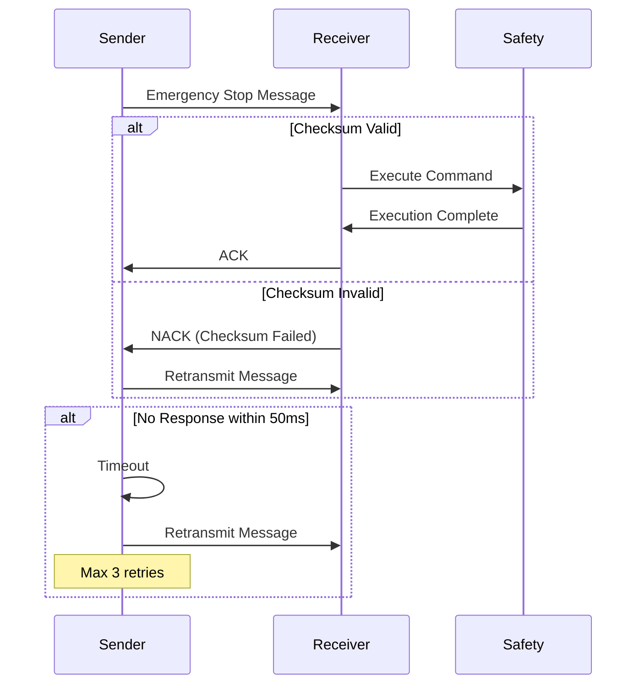

# WIA AI Safety Physical - Phase 3: Communication Protocol Specification

**Version:** 1.0.0
**Status:** Draft
**Last Updated:** 2025-01
**Primary Color:** #EF4444 (Red - Safety)

## 1. Overview

This specification defines communication protocols for safety-critical events, emergency messaging, and real-time safety monitoring in AI-enabled physical systems. The protocol supports multiple transport layers with redundancy and fail-safe mechanisms.

### 1.1 Protocol Stack



### 1.2 Protocol Requirements

| Requirement | Specification | Standard |
|-------------|--------------|----------|
| Latency (Emergency) | < 10ms | ISO 13849-1 Cat 3/4 |
| Latency (Normal) | < 100ms | ISO 10218-1 |
| Message Loss | < 0.01% | IEC 61508 SIL 3 |
| Error Detection | CRC-32 + Sequence | ISO 13849-1 |
| Redundancy | Dual channel | IEC 61508 |
| Heartbeat | 100ms interval | - |

---

## 2. Message Format

### 2.1 Base Message Structure

All safety messages follow this base structure:

```json
{
  "header": {
    "version": "1.0.0",
    "messageId": "msg-uuid-v4",
    "messageType": "safety_event",
    "timestamp": 1704067200123,
    "sequenceNumber": 12345,
    "priority": "critical",
    "sourceId": "system-001",
    "destinationId": "controller-001",
    "checksumType": "CRC32",
    "checksum": "A1B2C3D4"
  },
  "payload": {
    "type": "emergency_stop",
    "data": {}
  },
  "metadata": {
    "safetyLevel": "SIL3",
    "certificationRequired": true,
    "redundantChannel": 1
  }
}
```

### 2.2 Message Types

| Type | Priority | Max Latency | Description |
|------|----------|-------------|-------------|
| `emergency_stop` | 0 (Highest) | 10ms | Emergency stop command |
| `safety_violation` | 1 | 20ms | Safety constraint violation |
| `collision_detected` | 1 | 20ms | Collision event |
| `collision_predicted` | 2 | 50ms | Predicted collision warning |
| `zone_violation` | 2 | 50ms | Safety zone breach |
| `limit_exceeded` | 2 | 50ms | Force/velocity limit exceeded |
| `safety_status` | 3 | 100ms | Periodic safety status |
| `heartbeat` | 4 | 100ms | System alive signal |
| `configuration` | 5 (Lowest) | 1000ms | Configuration update |

### 2.3 Priority Levels

```
Priority 0: EMERGENCY     - Immediate processing, bypass queues
Priority 1: CRITICAL      - Process within 20ms
Priority 2: HIGH          - Process within 50ms
Priority 3: NORMAL        - Process within 100ms
Priority 4: LOW           - Process within 500ms
Priority 5: BACKGROUND    - Process when idle
```

---

## 3. Safety Event Messages

### 3.1 Emergency Stop Message

```json
{
  "header": {
    "version": "1.0.0",
    "messageId": "estop-7f8e9d2c-1a3b-4c5d",
    "messageType": "emergency_stop",
    "timestamp": 1704067200050,
    "sequenceNumber": 12345,
    "priority": "emergency",
    "sourceId": "safety-controller-001",
    "checksumType": "CRC32",
    "checksum": "E5F6G7H8"
  },
  "payload": {
    "type": "emergency_stop",
    "data": {
      "category": "cat_1",
      "trigger": {
        "source": "automatic",
        "reason": "Human proximity critical",
        "sensorId": "lidar-001",
        "location": { "x": 1.2, "y": 0.3, "z": 0.8 }
      },
      "scope": "global",
      "expectedResponseTime": 10,
      "recoveryAllowed": false
    }
  },
  "metadata": {
    "safetyLevel": "SIL3",
    "certificationRequired": true,
    "redundantChannel": 1,
    "requiresAcknowledgment": true
  }
}
```

### 3.2 Collision Detection Message

```json
{
  "header": {
    "version": "1.0.0",
    "messageId": "collision-abc123",
    "messageType": "collision_detected",
    "timestamp": 1704067200075,
    "sequenceNumber": 12346,
    "priority": "critical",
    "sourceId": "force-sensor-002"
  },
  "payload": {
    "type": "collision_detected",
    "data": {
      "severity": "critical",
      "detectionMethod": "force_torque",
      "location": {
        "point": { "x": 1.2, "y": 0.5, "z": 0.8 },
        "bodyPart": "upperArm",
        "surfaceNormal": { "x": 0.0, "y": 1.0, "z": 0.0 }
      },
      "impact": {
        "force": 142.5,
        "pressure": 18.3,
        "velocity": 0.18,
        "energy": 2.3,
        "duration": 0.025
      },
      "responseExecuted": {
        "action": "protective_stop",
        "executedAt": 1704067200120,
        "responseTime": 45
      }
    }
  }
}
```

### 3.3 Collision Prediction Message

```json
{
  "header": {
    "version": "1.0.0",
    "messageId": "predict-def456",
    "messageType": "collision_predicted",
    "timestamp": 1704067200000,
    "priority": "high",
    "sourceId": "vision-system-001"
  },
  "payload": {
    "type": "collision_predicted",
    "data": {
      "timeToCollision": 0.85,
      "probability": 0.87,
      "targetObject": {
        "type": "human",
        "trackingId": "person-001",
        "velocity": { "x": 0.3, "y": 0.1, "z": 0.0 },
        "estimatedBodyPart": "hand"
      },
      "predictedImpact": {
        "location": { "x": 1.5, "y": 0.6, "z": 0.9 },
        "estimatedForce": 85.0,
        "estimatedTime": 1704067200850
      },
      "avoidanceActions": [
        {
          "action": "slow_down",
          "probability": 0.95,
          "requiredTime": 0.3
        },
        {
          "action": "change_trajectory",
          "probability": 0.75,
          "requiredTime": 0.5
        }
      ],
      "recommendedAction": "slow_down"
    }
  }
}
```

### 3.4 Safety Zone Violation Message

```json
{
  "header": {
    "version": "1.0.0",
    "messageId": "zone-vio-789",
    "messageType": "zone_violation",
    "timestamp": 1704067200100,
    "priority": "high",
    "sourceId": "zone-monitor-001"
  },
  "payload": {
    "type": "zone_violation",
    "data": {
      "zoneId": "zone-collaborative-assembly",
      "zoneName": "Assembly Station A",
      "violationType": "velocity_exceeded",
      "currentValue": 0.35,
      "limit": 0.25,
      "percentage": 140,
      "duration": 0.15,
      "location": { "x": 2.1, "y": 0.2, "z": 1.0 },
      "actionTaken": "speed_reduction",
      "newLimit": 0.2
    }
  }
}
```

### 3.5 Safety Status Message

```json
{
  "header": {
    "version": "1.0.0",
    "messageId": "status-periodic-001",
    "messageType": "safety_status",
    "timestamp": 1704067200000,
    "priority": "normal",
    "sourceId": "safety-controller-001"
  },
  "payload": {
    "type": "safety_status",
    "data": {
      "systemState": "normal",
      "safetyLevel": "SIL3",
      "activeSafetyZones": 5,
      "humanPresenceDetected": true,
      "emergencyStopActive": false,
      "metrics": {
        "currentVelocity": {
          "linear": 0.18,
          "angular": 0.05
        },
        "currentForce": 12.5,
        "minSeparationDistance": 0.85,
        "velocityUtilization": 0.72,
        "forceUtilization": 0.08
      },
      "sensors": {
        "lidar": "operational",
        "camera": "operational",
        "forceTorque": "operational",
        "proximity": "operational"
      },
      "violations": {
        "last24h": 3,
        "lastHour": 0,
        "active": 0
      }
    }
  }
}
```

---

## 4. Heartbeat and Watchdog Protocol

### 4.1 Heartbeat Message

```json
{
  "header": {
    "version": "1.0.0",
    "messageId": "heartbeat-001",
    "messageType": "heartbeat",
    "timestamp": 1704067200000,
    "sequenceNumber": 98765,
    "priority": "low",
    "sourceId": "safety-controller-001"
  },
  "payload": {
    "type": "heartbeat",
    "data": {
      "uptime": 86400,
      "cycleTime": 0.01,
      "lastMessageSent": 1704067199900,
      "messagesSent": 98765,
      "messagesReceived": 98760,
      "errorCount": 5,
      "systemHealth": "healthy"
    }
  }
}
```

### 4.2 Heartbeat Protocol Flow



### 4.3 Watchdog Timer Configuration

```json
{
  "watchdog": {
    "enabled": true,
    "timeout": 300,
    "unit": "ms",
    "action": "emergency_stop_category_0",
    "resetMode": "manual",
    "redundantChannel": {
      "enabled": true,
      "crossCheck": true
    }
  }
}
```

---

## 5. Acknowledgment Protocol

### 5.1 ACK Message

```json
{
  "header": {
    "version": "1.0.0",
    "messageId": "ack-001",
    "messageType": "acknowledgment",
    "timestamp": 1704067200055,
    "priority": "emergency",
    "sourceId": "controller-001",
    "inReplyTo": "estop-7f8e9d2c-1a3b-4c5d"
  },
  "payload": {
    "type": "acknowledgment",
    "data": {
      "originalMessageId": "estop-7f8e9d2c-1a3b-4c5d",
      "status": "received_and_executed",
      "executedAt": 1704067200060,
      "processingTime": 10,
      "result": {
        "success": true,
        "currentState": "emergency_stop_category_1",
        "motorsEnabled": false,
        "brakesEngaged": true
      }
    }
  }
}
```

### 5.2 NACK (Negative Acknowledgment) Message

```json
{
  "header": {
    "version": "1.0.0",
    "messageId": "nack-001",
    "messageType": "negative_acknowledgment",
    "timestamp": 1704067200070,
    "priority": "critical",
    "sourceId": "controller-001",
    "inReplyTo": "config-abc123"
  },
  "payload": {
    "type": "negative_acknowledgment",
    "data": {
      "originalMessageId": "config-abc123",
      "status": "rejected",
      "reason": "checksum_failed",
      "errorCode": "SAFETY_CHECKSUM_MISMATCH",
      "details": "Message integrity check failed",
      "requestRetransmission": true
    }
  }
}
```

### 5.3 ACK/NACK Flow



---

## 6. Transport Layer Protocols

### 6.1 WebSocket Protocol

**Endpoint:** `wss://safety-system.local/safety/v1/stream`

**Connection Handshake:**
```javascript
// Client connection
const ws = new WebSocket('wss://safety-system.local/safety/v1/stream', {
  headers: {
    'Authorization': 'Bearer <TOKEN>',
    'X-Safety-Level': 'SIL3',
    'X-Client-ID': 'controller-001'
  }
});

// Server handshake response
{
  "type": "connection_established",
  "sessionId": "session-001",
  "maxMessageSize": 65536,
  "heartbeatInterval": 100,
  "supportedVersions": ["1.0.0"]
}
```

**Message Format:**
```json
{
  "type": "safety_message",
  "channel": "primary",
  "message": {
    "header": {},
    "payload": {}
  }
}
```

### 6.2 UDP Protocol (Low Latency)

**Port:** 5555 (Primary), 5556 (Redundant)

**Packet Structure:**
```
┌─────────────────────────────────────────────────┐
│ Header (64 bytes)                                │
├─────────────────────────────────────────────────┤
│ Protocol Version (4 bytes)                       │
│ Message Type (4 bytes)                           │
│ Message ID (16 bytes UUID)                       │
│ Timestamp (8 bytes)                              │
│ Sequence Number (4 bytes)                        │
│ Priority (1 byte)                                │
│ Payload Length (4 bytes)                         │
│ Checksum (4 bytes CRC32)                         │
│ Reserved (19 bytes)                              │
├─────────────────────────────────────────────────┤
│ Payload (Variable, max 1400 bytes)               │
├─────────────────────────────────────────────────┤
│ Footer Checksum (4 bytes)                        │
└─────────────────────────────────────────────────┘
```

### 6.3 Safety Fieldbus (EtherCAT)

**Configuration:**
```xml
<SafetyProtocol>
  <Protocol>EtherCAT</Protocol>
  <CycleTime>1ms</CycleTime>
  <SafetyOverEtherCAT>
    <FSoE>
      <Version>2.0</Version>
      <SafetyAddress>0x1000</SafetyAddress>
      <WatchdogTime>100ms</WatchdogTime>
    </FSoE>
  </SafetyOverEtherCAT>
  <Redundancy>
    <Enabled>true</Enabled>
    <Mode>hot_standby</Mode>
  </Redundancy>
</SafetyProtocol>
```

---

## 7. Error Detection and Correction

### 7.1 Checksum Algorithm (CRC-32)

```python
import zlib
import json

def calculate_checksum(message: dict) -> str:
    """Calculate CRC-32 checksum for message payload"""
    # Convert message to canonical JSON (sorted keys, no whitespace)
    canonical = json.dumps(message['payload'], sort_keys=True, separators=(',', ':'))

    # Calculate CRC-32
    checksum = zlib.crc32(canonical.encode('utf-8'))

    # Return as 8-character hex string
    return f"{checksum:08X}"

# Example usage
message = {
    "header": {
        "messageId": "msg-001",
        "timestamp": 1704067200000
    },
    "payload": {
        "type": "emergency_stop",
        "data": {"category": "cat_1"}
    }
}

checksum = calculate_checksum(message)
message['header']['checksum'] = checksum
```

### 7.2 Sequence Number Validation

```typescript
class SequenceValidator {
  private expectedSequence: number = 0;
  private windowSize: number = 100;
  private receivedMessages: Set<number> = new Set();

  validate(sequenceNumber: number): boolean {
    // Reject duplicate messages
    if (this.receivedMessages.has(sequenceNumber)) {
      return false;
    }

    // Check if within acceptable window
    const diff = sequenceNumber - this.expectedSequence;
    if (diff < 0 || diff > this.windowSize) {
      console.error(`Sequence out of order: expected ${this.expectedSequence}, got ${sequenceNumber}`);
      return false;
    }

    // Accept message
    this.receivedMessages.add(sequenceNumber);
    this.expectedSequence = sequenceNumber + 1;

    // Clean up old sequences
    if (this.receivedMessages.size > this.windowSize) {
      const oldSequence = sequenceNumber - this.windowSize;
      this.receivedMessages.delete(oldSequence);
    }

    return true;
  }
}
```

### 7.3 Redundant Channel Verification

```python
class RedundantChannelVerifier:
    def __init__(self):
        self.channel1_buffer = {}
        self.channel2_buffer = {}
        self.timeout = 0.05  # 50ms

    def verify(self, message_id: str, channel: int, data: dict) -> bool:
        """Verify message received on both redundant channels"""

        if channel == 1:
            self.channel1_buffer[message_id] = {
                'data': data,
                'timestamp': time.time()
            }
        elif channel == 2:
            self.channel2_buffer[message_id] = {
                'data': data,
                'timestamp': time.time()
            }

        # Check if message exists in both channels
        if message_id in self.channel1_buffer and message_id in self.channel2_buffer:
            msg1 = self.channel1_buffer[message_id]
            msg2 = self.channel2_buffer[message_id]

            # Verify data matches
            if msg1['data'] == msg2['data']:
                # Clean up buffers
                del self.channel1_buffer[message_id]
                del self.channel2_buffer[message_id]
                return True
            else:
                print(f"ERROR: Mismatch between redundant channels for {message_id}")
                return False

        return False  # Waiting for second channel
```

---

## 8. Real-Time Monitoring Protocol

### 8.1 Streaming Metrics Message

```json
{
  "header": {
    "messageType": "streaming_metrics",
    "timestamp": 1704067200000,
    "priority": "normal"
  },
  "payload": {
    "type": "streaming_metrics",
    "data": {
      "frequency": 100,
      "metrics": [
        {
          "timestamp": 1704067200000,
          "velocity": { "linear": 0.18, "angular": 0.05 },
          "force": 12.5,
          "separation": 0.85
        },
        {
          "timestamp": 1704067200010,
          "velocity": { "linear": 0.19, "angular": 0.06 },
          "force": 13.2,
          "separation": 0.83
        }
      ]
    }
  }
}
```

### 8.2 Compression for High-Frequency Data

```javascript
// Using MessagePack for binary compression
const msgpack = require('msgpack-lite');

// Encode message
const message = {
  t: 1704067200000,  // timestamp (shortened key)
  v: [0.18, 0.05],   // velocity [linear, angular]
  f: 12.5,           // force
  s: 0.85            // separation
};

const encoded = msgpack.encode(message);
// Reduces message size by ~60%

// Decode message
const decoded = msgpack.decode(encoded);
```

---

## 9. Protocol Implementation Examples

### 9.1 TypeScript Client

```typescript
import WebSocket from 'ws';
import { CRC32 } from 'crc';

class SafetyProtocolClient {
  private ws: WebSocket;
  private sequenceNumber: number = 0;
  private messageHandlers: Map<string, Function> = new Map();

  constructor(url: string, apiKey: string) {
    this.ws = new WebSocket(url, {
      headers: {
        'Authorization': `Bearer ${apiKey}`,
        'X-Safety-Level': 'SIL3'
      }
    });

    this.ws.on('message', this.handleMessage.bind(this));
  }

  sendEmergencyStop(reason: string): void {
    const message = {
      header: {
        version: '1.0.0',
        messageId: this.generateMessageId(),
        messageType: 'emergency_stop',
        timestamp: Date.now(),
        sequenceNumber: this.sequenceNumber++,
        priority: 'emergency',
        sourceId: 'client-001',
        checksumType: 'CRC32'
      },
      payload: {
        type: 'emergency_stop',
        data: {
          category: 'cat_1',
          trigger: {
            source: 'manual',
            reason: reason
          },
          scope: 'global'
        }
      },
      metadata: {
        safetyLevel: 'SIL3',
        requiresAcknowledgment: true
      }
    };

    // Calculate checksum
    message.header.checksum = this.calculateChecksum(message.payload);

    // Send message
    this.ws.send(JSON.stringify(message));

    // Wait for acknowledgment
    this.waitForAck(message.header.messageId, 50); // 50ms timeout
  }

  private calculateChecksum(payload: any): string {
    const canonical = JSON.stringify(payload, Object.keys(payload).sort());
    return CRC32.str(canonical).toString(16).toUpperCase();
  }

  private handleMessage(data: WebSocket.Data): void {
    const message = JSON.parse(data.toString());

    // Verify checksum
    if (!this.verifyChecksum(message)) {
      this.sendNack(message.header.messageId, 'checksum_failed');
      return;
    }

    // Handle by message type
    const handler = this.messageHandlers.get(message.header.messageType);
    if (handler) {
      handler(message);
    }

    // Send acknowledgment
    this.sendAck(message.header.messageId);
  }

  private generateMessageId(): string {
    return `msg-${Date.now()}-${Math.random().toString(36).substr(2, 9)}`;
  }
}
```

### 9.2 Python Server

```python
import asyncio
import json
import time
import zlib
from typing import Dict, Callable
from websockets.server import serve

class SafetyProtocolServer:
    def __init__(self):
        self.handlers: Dict[str, Callable] = {}
        self.sequence_validator = SequenceValidator()

    async def handle_connection(self, websocket, path):
        """Handle incoming WebSocket connection"""
        try:
            async for message in websocket:
                await self.process_message(websocket, message)
        except Exception as e:
            print(f"Connection error: {e}")

    async def process_message(self, websocket, raw_message: str):
        """Process incoming safety message"""
        message = json.loads(raw_message)

        # Verify checksum
        if not self.verify_checksum(message):
            await self.send_nack(websocket, message['header']['messageId'],
                                'checksum_failed')
            return

        # Validate sequence number
        if not self.sequence_validator.validate(message['header']['sequenceNumber']):
            await self.send_nack(websocket, message['header']['messageId'],
                                'sequence_invalid')
            return

        # Route to appropriate handler
        message_type = message['header']['messageType']
        if message_type in self.handlers:
            await self.handlers[message_type](websocket, message)

        # Send acknowledgment
        await self.send_ack(websocket, message['header']['messageId'])

    def verify_checksum(self, message: dict) -> bool:
        """Verify CRC-32 checksum"""
        expected = message['header'].get('checksum')
        if not expected:
            return True  # No checksum provided

        # Calculate checksum
        canonical = json.dumps(message['payload'], sort_keys=True, separators=(',', ':'))
        calculated = f"{zlib.crc32(canonical.encode('utf-8')):08X}"

        return expected == calculated

    async def send_ack(self, websocket, original_message_id: str):
        """Send acknowledgment message"""
        ack = {
            'header': {
                'version': '1.0.0',
                'messageId': f'ack-{int(time.time() * 1000)}',
                'messageType': 'acknowledgment',
                'timestamp': int(time.time() * 1000),
                'inReplyTo': original_message_id
            },
            'payload': {
                'type': 'acknowledgment',
                'data': {
                    'originalMessageId': original_message_id,
                    'status': 'received_and_executed'
                }
            }
        }

        await websocket.send(json.dumps(ack))

    async def send_nack(self, websocket, original_message_id: str, reason: str):
        """Send negative acknowledgment"""
        nack = {
            'header': {
                'version': '1.0.0',
                'messageId': f'nack-{int(time.time() * 1000)}',
                'messageType': 'negative_acknowledgment',
                'timestamp': int(time.time() * 1000),
                'inReplyTo': original_message_id
            },
            'payload': {
                'type': 'negative_acknowledgment',
                'data': {
                    'originalMessageId': original_message_id,
                    'status': 'rejected',
                    'reason': reason,
                    'requestRetransmission': True
                }
            }
        }

        await websocket.send(json.dumps(nack))

    def register_handler(self, message_type: str, handler: Callable):
        """Register message handler"""
        self.handlers[message_type] = handler

# Example usage
async def handle_emergency_stop(websocket, message):
    """Handle emergency stop message"""
    print(f"Emergency stop received: {message['payload']['data']['trigger']['reason']}")
    # Trigger emergency stop procedures
    # ...

server = SafetyProtocolServer()
server.register_handler('emergency_stop', handle_emergency_stop)

# Start server
start_server = serve(server.handle_connection, "localhost", 8765)
asyncio.get_event_loop().run_until_complete(start_server)
asyncio.get_event_loop().run_forever()
```

---

## 10. Compliance and Certification

### 10.1 Protocol Compliance Checklist

- [ ] Message latency < 100ms for all safety-critical messages
- [ ] Emergency stop latency < 10ms
- [ ] CRC-32 checksum on all messages
- [ ] Sequence number validation implemented
- [ ] Redundant channel verification active
- [ ] Heartbeat interval ≤ 100ms
- [ ] Watchdog timeout ≤ 300ms
- [ ] Message loss rate < 0.01%
- [ ] ACK/NACK protocol implemented
- [ ] Error detection rate > 99.99%

### 10.2 Protocol Testing

```python
import pytest
import time

def test_emergency_stop_latency():
    """Test emergency stop message latency < 10ms"""
    client = SafetyProtocolClient()

    start = time.time()
    client.send_emergency_stop("test")
    ack = client.wait_for_ack(timeout=0.01)
    latency = (time.time() - start) * 1000

    assert ack is not None, "No ACK received"
    assert latency < 10, f"Latency {latency}ms exceeds 10ms limit"

def test_checksum_validation():
    """Test checksum validation"""
    message = create_test_message()
    message['header']['checksum'] = "INVALID"

    result = server.process_message(message)
    assert result['type'] == 'negative_acknowledgment'
    assert result['reason'] == 'checksum_failed'

def test_sequence_validation():
    """Test sequence number validation"""
    validator = SequenceValidator()

    assert validator.validate(0) == True
    assert validator.validate(1) == True
    assert validator.validate(1) == False  # Duplicate
    assert validator.validate(105) == False  # Out of window
```

---

## 11. Revision History

| Version | Date | Author | Description |
|---------|------|--------|-------------|
| 1.0.0 | 2025-01 | WIA | Initial specification |

---

<div align="center" style="margin-top: 2em; padding-top: 1em; border-top: 2px solid #EF4444;">

**弘益人間**
*Broadly benefiting humanity through safe AI-physical interaction*

</div>
