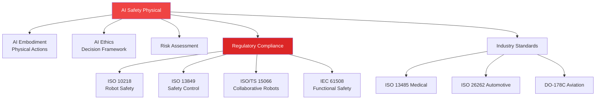

# WIA AI Safety Physical - Phase 4: Ecosystem Integration Specification

**Version:** 1.0.0
**Status:** Draft
**Last Updated:** 2025-01
**Primary Color:** #EF4444 (Red - Safety)

## 1. Overview

This specification defines the integration of AI Safety Physical standards with the broader WIA ecosystem, including AI Embodiment, AI Ethics, regulatory compliance (ISO 10218, ISO 13849, ISO/TS 15066), and industry-specific safety frameworks.

### 1.1 Integration Architecture



---

## 2. AI Embodiment Integration

### 2.1 Physical Action Safety Wrapper

All physical actions from AI Embodiment must pass through the safety validation layer:

```typescript
interface SafetyValidatedAction {
  embodimentAction: EmbodimentAction;
  safetyChecks: SafetyCheckResult[];
  riskAssessment: RiskLevel;
  approvalRequired: boolean;
  constraints: SafetyConstraints;
}

class SafetyActionValidator {
  async validateAction(action: EmbodimentAction): Promise<SafetyValidatedAction> {
    // Step 1: Check safety zones
    const zoneCheck = await this.checkSafetyZones(action.targetLocation);

    // Step 2: Validate force/velocity limits
    const limitsCheck = await this.validateLimits(action.trajectory);

    // Step 3: Predict collisions
    const collisionCheck = await this.predictCollisions(action);

    // Step 4: Assess risk
    const risk = await this.assessRisk(action, {
      zoneCheck,
      limitsCheck,
      collisionCheck
    });

    // Step 5: Determine if human approval needed
    const approvalRequired = risk.level >= RiskLevel.HIGH;

    return {
      embodimentAction: action,
      safetyChecks: [zoneCheck, limitsCheck, collisionCheck],
      riskAssessment: risk,
      approvalRequired,
      constraints: this.deriveConstraints(risk)
    };
  }

  private deriveConstraints(risk: RiskAssessment): SafetyConstraints {
    switch (risk.level) {
      case RiskLevel.NEGLIGIBLE:
        return { maxVelocity: 2.0, maxForce: 500 };
      case RiskLevel.LOW:
        return { maxVelocity: 1.0, maxForce: 300 };
      case RiskLevel.MEDIUM:
        return { maxVelocity: 0.5, maxForce: 150 };
      case RiskLevel.HIGH:
        return { maxVelocity: 0.25, maxForce: 80 };
      case RiskLevel.VERY_HIGH:
        return { maxVelocity: 0.1, maxForce: 50 };
    }
  }
}
```

### 2.2 Embodiment Action Safety Mapping

| Embodiment Action | Safety Requirements | Max Velocity | Max Force | SIL |
|-------------------|---------------------|--------------|-----------|-----|
| `grasp_object` | Grip force limiting | 0.1 m/s | 95 N | SIL 2 |
| `move_to_location` | Collision avoidance | 0.25 m/s | 150 N | SIL 3 |
| `collaborative_assembly` | Human proximity monitoring | 0.25 m/s | 150 N | SIL 3 |
| `handover_to_human` | Force sensing, gentle contact | 0.1 m/s | 65 N | SIL 3 |
| `emergency_intervention` | Immediate response | 1.0 m/s | 300 N | SIL 4 |

### 2.3 Integration Example

```python
from wia_embodiment import EmbodimentClient
from wia_safety_physical import SafetyValidator

# Initialize clients
embodiment = EmbodimentClient()
safety = SafetyValidator(safety_level='SIL3')

async def execute_safe_action(action_description: str):
    """Execute embodiment action with safety validation"""

    # Generate action plan from embodiment
    action = await embodiment.plan_action(action_description)

    # Validate action safety
    validated = await safety.validate_action(action)

    # Check if approval needed
    if validated.approval_required:
        approval = await request_human_approval(validated)
        if not approval.granted:
            return {"status": "rejected", "reason": approval.reason}

    # Apply safety constraints
    constrained_action = apply_constraints(action, validated.constraints)

    # Execute with real-time monitoring
    result = await embodiment.execute_action(
        constrained_action,
        on_violation=safety.emergency_stop
    )

    return result

# Example usage
result = await execute_safe_action("Pick up the red box and place it on the table")
```

---

## 3. AI Ethics Integration

### 3.1 Ethical Safety Decision Framework

Physical safety decisions must consider ethical implications:

```json
{
  "ethicalSafetyDecision": {
    "scenario": "collision_imminent",
    "options": [
      {
        "action": "emergency_stop",
        "safetyImpact": {
          "humanRisk": "minimal",
          "systemDamage": "none",
          "taskCompletion": "failed"
        },
        "ethicalScore": 95,
        "reasoning": "Prioritizes human safety above all"
      },
      {
        "action": "evasive_maneuver",
        "safetyImpact": {
          "humanRisk": "low",
          "systemDamage": "possible",
          "taskCompletion": "possible"
        },
        "ethicalScore": 75,
        "reasoning": "Attempts to preserve both safety and task"
      }
    ],
    "selectedAction": "emergency_stop",
    "ethicalPrinciples": [
      "human_safety_first",
      "do_no_harm",
      "precautionary_principle"
    ]
  }
}
```

### 3.2 Safety-Ethics Integration Rules

| Ethical Principle | Safety Implementation | Priority |
|-------------------|----------------------|----------|
| Human Safety First | Emergency stop on any human risk | 1 |
| Do No Harm | Preventive collision detection | 1 |
| Fairness | Equal safety for all humans | 2 |
| Transparency | Log all safety decisions | 2 |
| Accountability | Human oversight for high-risk | 3 |
| Privacy | Anonymize safety monitoring data | 4 |

### 3.3 Ethical Dilemma Resolution

```python
class EthicalSafetyResolver:
    def __init__(self, ethics_client, safety_client):
        self.ethics = ethics_client
        self.safety = safety_client

    async def resolve_dilemma(self, scenario: dict) -> dict:
        """
        Resolve ethical dilemmas in safety scenarios
        Example: Stop task vs. avoid damaging expensive equipment
        """

        # Get safety assessment
        safety_analysis = await self.safety.analyze_scenario(scenario)

        # Get ethical assessment
        ethical_analysis = await self.ethics.evaluate_options(
            scenario['options'],
            principles=['human_safety_first', 'minimize_harm', 'proportionality']
        )

        # Combine assessments
        decision = self.make_decision(safety_analysis, ethical_analysis)

        # Log decision with reasoning
        await self.log_decision({
            'scenario': scenario,
            'safety_analysis': safety_analysis,
            'ethical_analysis': ethical_analysis,
            'decision': decision,
            'timestamp': time.time()
        })

        return decision

    def make_decision(self, safety, ethics) -> dict:
        """Decision always prioritizes human safety"""
        if safety['human_risk'] > 0.1:  # Any significant human risk
            return {
                'action': 'emergency_stop',
                'reason': 'Human safety paramount',
                'ethical_justification': ethics['human_safety_first']
            }
        else:
            return ethics['recommended_action']
```

---

## 4. ISO 10218 Compliance

### 4.1 ISO 10218-1: Industrial Robots - Safety Requirements

**Compliance Mapping:**

| ISO 10218-1 Requirement | Implementation | Validation |
|-------------------------|----------------|------------|
| 5.7.1 Collaborative operation | SafetyZone with type='collaborative' | Zone configuration audit |
| 5.7.2 Safety-rated monitored stop | EmergencyState category_0 | E-stop response time test |
| 5.7.3 Hand guiding | Force/torque sensing, velocity limits | Force limit verification |
| 5.7.4 Speed and separation monitoring | Real-time distance monitoring | Separation distance test |
| 5.7.5 Power and force limiting | ForceLimits per ISO/TS 15066 | Force measurement test |
| 5.10 Protective stop | ProtectiveStop response | Response time test |
| 5.11 Emergency stop | EmergencyStop API | E-stop test |

### 4.2 ISO 10218-2: Robot Systems and Integration

**System Integration Requirements:**

```json
{
  "iso10218_2_compliance": {
    "section_5_2": {
      "requirement": "Risk assessment",
      "implementation": "RiskAssessment API",
      "status": "compliant"
    },
    "section_5_4": {
      "requirement": "Safeguarding",
      "implementation": "SafetyZone protective zones",
      "status": "compliant"
    },
    "section_5_5": {
      "requirement": "Collaborative workspace",
      "implementation": "Collaborative zone with human detection",
      "status": "compliant"
    },
    "section_5_10": {
      "requirement": "Safety functions verification",
      "implementation": "Automated safety testing suite",
      "status": "compliant"
    }
  }
}
```

---

## 5. ISO/TS 15066 Compliance (Collaborative Robots)

### 5.1 Biomechanical Limits Implementation

**Body Region Force Limits (from Phase 1):**

```python
class ISO_TS_15066_Validator:
    # Transient contact limits (Table 1 of ISO/TS 15066)
    TRANSIENT_LIMITS = {
        'skull': 130,      # N
        'forehead': 130,
        'face': 65,
        'neck': 150,
        'back': 210,
        'chest': 140,
        'abdomen': 110,
        'pelvis': 180,
        'upper_arm': 150,
        'lower_arm': 160,
        'hand': 140,
        'thigh': 220,
        'lower_leg': 220,
        'foot': 220
    }

    # Quasi-static contact limits (clamping/crushing)
    QUASI_STATIC_LIMITS = {
        'chest': 140,
        'abdomen': 110,
        'hand': 95
    }

    def validate_contact(self, body_part: str, force: float, contact_type: str) -> bool:
        """Validate contact force against ISO/TS 15066 limits"""

        if contact_type == 'transient':
            limit = self.TRANSIENT_LIMITS.get(body_part)
        elif contact_type == 'quasi_static':
            limit = self.QUASI_STATIC_LIMITS.get(body_part)
        else:
            raise ValueError(f"Invalid contact type: {contact_type}")

        if limit is None:
            raise ValueError(f"Unknown body part: {body_part}")

        compliant = force <= limit

        if not compliant:
            self.trigger_protective_stop(f"Force {force}N exceeds {limit}N for {body_part}")

        return compliant
```

### 5.2 Power and Force Limiting

**Maximum Allowable Power:**

```
P_max = (F_limit × v_relative) / 2

Where:
- F_limit: Force limit for body region (N)
- v_relative: Relative velocity between robot and human (m/s)
- P_max: Maximum allowable power (W)
```

**Implementation:**

```typescript
class PowerLimiter {
  calculateMaxPower(bodyPart: string, relativeVelocity: number): number {
    const forceLimit = this.getForceLimitForBodyPart(bodyPart);
    const maxPower = (forceLimit * relativeVelocity) / 2;
    return maxPower;
  }

  async monitorPower(bodyPart: string, velocity: number, force: number): Promise<boolean> {
    const maxPower = this.calculateMaxPower(bodyPart, velocity);
    const actualPower = force * velocity;

    if (actualPower > maxPower) {
      await this.triggerProtectiveStop({
        reason: 'Power limit exceeded',
        bodyPart,
        actualPower,
        maxPower,
        force,
        velocity
      });
      return false;
    }

    return true;
  }
}
```

---

## 6. ISO 13849 Compliance (Safety Control Systems)

### 6.1 Performance Level (PL) Requirements

| Performance Level | PFHd (per hour) | Category | Safety Integrity |
|-------------------|-----------------|----------|------------------|
| PL a | 10⁻⁵ to 10⁻⁴ | B | Low |
| PL b | 3×10⁻⁶ to 10⁻⁵ | 1 | Low |
| PL c | 10⁻⁶ to 3×10⁻⁶ | 1, 2 | Medium |
| PL d | 10⁻⁷ to 10⁻⁶ | 2, 3 | High |
| PL e | 10⁻⁸ to 10⁻⁷ | 3, 4 | Very High |

**WIA Mapping:**
- SIL 1 ≈ PL c
- SIL 2 ≈ PL d
- SIL 3 ≈ PL e
- SIL 4 ≈ PL e (with additional verification)

### 6.2 Safety Function Implementation

```json
{
  "safetyFunctions": [
    {
      "function": "Emergency Stop",
      "category": "Category 0/1",
      "performanceLevel": "PL e",
      "responseTime": "< 10ms",
      "implementation": "Dual-channel with monitoring",
      "testFrequency": "Every startup + monthly"
    },
    {
      "function": "Protective Stop",
      "category": "Category 2",
      "performanceLevel": "PL d",
      "responseTime": "< 50ms",
      "implementation": "Safety-rated monitoring",
      "testFrequency": "Daily"
    },
    {
      "function": "Speed Monitoring",
      "category": "Category 3",
      "performanceLevel": "PL d",
      "responseTime": "< 100ms",
      "implementation": "Redundant encoders",
      "testFrequency": "Continuous"
    },
    {
      "function": "Force Limiting",
      "category": "Category 3",
      "performanceLevel": "PL d",
      "responseTime": "< 20ms",
      "implementation": "Dual force/torque sensors",
      "testFrequency": "Continuous"
    }
  ]
}
```

---

## 7. Industry-Specific Integrations

### 7.1 Medical Robotics (ISO 13485)

```typescript
interface MedicalSafetyIntegration {
  // Additional safety requirements for medical devices
  sterilizationCompatible: boolean;
  biocompatibilityTested: boolean;
  patientSafetyMonitoring: {
    vitalSigns: boolean;
    emergencyProtocols: string[];
    adverseEventReporting: boolean;
  };
  regulatoryCompliance: {
    fda510k: boolean;
    ceMarking: boolean;
    iso13485: boolean;
  };
  traceability: {
    deviceHistory: boolean;
    procedureLogging: boolean;
    maintenanceRecords: boolean;
  };
}
```

### 7.2 Automotive (ISO 26262)

```json
{
  "automotiveSafety": {
    "asil": "ASIL-D",
    "requirements": {
      "functionalSafety": "ISO 26262-6",
      "hardwareSafety": "ISO 26262-5",
      "softwareSafety": "ISO 26262-6"
    },
    "hazardAnalysis": {
      "severity": "S3 (life-threatening)",
      "exposure": "E4 (high probability)",
      "controllability": "C3 (difficult to control)"
    },
    "integration": {
      "vehicleNetworks": ["CAN", "FlexRay", "Automotive Ethernet"],
      "diagnostics": "UDS (ISO 14229)",
      "calibration": "XCP (ASAM)"
    }
  }
}
```

### 7.3 Aviation (DO-178C)

```json
{
  "aviationSafety": {
    "designAssuranceLevel": "DAL-A",
    "requirements": {
      "softwareDevelopment": "DO-178C",
      "hardwareDevelopment": "DO-254",
      "safetyAssessment": "ARP4761"
    },
    "verification": {
      "structuralCoverage": "MC/DC",
      "requirements": "100% traced",
      "testing": "Independent verification"
    }
  }
}
```

---

## 8. Certification Levels

### 8.1 Bronze Level Certification

**Requirements (20 items):**

- [ ] Phase 1: Data format implementation complete
- [ ] Phase 2: REST API endpoints functional
- [ ] Phase 3: Communication protocol implemented
- [ ] Safety zones defined and configurable
- [ ] Force limits per ISO/TS 15066 implemented
- [ ] Velocity limits per ISO 10218-1 implemented
- [ ] Emergency stop (Category 1) functional
- [ ] Collision detection active
- [ ] Safety status monitoring implemented
- [ ] Basic risk assessment capability
- [ ] Error logging and reporting
- [ ] API authentication and authorization
- [ ] Message checksums validated
- [ ] Heartbeat protocol active
- [ ] Configuration backup/restore
- [ ] Basic documentation complete
- [ ] Safety testing performed (10+ test cases)
- [ ] No critical bugs in safety functions
- [ ] Compliance audit initiated
- [ ] Training materials available

**Certification Badge:**
```
┌─────────────────────────┐
│   WIA Safety Physical   │
│    🥉 BRONZE LEVEL      │
│   SIL 1-2 Certified     │
└─────────────────────────┘
```

### 8.2 Silver Level Certification

**Requirements (25 items, includes all Bronze):**

- [ ] All Bronze level requirements met
- [ ] Redundant safety channels implemented
- [ ] Watchdog timer with fail-safe
- [ ] Collision prediction (500ms horizon)
- [ ] Human proximity detection < 100ms latency
- [ ] Force/torque sensor integration
- [ ] Vision-based safety monitoring
- [ ] ISO 10218-1 compliance verified
- [ ] ISO 10218-2 system integration
- [ ] ISO/TS 15066 biomechanical limits
- [ ] Emergency stop Category 0 implemented
- [ ] Protective stop functional
- [ ] Safety-rated sensors certified
- [ ] Dual-channel verification
- [ ] Advanced risk assessment (quantitative)
- [ ] Safety function testing (50+ test cases)
- [ ] Performance benchmarking complete
- [ ] Third-party security audit
- [ ] Incident response procedures
- [ ] Regular safety training program
- [ ] Safety metrics dashboard
- [ ] Integration with 2+ WIA standards
- [ ] Multi-language support
- [ ] Production deployment (5+ systems)
- [ ] Independent safety assessment

**Certification Badge:**
```
┌─────────────────────────┐
│   WIA Safety Physical   │
│    🥈 SILVER LEVEL      │
│   SIL 2-3 Certified     │
└─────────────────────────┘
```

### 8.3 Gold Level Certification

**Requirements (30 items, includes all Silver):**

- [ ] All Silver level requirements met
- [ ] SIL 3 certification achieved
- [ ] ISO 13849-1 PL e compliance
- [ ] Real-time OS with deterministic response
- [ ] Multi-sensor fusion for safety
- [ ] AI-based collision prediction
- [ ] Adaptive safety zones
- [ ] Context-aware force limiting
- [ ] Advanced human intent detection
- [ ] Embodiment integration active
- [ ] Ethics integration implemented
- [ ] Predictive maintenance for safety
- [ ] Automated safety audits
- [ ] Zero safety incidents (6 months)
- [ ] Safety performance Level 4
- [ ] Comprehensive testing (200+ test cases)
- [ ] Formal verification of critical functions
- [ ] Hardware-in-the-loop testing
- [ ] Safety certification by TÜV/UL
- [ ] Published safety case study
- [ ] Open-source safety tools contribution
- [ ] International deployment (3+ countries)
- [ ] Integration with 5+ WIA standards
- [ ] Advanced analytics and ML monitoring
- [ ] Safety innovation award/recognition
- [ ] Industry reference implementation
- [ ] Safety training certification program
- [ ] Continuous improvement process
- [ ] Safety research publication
- [ ] Community safety contributions

**Certification Badge:**
```
┌─────────────────────────┐
│   WIA Safety Physical   │
│    🥇 GOLD LEVEL        │
│   SIL 3 Certified       │
│   ISO 10218 Compliant   │
└─────────────────────────┘
```

### 8.4 Platinum Level Certification

**Requirements (40 items, includes all Gold):**

- [ ] All Gold level requirements met
- [ ] SIL 4 certification achieved
- [ ] ISO 13849-1 Category 4 implementation
- [ ] Formal methods verification complete
- [ ] Diverse redundancy implemented
- [ ] Fault injection testing passed
- [ ] Zero critical failures (12 months)
- [ ] Advanced AI safety guardian
- [ ] Quantum-resistant security
- [ ] Edge AI safety processing
- [ ] Multi-robot safety coordination
- [ ] Industry-specific compliance (medical/auto/aviation)
- [ ] Safety innovation patent filed
- [ ] International safety standard contribution
- [ ] Published in peer-reviewed journal
- [ ] Safety excellence award received
- [ ] Keynote at safety conference
- [ ] 1000+ deployments worldwide
- [ ] Integration with 10+ WIA standards
- [ ] Complete ecosystem integration
- [ ] Safety research lab partnership
- [ ] University collaboration program
- [ ] Open safety dataset published
- [ ] Safety benchmark established
- [ ] Industry consortium leadership
- [ ] Government advisory role
- [ ] Safety standard author/editor
- [ ] International certification recognition
- [ ] Safety expert training program
- [ ] Continuous safety R&D investment
- [ ] Zero-harm culture established
- [ ] Safety innovation roadmap
- [ ] Cross-industry safety leadership
- [ ] Global safety impact demonstrated
- [ ] Long-term safety track record (3+ years)
- [ ] Safety thought leadership
- [ ] Comprehensive safety ecosystem
- [ ] Next-generation safety features
- [ ] Safety excellence sustainability
- [ ] 弘益人間 principle embodiment

**Certification Badge:**
```
┌─────────────────────────┐
│   WIA Safety Physical   │
│    💎 PLATINUM LEVEL    │
│   SIL 4 Certified       │
│   ISO 10218 Compliant   │
│   Industry Leader       │
└─────────────────────────┘
```

---

## 9. Integration Testing Framework

### 9.1 Safety Integration Test Suite

```python
import pytest
from wia_safety_physical import SafetySystem
from wia_embodiment import EmbodimentSystem
from wia_ethics import EthicsEngine

class TestSafetyIntegration:
    def setup_method(self):
        self.safety = SafetySystem(sil_level='SIL3')
        self.embodiment = EmbodimentSystem()
        self.ethics = EthicsEngine()

    @pytest.mark.integration
    async def test_embodiment_action_safety_validation(self):
        """Test that all embodiment actions are safety-validated"""
        action = await self.embodiment.plan_action("Pick up object")

        validated = await self.safety.validate_action(action)

        assert validated.safety_checks is not None
        assert validated.risk_assessment is not None
        assert len(validated.safety_checks) >= 3

    @pytest.mark.integration
    async def test_emergency_stop_integration(self):
        """Test emergency stop across all systems"""
        # Trigger emergency stop
        response = await self.safety.emergency_stop(
            category='cat_1',
            reason='Integration test'
        )

        # Verify embodiment system stopped
        embodiment_state = await self.embodiment.get_state()
        assert embodiment_state.motors_enabled == False

        # Verify all movements ceased
        assert embodiment_state.velocity.magnitude < 0.001

        # Verify emergency logged
        logs = await self.safety.get_emergency_logs()
        assert len(logs) > 0
        assert logs[-1].category == 'cat_1'

    @pytest.mark.integration
    async def test_ethical_safety_decision(self):
        """Test ethical decision-making in safety scenarios"""
        scenario = {
            'type': 'collision_imminent',
            'options': [
                {'action': 'emergency_stop', 'task_impact': 'high'},
                {'action': 'evasive_maneuver', 'task_impact': 'low'}
            ]
        }

        decision = await self.ethics.resolve_safety_dilemma(
            scenario,
            safety_context=await self.safety.get_context()
        )

        # Human safety must always be prioritized
        assert decision.action == 'emergency_stop'
        assert decision.reasoning.includes('human_safety_first')

    @pytest.mark.integration
    async def test_iso15066_force_limiting(self):
        """Test ISO/TS 15066 force limiting compliance"""
        # Simulate contact with upper arm
        contact_event = {
            'body_part': 'upper_arm',
            'force': 145.0,  # Just below 150N limit
            'contact_type': 'transient'
        }

        compliant = await self.safety.validate_contact(contact_event)
        assert compliant == True

        # Exceed limit
        contact_event['force'] = 155.0  # Above 150N limit
        compliant = await self.safety.validate_contact(contact_event)
        assert compliant == False

        # Verify protective stop triggered
        state = await self.safety.get_state()
        assert state.current_state == 'protective_stop'
```

### 9.2 Compliance Verification Tests

```typescript
describe('ISO 10218 Compliance', () => {
  it('should support all collaborative operation modes', async () => {
    const modes = [
      'safety_rated_monitored_stop',
      'hand_guiding',
      'speed_and_separation_monitoring',
      'power_and_force_limiting'
    ];

    for (const mode of modes) {
      const supported = await safety.supportsMode(mode);
      expect(supported).toBe(true);
    }
  });

  it('should achieve emergency stop within 10ms', async () => {
    const start = performance.now();
    await safety.emergencyStop({ category: 'cat_1' });
    const duration = performance.now() - start;

    expect(duration).toBeLessThan(10);
  });

  it('should maintain safety integrity level', async () => {
    const pfh = await safety.calculatePFH();
    const silLevel = await safety.getSILLevel();

    if (silLevel === 'SIL3') {
      expect(pfh).toBeLessThan(1e-7);
      expect(pfh).toBeGreaterThan(1e-8);
    }
  });
});
```

---

## 10. Deployment and Monitoring

### 10.1 Production Deployment Checklist

- [ ] All safety systems tested and verified
- [ ] Redundancy mechanisms active
- [ ] Monitoring and alerting configured
- [ ] Emergency contact procedures established
- [ ] Staff trained on safety procedures
- [ ] Risk assessment documented
- [ ] Compliance certificates obtained
- [ ] Insurance coverage verified
- [ ] Incident response plan ready
- [ ] Regular maintenance scheduled
- [ ] Safety audit completed
- [ ] Documentation up-to-date
- [ ] Backup systems tested
- [ ] Disaster recovery plan in place
- [ ] Regulatory approvals obtained

### 10.2 Continuous Monitoring

```python
from prometheus_client import Counter, Histogram, Gauge

# Safety metrics
safety_violations = Counter('safety_violations_total', 'Total safety violations', ['type', 'severity'])
emergency_stops = Counter('emergency_stops_total', 'Total emergency stops', ['category'])
collision_events = Counter('collision_events_total', 'Total collision events', ['severity'])

response_time = Histogram('safety_response_time_seconds', 'Safety system response time')
separation_distance = Gauge('human_separation_distance_meters', 'Minimum human separation distance')
force_utilization = Gauge('force_utilization_ratio', 'Force utilization vs limit')

class SafetyMonitor:
    def record_violation(self, violation_type: str, severity: str):
        safety_violations.labels(type=violation_type, severity=severity).inc()

    def record_emergency_stop(self, category: str):
        emergency_stops.labels(category=category).inc()

    def record_collision(self, severity: str):
        collision_events.labels(severity=severity).inc()

    def update_metrics(self, metrics: dict):
        separation_distance.set(metrics['min_separation'])
        force_utilization.set(metrics['force_utilization'])
```

---

## 11. Future Integration Roadmap

### 11.1 Phase 5: Advanced AI Safety (2026)

- Machine learning-based collision prediction
- Adaptive safety zones based on human behavior
- Predictive maintenance for safety systems
- Advanced human intent recognition
- Multi-modal safety sensing fusion

### 11.2 Phase 6: Distributed Safety (2027)

- Multi-robot safety coordination
- Swarm safety protocols
- Cloud-based safety analytics
- Federated learning for safety improvement
- Global safety knowledge sharing

### 11.3 Phase 7: Autonomous Safety (2028+)

- Self-certifying safety systems
- Autonomous risk assessment
- AI safety guardians
- Zero-human-intervention safety
- Universal safety standards

---

## 12. Revision History

| Version | Date | Author | Description |
|---------|------|--------|-------------|
| 1.0.0 | 2025-01 | WIA | Initial specification |

---

<div align="center" style="margin-top: 2em; padding-top: 1em; border-top: 2px solid #EF4444;">

**弘益人間**

*Broadly benefiting humanity through safe AI-physical interaction*

*"Safety is not just a requirement—it is our fundamental commitment to human dignity and wellbeing."*

**WIA AI Safety Physical Standard**
*Protecting humans, empowering AI, building trust*

</div>
