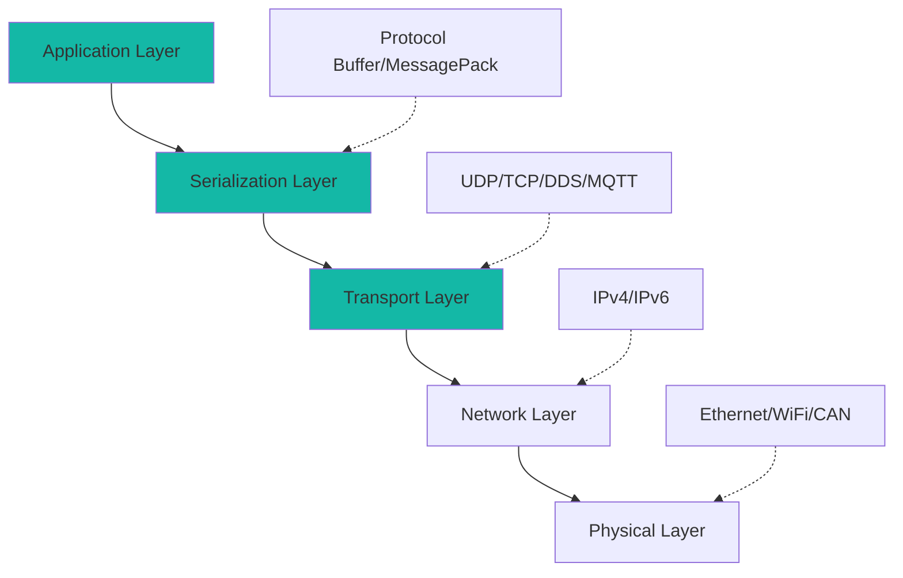
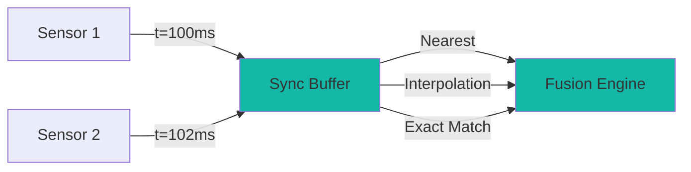

# WIA AI Sensor Fusion Protocol Specification

**Phase 3: Communication Protocol Standard**

**Version**: 1.0.0
**Status**: Draft
**Date**: 2025-01
**Primary Color**: #14B8A6 (Teal)

---

## Overview

### 1.1 Purpose

WIA AI Sensor Fusion Protocol defines low-latency, high-throughput communication protocols for real-time sensor data streaming, time synchronization, and fused output distribution. This protocol enables deterministic sensor fusion in safety-critical and time-sensitive applications.

### 1.2 Scope

- **In Scope**:
  - Binary protocol for sensor data streaming
  - Time synchronization protocols (PTP, NTP)
  - Multi-sensor data synchronization
  - QoS levels and priority handling
  - Transport layer options (UDP, TCP, DDS, MQTT)
  - Compression and serialization

- **Out of Scope**:
  - Algorithm implementations (Phase 2)
  - System integration (Phase 4)

### 1.3 Design Principles

1. **Low-latency**: Sub-millisecond communication
2. **Deterministic**: Predictable timing behavior
3. **Efficient**: Minimal overhead and bandwidth
4. **Synchronized**: Precise temporal alignment
5. **Reliable**: Guaranteed delivery options

---

## Protocol Stack

### 2.1 Architecture



### 2.2 Protocol Layers

| Layer | Protocol | Purpose |
|-------|----------|---------|
| Application | WIA Sensor Fusion | Sensor data and fusion logic |
| Serialization | Protocol Buffer, MessagePack | Efficient encoding |
| Transport | UDP, TCP, DDS, MQTT | Data delivery |
| Network | IPv4, IPv6 | Routing |
| Physical | Ethernet, WiFi, CAN | Hardware interface |

---

## Binary Protocol Format

### 3.1 Message Frame Structure

```
+----------------+----------------+----------------+----------------+
|  Magic Number  |    Version     |  Message Type  |    Flags       |
|   (2 bytes)    |   (1 byte)     |   (1 byte)     |   (1 byte)    |
+----------------+----------------+----------------+----------------+
|                     Sequence Number (4 bytes)                    |
+------------------------------------------------------------------+
|                     Timestamp (8 bytes, nanoseconds)             |
+------------------------------------------------------------------+
|                     Payload Length (4 bytes)                     |
+------------------------------------------------------------------+
|                     Payload (variable)                           |
+------------------------------------------------------------------+
|                     CRC32 Checksum (4 bytes)                     |
+------------------------------------------------------------------+
```

**Total Header Size**: 24 bytes

### 3.2 Magic Number

- Value: `0xWF01` (WIA Fusion 01)
- Purpose: Protocol identification
- Endianness: Little-endian

### 3.3 Message Types

| Type | Code | Description |
|------|------|-------------|
| SENSOR_DATA | 0x01 | Raw sensor data |
| FUSED_OBJECT | 0x02 | Fused object detection |
| FUSED_STATE | 0x03 | Fused state estimate |
| CONFIG | 0x10 | Configuration message |
| HEARTBEAT | 0x20 | Keep-alive message |
| SYNC | 0x30 | Time synchronization |
| ACK | 0xF0 | Acknowledgment |
| NACK | 0xF1 | Negative acknowledgment |

### 3.4 Flags

```
Bit 0: Compressed (1 = compressed, 0 = uncompressed)
Bit 1: Priority (1 = high, 0 = normal)
Bit 2: Reliability (1 = reliable, 0 = best-effort)
Bit 3: Fragment (1 = fragmented, 0 = complete)
Bit 4-7: Reserved
```

---

## Serialization

### 4.1 Protocol Buffer Schema

```protobuf
syntax = "proto3";

package wia.sensor_fusion;

message SensorFrame {
  string sensor_id = 1;
  SensorType sensor_type = 2;
  double timestamp = 3;  // Unix time in seconds
  string frame_id = 4;
  uint64 sequence = 5;

  oneof data {
    CameraData camera = 10;
    LidarData lidar = 11;
    ImuData imu = 12;
    ForceTorqueData force_torque = 13;
    RadarData radar = 14;
  }

  QualityMetrics quality = 20;
}

enum SensorType {
  SENSOR_TYPE_UNKNOWN = 0;
  SENSOR_TYPE_CAMERA = 1;
  SENSOR_TYPE_LIDAR = 2;
  SENSOR_TYPE_IMU = 3;
  SENSOR_TYPE_FORCE_TORQUE = 4;
  SENSOR_TYPE_RADAR = 5;
}

message CameraData {
  Image image = 1;
  repeated Detection detections = 2;
}

message Image {
  string encoding = 1;
  uint32 width = 2;
  uint32 height = 3;
  bytes data = 4;
}

message Detection {
  string class_id = 1;
  float confidence = 2;
  BoundingBox bbox = 3;
}

message BoundingBox {
  uint32 x = 1;
  uint32 y = 2;
  uint32 width = 3;
  uint32 height = 4;
}

message LidarData {
  PointCloud point_cloud = 1;
  repeated Cluster clusters = 2;
}

message PointCloud {
  string format = 1;  // "xyzi", "xyzrgb"
  uint32 num_points = 2;
  bytes data = 3;  // Packed binary data
}

message ImuData {
  Vector3 linear_acceleration = 1;
  Vector3 angular_velocity = 2;
  Quaternion orientation = 3;
  Vector3 magnetometer = 4;
}

message Vector3 {
  double x = 1;
  double y = 2;
  double z = 3;
}

message Quaternion {
  double x = 1;
  double y = 2;
  double z = 3;
  double w = 4;
}

message QualityMetrics {
  string status = 1;  // "good", "degraded", "poor", "failed"
  float confidence = 2;
  float latency_ms = 3;
}

message FusedObject {
  string object_id = 1;
  double timestamp = 2;
  string frame_id = 3;
  string class_name = 4;
  float confidence = 5;
  Pose pose = 6;
  Twist velocity = 7;
  Dimensions dimensions = 8;
  repeated SensorSource sources = 9;
  TrackingInfo tracking = 10;
}

message Pose {
  Vector3 position = 1;
  Quaternion orientation = 2;
  repeated double covariance = 3;  // 6x6 = 36 elements
}

message Twist {
  Vector3 linear = 1;
  Vector3 angular = 2;
}

message Dimensions {
  double length = 1;
  double width = 2;
  double height = 3;
}

message SensorSource {
  string sensor_id = 1;
  float weight = 2;
}

message TrackingInfo {
  uint64 track_id = 1;
  uint32 age_frames = 2;
  uint32 lost_frames = 3;
}
```

### 4.2 MessagePack Alternative

For simpler implementations, MessagePack provides efficient binary serialization:

```python
import msgpack

# Serialize
data = {
    'sensor_id': 'camera_front',
    'sensor_type': 'camera',
    'timestamp': 1704067200.123456789,
    'data': {...}
}
packed = msgpack.packb(data)

# Deserialize
unpacked = msgpack.unpackb(packed)
```

---

## Time Synchronization

### 5.1 Precision Time Protocol (PTP)

**IEEE 1588-2008** for sub-microsecond synchronization.

```yaml
ptp_config:
  domain: 0
  transport: udp_ipv4
  profile: default
  priority1: 128
  priority2: 128
  announce_interval: 1  # seconds
  sync_interval: 0.125  # 8 Hz
  delay_request_interval: 0.125
```

**Setup**:
```bash
# Install PTP daemon
sudo apt install linuxptp

# Configure master
sudo ptp4l -i eth0 -m -S

# Configure slave
sudo ptp4l -i eth0 -m -s
```

### 5.2 Network Time Protocol (NTP)

For less demanding applications (millisecond precision).

```yaml
ntp_config:
  servers:
    - pool.ntp.org
    - time.google.com
  poll_interval: 64  # seconds
```

### 5.3 Timestamp Format

All timestamps use **TAI (International Atomic Time)** or **UTC** with nanosecond precision:

```
Unix timestamp: seconds.nanoseconds
Example: 1704067200.123456789
```

### 5.4 Clock Synchronization Message

```protobuf
message SyncMessage {
  double master_timestamp = 1;
  double slave_timestamp = 2;
  double offset_ns = 3;
  double round_trip_delay_ns = 4;
}
```

---

## Transport Protocols

### 6.1 UDP (Best-Effort, Low Latency)

**Use Case**: High-frequency sensor data (IMU, LIDAR)

```python
import socket

# Sender
sock = socket.socket(socket.AF_INET, socket.SOCK_DGRAM)
sock.sendto(data, ('192.168.1.100', 5000))

# Receiver
sock = socket.socket(socket.AF_INET, socket.SOCK_DGRAM)
sock.bind(('0.0.0.0', 5000))
data, addr = sock.recvfrom(65536)
```

**Configuration**:
```yaml
udp_transport:
  multicast: true
  multicast_address: 239.255.0.1
  port: 5000
  buffer_size: 65536
  send_buffer_size: 1048576
  recv_buffer_size: 1048576
```

### 6.2 TCP (Reliable, Ordered)

**Use Case**: Configuration, calibration data

```python
import socket

# Server
server = socket.socket(socket.AF_INET, socket.SOCK_STREAM)
server.bind(('0.0.0.0', 5001))
server.listen(5)
conn, addr = server.accept()
data = conn.recv(65536)

# Client
client = socket.socket(socket.AF_INET, socket.SOCK_STREAM)
client.connect(('192.168.1.100', 5001))
client.send(data)
```

### 6.3 DDS (Data Distribution Service)

**Use Case**: Real-time, QoS-aware multi-sensor fusion

```xml
<dds>
  <qos_library name="SensorFusionQos">
    <qos_profile name="RealtimeSensor">
      <datareader_qos>
        <reliability>
          <kind>RELIABLE_RELIABILITY_QOS</kind>
        </reliability>
        <history>
          <kind>KEEP_LAST_HISTORY_QOS</kind>
          <depth>10</depth>
        </history>
        <deadline>
          <period>
            <sec>0</sec>
            <nanosec>10000000</nanosec>  <!-- 10ms -->
          </period>
        </deadline>
      </datareader_qos>
    </qos_profile>
  </qos_library>
</dds>
```

**Python DDS Example**:
```python
from cyclonedds.domain import DomainParticipant
from cyclonedds.pub import Publisher, DataWriter
from cyclonedds.topic import Topic

# Create participant
participant = DomainParticipant()

# Create topic
topic = Topic(participant, 'SensorData', SensorFrame)

# Create publisher and writer
publisher = Publisher(participant)
writer = DataWriter(publisher, topic)

# Publish
frame = SensorFrame(sensor_id='camera_front', ...)
writer.write(frame)
```

### 6.4 MQTT (Pub/Sub, IoT)

**Use Case**: Cloud integration, distributed sensors

```yaml
mqtt_config:
  broker: mqtt.wia.live
  port: 1883
  client_id: sensor_fusion_client
  topics:
    sensor_data: wia/sensors/+/data
    fused_objects: wia/fusion/objects
  qos: 1
  retain: false
```

**Python MQTT Example**:
```python
import paho.mqtt.client as mqtt

def on_message(client, userdata, msg):
    data = msgpack.unpackb(msg.payload)
    print(f"Received from {msg.topic}: {data}")

client = mqtt.Client()
client.on_message = on_message
client.connect("mqtt.wia.live", 1883)
client.subscribe("wia/sensors/+/data")
client.loop_forever()
```

---

## QoS and Priority Levels

### 7.1 Quality of Service Levels

| Level | Name | Description | Use Case |
|-------|------|-------------|----------|
| 0 | Best-Effort | No guarantees | Non-critical telemetry |
| 1 | Reliable | Guaranteed delivery | Configuration |
| 2 | Real-Time | Bounded latency | Safety-critical sensors |
| 3 | Mission-Critical | Highest priority + redundancy | Emergency stop |

### 7.2 Priority Mapping

```python
class Priority:
    LOW = 0
    NORMAL = 1
    HIGH = 2
    CRITICAL = 3

priority_to_tos = {
    Priority.LOW: 0x00,
    Priority.NORMAL: 0x20,
    Priority.HIGH: 0x40,
    Priority.CRITICAL: 0x60
}

# Set socket priority
sock.setsockopt(socket.IPPROTO_IP, socket.IP_TOS, priority_to_tos[Priority.HIGH])
```

---

## Multi-Sensor Synchronization

### 8.1 Synchronization Methods



### 8.2 Nearest Timestamp

```python
def sync_nearest(sensor_data: Dict[str, List], target_time: float, max_diff_ms: float):
    """
    Synchronize sensors by selecting nearest timestamp.
    """
    synced = {}

    for sensor_id, frames in sensor_data.items():
        # Find nearest frame
        nearest = min(frames, key=lambda f: abs(f.timestamp - target_time))

        # Check time difference
        diff_ms = abs(nearest.timestamp - target_time) * 1000
        if diff_ms <= max_diff_ms:
            synced[sensor_id] = nearest

    return synced
```

### 8.3 Linear Interpolation

```python
def sync_interpolate(sensor_data: Dict[str, List], target_time: float):
    """
    Synchronize sensors using linear interpolation.
    """
    synced = {}

    for sensor_id, frames in sensor_data.items():
        # Find frames before and after target time
        before = [f for f in frames if f.timestamp <= target_time]
        after = [f for f in frames if f.timestamp > target_time]

        if before and after:
            f1 = before[-1]
            f2 = after[0]

            # Interpolate
            alpha = (target_time - f1.timestamp) / (f2.timestamp - f1.timestamp)
            synced[sensor_id] = interpolate_frame(f1, f2, alpha)

    return synced
```

### 8.4 Exact Match

```python
def sync_exact(sensor_data: Dict[str, List], target_time: float, tolerance_ns: float = 1000):
    """
    Synchronize sensors requiring exact timestamp match.
    """
    synced = {}

    for sensor_id, frames in sensor_data.items():
        for frame in frames:
            if abs(frame.timestamp - target_time) * 1e9 <= tolerance_ns:
                synced[sensor_id] = frame
                break

    return synced
```

---

## Compression

### 9.1 Point Cloud Compression

```python
import zlib
import numpy as np

def compress_point_cloud(points: np.ndarray) -> bytes:
    """
    Compress LIDAR point cloud using zlib.
    """
    # Convert to bytes
    points_bytes = points.tobytes()

    # Compress
    compressed = zlib.compress(points_bytes, level=6)

    return compressed

def decompress_point_cloud(compressed: bytes, dtype, shape) -> np.ndarray:
    """
    Decompress LIDAR point cloud.
    """
    decompressed = zlib.decompress(compressed)
    points = np.frombuffer(decompressed, dtype=dtype).reshape(shape)
    return points
```

### 9.2 Image Compression

```python
import cv2

def compress_image(image: np.ndarray, quality: int = 85) -> bytes:
    """
    Compress image using JPEG.
    """
    encode_param = [int(cv2.IMWRITE_JPEG_QUALITY), quality]
    _, encoded = cv2.imencode('.jpg', image, encode_param)
    return encoded.tobytes()

def decompress_image(compressed: bytes) -> np.ndarray:
    """
    Decompress JPEG image.
    """
    decoded = cv2.imdecode(np.frombuffer(compressed, np.uint8), cv2.IMREAD_COLOR)
    return decoded
```

---

## Heartbeat and Keep-Alive

### 10.1 Heartbeat Protocol

```python
import threading
import time

class HeartbeatManager:
    def __init__(self, interval_s: float = 1.0):
        self.interval = interval_s
        self.last_heartbeat = {}
        self.running = True

    def start(self):
        thread = threading.Thread(target=self._heartbeat_loop)
        thread.daemon = True
        thread.start()

    def _heartbeat_loop(self):
        while self.running:
            # Send heartbeat
            heartbeat = {
                'type': 'heartbeat',
                'timestamp': time.time()
            }
            self.send(heartbeat)
            time.sleep(self.interval)

    def check_timeout(self, sensor_id: str, timeout_s: float) -> bool:
        last = self.last_heartbeat.get(sensor_id, 0)
        return (time.time() - last) > timeout_s
```

---

## Error Handling and Recovery

### 11.1 Packet Loss Detection

```python
class SequenceChecker:
    def __init__(self):
        self.last_sequence = {}

    def check(self, sensor_id: str, sequence: int) -> int:
        """
        Returns number of lost packets.
        """
        last = self.last_sequence.get(sensor_id, sequence - 1)
        lost = sequence - last - 1
        self.last_sequence[sensor_id] = sequence
        return lost
```

### 11.2 Retransmission

```python
class ReliableTransport:
    def __init__(self):
        self.pending_acks = {}
        self.retry_count = 3
        self.timeout_ms = 100

    def send_reliable(self, data: bytes, seq: int):
        # Send with retry
        for i in range(self.retry_count):
            self.send(data)

            # Wait for ACK
            if self.wait_for_ack(seq, self.timeout_ms):
                return True

        return False  # Failed after retries
```

---

## Performance Benchmarks

### 12.1 Latency Targets

| Transport | Typical Latency | Max Latency |
|-----------|----------------|-------------|
| UDP (LAN) | 0.5 ms | 2 ms |
| TCP (LAN) | 1 ms | 5 ms |
| DDS (LAN) | 1 ms | 3 ms |
| MQTT (LAN) | 5 ms | 20 ms |
| MQTT (WAN) | 50 ms | 200 ms |

### 12.2 Throughput

| Data Type | Size | Rate | Bandwidth |
|-----------|------|------|-----------|
| IMU | 100 bytes | 1000 Hz | 0.8 Mbps |
| Camera (compressed) | 50 KB | 30 Hz | 12 Mbps |
| LIDAR | 1 MB | 10 Hz | 80 Mbps |
| Fused Objects | 1 KB | 20 Hz | 0.16 Mbps |

---

## Related Specifications

- [PHASE-1-DATA-FORMAT.md](./PHASE-1-DATA-FORMAT.md) - Data format schemas
- [PHASE-2-API-INTERFACE.md](./PHASE-2-API-INTERFACE.md) - REST API interface
- [PHASE-4-INTEGRATION.md](./PHASE-4-INTEGRATION.md) - System integration

---

**Document Version**: 1.0.0
**Last Updated**: 2025-01
**Author**: WIA AI Sensor Fusion Working Group

---

弘益人間 - *Benefit All Humanity*
