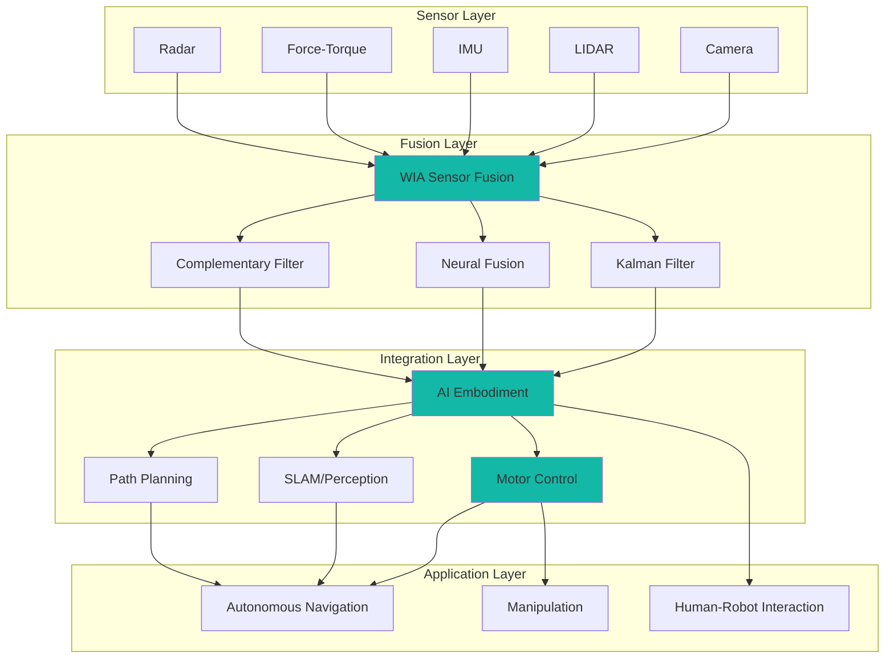
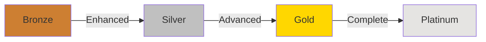

# WIA AI Sensor Fusion Integration Specification

**Phase 4: Ecosystem Integration Standard**

**Version**: 1.0.0
**Status**: Draft
**Date**: 2025-01
**Primary Color**: #14B8A6 (Teal)

---

## Overview

### 1.1 Purpose

WIA AI Sensor Fusion Integration defines standards for integrating multi-modal sensor fusion with AI systems, robotics platforms, and perception pipelines. This specification enables seamless interoperability across the WIA ecosystem and external frameworks.

### 1.2 Scope

- **In Scope**:
  - Integration with WIA AI Embodiment
  - Integration with WIA AI Motor Control
  - Integration with perception systems (computer vision, SLAM)
  - ROS/ROS2 integration
  - Isaac Sim integration
  - Digital Twin integration
  - Safety and compliance frameworks

- **Out of Scope**:
  - Algorithm implementations (covered in Phase 2)
  - Hardware specifications

### 1.3 Design Principles

1. **Interoperable**: Seamless integration across systems
2. **Modular**: Plug-and-play architecture
3. **Safe**: Built-in safety guarantees
4. **Scalable**: From single robot to fleet management
5. **Standards-compliant**: ISO, ROS, IEC compliance

---

## Integration Architecture

### 2.1 System Overview



---

## AI Embodiment Integration

### 3.1 Overview

Integration with WIA AI Embodiment enables sensor fusion to inform embodied AI decision-making and state estimation.

### 3.2 Data Flow

```typescript
// TypeScript Integration Example
import { SensorFusionClient } from '@wia/sensor-fusion';
import { EmbodimentClient } from '@wia/ai-embodiment';

const fusion = new SensorFusionClient({ apiKey: 'key' });
const embodiment = new EmbodimentClient({ apiKey: 'key' });

// Subscribe to fused state
const stateStream = fusion.fusion.streamState('my_fusion');

stateStream.on('data', async (fusedState) => {
  // Update embodiment state
  await embodiment.state.update({
    pose: fusedState.pose,
    velocity: fusedState.velocity,
    acceleration: fusedState.acceleration,
    timestamp: fusedState.timestamp
  });

  // Get AI decision based on fused perception
  const decision = await embodiment.inference.predict({
    state: fusedState,
    goal: currentGoal
  });

  console.log('AI Decision:', decision);
});
```

### 3.3 Object Detection Integration

```python
from wia_sensor_fusion import SensorFusionClient
from wia_ai_embodiment import EmbodimentClient

fusion = SensorFusionClient(api_key='key')
embodiment = EmbodimentClient(api_key='key')

# Stream fused objects
async for objects in fusion.fusion.stream_objects('my_fusion'):
    # Filter relevant objects
    humans = [obj for obj in objects if obj.class_name == 'person']

    # Update embodiment world model
    await embodiment.world_model.update_objects(humans)

    # Plan path avoiding humans
    path = await embodiment.planner.plan_path(
        start=current_pose,
        goal=target_pose,
        obstacles=humans
    )
```

### 3.4 Uncertainty Propagation

```python
# Propagate sensor fusion uncertainty to AI decision-making
fused_object = {
    'pose': {
        'position': {'x': 2.8, 'y': 0.5, 'z': 0.0},
        'covariance': [0.01, 0.0, ..., 0.001]  # 6x6 covariance
    },
    'confidence': 0.94
}

# AI Embodiment uses uncertainty for risk-aware planning
decision = embodiment.planner.plan_with_uncertainty(
    object_pose=fused_object['pose'],
    confidence=fused_object['confidence'],
    risk_threshold=0.8
)
```

---

## Motor Control Integration

### 4.1 Overview

Integration with WIA AI Motor Control enables sensor-guided motion control and force feedback.

### 4.2 Visual Servoing

```python
from wia_sensor_fusion import SensorFusionClient
from wia_motor_control import MotorController

fusion = SensorFusionClient(api_key='key')
motors = MotorController(api_key='key')

# Visual servoing loop
async def visual_servoing():
    while True:
        # Get fused object position from camera + LIDAR
        objects = await fusion.fusion.query_objects(
            config_id='my_fusion',
            class_name='target_object',
            latest=True
        )

        if not objects:
            continue

        target = objects[0]

        # Compute error
        current_pose = await motors.get_end_effector_pose()
        error = compute_error(current_pose, target.pose)

        # Control law (PID)
        velocity_command = pid_controller.compute(error)

        # Send to motor controller
        await motors.command_velocity(velocity_command)

        await asyncio.sleep(0.01)  # 100 Hz control loop
```

### 4.3 Force-Guided Assembly

```python
# Integrate force-torque sensor fusion with motor control
async def force_guided_insertion():
    while True:
        # Get fused force-torque data
        ft_data = await fusion.sensors.get_latest('ft_wrist')

        # Check force threshold
        if ft_data.force.z > CONTACT_FORCE_THRESHOLD:
            # Contact detected, switch to compliance control
            await motors.set_control_mode('impedance')
            await motors.set_impedance(
                stiffness={'x': 1000, 'y': 1000, 'z': 100},  # Low Z stiffness
                damping={'x': 50, 'y': 50, 'z': 10}
            )

        # Use fused force for precise insertion
        insertion_depth = integrate_force(ft_data.force.z)

        if insertion_depth >= TARGET_DEPTH:
            await motors.stop()
            break

        await asyncio.sleep(0.001)  # 1 kHz control
```

### 4.4 Collision Avoidance

```python
# Real-time collision avoidance using fused sensor data
async def collision_avoidance():
    while True:
        # Get fused objects from all sensors
        objects = await fusion.fusion.query_objects(
            config_id='my_fusion',
            latest=True
        )

        # Check proximity to any object
        for obj in objects:
            distance = compute_distance(current_pose, obj.pose)

            if distance < SAFETY_DISTANCE:
                # Emergency stop
                await motors.emergency_stop()
                print(f"Collision avoided with {obj.class_name}")
                break

        await asyncio.sleep(0.01)  # 100 Hz
```

---

## Perception System Integration

### 5.1 SLAM Integration

```python
from wia_sensor_fusion import SensorFusionClient
import rclpy
from nav_msgs.msg import Odometry
from sensor_msgs.msg import PointCloud2

class SLAMIntegration:
    def __init__(self):
        self.fusion = SensorFusionClient(api_key='key')
        self.node = rclpy.create_node('slam_fusion_bridge')

        # Publishers
        self.odom_pub = self.node.create_publisher(Odometry, '/odometry', 10)
        self.cloud_pub = self.node.create_publisher(PointCloud2, '/point_cloud', 10)

    async def run(self):
        # Get fused IMU + LIDAR odometry
        async for state in self.fusion.fusion.stream_state('slam_fusion'):
            # Publish odometry from fused state
            odom = Odometry()
            odom.header.stamp = self.node.get_clock().now().to_msg()
            odom.header.frame_id = 'world'
            odom.pose.pose.position.x = state.pose.position.x
            odom.pose.pose.position.y = state.pose.position.y
            odom.pose.pose.position.z = state.pose.position.z
            odom.twist.twist.linear.x = state.velocity.linear.x
            odom.twist.twist.linear.y = state.velocity.linear.y
            odom.twist.twist.linear.z = state.velocity.linear.z

            self.odom_pub.publish(odom)

        # Get fused LIDAR point cloud
        async for lidar_data in self.fusion.sensors.stream('lidar_fused'):
            # Convert to ROS PointCloud2
            cloud_msg = self.convert_to_pointcloud2(lidar_data)
            self.cloud_pub.publish(cloud_msg)
```

### 5.2 Object Tracking

```python
# Multi-sensor object tracking with fusion
class MultiSensorTracker:
    def __init__(self):
        self.fusion = SensorFusionClient(api_key='key')
        self.tracks = {}

    async def track_objects(self):
        async for objects in self.fusion.fusion.stream_objects('tracking_fusion'):
            for obj in objects:
                track_id = obj.tracking.track_id

                if track_id not in self.tracks:
                    # New track
                    self.tracks[track_id] = Track(obj)
                else:
                    # Update existing track
                    self.tracks[track_id].update(obj)

                # Predict next position
                predicted = self.tracks[track_id].predict(dt=0.1)
                print(f"Track {track_id} predicted at {predicted}")
```

---

## ROS/ROS2 Integration

### 6.1 ROS2 Bridge

```python
import rclpy
from rclpy.node import Node
from sensor_msgs.msg import Image, PointCloud2, Imu
from geometry_msgs.msg import PoseStamped
from wia_sensor_fusion import SensorFusionClient

class WIASensorFusionBridge(Node):
    def __init__(self):
        super().__init__('wia_sensor_fusion_bridge')

        # WIA Client
        self.fusion = SensorFusionClient(api_key='key')

        # ROS2 Publishers
        self.fused_pose_pub = self.create_publisher(
            PoseStamped,
            '/wia/fusion/pose',
            10
        )

        # ROS2 Subscribers
        self.camera_sub = self.create_subscription(
            Image,
            '/camera/image_raw',
            self.camera_callback,
            10
        )

        self.lidar_sub = self.create_subscription(
            PointCloud2,
            '/lidar/points',
            self.lidar_callback,
            10
        )

    def camera_callback(self, msg):
        # Convert ROS2 Image to WIA format
        wia_frame = self.ros_image_to_wia(msg)

        # Send to WIA Sensor Fusion
        self.fusion.sensors.publish('camera_front', wia_frame)

    def lidar_callback(self, msg):
        # Convert ROS2 PointCloud2 to WIA format
        wia_frame = self.ros_pointcloud_to_wia(msg)

        # Send to WIA Sensor Fusion
        self.fusion.sensors.publish('lidar_top', wia_frame)

    async def publish_fused_state(self):
        async for state in self.fusion.fusion.stream_state('ros_fusion'):
            # Convert WIA state to ROS2 PoseStamped
            pose_msg = PoseStamped()
            pose_msg.header.stamp = self.get_clock().now().to_msg()
            pose_msg.header.frame_id = 'world'
            pose_msg.pose.position.x = state.pose.position.x
            pose_msg.pose.position.y = state.pose.position.y
            pose_msg.pose.position.z = state.pose.position.z
            pose_msg.pose.orientation.x = state.pose.orientation.x
            pose_msg.pose.orientation.y = state.pose.orientation.y
            pose_msg.pose.orientation.z = state.pose.orientation.z
            pose_msg.pose.orientation.w = state.pose.orientation.w

            self.fused_pose_pub.publish(pose_msg)

def main():
    rclpy.init()
    bridge = WIASensorFusionBridge()
    rclpy.spin(bridge)
```

---

## Isaac Sim Integration

### 6.2 Isaac Sim Digital Twin

```python
from omni.isaac.core import World
from omni.isaac.sensor import Camera, LidarRtx, IMUSensor
from wia_sensor_fusion import SensorFusionClient

class IsaacSimFusion:
    def __init__(self):
        self.world = World(stage_units_in_meters=1.0)
        self.fusion = SensorFusionClient(api_key='key')

        # Create virtual sensors
        self.camera = Camera(prim_path="/World/Camera")
        self.lidar = LidarRtx(prim_path="/World/Lidar")
        self.imu = IMUSensor(prim_path="/World/IMU")

    async def run_simulation(self):
        while True:
            # Step simulation
            self.world.step(render=True)

            # Get sensor data from Isaac Sim
            camera_data = self.camera.get_rgb()
            lidar_data = self.lidar.get_point_cloud()
            imu_data = self.imu.get_sensor_reading()

            # Send to WIA Sensor Fusion
            await self.fusion.sensors.publish('sim_camera', {
                'image': camera_data,
                'timestamp': self.world.get_current_time()
            })

            await self.fusion.sensors.publish('sim_lidar', {
                'point_cloud': lidar_data,
                'timestamp': self.world.get_current_time()
            })

            # Get fused output
            fused_state = await self.fusion.fusion.get_state('sim_fusion', latest=True)

            # Apply to robot in simulation
            robot_prim = self.world.scene.get_object("robot")
            robot_prim.set_world_pose(
                position=[fused_state.pose.position.x,
                         fused_state.pose.position.y,
                         fused_state.pose.position.z],
                orientation=[fused_state.pose.orientation.w,
                            fused_state.pose.orientation.x,
                            fused_state.pose.orientation.y,
                            fused_state.pose.orientation.z]
            )
```

---

## Certification Levels

### 7.1 Certification Overview

WIA AI Sensor Fusion systems can achieve four certification levels based on compliance with standards and capabilities.



### 7.2 Bronze Certification

**Requirements**: Basic multi-sensor fusion with minimal safety features

| Category | Requirement | Status |
|----------|-------------|--------|
| **Data Format** | Implement Phase 1 schemas | Required |
| **API** | Basic REST API | Required |
| **Protocol** | UDP or TCP communication | Required |
| **Sensors** | 2-3 sensor types | Required |
| **Fusion** | One fusion algorithm | Required |
| **Latency** | < 100ms end-to-end | Required |
| **Synchronization** | Nearest timestamp | Required |

**Checklist**:

- [ ] Implement SensorFrame schema (Phase 1)
- [ ] Implement FusedObject schema (Phase 1)
- [ ] Support at least 2 sensor types (e.g., Camera + IMU)
- [ ] Implement basic REST API endpoints
- [ ] Implement one fusion algorithm (e.g., Complementary Filter)
- [ ] Timestamp synchronization (nearest method)
- [ ] End-to-end latency < 100ms
- [ ] Sensor registration API
- [ ] Basic data validation
- [ ] Error handling for sensor failures
- [ ] API documentation available
- [ ] Simple calibration support
- [ ] Health monitoring API
- [ ] Basic logging
- [ ] Configuration file support
- [ ] Single-threaded operation acceptable
- [ ] Manual calibration process
- [ ] Basic uncertainty quantification
- [ ] Support 1-2 concurrent sensors
- [ ] WebSocket data streaming
- [ ] JSON serialization

**Use Cases**: Educational robots, simple autonomous vehicles, research platforms

### 7.3 Silver Certification

**Requirements**: Multi-modal fusion with enhanced safety and real-time performance

| Category | Requirement | Status |
|----------|-------------|--------|
| **Data Format** | Full Phase 1 compliance | Required |
| **API** | Full Phase 2 REST API + WebSocket | Required |
| **Protocol** | Real-time UDP + reliability | Required |
| **Sensors** | 4-6 sensor types | Required |
| **Fusion** | Multiple fusion algorithms | Required |
| **Latency** | < 20ms end-to-end | Required |
| **Synchronization** | Interpolation support | Required |
| **Time Sync** | NTP synchronization | Required |
| **Integration** | One WIA standard integration | Required |

**Checklist**:

- [ ] All Bronze requirements met
- [ ] Support 4+ sensor types (Camera, LIDAR, IMU, Force-Torque)
- [ ] Implement Kalman Filter fusion
- [ ] Implement Complementary Filter fusion
- [ ] Linear interpolation for synchronization
- [ ] NTP time synchronization (< 10ms accuracy)
- [ ] Binary protocol support (Protocol Buffer)
- [ ] End-to-end latency < 20ms
- [ ] Multi-threaded sensor processing
- [ ] Automatic sensor calibration
- [ ] Coordinate frame transformations
- [ ] Extrinsic calibration API
- [ ] Quality metrics per sensor
- [ ] Sensor timeout detection
- [ ] Automatic reconnection
- [ ] Integration with one WIA standard (e.g., Motor Control)
- [ ] Real-time WebSocket streaming
- [ ] Object tracking support
- [ ] Uncertainty covariance propagation
- [ ] Performance metrics API
- [ ] Support 5-10 concurrent sensors
- [ ] MessagePack serialization option
- [ ] Basic compression support
- [ ] Configurable QoS levels

**Use Cases**: Autonomous drones, industrial robots, mobile manipulation

### 7.4 Gold Certification

**Requirements**: Advanced fusion with AI integration and comprehensive safety

| Category | Requirement | Status |
|----------|-------------|--------|
| **Data Format** | Phase 1 + Binary formats | Required |
| **API** | Full Phase 2 + SDK | Required |
| **Protocol** | Full Phase 3 protocol | Required |
| **Sensors** | 8+ sensor types | Required |
| **Fusion** | Advanced algorithms (Neural) | Required |
| **Latency** | < 5ms end-to-end | Required |
| **Time Sync** | PTP synchronization | Required |
| **AI Integration** | AI Embodiment integration | Required |
| **Safety** | ISO 26262 ASIL-B compliance | Required |
| **Integration** | 2+ WIA standards | Required |

**Checklist**:

- [ ] All Silver requirements met
- [ ] Support 8+ sensor types (all modalities)
- [ ] Neural network fusion algorithm
- [ ] Extended Kalman Filter (EKF)
- [ ] Unscented Kalman Filter (UKF)
- [ ] Particle Filter option
- [ ] PTP time synchronization (< 1μs accuracy)
- [ ] DDS protocol support
- [ ] End-to-end latency < 5ms
- [ ] Hardware-accelerated processing (GPU/FPGA)
- [ ] Real-time operating system (RTOS)
- [ ] Advanced object tracking (multi-hypothesis)
- [ ] SLAM integration
- [ ] AI Embodiment integration
- [ ] Motor Control integration
- [ ] ROS2 bridge implementation
- [ ] Isaac Sim integration
- [ ] Digital Twin support
- [ ] Sensor fault detection and isolation
- [ ] Redundant sensor support
- [ ] ISO 26262 ASIL-B compliance
- [ ] Comprehensive test suite
- [ ] TypeScript SDK
- [ ] Python SDK
- [ ] Support 20+ concurrent sensors
- [ ] Advanced compression (point cloud)
- [ ] Priority-based QoS

**Use Cases**: Autonomous vehicles, collaborative robots, surgical robots

### 7.5 Platinum Certification

**Requirements**: Complete ecosystem integration with highest safety standards

| Category | Requirement | Status |
|----------|-------------|--------|
| **Data Format** | Full Phase 1 compliance | Required |
| **API** | Full Phase 2 + Custom | Required |
| **Protocol** | Full Phase 3 + EtherCAT | Required |
| **Sensors** | 15+ sensor types | Required |
| **Fusion** | All algorithms + Custom | Required |
| **Latency** | < 1ms end-to-end | Required |
| **Time Sync** | PTP with redundancy | Required |
| **AI Integration** | Full ecosystem integration | Required |
| **Safety** | ISO 26262 ASIL-D compliance | Required |
| **Certification** | Third-party safety cert | Required |

**Checklist**:

- [ ] All Gold requirements met
- [ ] Support 15+ sensor types (all modalities + custom)
- [ ] Custom fusion algorithms
- [ ] Adaptive fusion weights
- [ ] Learning-based sensor fusion
- [ ] Multi-level fusion (low/mid/high level)
- [ ] Redundant PTP synchronization
- [ ] Sub-microsecond time accuracy
- [ ] EtherCAT protocol support
- [ ] TSN (Time-Sensitive Networking)
- [ ] End-to-end latency < 1ms
- [ ] Deterministic real-time guarantees
- [ ] Full AI Embodiment integration
- [ ] Full Motor Control integration
- [ ] BCI integration support
- [ ] Smart Wheelchair integration
- [ ] Multi-modal perception fusion
- [ ] Semantic SLAM
- [ ] 3D object reconstruction
- [ ] Scene understanding
- [ ] ROS2 full integration
- [ ] MoveIt integration
- [ ] Isaac Sim full integration
- [ ] URDF/SDF model support
- [ ] ISO 26262 ASIL-D compliance
- [ ] IEC 61508 SIL 3 compliance
- [ ] Third-party safety certification (TÜV, UL)
- [ ] Redundant safety systems
- [ ] Fail-operational architecture
- [ ] Comprehensive diagnostics
- [ ] Fleet management
- [ ] Cloud integration
- [ ] Edge computing support
- [ ] Support 50+ concurrent sensors
- [ ] Hardware acceleration (GPU/FPGA/ASIC)
- [ ] Multi-robot coordination
- [ ] V2X communication support

**Use Cases**: Autonomous vehicles (L4/L5), space robotics, critical infrastructure

---

## Compliance Testing

### 8.1 Test Suites

```typescript
interface ComplianceTest {
  test_id: string;
  certification_level: 'bronze' | 'silver' | 'gold' | 'platinum';
  category: string;
  description: string;
  pass_criteria: string;
}

const tests: ComplianceTest[] = [
  {
    test_id: 'SF-001',
    certification_level: 'bronze',
    category: 'Latency',
    description: 'End-to-end latency test',
    pass_criteria: 'Latency < 100ms for 95% of samples'
  },
  {
    test_id: 'SF-002',
    certification_level: 'silver',
    category: 'Synchronization',
    description: 'Multi-sensor synchronization accuracy',
    pass_criteria: 'Sync error < 5ms for all sensors'
  },
  {
    test_id: 'SF-003',
    certification_level: 'gold',
    category: 'Time Sync',
    description: 'PTP synchronization accuracy',
    pass_criteria: 'Time sync error < 1μs'
  }
];
```

### 8.2 Performance Benchmarks

| Test | Metric | Bronze | Silver | Gold | Platinum |
|------|--------|--------|--------|------|----------|
| Latency | End-to-end | < 100ms | < 20ms | < 5ms | < 1ms |
| Throughput | Sensors | 2-3 | 4-6 | 8+ | 15+ |
| Sync Accuracy | Time error | < 50ms | < 5ms | < 1ms | < 1μs |
| Fusion Rate | Hz | 10+ | 50+ | 100+ | 1000+ |
| Reliability | Uptime | 95% | 99% | 99.9% | 99.99% |

---

## Safety and Compliance

### 9.1 Safety Standards

- **ISO 26262**: Automotive functional safety (ASIL-B for Gold, ASIL-D for Platinum)
- **IEC 61508**: Functional safety (SIL 2 for Gold, SIL 3 for Platinum)
- **ISO 13849**: Safety of machinery (PLd for Gold, PLe for Platinum)
- **ISO 21448**: SOTIF (Safety of the Intended Functionality)

### 9.2 Safety Monitoring

```python
class SafetyMonitor:
    def __init__(self):
        self.fusion = SensorFusionClient(api_key='key')
        self.safety_state = 'normal'

    async def monitor(self):
        while True:
            # Check sensor health
            sensors = await self.fusion.sensors.list()
            failed_sensors = [s for s in sensors if s.status != 'active']

            if len(failed_sensors) > REDUNDANCY_THRESHOLD:
                self.safety_state = 'degraded'
                await self.trigger_safe_mode()

            # Check fusion quality
            status = await self.fusion.fusion.get_status('safety_fusion')

            if status.performance.latency_ms > MAX_LATENCY_MS:
                self.safety_state = 'critical'
                await self.emergency_stop()

            await asyncio.sleep(0.01)  # 100 Hz monitoring
```

---

## Related Specifications

- [PHASE-1-DATA-FORMAT.md](./PHASE-1-DATA-FORMAT.md) - Data format schemas
- [PHASE-2-API-INTERFACE.md](./PHASE-2-API-INTERFACE.md) - REST API interface
- [PHASE-3-PROTOCOL.md](./PHASE-3-PROTOCOL.md) - Communication protocol

---

**Document Version**: 1.0.0
**Last Updated**: 2025-01
**Author**: WIA AI Sensor Fusion Working Group

---

弘益人間 - *Benefit All Humanity*
