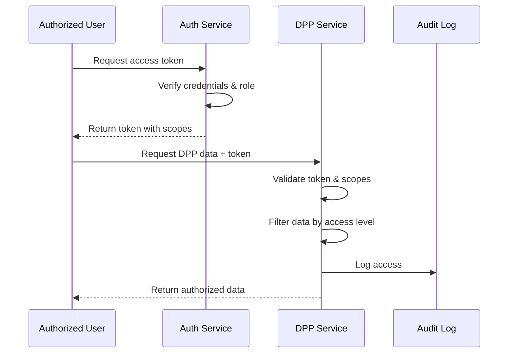
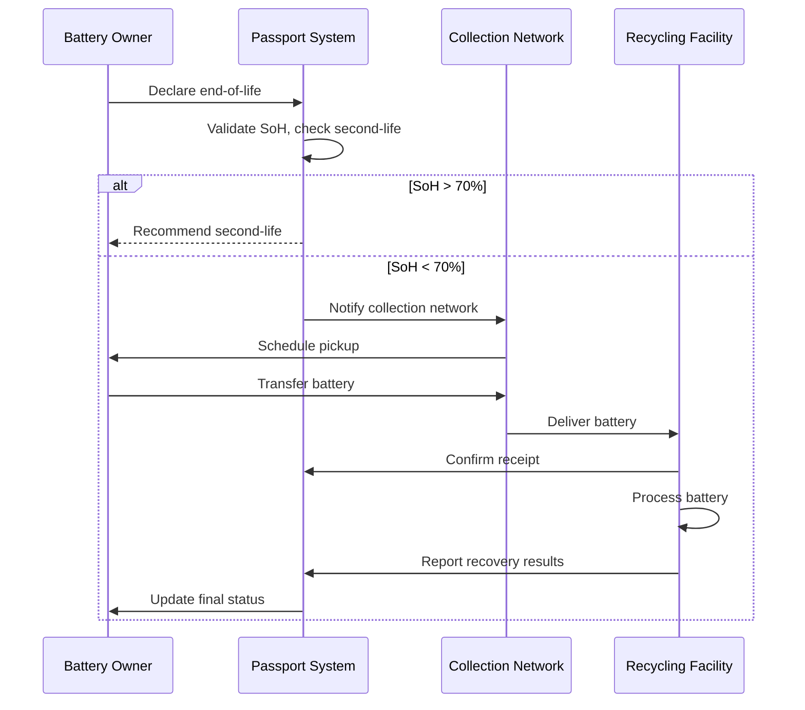
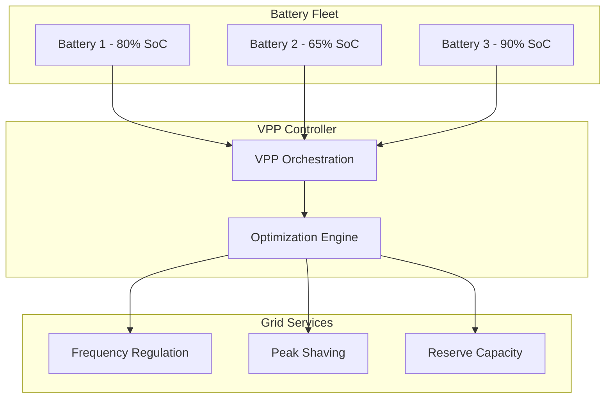

# WIA Battery Passport Integration Standard
## Phase 4 Specification

---

**Version**: 1.0.0
**Status**: Draft
**Date**: 2025-01
**Authors**: WIA Standards Committee
**License**: MIT
**Primary Color**: #22C55E (Green)

---

## Table of Contents

1. [Overview](#overview)
2. [Terminology](#terminology)
3. [EU Battery Regulation Integration](#eu-battery-regulation-integration)
4. [Recycling Systems Integration](#recycling-systems-integration)
5. [Carbon Credit Integration](#carbon-credit-integration)
6. [Supply Chain Platforms](#supply-chain-platforms)
7. [Energy Management Systems](#energy-management-systems)
8. [Vehicle Integration](#vehicle-integration)
9. [Regulatory Compliance](#regulatory-compliance)
10. [Circular Economy](#circular-economy)
11. [Integration Patterns](#integration-patterns)
12. [Certification Levels](#certification-levels)
13. [Implementation Checklist](#implementation-checklist)
14. [References](#references)

---

## Overview

### 1.1 Purpose

The WIA Battery Passport Integration Standard defines comprehensive integration patterns for connecting battery passport systems with EU regulatory frameworks, recycling infrastructure, carbon credit markets, and circular economy platforms. This Phase 4 specification completes the WIA Battery Passport standard by enabling seamless interoperability across the entire battery ecosystem.

**Core Objectives**:
- Ensure full compliance with EU Battery Regulation 2023/1542
- Enable integration with recycling and material recovery systems
- Facilitate carbon credit generation and trading from battery lifecycle
- Connect with supply chain transparency platforms
- Support circular economy business models
- Enable regulatory reporting and compliance automation
- Integrate with vehicle and energy management systems

### 1.2 Scope

This standard covers:

| Domain | Description |
|--------|-------------|
| EU Compliance | Digital Product Passport (DPP), Battery Regulation 2023/1542 |
| Recycling Integration | Collection, dismantling, material recovery systems |
| Carbon Markets | Carbon footprint verification, credit generation, trading |
| Supply Chain | ERP, blockchain, traceability platforms |
| Energy Systems | Battery energy storage (BESS), grid integration |
| Vehicle Systems | EV platforms, fleet management, telematics |
| Circular Economy | Second-life marketplaces, sharing platforms |

### 1.3 Integration Architecture

```mermaid
graph TB
    subgraph "WIA Battery Passport Platform"
        CORE[Passport Core]
        API[Public API]
        BC[Blockchain Layer]
    end

    subgraph "EU Regulatory"
        DPP[Digital Product Passport]
        EUDAC[EU Data Access]
        CUSTOMS[Customs Systems]
    end

    subgraph "Recycling Ecosystem"
        COLLECT[Collection Network]
        DISMANTLE[Dismantling Facilities]
        RECOVERY[Material Recovery]
    end

    subgraph "Carbon Markets"
        VERIFY[Carbon Verifiers]
        REGISTRY[Credit Registry]
        EXCHANGE[Trading Platform]
    end

    subgraph "Supply Chain"
        ERP[ERP Systems]
        SCM[Supply Chain Management]
        TRACE[Traceability Platforms]
    end

    subgraph "Energy & Vehicles"
        BESS[Energy Storage Systems]
        EV[Electric Vehicles]
        FLEET[Fleet Management]
    end

    CORE --> API
    CORE --> BC

    API <-->|Compliance Data| DPP
    API <-->|Reporting| EUDAC
    API <-->|Import/Export| CUSTOMS

    API <-->|EOL Notifications| COLLECT
    API <-->|Recovery Data| DISMANTLE
    API <-->|Material Results| RECOVERY

    API <-->|Footprint Data| VERIFY
    API <-->|Issue Credits| REGISTRY
    API <-->|Trade Credits| EXCHANGE

    API <-->|Manufacturing Data| ERP
    API <-->|Logistics| SCM
    API <-->|Traceability| TRACE

    API <-->|Telemetry| BESS
    API <-->|BMS Data| EV
    API <-->|Analytics| FLEET
```



---

## Terminology

### 2.1 Core Terms

| Term | Definition |
|------|------------|
| **DPP** | Digital Product Passport - EU-mandated digital record |
| **EU Battery Regulation** | Regulation 2023/1542 on batteries and waste batteries |
| **Extended Producer Responsibility (EPR)** | Manufacturer responsibility for end-of-life |
| **Material Recovery Rate** | Percentage of materials recovered from recycling |
| **Carbon Credit** | Tradable certificate representing CO2 reduction |
| **Second-Life** | Repurposing batteries for new applications |
| **Circular Economy** | Economic system eliminating waste through reuse |

### 2.2 Regulatory Terms

| Term | Definition |
|------|------------|
| **CE Marking** | European conformity certification |
| **REACH** | EU chemical regulation |
| **RoHS** | Restriction of Hazardous Substances |
| **WEEE** | Waste Electrical and Electronic Equipment Directive |
| **Due Diligence** | Supply chain risk assessment requirement |

---

## EU Battery Regulation Integration

### 3.1 Digital Product Passport (DPP) Requirements

The EU Battery Regulation mandates a Digital Product Passport for all batteries >2kWh from 2027.

**Required Information:**

| Category | Data Elements |
|----------|---------------|
| **Identity** | Manufacturer, model, serial number, production date |
| **Composition** | Chemistry, materials, hazardous substances |
| **Performance** | Capacity, power, cycle life, SoH |
| **Carbon Footprint** | Cradle-to-gate emissions, methodology |
| **Supply Chain** | Material sourcing, due diligence results |
| **Safety** | Safety instructions, hazard warnings |
| **Recycling** | Dismantling instructions, material content |

**DPP Data Mapping:**

```json
{
  "dppVersion": "1.0",
  "batteryIdentification": {
    "batteryId": "BAT-2025-LI-001234",
    "manufacturerIdentification": {
      "name": "GreenCell Technologies",
      "identifier": "MFG-2025-001",
      "address": "Seoul, South Korea"
    },
    "manufacturingDate": "2025-01-10",
    "typeApprovalNumber": "TA-2025-0001"
  },
  "batteryComposition": {
    "cathode": "NMC811",
    "anode": "graphite",
    "electrolyte": "liquid lithium salt",
    "hazardousSubstances": [
      {
        "substance": "Cobalt compounds",
        "casNumber": "7440-48-4",
        "percentage": 10,
        "reachCompliant": true
      }
    ]
  },
  "performanceAndDurability": {
    "nominalCapacity": 250,
    "capacityUnit": "Ah",
    "powerCapability": 100,
    "powerUnit": "kW",
    "expectedLifetime": 3000,
    "lifetimeUnit": "cycles",
    "stateOfHealth": {
      "current": 100.0,
      "measurementDate": "2025-01-10"
    }
  },
  "carbonFootprint": {
    "totalCarbonFootprint": 12580,
    "unit": "kg CO2e",
    "shareOfRenewableEnergy": 45,
    "carbonFootprintPerformanceClass": "B"
  },
  "dueDiligenceInformation": {
    "responsibleSourcingPolicies": "https://greencell.com/policies/sourcing.pdf",
    "riskAssessmentResults": "Low risk",
    "certifications": ["RMI", "IRMA", "Fair Cobalt Alliance"]
  }
}
```

### 3.2 EU Compliance Reporting API

**Generate DPP Report:**

```http
POST /v1/eu-compliance/dpp/generate
Authorization: Bearer <token>
Content-Type: application/json

{
  "batteryId": "BAT-2025-LI-001234",
  "reportType": "full_dpp",
  "language": "en",
  "includeQRCode": true
}
```

**Response:**

```json
{
  "dppId": "DPP-EU-2025-000001",
  "batteryId": "BAT-2025-LI-001234",
  "generatedAt": "2025-01-15T10:00:00Z",
  "qrCode": "https://dpp.wia.live/DPP-EU-2025-000001",
  "dataCarrier": {
    "type": "qr_code",
    "format": "2D matrix",
    "content": "https://dpp.wia.live/DPP-EU-2025-000001"
  },
  "complianceStatus": {
    "compliant": true,
    "regulation": "EU 2023/1542",
    "validFrom": "2027-01-01",
    "checks": [
      { "requirement": "carbon_footprint_declaration", "status": "pass" },
      { "requirement": "material_composition", "status": "pass" },
      { "requirement": "due_diligence", "status": "pass" },
      { "requirement": "recycled_content", "status": "pass" }
    ]
  },
  "downloadUrls": {
    "pdf": "https://dpp.wia.live/DPP-EU-2025-000001.pdf",
    "xml": "https://dpp.wia.live/DPP-EU-2025-000001.xml",
    "json": "https://dpp.wia.live/DPP-EU-2025-000001.json"
  }
}
```

### 3.3 EU Data Access Requirements

Authorized parties must have access to DPP data:

**Access Control Matrix:**

| Party | Access Level | Data Scope |
|-------|--------------|------------|
| **Consumers** | Public read | Identity, safety, recycling info |
| **Repair Shops** | Authenticated read | Maintenance instructions, diagnostics |
| **Recyclers** | Authenticated read | Dismantling, material content |
| **Regulators** | Full read | Complete passport data |
| **Researchers** | Anonymized read | Aggregated statistics |

**Access Request Flow:**



---

## Recycling Systems Integration

### 4.1 Extended Producer Responsibility (EPR)

Manufacturers are responsible for battery collection and recycling.

**EPR Registration:**

```http
POST /v1/recycling/epr/register
Authorization: Bearer <manufacturer_token>
Content-Type: application/json

{
  "manufacturerId": "MFG-2025-001",
  "eprScheme": "EU Battery Compliance Scheme",
  "registrationNumber": "EPR-EU-2025-001",
  "responsibleParty": {
    "name": "GreenCell Technologies",
    "country": "KR",
    "email": "epr@greencell.com"
  },
  "collectionTargets": {
    "year": 2025,
    "targetPercentage": 65,
    "projectedVolume": 50000,
    "volumeUnit": "kg"
  },
  "recyclingPartners": [
    {
      "name": "EU Battery Recycling GmbH",
      "country": "DE",
      "facilities": ["Facility-Berlin", "Facility-Munich"]
    }
  ]
}
```

### 4.2 End-of-Life Collection Workflow



**Declare End-of-Life:**

```http
POST /v1/batteries/{batteryId}/end-of-life
Authorization: Bearer <owner_token>
Content-Type: application/json

{
  "reason": "vehicle_retired",
  "finalSoH": 68.5,
  "finalCycleCount": 2950,
  "ownerLocation": {
    "country": "DE",
    "postalCode": "10115",
    "city": "Berlin"
  },
  "preferredCollector": "EU Battery Recycling GmbH"
}
```

**Response:**

```json
{
  "eolId": "EOL-2025-0001",
  "batteryId": "BAT-2025-LI-001234",
  "status": "collection_scheduled",
  "collectionSchedule": {
    "collector": "EU Battery Recycling GmbH",
    "scheduledDate": "2025-01-20",
    "trackingNumber": "TRACK-2025-001",
    "contactPhone": "+49-30-12345678"
  },
  "recyclingFacility": {
    "name": "Berlin Battery Recycling Center",
    "address": "Industrial Area, Berlin, Germany",
    "certifications": ["ISO 14001", "R2"]
  }
}
```

### 4.3 Material Recovery Reporting

```http
POST /v1/recycling/{batteryId}/recovery-results
Authorization: Bearer <recycler_token>
Content-Type: application/json

{
  "batteryId": "BAT-2025-LI-001234",
  "recyclingDate": "2025-01-25",
  "facilityId": "RECYCLER-EU-001",
  "processType": "pyrometallurgical",
  "materialsRecovered": [
    {
      "material": "Nickel",
      "originalWeight": 48.0,
      "recoveredWeight": 46.5,
      "recoveryRate": 96.9,
      "purity": 98.5,
      "unit": "kg"
    },
    {
      "material": "Cobalt",
      "originalWeight": 6.0,
      "recoveredWeight": 5.7,
      "recoveryRate": 95.0,
      "purity": 97.0,
      "unit": "kg"
    },
    {
      "material": "Lithium",
      "originalWeight": 4.2,
      "recoveredWeight": 3.9,
      "recoveryRate": 92.9,
      "purity": 99.5,
      "unit": "kg"
    },
    {
      "material": "Copper",
      "originalWeight": 12.0,
      "recoveredWeight": 11.8,
      "recoveryRate": 98.3,
      "purity": 99.9,
      "unit": "kg"
    }
  ],
  "totalRecoveryRate": 95.8,
  "residualWaste": 10.5,
  "residualWasteUnit": "kg",
  "certifications": ["ISO 14001", "R2"],
  "blockchainHash": "0xdef456..."
}
```

---

## Carbon Credit Integration

### 5.1 Battery Carbon Footprint Lifecycle


### 5.2 Carbon Credit Generation

Batteries with lower carbon footprints than industry baselines can generate carbon credits.

**Calculate Carbon Credit Eligibility:**

```http
POST /v1/carbon/credits/calculate
Authorization: Bearer <token>
Content-Type: application/json

{
  "batteryId": "BAT-2025-LI-001234",
  "totalCO2e": 12580,
  "industryBaseline": 15000,
  "categoryBaseline": "EV_battery_100kWh",
  "verificationMethod": "ISO 14067",
  "includeRecyclingCredit": true
}
```

**Response:**

```json
{
  "batteryId": "BAT-2025-LI-001234",
  "eligible": true,
  "creditCalculation": {
    "batteryCO2e": 12580,
    "industryBaseline": 15000,
    "reduction": 2420,
    "reductionPercentage": 16.1,
    "recyclingCredit": 2500,
    "netReduction": 4920,
    "creditsGenerated": 4.92,
    "creditsUnit": "tCO2e"
  },
  "verificationStatus": "verified",
  "verifiedBy": "Carbon Trust International",
  "verificationDate": "2025-01-15",
  "creditTokens": [
    {
      "tokenId": "CC-BAT-2025-0001",
      "amount": 4.92,
      "unit": "tCO2e",
      "vintageYear": 2025,
      "standard": "Gold Standard",
      "blockchainTx": "0xabc123..."
    }
  ]
}
```

### 5.3 Carbon Credit Trading Integration

**List Credits for Sale:**

```http
POST /v1/carbon/credits/list
Authorization: Bearer <token>
Content-Type: application/json

{
  "creditTokenId": "CC-BAT-2025-0001",
  "amount": 4.92,
  "pricePerCredit": 35.00,
  "currency": "EUR",
  "minimumPurchase": 0.5,
  "listingDuration": 90,
  "marketplaces": ["EU ETS", "Carbon Trade Exchange"]
}
```

**Integration with Carbon Registries:**

| Registry | Integration Type | Support |
|----------|-----------------|---------|
| **Gold Standard** | API | ✓ Full |
| **Verra (VCS)** | API | ✓ Full |
| **EU ETS** | Portal | ✓ Manual |
| **Carbon Trade Exchange** | API | ✓ Full |
| **Climate Action Reserve** | API | ✓ Partial |

---

## Supply Chain Platforms

### 5.1 ERP System Integration

**SAP S/4HANA Integration:**

```http
POST /v1/integrations/sap/sync
Authorization: Bearer <token>
Content-Type: application/json

{
  "batteryId": "BAT-2025-LI-001234",
  "sapMaterialNumber": "MAT-100001",
  "sapPlant": "1000",
  "sapStorageLocation": "0001",
  "syncDirection": "bidirectional",
  "syncFields": [
    "serialNumber",
    "manufacturingDate",
    "qualityStatus",
    "stockLocation",
    "ownership"
  ]
}
```

### 5.2 Blockchain Traceability

**Hyperledger Fabric Integration:**

```javascript
const fabric = require('@hyperledger/fabric-gateway');

// Connect to battery passport chaincode
const contract = network.getContract('battery-passport');

// Record lifecycle event
await contract.submitTransaction('RecordEvent', JSON.stringify({
  batteryId: 'BAT-2025-LI-001234',
  eventType: 'ownership_transfer',
  from: 'MFG-2025-001',
  to: 'DIST-2025-050',
  timestamp: '2025-01-11T14:00:00Z',
  documentHash: 'sha256:abc123...'
}));

// Query complete history
const history = await contract.evaluateTransaction('GetHistory', 'BAT-2025-LI-001234');
console.log(JSON.parse(history.toString()));
```

### 5.3 Supply Chain Visibility Platforms

**Integration with TradeLens (Blockchain Supply Chain):**

```http
POST /v1/integrations/tradelens/shipment
Authorization: Bearer <token>
Content-Type: application/json

{
  "batteryIds": ["BAT-2025-LI-001234", "BAT-2025-LI-001235"],
  "shipmentId": "SHIP-2025-001",
  "origin": {
    "port": "Busan, South Korea",
    "facility": "GreenCell Factory A"
  },
  "destination": {
    "port": "Rotterdam, Netherlands",
    "facility": "EU Distribution Center"
  },
  "carrier": "Maersk",
  "vesselName": "Maersk Seoul",
  "containerNumber": "CONT-12345",
  "estimatedArrival": "2025-02-01"
}
```

---

## Energy Management Systems

### 6.1 Battery Energy Storage System (BESS) Integration

**Grid Connection Protocol:**

```http
POST /v1/integrations/bess/register
Authorization: Bearer <token>
Content-Type: application/json

{
  "batteryId": "BAT-2025-LI-001234",
  "bessId": "BESS-2025-001",
  "application": "grid_stabilization",
  "gridConnection": {
    "gridOperator": "TransnetBW",
    "connectionPoint": "CP-12345",
    "voltage": 400,
    "voltageUnit": "kV",
    "maxPower": 100,
    "maxPowerUnit": "MW"
  },
  "controlSystem": {
    "manufacturer": "ABB",
    "model": "GridConnect-Pro",
    "softwareVersion": "2.5.1"
  },
  "telemetryEndpoint": "mqtt://bess-2025-001.grid.com:8883"
}
```

**Real-time Energy Dispatch:**

```javascript
// MQTT telemetry from BESS
const telemetry = {
  batteryId: 'BAT-2025-LI-001234',
  timestamp: '2025-01-15T14:30:00Z',
  stateOfCharge: 75.0,
  powerOutput: 25.5,  // MW
  gridFrequency: 50.02,  // Hz
  activeServices: ['frequency_regulation', 'peak_shaving'],
  revenue: {
    daily: 1250.00,
    currency: 'EUR'
  }
};
```

### 6.2 Smart Grid Integration

**Virtual Power Plant (VPP) Coordination:**



---

## Vehicle Integration

### 7.1 Electric Vehicle Platform Integration

**Tesla Fleet API Integration:**

```http
POST /v1/integrations/tesla/vehicle
Authorization: Bearer <token>
Content-Type: application/json

{
  "batteryId": "BAT-2025-LI-001234",
  "vin": "5YJ3E1EA1JF000123",
  "model": "Model 3 Long Range",
  "productionDate": "2025-01",
  "telemetryAccess": {
    "apiKey": "tesla_api_key",
    "dataFields": [
      "battery_level",
      "battery_range",
      "charge_state",
      "odometer",
      "climate_state"
    ],
    "updateFrequency": 60
  }
}
```

**Vehicle Telemetry Sync:**

```javascript
// Sync Tesla telemetry to passport
const vehicleData = await teslaAPI.getVehicleData(vin);

await passportAPI.updateTelemetry({
  batteryId: 'BAT-2025-LI-001234',
  stateOfCharge: vehicleData.charge_state.battery_level,
  rangeRemaining: vehicleData.charge_state.battery_range,
  odometer: vehicleData.vehicle_state.odometer,
  location: {
    latitude: vehicleData.drive_state.latitude,
    longitude: vehicleData.drive_state.longitude
  }
});
```

### 7.2 Fleet Management Integration

**Geotab Fleet Integration:**

```http
POST /v1/integrations/geotab/fleet
Authorization: Bearer <token>
Content-Type: application/json

{
  "fleetId": "FLEET-2025-001",
  "fleetName": "Corporate EV Fleet",
  "geotabDatabase": "database123",
  "vehicles": [
    {
      "deviceId": "G9-12345",
      "batteryId": "BAT-2025-LI-001234",
      "vin": "VIN123456789ABCDEF"
    }
  ],
  "dataSyncConfig": {
    "syncInterval": 300,
    "metrics": ["battery_voltage", "battery_current", "odometer", "engine_hours"]
  }
}
```

---

## Regulatory Compliance

### 8.1 Multi-Region Compliance Matrix

| Region | Regulation | Requirements | Integration Status |
|--------|------------|--------------|-------------------|
| **EU** | Battery Regulation 2023/1542 | DPP, carbon footprint, recycling | ✓ Full |
| **EU** | REACH | Substance registration | ✓ Full |
| **EU** | RoHS | Hazardous substance limits | ✓ Full |
| **USA** | EPA Battery Rule | Recycling, labeling | ✓ Partial |
| **China** | GB Standards | Safety, performance | ✓ Partial |
| **Korea** | K-Battery Standard | Safety, certification | ✓ Full |
| **Japan** | Battery Safety Law | Safety standards | ✓ Partial |

### 8.2 Automated Compliance Checking

```http
POST /v1/compliance/validate
Authorization: Bearer <token>
Content-Type: application/json

{
  "batteryId": "BAT-2025-LI-001234",
  "targetRegions": ["EU", "USA", "Korea"],
  "regulationVersions": {
    "EU": "2023/1542",
    "USA": "EPA-2024",
    "Korea": "K-BAT-2025"
  }
}
```

**Response:**

```json
{
  "batteryId": "BAT-2025-LI-001234",
  "validatedAt": "2025-01-15T10:00:00Z",
  "complianceResults": {
    "EU": {
      "compliant": true,
      "regulation": "2023/1542",
      "score": 98,
      "checks": [
        { "requirement": "carbon_footprint", "status": "pass", "score": 100 },
        { "requirement": "dpp_availability", "status": "pass", "score": 100 },
        { "requirement": "recycled_content", "status": "pass", "score": 95 },
        { "requirement": "due_diligence", "status": "pass", "score": 100 }
      ],
      "warnings": ["Recycled content below 2030 targets"]
    },
    "USA": {
      "compliant": true,
      "regulation": "EPA-2024",
      "score": 92,
      "checks": [
        { "requirement": "recycling_info", "status": "pass", "score": 95 },
        { "requirement": "labeling", "status": "pass", "score": 100 }
      ]
    },
    "Korea": {
      "compliant": true,
      "regulation": "K-BAT-2025",
      "score": 100,
      "checks": [
        { "requirement": "safety_certification", "status": "pass", "score": 100 },
        { "requirement": "performance_standards", "status": "pass", "score": 100 }
      ]
    }
  }
}
```

---

## Circular Economy

### 9.1 Second-Life Marketplace Integration

**Battery Second-Life Exchange:**

```http
POST /v1/marketplace/second-life/list
Authorization: Bearer <token>
Content-Type: application/json

{
  "batteryId": "BAT-2025-LI-001234",
  "currentSoH": 78.5,
  "cycleCount": 2600,
  "originalApplication": "electric_vehicle",
  "recommendedApplications": ["stationary_storage", "marine", "industrial_equipment"],
  "pricing": {
    "askingPrice": 3500,
    "currency": "EUR",
    "pricePerKWh": 35
  },
  "warranty": {
    "durationMonths": 36,
    "minSoHGuarantee": 70
  },
  "location": {
    "country": "DE",
    "city": "Berlin"
  }
}
```

**Marketplace Response:**

```json
{
  "listingId": "SLM-2025-0001",
  "batteryId": "BAT-2025-LI-001234",
  "status": "active",
  "matches": [
    {
      "buyerId": "BUYER-2025-100",
      "buyerType": "stationary_storage_provider",
      "matchScore": 95,
      "offerPrice": 3400,
      "intendedUse": "residential_storage",
      "estimatedSecondLifeYears": 8
    },
    {
      "buyerId": "BUYER-2025-101",
      "buyerType": "marine_equipment",
      "matchScore": 88,
      "offerPrice": 3200,
      "intendedUse": "electric_boat",
      "estimatedSecondLifeYears": 6
    }
  ]
}
```

### 9.2 Battery-as-a-Service (BaaS) Integration

**Subscription Model:**

```http
POST /v1/baas/subscription
Authorization: Bearer <token>
Content-Type: application/json

{
  "batteryId": "BAT-2025-LI-001234",
  "subscriptionModel": "performance_based",
  "customer": "CUSTOMER-2025-001",
  "terms": {
    "monthlyFee": 150,
    "currency": "EUR",
    "includedServices": [
      "battery_monitoring",
      "maintenance",
      "replacement_at_70_soh",
      "recycling"
    ],
    "duration": 96,
    "durationUnit": "months"
  },
  "performanceGuarantees": {
    "minSoH": 80,
    "maxDegradationPerYear": 5
  }
}
```

### 9.3 Material Passport Integration

**Link to Raw Material Passports:**

```json
{
  "batteryId": "BAT-2025-LI-001234",
  "materialPassports": [
    {
      "material": "Cobalt",
      "passportId": "MP-COBALT-2024-0001",
      "weight": 6.0,
      "source": {
        "mine": "Ethical Cobalt Mine, AU",
        "certification": "RMI Conformant"
      },
      "traceabilityChain": [
        "Mine extraction",
        "Primary refining",
        "Secondary refining",
        "Cathode production",
        "Cell manufacturing",
        "Battery assembly"
      ]
    },
    {
      "material": "Lithium",
      "passportId": "MP-LITHIUM-2024-0002",
      "weight": 4.2,
      "source": {
        "mine": "Chilean Lithium Mine",
        "certification": "RMI Conformant"
      }
    }
  ]
}
```

---

## Integration Patterns

### 10.1 API-Based Integration

**Advantages:**
- Real-time data exchange
- Flexible and scalable
- Standardized protocols

**Example - REST API:**

```javascript
const axios = require('axios');

// Register battery from manufacturing system
const response = await axios.post(
  'https://api.wia.live/battery-passport/v1/batteries/register',
  {
    identity: {
      manufacturer: "GreenCell Technologies",
      serialNumber: "SN-2025-001234"
    },
    chemistry: { type: "lithium-ion", cathode: "NMC811" },
    specifications: { nominalVoltage: 400, nominalCapacity: 250 }
  },
  {
    headers: { 'Authorization': `Bearer ${apiKey}` }
  }
);

console.log(`Battery registered: ${response.data.batteryId}`);
```

### 10.2 Event-Driven Integration

**Advantages:**
- Asynchronous processing
- Loose coupling
- Scalable architecture

**Example - Webhook Notifications:**

```http
POST /v1/webhooks/register
Authorization: Bearer <token>
Content-Type: application/json

{
  "webhookUrl": "https://recycler.example.com/api/webhooks/battery-eol",
  "events": ["battery.end_of_life", "battery.collection_scheduled"],
  "filters": {
    "region": "EU",
    "minSoH": 0,
    "maxSoH": 70
  },
  "secret": "webhook_secret_key"
}
```

**Webhook Payload:**

```json
{
  "eventId": "evt-2025-001",
  "eventType": "battery.end_of_life",
  "timestamp": "2025-01-15T10:00:00Z",
  "data": {
    "batteryId": "BAT-2025-LI-001234",
    "finalSoH": 68.5,
    "location": "Berlin, Germany",
    "owner": "CUSTOMER-2025-001"
  },
  "signature": "sha256_hmac_signature"
}
```

### 10.3 File-Based Integration

**Advantages:**
- Simple implementation
- Batch processing
- Legacy system compatibility

**Example - CSV Export:**

```http
GET /v1/batteries/export?format=csv&startDate=2025-01-01&endDate=2025-01-31
Authorization: Bearer <token>
```

---

## Certification Levels

### 11.1 Integration Certification Tiers

| Level | Requirements | Integrations |
|-------|-------------|--------------|
| **Bronze** | Basic data exchange | 2+ integrations |
| **Silver** | EU compliance + recycling | 5+ integrations |
| **Gold** | Full supply chain + carbon | 10+ integrations |
| **Platinum** | Complete ecosystem | 15+ integrations |

### 11.2 Bronze Certification (Basic Integration)

**Required Integrations (2+):**
- [ ] QR code / NFC digital access
- [ ] Basic API for battery registration
- [ ] PDF/JSON export functionality

**Capabilities:**
- Digital passport creation
- Basic data sharing
- Manual compliance reporting

### 11.3 Silver Certification (EU Compliance)

**Bronze + Additional (5+ total):**
- [ ] EU DPP compliance
- [ ] Recycling system integration
- [ ] Carbon footprint calculation
- [ ] Material traceability
- [ ] Regulatory reporting API

**Capabilities:**
- Automated EU compliance
- EPR management
- End-of-life coordination
- Supply chain transparency

### 11.4 Gold Certification (Full Supply Chain)

**Silver + Additional (10+ total):**
- [ ] ERP system integration (SAP, Oracle)
- [ ] Blockchain traceability
- [ ] Carbon credit generation
- [ ] Second-life marketplace
- [ ] BESS/grid integration
- [ ] Fleet management integration
- [ ] IoT telemetry streaming
- [ ] Multi-region compliance

**Capabilities:**
- Complete supply chain visibility
- Automated carbon trading
- Real-time energy optimization
- Circular economy workflows

### 11.5 Platinum Certification (Complete Ecosystem)

**Gold + Additional (15+ total):**
- [ ] Multi-blockchain support
- [ ] AI predictive analytics
- [ ] Global customs integration
- [ ] Advanced BaaS models
- [ ] Material passport linking
- [ ] Virtual power plant coordination
- [ ] Automated regulatory updates
- [ ] White-label solutions

**Capabilities:**
- Global ecosystem leadership
- Advanced AI/ML capabilities
- Complete automation
- Enterprise-grade scalability

---

## Implementation Checklist

### 12.1 EU Compliance Integration (Silver)

- [ ] 1. Implement Digital Product Passport (DPP) generation
- [ ] 2. Map battery data to EU regulation requirements
- [ ] 3. Create QR code with DPP link
- [ ] 4. Build public DPP access portal
- [ ] 5. Implement carbon footprint declaration
- [ ] 6. Add material composition disclosure
- [ ] 7. Build due diligence reporting
- [ ] 8. Create recycled content tracking
- [ ] 9. Implement multi-language support (EN, DE, FR)
- [ ] 10. Set up compliance validation API
- [ ] 11. Build EU data access control
- [ ] 12. Create audit logging for data access
- [ ] 13. Implement GDPR compliance
- [ ] 14. Set up automated compliance updates

### 12.2 Recycling System Integration (Silver)

- [ ] 15. Register with EPR schemes
- [ ] 16. Integrate with collection networks
- [ ] 17. Build end-of-life declaration workflow
- [ ] 18. Create pickup scheduling system
- [ ] 19. Implement recycler notification
- [ ] 20. Build material recovery reporting
- [ ] 21. Create recycling certificate generation
- [ ] 22. Implement collection target tracking
- [ ] 23. Build recycling performance analytics

### 12.3 Carbon Market Integration (Gold)

- [ ] 24. Implement carbon footprint verification
- [ ] 25. Build credit eligibility calculator
- [ ] 26. Integrate with carbon registries (Gold Standard, Verra)
- [ ] 27. Create carbon token minting
- [ ] 28. Build credit marketplace listing
- [ ] 29. Implement carbon credit trading
- [ ] 30. Create retirement mechanism
- [ ] 31. Build carbon reporting dashboard

### 12.4 Supply Chain Platforms (Gold)

- [ ] 32. Integrate with ERP systems (SAP, Oracle)
- [ ] 33. Build blockchain traceability
- [ ] 34. Implement material passport linking
- [ ] 35. Create supply chain visibility dashboard
- [ ] 36. Build logistics tracking integration
- [ ] 37. Implement customs integration
- [ ] 38. Create stakeholder portal

### 12.5 Energy & Vehicle Integration (Gold)

- [ ] 39. Integrate with BESS control systems
- [ ] 40. Build grid service coordination
- [ ] 41. Implement virtual power plant (VPP) integration
- [ ] 42. Create vehicle telematics integration (Tesla, Geotab)
- [ ] 43. Build fleet management analytics
- [ ] 44. Implement real-time telemetry streaming
- [ ] 45. Create energy optimization algorithms

### 12.6 Circular Economy (Platinum)

- [ ] 46. Build second-life marketplace
- [ ] 47. Implement Battery-as-a-Service (BaaS) platform
- [ ] 48. Create AI-powered matching algorithms
- [ ] 49. Build warranty and guarantee management
- [ ] 50. Implement sharing economy features
- [ ] 51. Create lifecycle cost optimization
- [ ] 52. Build predictive maintenance
- [ ] 53. Implement automated repurposing workflows

---

## References

### 13.1 Related Standards

- **Phase 1**: [Data Format Specification](./PHASE-1-DATA-FORMAT.md)
- **Phase 2**: [API Interface Specification](./PHASE-2-API-INTERFACE.md)
- **Phase 3**: [Protocol Specification](./PHASE-3-PROTOCOL.md)

### 13.2 Regulatory References

- EU Battery Regulation 2023/1542
- EU Digital Product Passport Framework
- REACH Regulation (EC) 1907/2006
- RoHS Directive 2011/65/EU
- ISO 14067 (Carbon Footprint of Products)
- IEC 62660 (Battery Performance and Safety)

### 13.3 Integration Partners

- Global Battery Alliance (GBA)
- Catena-X Automotive Network
- TradeLens (Blockchain Supply Chain)
- Gold Standard / Verra (Carbon Credits)
- SAP S/4HANA
- Tesla Fleet API
- Geotab Fleet Management

---

<div align="center">

**WIA Battery Passport Integration Standard v1.0.0**

**弘益人間 (홍익인간)** - Benefit All Humanity

---

**© 2025 WIA**

**MIT License**

</div>
