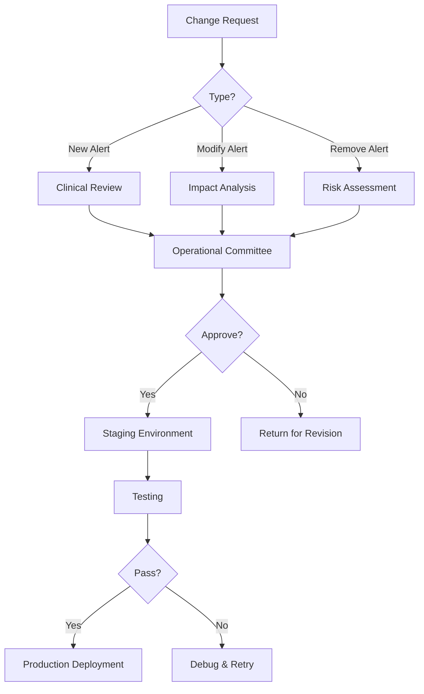

# WIA Clinical Decision Support Standard - Phase 4: Integration Guide

> **Version**: 1.0.0
> **Status**: Stable
> **Last Updated**: 2025
> **Standard**: WIA-MED-015

---

## 1. Overview

Phase 4 provides comprehensive integration guidelines for implementing the WIA Clinical Decision Support standard within healthcare ecosystems. This specification covers EHR integration patterns, deployment strategies, and operational best practices.

### 1.1 Integration Goals

- **Seamless EHR Integration**: Minimal disruption to clinical workflows
- **Alert Fatigue Reduction**: Intelligent alert suppression and prioritization
- **Evidence-Based Decisions**: Connect recommendations to clinical evidence
- **Measurable Impact**: Track clinical outcomes and system effectiveness

---

## 2. EHR Integration Patterns

### 2.1 Integration Architecture

```
┌─────────────────────────────────────────────────────────────┐
│                      EHR System                              │
│  ┌──────────┐  ┌──────────┐  ┌──────────┐  ┌──────────┐    │
│  │  CPOE    │  │ Results  │  │ Patient  │  │  MAR     │    │
│  │ Module   │  │ Review   │  │  Chart   │  │ Module   │    │
│  └────┬─────┘  └────┬─────┘  └────┬─────┘  └────┬─────┘    │
│       │             │             │             │           │
│       └─────────────┴──────┬──────┴─────────────┘           │
│                            │                                 │
│                     ┌──────▼──────┐                         │
│                     │  CDS Hooks  │                         │
│                     │   Client    │                         │
│                     └──────┬──────┘                         │
└────────────────────────────┼────────────────────────────────┘
                             │
                    ┌────────▼────────┐
                    │   WIA CDS API   │
                    │   Gateway       │
                    └────────┬────────┘
                             │
        ┌────────────────────┼────────────────────┐
        │                    │                    │
┌───────▼───────┐  ┌────────▼────────┐  ┌───────▼───────┐
│ Drug Safety   │  │    Guideline    │  │  Preventive   │
│   Engine      │  │     Engine      │  │  Care Engine  │
└───────────────┘  └─────────────────┘  └───────────────┘
```

### 2.2 Vendor-Specific Integration

#### Epic Integration

```json
{
    "vendor": "Epic",
    "integration_type": "CDS Hooks + App Orchard",
    "configuration": {
        "baseUrl": "https://fhir.epic.com/interconnect-fhir-oauth/api/FHIR/R4",
        "authorizationEndpoint": "https://fhir.epic.com/interconnect-fhir-oauth/oauth2/authorize",
        "tokenEndpoint": "https://fhir.epic.com/interconnect-fhir-oauth/oauth2/token",
        "cdsHooksEndpoint": "https://api.wiacds.com/cds-services",
        "smartAppId": "wia-cds-app-12345"
    },
    "hooks": [
        "patient-view",
        "medication-prescribe",
        "order-select",
        "order-sign"
    ]
}
```

#### Cerner Integration

```json
{
    "vendor": "Cerner",
    "integration_type": "CDS Hooks + SMART on FHIR",
    "configuration": {
        "baseUrl": "https://fhir-myrecord.cerner.com/r4/",
        "authorizationEndpoint": "https://authorization.cerner.com/tenants/{tenant}/protocols/oauth2/authorize",
        "tokenEndpoint": "https://authorization.cerner.com/tenants/{tenant}/protocols/oauth2/token",
        "cdsHooksEndpoint": "https://api.wiacds.com/cds-services"
    }
}
```

---

## 3. Alert Configuration

### 3.1 Alert Suppression Rules

```json
{
    "suppressionRules": [
        {
            "ruleId": "suppress-documented-awareness",
            "description": "Suppress alerts when interaction previously documented",
            "condition": {
                "alertType": "drug_drug_interaction",
                "previousOverride": true,
                "overrideReason": "patient-aware",
                "withinDays": 90
            },
            "action": {
                "suppress": true,
                "logReason": "Previous documentation exists"
            }
        },
        {
            "ruleId": "suppress-specialist-override",
            "description": "Suppress specialty-specific alerts for specialists",
            "condition": {
                "alertCategory": "specialty_medication",
                "prescriberSpecialty": "matches_medication_specialty"
            },
            "action": {
                "downgrade": "info",
                "nonInterruptive": true
            }
        }
    ]
}
```

### 3.2 Alert Customization by Institution

```json
{
    "institutionId": "hospital-xyz",
    "customizations": {
        "defaultSeverityOverrides": {
            "vancomycin_monitoring": "high",
            "statin_interactions": "medium"
        },
        "suppressedInteractions": [
            {
                "drug1": "Aspirin",
                "drug2": "Clopidogrel",
                "reason": "Institutional protocol for dual antiplatelet therapy"
            }
        ],
        "additionalAlerts": [
            {
                "alertId": "local-antibiotic-stewardship",
                "trigger": "broad_spectrum_antibiotic_order",
                "message": "Consider narrow-spectrum alternative per institutional antibiotic stewardship protocol"
            }
        ]
    }
}
```

---

## 4. Knowledge Base Management

### 4.1 Drug Database Integration

```json
{
    "drugDatabases": [
        {
            "name": "First Databank",
            "type": "drug_interactions",
            "updateFrequency": "daily",
            "connectionString": "https://api.fdbhealth.com/v1/"
        },
        {
            "name": "Lexicomp",
            "type": "drug_information",
            "updateFrequency": "daily",
            "connectionString": "https://api.lexicomp.com/v1/"
        },
        {
            "name": "RxNorm",
            "type": "drug_terminology",
            "updateFrequency": "weekly",
            "connectionString": "https://rxnav.nlm.nih.gov/REST/"
        }
    ]
}
```

### 4.2 Guideline Management

```json
{
    "guidelineSources": [
        {
            "name": "USPSTF",
            "type": "preventive_care",
            "url": "https://www.uspreventiveservicestaskforce.org/",
            "updateReview": "quarterly"
        },
        {
            "name": "ADA Standards of Care",
            "type": "chronic_disease",
            "specialty": "endocrinology",
            "updateReview": "annual"
        },
        {
            "name": "ACC/AHA Guidelines",
            "type": "cardiovascular",
            "updateReview": "as_published"
        }
    ],
    "updateProcess": {
        "notification": "email_to_pharmacy_committee",
        "reviewRequired": true,
        "stagingPeriod": 30,
        "rollbackEnabled": true
    }
}
```

---

## 5. Deployment Strategy

### 5.1 Phased Rollout Plan

| Phase | Duration | Scope | Success Criteria |
|-------|----------|-------|------------------|
| Pilot | 4 weeks | 1 unit, non-critical alerts | <5% false positive rate |
| Limited | 8 weeks | 3 units, all alert types | Override rate <30% |
| Expanded | 12 weeks | Hospital-wide, progressive | User satisfaction >70% |
| Full | Ongoing | All facilities | Measurable outcomes improvement |

### 5.2 Pilot Configuration

```yaml
pilot:
  name: "WIA CDS Pilot - Cardiology Unit"
  start_date: "2025-02-01"
  end_date: "2025-02-28"
  
  units:
    - unit_id: "cardiology-3-north"
      beds: 32
      
  alert_types:
    enabled:
      - drug_drug_interaction
      - allergy_alert
      - dose_range_check
    disabled:
      - guideline_reminder
      - preventive_care
      
  settings:
    interruptive_alerts: false
    override_reason_required: false
    parallel_run: true
    
  metrics:
    - alert_volume
    - false_positive_rate
    - override_rate
    - user_satisfaction
    - workflow_impact
```

### 5.3 Cutover Checklist

```markdown
## Pre-Go-Live Checklist

### Technical Readiness
- [ ] Integration testing complete
- [ ] Performance testing passed (SLA requirements met)
- [ ] Security audit completed
- [ ] Disaster recovery tested
- [ ] Monitoring dashboards configured
- [ ] Alerting thresholds set

### Clinical Readiness
- [ ] Pharmacy & Therapeutics Committee approval
- [ ] Medical Executive Committee approval
- [ ] Clinical content validated
- [ ] Override reasons configured
- [ ] Suppression rules reviewed

### Training
- [ ] Physician training complete (>90% completion)
- [ ] Nursing training complete (>90% completion)
- [ ] Pharmacy training complete (100% completion)
- [ ] IT support training complete

### Operations
- [ ] Support escalation path defined
- [ ] On-call schedule established
- [ ] Rollback procedure documented and tested
- [ ] Communication plan ready
```

---

## 6. Training and Adoption

### 6.1 Training Curriculum

| Audience | Duration | Format | Topics |
|----------|----------|--------|--------|
| Physicians | 30 min | Online + in-person | Alert interpretation, override workflow, feedback |
| Nurses | 20 min | Online | Alert awareness, escalation, documentation |
| Pharmacists | 60 min | In-person | Full system, medication alerts, configuration |
| IT Staff | 4 hours | In-person | Technical architecture, troubleshooting, monitoring |

### 6.2 Change Management

```json
{
    "communicationPlan": [
        {
            "phase": "pre_launch",
            "timing": "-4 weeks",
            "channels": ["email", "department_meetings"],
            "message": "Introduction to new CDS system"
        },
        {
            "phase": "training",
            "timing": "-2 weeks",
            "channels": ["training_portal", "hands_on_sessions"],
            "message": "Training availability and requirements"
        },
        {
            "phase": "go_live",
            "timing": "day 0",
            "channels": ["all_staff_email", "intranet_banner"],
            "message": "System live, support resources available"
        },
        {
            "phase": "post_launch",
            "timing": "+1 week",
            "channels": ["feedback_surveys", "department_huddles"],
            "message": "Feedback collection, issue resolution"
        }
    ]
}
```

---

## 7. Monitoring and Analytics

### 7.1 Key Performance Indicators

```json
{
    "kpis": {
        "safety": [
            {
                "metric": "prevented_adverse_events",
                "target": ">10 per month",
                "measurement": "Pharmacist-validated alert acceptances"
            },
            {
                "metric": "critical_alert_response_time",
                "target": "<5 minutes",
                "measurement": "Time from alert to acknowledgment"
            }
        ],
        "efficiency": [
            {
                "metric": "alert_volume_per_provider",
                "target": "<15 per shift",
                "measurement": "Alerts per provider per 8-hour shift"
            },
            {
                "metric": "override_rate",
                "target": "<25%",
                "measurement": "Overridden alerts / Total alerts"
            }
        ],
        "adoption": [
            {
                "metric": "training_completion",
                "target": ">95%",
                "measurement": "Completed / Assigned"
            },
            {
                "metric": "user_satisfaction",
                "target": ">4.0/5.0",
                "measurement": "Quarterly survey score"
            }
        ]
    }
}
```

### 7.2 Dashboard Components

```yaml
dashboards:
  executive:
    refresh: daily
    components:
      - alert_volume_trend
      - prevented_adverse_events
      - override_rate_by_category
      - user_satisfaction_trend
      
  operational:
    refresh: hourly
    components:
      - real_time_alert_feed
      - response_time_distribution
      - top_overridden_alerts
      - system_health_status
      
  clinical:
    refresh: real_time
    components:
      - critical_alerts_pending
      - my_override_history
      - patient_specific_alerts
      - guideline_adherence_score
```

---

## 8. Continuous Improvement

### 8.1 Feedback Loop

```
┌─────────────────┐
│   Alert Fired   │
└────────┬────────┘
         │
         ▼
┌─────────────────┐
│  User Action    │◄──────────────────────┐
│  (Accept/       │                        │
│   Override)     │                        │
└────────┬────────┘                        │
         │                                 │
         ▼                                 │
┌─────────────────┐                        │
│ Capture Feedback│                        │
│  - Override     │                        │
│    reason       │                        │
│  - Helpful?     │                        │
│  - Comments     │                        │
└────────┬────────┘                        │
         │                                 │
         ▼                                 │
┌─────────────────┐                        │
│  Analytics &    │                        │
│  Review         │                        │
└────────┬────────┘                        │
         │                                 │
         ▼                                 │
┌─────────────────┐                        │
│  Rule           │────────────────────────┘
│  Optimization   │
└─────────────────┘
```

### 8.2 Alert Optimization Process

```json
{
    "optimizationProcess": {
        "reviewFrequency": "monthly",
        "committee": "CDS Governance Committee",
        "criteria": {
            "candidateForRemoval": {
                "overrideRate": ">50%",
                "duration": "3+ months",
                "noDocumentedBenefit": true
            },
            "candidateForDowngrade": {
                "overrideRate": ">30%",
                "currentSeverity": "high",
                "lowClinicalImpact": true
            },
            "candidateForEnhancement": {
                "acceptanceRate": ">90%",
                "clinicalBenefit": "demonstrated",
                "userFeedback": "positive"
            }
        }
    }
}
```

---

## 9. Governance

### 9.1 Committee Structure

```yaml
governance:
  cds_steering_committee:
    members:
      - Chief Medical Information Officer (Chair)
      - Chief Nursing Informatics Officer
      - Chief Pharmacy Officer
      - IT Director
      - Quality Director
    meetings: monthly
    responsibilities:
      - Strategic direction
      - Major policy decisions
      - Resource allocation
      
  cds_operational_committee:
    members:
      - Clinical Informaticist (Chair)
      - Pharmacist representatives (2)
      - Physician representatives (3)
      - Nursing representative (1)
      - IT analyst (1)
    meetings: bi-weekly
    responsibilities:
      - Alert optimization
      - User feedback review
      - Rule modification approval
```

### 9.2 Change Control Process



---

## 10. Success Metrics

### 10.1 Clinical Outcomes

| Metric | Baseline | Target | Measurement |
|--------|----------|--------|-------------|
| Medication errors | X per 1000 orders | 20% reduction | Medication error reports |
| Adverse drug events | Y per 1000 patients | 25% reduction | Pharmacovigilance data |
| Guideline adherence | Z% | +15% improvement | EHR documentation audit |
| Preventive care gaps | W% | 30% reduction | Screening completion rates |

### 10.2 ROI Calculation

```json
{
    "roiModel": {
        "costs": {
            "implementation": 500000,
            "annualLicense": 100000,
            "annualMaintenance": 50000,
            "training": 25000
        },
        "savings": {
            "preventedADEs": {
                "estimatedADEsPrevented": 120,
                "avgCostPerADE": 15000,
                "annualSavings": 1800000
            },
            "reducedLOS": {
                "estimatedDaysReduced": 200,
                "costPerDay": 2000,
                "annualSavings": 400000
            },
            "liabilityReduction": {
                "estimatedClaimsAvoided": 2,
                "avgClaimCost": 250000,
                "annualSavings": 500000
            }
        },
        "yearOneROI": "380%",
        "paybackPeriod": "4 months"
    }
}
```

---

**홍익인간 (弘益人間)**: "Benefit all humanity"

The WIA Clinical Decision Support Standard belongs to humanity. Free forever.

---

**Copyright 2025 SmileStory Inc. / WIA**
MIT License
