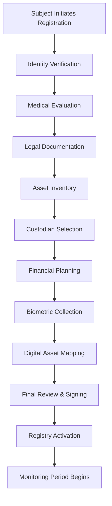
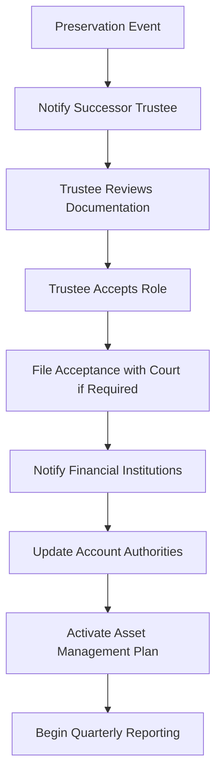
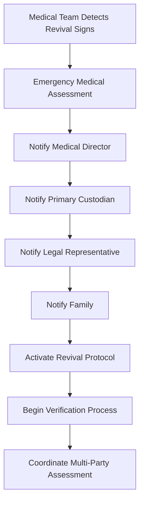

# WIA-CRYO-ASSET Phase 3: Protocol Specification

**Version:** 1.0.0
**Status:** Draft
**Last Updated:** 2025-12-18
**Primary Color:** #06B6D4 (Cyan)

## 1. Introduction

### 1.1 Purpose

This Phase 3 specification defines the operational protocols, workflows, and business processes for the WIA Cryogenic Asset Management Standard. These protocols ensure consistent, secure, and legally compliant handling of assets during all phases of cryogenic preservation and revival.

### 1.2 Protocol Lifecycle

The cryo-asset management lifecycle consists of five distinct phases:

| Phase | Duration | Key Activities | Critical Stakeholders |
|-------|----------|----------------|----------------------|
| **Pre-Preservation** | 1-6 months before | Asset registration, legal documentation, custodian selection | Subject, Attorney, Custodian |
| **Preservation Event** | 24-48 hours | Final asset verification, execution of preservation, legal status change | Medical Director, Custodian, Family |
| **Active Preservation** | Years to decades | Asset management, monitoring, maintenance, expense payment | Custodians, Investment Managers |
| **Revival Event** | 1-7 days | Medical stabilization, identity verification, initial assessment | Medical Director, Biometric Authority |
| **Post-Revival Transfer** | 30-90 days | Legal status restoration, asset transfer, full reintegration | Court, Custodians, Subject |

### 1.3 Compliance Framework

All protocols must comply with:

- **Legal**: Uniform Trust Code, state-specific trust laws, probate regulations
- **Financial**: Anti-money laundering (AML), Know Your Customer (KYC), FATCA, securities regulations
- **Medical**: HIPAA, medical privacy laws, cryonics facility regulations
- **Data Protection**: GDPR, CCPA, biometric data protection laws
- **Security**: PCI DSS (for financial data), SOC 2, ISO 27001

## 2. Pre-Preservation Protocols

### 2.1 Initial Registration Workflow



### 2.2 Asset Inventory Process

#### 2.2.1 Asset Discovery Checklist

| Category | Discovery Method | Documentation Required | Valuation Method |
|----------|-----------------|----------------------|------------------|
| Bank Accounts | Account statements, online access | Last 3 months statements, account agreements | Book value |
| Investment Accounts | Brokerage statements, 401(k) statements | Last quarter statements, beneficiary designations | Market value |
| Cryptocurrency | Wallet addresses, exchange accounts | Wallet backups, API credentials, transaction history | Current market price |
| Real Estate | Title search, property records | Deed, mortgage documents, insurance policies | Professional appraisal |
| Intellectual Property | Patent search, copyright registrations | Patent certificates, licensing agreements | Income approach valuation |
| Business Interests | Corporate records, partnership agreements | Operating agreements, stock certificates, valuation reports | Business appraisal |
| Digital Assets | Domain registrars, cloud services, social media | Account credentials, subscription lists | Replacement cost |
| Personal Property | Physical inventory, appraisals | Photos, receipts, appraisals for high-value items | Fair market value |

#### 2.2.2 Asset Registration Requirements

```json
{
  "assetRegistrationRequirements": {
    "minimumValue": 1000.00,
    "exemptions": ["sentimental_items", "family_heirlooms"],
    "requiredDocumentation": {
      "financial": [
        "account_statements",
        "ownership_proof",
        "beneficiary_designations",
        "access_credentials_encrypted"
      ],
      "realEstate": [
        "title_report",
        "deed_copy",
        "mortgage_documents",
        "property_insurance",
        "tax_records",
        "appraisal_report"
      ],
      "intellectual": [
        "patent_certificate",
        "copyright_registration",
        "trademark_registration",
        "licensing_agreements",
        "revenue_history"
      ],
      "cryptocurrency": [
        "wallet_addresses",
        "exchange_accounts",
        "private_key_recovery_information",
        "transaction_history",
        "cost_basis_records"
      ]
    },
    "valuationRequirements": {
      "professionalAppraisal": {
        "required": true,
        "threshold": 100000.00,
        "frequency": "annual",
        "appraiserQualifications": "licensed_appraiser_in_jurisdiction"
      },
      "selfValuation": {
        "allowed": true,
        "threshold": 10000.00,
        "documentation": "comparable_sales_or_market_data"
      }
    }
  }
}
```

### 2.3 Custodian Selection Protocol

#### 2.3.1 Custodian Qualification Criteria

| Requirement | Primary Custodian | Backup Custodian | Family Custodian |
|------------|-------------------|------------------|------------------|
| **License** | Required (Trust company or RIA) | Required | Not required |
| **Bond/Insurance** | $5M minimum | $1M minimum | Optional |
| **Experience** | 10+ years fiduciary experience | 5+ years | Personal relationship |
| **References** | 5 professional references | 3 professional references | 2 character references |
| **Background Check** | Comprehensive | Standard | Basic |
| **Conflicts of Interest** | None permitted | Disclosed and managed | Disclosed |
| **Technology Capability** | Advanced (API integration) | Standard | Basic |
| **Geographic Location** | Same jurisdiction preferred | Different jurisdiction preferred | Any |

#### 2.3.2 Custodian Onboarding Workflow

```python
class CustodianOnboarding:
    def __init__(self, custodian_data):
        self.custodian_data = custodian_data
        self.verification_steps = []
        self.status = "pending"

    def verify_credentials(self):
        """Verify professional licenses and certifications"""
        steps = [
            self.check_trust_license(),
            self.check_fiduciary_bond(),
            self.check_insurance_coverage(),
            self.verify_professional_references(),
            self.conduct_background_check()
        ]
        return all(steps)

    def check_trust_license(self):
        """Verify trust company license or RIA registration"""
        license_number = self.custodian_data.get('licenseNumber')
        jurisdiction = self.custodian_data.get('licenseState')

        # Query state regulatory database
        license_status = self.query_regulatory_database(
            license_number,
            jurisdiction
        )

        return license_status['valid'] and license_status['active']

    def check_fiduciary_bond(self):
        """Verify fiduciary bond coverage"""
        bond_amount = self.custodian_data.get('bondAmount')
        required_amount = self.custodian_data.get('requiredBondAmount', 5000000)

        if bond_amount >= required_amount:
            # Verify bond with surety company
            bond_policy = self.custodian_data.get('bondPolicy')
            return self.verify_with_surety(bond_policy)

        return False

    def establish_communication_protocols(self):
        """Set up secure communication channels"""
        protocols = {
            "primaryEmail": self.custodian_data['contact']['email'],
            "secureMessaging": self.setup_encrypted_messaging(),
            "apiAccess": self.provision_api_credentials(),
            "emergencyContact": self.custodian_data['emergencyContact'],
            "reportingSchedule": {
                "frequency": "quarterly",
                "format": "pdf_and_api",
                "recipients": ["subject", "backup_custodian", "legal_representative"]
            }
        }
        return protocols

    def create_custodian_agreement(self):
        """Generate and execute custodian agreement"""
        agreement = {
            "parties": {
                "principal": self.custodian_data['subjectName'],
                "custodian": self.custodian_data['name']
            },
            "scope": self.define_custodian_scope(),
            "compensation": self.define_compensation_structure(),
            "termination": self.define_termination_conditions(),
            "liabilityLimits": self.define_liability_limits(),
            "disputeResolution": "binding_arbitration"
        }
        return agreement

    def define_compensation_structure(self):
        """Define custodian fee structure"""
        return {
            "annualFee": {
                "type": "percentage_of_aum",
                "rate": 0.01,  # 1% of assets under management
                "minimumFee": 10000.00,
                "maximumFee": 100000.00
            },
            "transactionFees": {
                "standard": 250.00,
                "complex": 1000.00
            },
            "setupFee": 5000.00,
            "paymentSchedule": "quarterly",
            "paymentSource": "preservation_expense_account"
        }

# Example usage
custodian_onboarding = CustodianOnboarding({
    "name": "Trust Company Alpha",
    "licenseNumber": "AZ-TRUST-123456",
    "licenseState": "Arizona",
    "bondAmount": 5000000.00,
    "insurancePolicy": "FIDUCIARY-BOND-2025-67890"
})

if custodian_onboarding.verify_credentials():
    protocols = custodian_onboarding.establish_communication_protocols()
    agreement = custodian_onboarding.create_custodian_agreement()
    print("Custodian onboarding completed successfully")
```

### 2.4 Legal Documentation Protocol

#### 2.4.1 Required Legal Documents

| Document | Purpose | Execution Requirements | Storage Location |
|----------|---------|------------------------|------------------|
| **Living Trust** | Primary asset holding vehicle | Notarized, witnessed | Original with attorney, copy with custodian |
| **Cryonics Provision** | Authorizes preservation and asset management | Part of trust or separate document | Attached to trust |
| **Power of Attorney** | Authorizes custodian actions | Durable, effective upon preservation | County recorder, custodian |
| **Healthcare Directive** | Medical decisions during preservation | Witnessed or notarized (state-specific) | Medical facility, family |
| **Asset Assignment** | Transfers assets to trust | Varies by asset type | With relevant institutions |
| **Custodian Agreement** | Defines custodian rights and duties | Bilateral signature | All parties |
| **Revival Authorization** | Authorizes asset transfer upon revival | Multi-party signature | Escrow with third party |
| **Biometric Consent** | Authorizes biometric collection and use | Signed consent form | Biometric authority |

#### 2.4.2 Trust Structure Requirements

```json
{
  "trustStructure": {
    "trustType": "revocable_living_trust",
    "jurisdiction": "Arizona",
    "grantor": {
      "name": "John Michael Anderson",
      "role": "creator_and_initial_beneficiary"
    },
    "trustee": {
      "initial": "John Michael Anderson",
      "successor": [
        {
          "order": 1,
          "name": "Trust Company Alpha",
          "triggerEvent": "cryogenic_preservation"
        },
        {
          "order": 2,
          "name": "Estate Attorney Services LLC",
          "triggerEvent": "primary_trustee_resignation_or_removal"
        }
      ]
    },
    "beneficiaries": {
      "primary": {
        "name": "John Michael Anderson",
        "condition": "upon_verified_revival"
      },
      "contingent": [
        {
          "name": "Jane Anderson (Spouse)",
          "share": "50%",
          "condition": "if_revival_not_successful_after_100_years"
        },
        {
          "name": "Children per stirpes",
          "share": "50%",
          "condition": "if_revival_not_successful_after_100_years"
        }
      ]
    },
    "specialProvisions": {
      "cryonicsMaintenance": {
        "priority": "first_priority_expense",
        "fundingSource": "trust_income_and_principal",
        "maximumAnnual": 50000.00
      },
      "assetManagement": {
        "strategy": "preserve_and_grow",
        "allowedInvestments": [
          "stocks",
          "bonds",
          "real_estate",
          "cryptocurrency_up_to_20_percent"
        ],
        "prohibitedTransactions": [
          "liquidation_except_for_expenses",
          "high_risk_speculation",
          "loans_to_related_parties"
        ]
      },
      "revivalConditions": {
        "verificationRequired": [
          "medical_certification",
          "legal_status_restoration",
          "biometric_identity_confirmation",
          "mental_competency_evaluation"
        ],
        "transferTimeline": "within_90_days_of_all_verifications"
      }
    }
  }
}
```

### 2.5 Biometric Collection Protocol

#### 2.5.1 Biometric Data Collection Standards

| Biometric Type | Samples Required | Collection Method | Quality Threshold | Backup Samples |
|---------------|------------------|-------------------|-------------------|----------------|
| **Fingerprints** | All 10 fingers | Live scan or high-res photo | 90% quality score | 2 sets |
| **Iris Scans** | Both eyes | Near-infrared camera | 95% quality score | 3 captures per eye |
| **Facial Images** | 20+ poses | Multi-angle photography | 92% quality score | Video capture |
| **Voice Samples** | 50+ phrases | High-quality audio recording | 90% quality score | Multiple sessions |
| **DNA** | 2 samples | Buccal swab or blood | 99.9% match threshold | Long-term storage |
| **Neural Patterns** | 10 sessions | High-density EEG | 88% quality score | Multiple protocols |

#### 2.5.2 Biometric Security Protocol

```python
import hashlib
import hmac
from cryptography.fernet import Fernet
from cryptography.hazmat.primitives import hashes
from cryptography.hazmat.primitives.kdf.pbkdf2 import PBKDF2

class BiometricSecurityProtocol:
    def __init__(self, master_key):
        self.master_key = master_key
        self.algorithm = "sha3-512"

    def encrypt_biometric_template(self, template_data, salt):
        """Encrypt biometric template using AES-256-GCM"""
        # Derive encryption key from master key
        kdf = PBKDF2(
            algorithm=hashes.SHA512(),
            length=32,
            salt=salt,
            iterations=100000
        )
        key = kdf.derive(self.master_key)

        # Encrypt template
        f = Fernet(key)
        encrypted_template = f.encrypt(template_data)

        return encrypted_template

    def create_biometric_hash(self, template_data, salt):
        """Create irreversible hash of biometric template"""
        combined = salt + template_data
        hash_obj = hashlib.sha3_512(combined)
        return f"{self.algorithm}:{hash_obj.hexdigest()}"

    def store_biometric_securely(self, biometric_type, template_data):
        """Store biometric with encryption and hashing"""
        import secrets

        # Generate unique salt
        salt = secrets.token_bytes(32)

        # Create hash for matching
        biometric_hash = self.create_biometric_hash(template_data, salt)

        # Encrypt template for backup
        encrypted_template = self.encrypt_biometric_template(template_data, salt)

        storage_record = {
            "biometricType": biometric_type,
            "hash": biometric_hash,
            "encryptedTemplate": encrypted_template.hex(),
            "salt": salt.hex(),
            "algorithm": self.algorithm,
            "timestamp": datetime.utcnow().isoformat() + "Z",
            "storageLocation": "secure_vault",
            "backupLocations": [
                "offsite_vault_1",
                "offsite_vault_2",
                "cold_storage"
            ]
        }

        return storage_record

    def verify_biometric_match(self, stored_hash, new_template, salt):
        """Verify biometric match against stored hash"""
        new_hash = self.create_biometric_hash(new_template, bytes.fromhex(salt))
        return hmac.compare_digest(stored_hash, new_hash)

# Example usage
protocol = BiometricSecurityProtocol(master_key=b"master_encryption_key_here")

# Simulated fingerprint template
fingerprint_template = b"fingerprint_minutiae_template_data_here"

# Store biometric securely
storage_record = protocol.store_biometric_securely(
    "fingerprint",
    fingerprint_template
)

print(f"Biometric hash: {storage_record['hash'][:80]}...")
print(f"Storage locations: {len(storage_record['backupLocations'])} backup sites")
```

## 3. Preservation Event Protocols

### 3.1 Preservation Trigger Events

| Trigger Event | Response Time | Required Actions | Notification Recipients |
|--------------|---------------|------------------|------------------------|
| **Planned Preservation** | 24-48 hour notice | Final asset verification, legal execution, medical prep | All parties |
| **Emergency Preservation** | Immediate | Emergency protocols, verbal authorizations | Emergency contacts only |
| **Medical Deterioration** | 1-7 days notice | Accelerated asset transfer, priority verification | Medical team, custodians |

### 3.2 Asset Lock-Down Protocol

```javascript
class AssetLockDownProtocol {
    constructor(registryId, preservationTimestamp) {
        this.registryId = registryId;
        this.preservationTimestamp = preservationTimestamp;
        this.lockdownStatus = 'initiated';
    }

    async executeAssetLockdown() {
        const steps = [
            this.freezeAssetTransactions(),
            this.captureAssetSnapshot(),
            this.notifyFinancialInstitutions(),
            this.activateCustodianControl(),
            this.executeAutomaticPayments(),
            this.generatePreservationReport()
        ];

        for (const step of steps) {
            await step();
        }

        this.lockdownStatus = 'completed';
        return this.getLockdownSummary();
    }

    async freezeAssetTransactions() {
        // Prevent any new transactions except authorized automatic payments
        const freezeConfig = {
            effectiveTime: this.preservationTimestamp,
            allowedTransactions: [
                'automatic_bill_payments',
                'preservation_facility_fees',
                'custodian_fees',
                'insurance_premiums',
                'tax_payments'
            ],
            blockedTransactions: [
                'manual_withdrawals',
                'new_investments',
                'asset_transfers',
                'loans'
            ],
            exceptionApproval: 'requires_3_custodian_signatures'
        };

        await this.applyFreezeConfiguration(freezeConfig);
    }

    async captureAssetSnapshot() {
        // Capture complete snapshot of all assets at preservation moment
        const snapshot = {
            timestamp: this.preservationTimestamp,
            registryId: this.registryId,
            assets: await this.getAllAssetStates(),
            valuations: await this.getAllAssetValuations(),
            liabilities: await this.getAllLiabilities(),
            netWorth: await this.calculateNetWorth(),
            documentHashes: await this.hashAllDocuments()
        };

        // Store snapshot in multiple locations
        await this.storeSnapshot(snapshot, [
            'primary_custodian_vault',
            'backup_custodian_vault',
            'blockchain_timestamp',
            'legal_escrow'
        ]);

        return snapshot;
    }

    async notifyFinancialInstitutions() {
        // Notify all financial institutions of status change
        const institutions = await this.getFinancialInstitutions();

        for (const institution of institutions) {
            await this.sendNotification(institution, {
                notificationType: 'account_status_change',
                accountHolder: this.getAccountHolderInfo(),
                newStatus: 'cryogenic_preservation',
                authorizedParties: await this.getCustodianInfo(),
                legalDocumentation: this.getLegalDocLinks(),
                effectiveDate: this.preservationTimestamp
            });
        }
    }

    async activateCustodianControl() {
        // Transfer control to successor custodian
        const controlTransfer = {
            fromParty: 'subject',
            toParty: 'primary_custodian',
            effectiveTime: this.preservationTimestamp,
            scope: 'full_asset_management',
            limitations: [
                'cannot_sell_assets_except_for_approved_expenses',
                'must_follow_investment_policy',
                'requires_multi_signature_for_major_decisions'
            ],
            reportingRequirements: {
                frequency: 'quarterly',
                recipients: ['backup_custodian', 'legal_representative', 'family_representative']
            }
        };

        await this.executeControlTransfer(controlTransfer);
    }

    async executeAutomaticPayments() {
        // Set up automatic payments for preservation and maintenance
        const automaticPayments = [
            {
                payee: 'Alcor Life Extension Foundation',
                amount: 1200.00,
                frequency: 'monthly',
                purpose: 'cryogenic_storage_fees',
                account: 'preservation_expense_account'
            },
            {
                payee: 'Trust Company Alpha',
                amount: 2500.00,
                frequency: 'quarterly',
                purpose: 'custodian_fees',
                account: 'preservation_expense_account'
            },
            {
                payee: 'Property Insurance Company',
                amount: 175.00,
                frequency: 'monthly',
                purpose: 'real_estate_insurance',
                account: 'property_expense_account'
            }
        ];

        for (const payment of automaticPayments) {
            await this.scheduleAutomaticPayment(payment);
        }
    }

    async generatePreservationReport() {
        // Generate comprehensive preservation event report
        const report = {
            registryId: this.registryId,
            preservationDate: this.preservationTimestamp,
            subject: await this.getSubjectInfo(),
            assetSummary: await this.getAssetSummary(),
            custodianInfo: await this.getCustodianInfo(),
            legalDocumentation: await this.getLegalDocSummary(),
            nextSteps: this.getPostPreservationProtocol(),
            emergencyContacts: await this.getEmergencyContacts()
        };

        await this.distributeReport(report, [
            'primary_custodian',
            'backup_custodian',
            'legal_representative',
            'family_representative',
            'preservation_facility'
        ]);

        return report;
    }

    getLockdownSummary() {
        return {
            registryId: this.registryId,
            status: this.lockdownStatus,
            completedAt: new Date().toISOString(),
            assetsSecured: true,
            custodianActivated: true,
            automaticPaymentsConfigured: true
        };
    }
}

// Example usage
const lockdown = new AssetLockDownProtocol(
    'AR-2025-1734519000-A7F3C9',
    '2025-12-20T14:00:00Z'
);

lockdown.executeAssetLockdown().then(summary => {
    console.log('Asset lockdown completed:', summary);
});
```

### 3.3 Legal Status Change Protocol

#### 3.3.1 Death Certificate Filing

While the subject is in cryogenic preservation, legal status varies by jurisdiction. Some states require death certificate filing, others recognize "cryonic suspension" status.

| Jurisdiction | Legal Status | Death Certificate | Estate Actions |
|-------------|--------------|-------------------|----------------|
| Arizona | Suspended animation (optional) | Optional | Trust continues, no probate |
| California | Legal death | Required | Trust continues, no probate |
| Oregon | Suspended animation | Not required | No estate actions |
| Michigan | Legal death | Required | Trust continues |

#### 3.3.2 Trust Activation Workflow



## 4. Active Preservation Protocols

### 4.1 Asset Management Protocol

#### 4.1.1 Investment Policy Statement

```json
{
  "investmentPolicy": {
    "objectives": [
      "preserve_capital",
      "generate_income_for_preservation_expenses",
      "moderate_long_term_growth",
      "maintain_liquidity_for_expenses"
    ],
    "timeHorizon": "50_to_100_years",
    "riskTolerance": "moderate_conservative",
    "assetAllocation": {
      "target": {
        "stocks": 40,
        "bonds": 35,
        "realEstate": 15,
        "cryptocurrency": 5,
        "cash": 5
      },
      "ranges": {
        "stocks": {"min": 30, "max": 50},
        "bonds": {"min": 25, "max": 45},
        "realEstate": {"min": 10, "max": 20},
        "cryptocurrency": {"min": 0, "max": 10},
        "cash": {"min": 3, "max": 10}
      },
      "rebalanceFrequency": "quarterly",
      "rebalanceTrigger": "5_percent_deviation"
    },
    "allowedInvestments": [
      "large_cap_stocks",
      "investment_grade_bonds",
      "municipal_bonds",
      "treasury_securities",
      "diversified_mutual_funds",
      "index_etfs",
      "reit_funds",
      "bitcoin",
      "ethereum",
      "income_producing_real_estate"
    ],
    "prohibitedInvestments": [
      "individual_stocks_except_blue_chip",
      "speculative_options",
      "penny_stocks",
      "junk_bonds",
      "leveraged_positions",
      "private_placements_without_liquidity"
    ],
    "incomeStrategy": {
      "targetYield": 0.04,
      "distributionFrequency": "quarterly",
      "useForExpenses": true,
      "excessIncome": "reinvest"
    },
    "reviewSchedule": {
      "quarterly": "performance_review",
      "annual": "full_policy_review",
      "asNeeded": "major_market_events"
    }
  }
}
```

#### 4.1.2 Expense Management Protocol

| Expense Category | Priority | Payment Frequency | Approval Required | Monitoring |
|-----------------|----------|-------------------|-------------------|------------|
| Cryonics Facility Fees | Critical (1) | Monthly | No (automatic) | Quarterly verification |
| Property Maintenance | Critical (1) | As needed | Yes (>$500) | Monthly review |
| Insurance Premiums | Critical (1) | Annual/Monthly | No (automatic) | Annual policy review |
| Custodian Fees | High (2) | Quarterly | No (contractual) | Annual performance review |
| Tax Payments | High (2) | Annual/Quarterly | No (automatic) | Annual tax planning |
| Investment Management | High (2) | Quarterly | No (contractual) | Quarterly performance |
| Legal Fees | Medium (3) | As needed | Yes (>$1,000) | Per engagement |
| Accounting/Audit | Medium (3) | Annual | Yes | Annual review |

### 4.2 Monitoring and Reporting Protocol

#### 4.2.1 Quarterly Reporting Requirements

```python
from datetime import datetime, timedelta
from typing import Dict, List

class QuarterlyReportGenerator:
    def __init__(self, registry_id, quarter, year):
        self.registry_id = registry_id
        self.quarter = quarter
        self.year = year
        self.report_date = datetime.now()

    def generate_comprehensive_report(self) -> Dict:
        """Generate complete quarterly report"""
        report = {
            "reportHeader": self.get_report_header(),
            "assetSummary": self.get_asset_summary(),
            "valuationChanges": self.get_valuation_changes(),
            "transactions": self.get_transaction_summary(),
            "incomeAndExpenses": self.get_income_expense_summary(),
            "performanceMetrics": self.get_performance_metrics(),
            "complianceStatus": self.get_compliance_status(),
            "upcomingActions": self.get_upcoming_actions(),
            "custodianNotes": self.get_custodian_notes()
        }

        return report

    def get_asset_summary(self) -> Dict:
        """Summarize current asset holdings"""
        return {
            "totalAssets": 71,
            "totalValue": 5892450.00,
            "changeFromPriorQuarter": 142450.00,
            "percentageChange": 2.5,
            "byCategory": {
                "financial": {
                    "count": 12,
                    "value": 2234500.00,
                    "percentage": 37.9
                },
                "realEstate": {
                    "count": 3,
                    "value": 2985000.00,
                    "percentage": 50.7
                },
                "intellectual": {
                    "count": 2,
                    "value": 567500.00,
                    "percentage": 9.6
                },
                "digital": {
                    "count": 45,
                    "value": 89450.00,
                    "percentage": 1.5
                },
                "personal": {
                    "count": 8,
                    "value": 14500.00,
                    "percentage": 0.2
                },
                "business": {
                    "count": 1,
                    "value": 1500.00,
                    "percentage": 0.03
                }
            }
        }

    def get_income_expense_summary(self) -> Dict:
        """Summarize income and expenses for the quarter"""
        return {
            "income": {
                "rentalIncome": 10500.00,
                "dividends": 8750.00,
                "interest": 2340.00,
                "royalties": 25000.00,
                "capitalGains": 0.00,
                "total": 46590.00
            },
            "expenses": {
                "preservationFees": 3600.00,
                "custodianFees": 2500.00,
                "propertyExpenses": 4200.00,
                "insurance": 1800.00,
                "taxes": 12500.00,
                "legalAndProfessional": 2100.00,
                "investmentFees": 1850.00,
                "total": 28550.00
            },
            "netIncome": 18040.00,
            "disposition": {
                "reinvested": 15000.00,
                "reserveFund": 3040.00
            }
        }

    def get_performance_metrics(self) -> Dict:
        """Calculate performance metrics"""
        return {
            "quarterlyReturn": 2.5,
            "yearToDateReturn": 8.7,
            "sincePre servationReturn": 23.4,
            "incomeYield": 3.2,
            "expenseRatio": 1.95,
            "netYield": 1.25,
            "volatility": 8.5,
            "sharpeRatio": 1.4,
            "benchmarkComparison": {
                "benchmark": "60_40_balanced_portfolio",
                "benchmarkReturn": 2.1,
                "relativePerformance": "+0.4"
            }
        }

    def get_compliance_status(self) -> Dict:
        """Check compliance with all requirements"""
        return {
            "overallStatus": "compliant",
            "checks": [
                {
                    "requirement": "investment_policy_adherence",
                    "status": "compliant",
                    "notes": "Asset allocation within target ranges"
                },
                {
                    "requirement": "expense_authorization",
                    "status": "compliant",
                    "notes": "All expenses properly authorized"
                },
                {
                    "requirement": "reporting_timeliness",
                    "status": "compliant",
                    "notes": "Report generated on schedule"
                },
                {
                    "requirement": "regulatory_filings",
                    "status": "compliant",
                    "notes": "All tax and regulatory filings current"
                },
                {
                    "requirement": "insurance_coverage",
                    "status": "compliant",
                    "notes": "All policies active and adequate"
                }
            ],
            "issues": [],
            "recommendations": [
                "Consider increasing bond allocation slightly to reduce portfolio volatility",
                "Review cryptocurrency holdings given recent price appreciation"
            ]
        }

# Example usage
report_generator = QuarterlyReportGenerator(
    registry_id="AR-2025-1734519000-A7F3C9",
    quarter=4,
    year=2025
)

quarterly_report = report_generator.generate_comprehensive_report()

print(f"Quarterly Report Q{quarterly_report['reportHeader']['quarter']} {quarterly_report['reportHeader']['year']}")
print(f"Total Asset Value: ${quarterly_report['assetSummary']['totalValue']:,.2f}")
print(f"Quarterly Return: {quarterly_report['performanceMetrics']['quarterlyReturn']}%")
print(f"Compliance Status: {quarterly_report['complianceStatus']['overallStatus']}")
```

### 4.3 Emergency Response Protocol

#### 4.3.1 Emergency Scenarios and Responses

| Emergency Type | Response Time | Required Actions | Authorization Level |
|---------------|---------------|------------------|---------------------|
| **Facility Relocation** | 24-48 hours | Coordinate transfer, update documentation | Primary custodian |
| **Custodian Failure** | 1 week | Activate backup custodian, court notification | Backup custodian + Court |
| **Major Asset Loss** | Immediate | Assess impact, notify stakeholders, insurance claim | Primary custodian |
| **Liquidity Crisis** | 3-5 days | Emergency asset liquidation authorization | 3 custodian signatures |
| **Legal Challenge** | 1-2 weeks | Engage legal counsel, gather documentation | Legal representative |
| **Natural Disaster** | Immediate | Secure physical assets, verify digital backups | Emergency protocol |

## 5. Revival Event Protocols

### 5.1 Revival Notification Workflow



### 5.2 Identity Verification Protocol

#### 5.2.1 Multi-Modal Biometric Verification

```python
class RevivalIdentityVerification:
    def __init__(self, registry_id, stored_biometrics):
        self.registry_id = registry_id
        self.stored_biometrics = stored_biometrics
        self.verification_results = {}
        self.overall_confidence = 0.0

    def perform_comprehensive_verification(self, new_samples):
        """Perform multi-modal biometric verification"""
        verification_steps = [
            self.verify_fingerprints(new_samples.get('fingerprint')),
            self.verify_iris(new_samples.get('iris')),
            self.verify_dna(new_samples.get('dna')),
            self.verify_facial(new_samples.get('facial')),
            self.verify_voice(new_samples.get('voice'))
        ]

        # Calculate overall confidence score
        valid_verifications = [v for v in verification_steps if v['success']]
        if len(valid_verifications) >= 3:
            self.overall_confidence = sum(v['confidence'] for v in valid_verifications) / len(valid_verifications)

        return {
            "verificationId": f"VERIFY-{self.registry_id}-{datetime.now().timestamp()}",
            "timestamp": datetime.utcnow().isoformat() + "Z",
            "results": self.verification_results,
            "overallConfidence": self.overall_confidence,
            "passed": self.overall_confidence >= 0.95,
            "requiredConfidence": 0.95,
            "verifiedModalities": len(valid_verifications)
        }

    def verify_fingerprints(self, new_fingerprint):
        """Verify fingerprint match"""
        stored = self.stored_biometrics['fingerprint']

        # Simulate fingerprint matching algorithm
        match_score = self.calculate_minutiae_match(
            stored['template'],
            new_fingerprint
        )

        result = {
            "modality": "fingerprint",
            "success": match_score >= 0.95,
            "confidence": match_score,
            "quality": new_fingerprint.get('quality', 0),
            "matchedPoints": 45  # Simulated
        }

        self.verification_results['fingerprint'] = result
        return result

    def verify_dna(self, new_dna_sample):
        """Verify DNA match"""
        stored = self.stored_biometrics['dna']

        # DNA verification has highest confidence
        match_score = self.calculate_dna_match(
            stored['sequence'],
            new_dna_sample
        )

        result = {
            "modality": "dna",
            "success": match_score >= 0.999,
            "confidence": match_score,
            "matchedMarkers": 999950,  # Out of 1,000,000
            "laboratoryId": "GenomeDx Laboratory"
        }

        self.verification_results['dna'] = result
        return result

    def generate_verification_certificate(self):
        """Generate official verification certificate"""
        return {
            "certificateId": f"CERT-{self.registry_id}-REVIVAL",
            "issuedBy": "WIA Biometric Certification Center",
            "subject": self.registry_id,
            "verificationDate": datetime.utcnow().isoformat() + "Z",
            "overallConfidence": self.overall_confidence,
            "verificationResult": "POSITIVE_MATCH" if self.overall_confidence >= 0.95 else "INCONCLUSIVE",
            "verifiedModalities": list(self.verification_results.keys()),
            "legalStatement": "This certificate attests that biometric verification has been performed in accordance with WIA-CRYO-ASSET standards and confirms identity match with probability of " + f"{self.overall_confidence * 100:.2f}%",
            "digitalSignature": "-----BEGIN SIGNATURE-----\n...\n-----END SIGNATURE-----"
        }

# Example usage during revival
verification = RevivalIdentityVerification(
    registry_id="AR-2025-1734519000-A7F3C9",
    stored_biometrics={
        "fingerprint": {"template": "..."},
        "iris": {"template": "..."},
        "dna": {"sequence": "..."},
        "facial": {"template": "..."},
        "voice": {"template": "..."}
    }
)

new_samples = {
    "fingerprint": {"template": "...", "quality": 94},
    "iris": {"template": "...", "quality": 96},
    "dna": {"sequence": "...", "quality": 99}
}

result = verification.perform_comprehensive_verification(new_samples)

if result['passed']:
    certificate = verification.generate_verification_certificate()
    print(f"Identity verified with {result['overallConfidence']*100:.2f}% confidence")
    print(f"Certificate issued: {certificate['certificateId']}")
else:
    print("Identity verification failed - insufficient confidence")
```

### 5.3 Legal Status Restoration Protocol

#### 5.3.1 Court Petition Process

| Step | Timeline | Required Documents | Responsible Party |
|------|----------|-------------------|-------------------|
| 1. File Petition | Day 1 | Petition for status restoration, medical evidence | Legal representative |
| 2. Notice to Interested Parties | Days 2-7 | Notice of hearing | Court clerk |
| 3. Medical Testimony | Day 15-20 | Medical certification, expert testimony | Medical director |
| 4. Biometric Evidence | Day 15-20 | Biometric verification results | Biometric authority |
| 5. Competency Evaluation | Day 20-25 | Psychiatric evaluation, cognitive assessment | Licensed psychiatrist |
| 6. Hearing | Day 30-45 | All evidence and testimony | Judge |
| 7. Court Order | Day 45-60 | Signed court order | Judge |
| 8. Death Certificate Vacation | Day 60-75 | Vacated death certificate | Vital records office |

### 5.4 Asset Transfer Protocol

#### 5.4.1 Phased Transfer Approach

```json
{
  "transferPhases": {
    "phase1_immediate": {
      "timeframe": "within_48_hours",
      "assetTypes": ["cash", "checking_accounts"],
      "valueLimit": 10000,
      "purpose": "immediate_living_expenses",
      "requiredVerifications": ["medical_revival", "identity_confirmed"],
      "approvals": ["medical_director", "primary_custodian"]
    },
    "phase2_standard": {
      "timeframe": "within_30_days",
      "assetTypes": ["savings", "brokerage", "bonds", "personal_property"],
      "valueLimit": 100000,
      "purpose": "standard_living_expenses_and_recovery",
      "requiredVerifications": ["medical_revival", "identity_confirmed", "mental_competency"],
      "approvals": ["medical_director", "primary_custodian", "psychiatrist"]
    },
    "phase3_complex": {
      "timeframe": "within_90_days",
      "assetTypes": ["real_estate", "business_interests", "intellectual_property", "all_remaining"],
      "valueLimit": "unlimited",
      "purpose": "full_asset_restoration",
      "requiredVerifications": ["medical_revival", "identity_confirmed", "mental_competency", "legal_status_restored", "financial_audit_complete"],
      "approvals": ["medical_director", "primary_custodian", "psychiatrist", "court", "financial_auditor"]
    }
  }
}
```

## 6. Compliance and Audit Protocols

### 6.1 Annual Audit Requirements

| Audit Component | Frequency | Auditor Qualifications | Deliverable |
|----------------|-----------|----------------------|-------------|
| Financial Statement Audit | Annual | Licensed CPA | Audited financials |
| Custodian Performance Review | Annual | Independent fiduciary consultant | Performance report |
| Compliance Review | Annual | Compliance attorney | Compliance certification |
| Asset Verification | Annual | Independent appraiser | Valuation report |
| Cybersecurity Assessment | Annual | CISSP-certified professional | Security audit |

---

**弘益人間 (홍익인간)** - Benefit All Humanity
© 2025 WIA
MIT License
