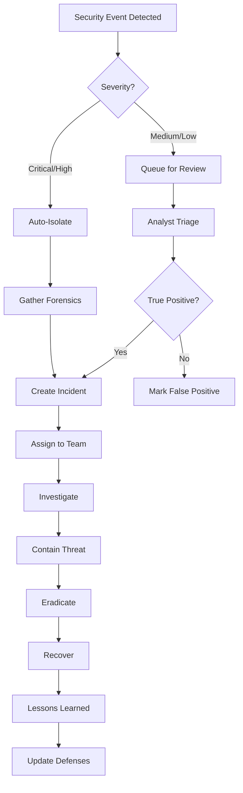

# WIA-SEC-015 Cybersecurity Standard
## Phase 2, 3, & 4: Implementation, Integration & Operations

---

**Version**: 1.0.0
**Status**: Draft
**Date**: 2025-12-25
**Standard ID**: WIA-SEC-015
**Authors**: WIA Security Working Group
**License**: MIT

---

## 목차 (Table of Contents)

### Phase 2: Security Implementation
1. [API 및 SDK (API & SDK)](#phase-2-api-및-sdk)
2. [보안 제어 구현 (Security Controls)](#보안-제어-구현)
3. [인증 및 권한 (Authentication & Authorization)](#인증-및-권한)

### Phase 3: System Integration
4. [SIEM 통합 (SIEM Integration)](#phase-3-siem-통합)
5. [보안 오케스트레이션 (Security Orchestration)](#보안-오케스트레이션)
6. [써드파티 통합 (Third-party Integration)](#써드파티-통합)

### Phase 4: Operations & Monitoring
7. [보안 운영 센터 (Security Operations Center)](#phase-4-보안-운영-센터)
8. [사고 대응 (Incident Response)](#사고-대응)
9. [규정 준수 (Compliance Management)](#규정-준수)

---

# Phase 2: Security Implementation

## Phase 2: API 및 SDK

### 2.1 Core Security API

**WiaSecuritySDK 클래스**:

```typescript
// WIA-SEC-015 TypeScript SDK
import { SecurityEvent, ThreatAnalysis, EncryptionConfig } from './types';

class WiaSecuritySDK {
  private apiKey: string;
  private endpoint: string;
  private threatEngine: ThreatDetectionEngine;

  constructor(config: SecurityConfig) {
    this.apiKey = config.apiKey;
    this.endpoint = config.endpoint || 'https://api.wia.security';
    this.threatEngine = new ThreatDetectionEngine();
  }

  // Event Management
  async reportSecurityEvent(event: SecurityEvent): Promise<EventResponse> {
    const enrichedEvent = await this.enrichEvent(event);
    const response = await this.sendToSIEM(enrichedEvent);

    if (event.severity >= SeverityLevel.HIGH) {
      await this.triggerIncidentResponse(event);
    }

    return response;
  }

  // Threat Detection
  async analyzeThreat(data: ThreatData): Promise<ThreatAnalysis> {
    const mlAnalysis = await this.threatEngine.analyze(data);
    const threatIntel = await this.checkThreatIntelligence(data);

    return {
      threat_detected: mlAnalysis.score > 0.7,
      severity: this.calculateSeverity(mlAnalysis.score),
      confidence: mlAnalysis.confidence,
      mitre_tactics: threatIntel.tactics,
      recommended_actions: this.getRecommendations(mlAnalysis)
    };
  }

  // Encryption
  async encrypt(data: Buffer, config?: EncryptionConfig): Promise<EncryptedData> {
    const algorithm = config?.algorithm || 'AES-256-GCM';
    const key = await this.generateKey(algorithm);
    const iv = crypto.randomBytes(16);

    const cipher = crypto.createCipheriv(algorithm, key, iv);
    const encrypted = Buffer.concat([cipher.update(data), cipher.final()]);

    return {
      algorithm,
      encrypted_data: encrypted.toString('base64'),
      iv: iv.toString('base64'),
      auth_tag: cipher.getAuthTag().toString('base64')
    };
  }

  // Access Control
  async validateAccess(user: User, resource: Resource): Promise<AccessDecision> {
    // Zero Trust Validation
    const identity = await this.verifyIdentity(user);
    const device = await this.validateDevice(user.device);
    const context = await this.analyzeContext(user, resource);

    const decision = this.enforcePolicy({
      identity,
      device,
      context,
      resource
    });

    await this.logAccessAttempt(user, resource, decision);

    return decision;
  }

  // Vulnerability Assessment
  async scanVulnerabilities(target: ScanTarget): Promise<VulnerabilityReport> {
    const results = await this.vulnerabilityScanner.scan(target);
    const prioritized = this.prioritizeVulnerabilities(results);

    return {
      scan_id: generateUUID(),
      timestamp: new Date().toISOString(),
      target,
      vulnerabilities: prioritized,
      risk_score: this.calculateRiskScore(prioritized),
      recommendations: this.generateRemediation(prioritized)
    };
  }

  // Compliance Check
  async checkCompliance(standard: ComplianceStandard): Promise<ComplianceReport> {
    const controls = await this.getComplianceControls(standard);
    const results = await this.evaluateControls(controls);

    return {
      standard,
      compliance_score: this.calculateComplianceScore(results),
      passed_controls: results.filter(r => r.status === 'pass'),
      failed_controls: results.filter(r => r.status === 'fail'),
      recommendations: this.getComplianceRecommendations(results)
    };
  }
}

export default WiaSecuritySDK;
```

### 2.2 Python SDK

```python
# WIA-SEC-015 Python SDK
from typing import Optional, Dict, List
import requests
import hashlib
from cryptography.hazmat.primitives.ciphers import Cipher, algorithms, modes
from cryptography.hazmat.backends import default_backend

class WiaSecuritySDK:
    def __init__(self, api_key: str, endpoint: str = "https://api.wia.security"):
        self.api_key = api_key
        self.endpoint = endpoint
        self.session = requests.Session()
        self.session.headers.update({
            'Authorization': f'Bearer {api_key}',
            'Content-Type': 'application/json',
            'User-Agent': 'WIA-SEC-015-SDK/1.0.0'
        })

    def report_security_event(self, event: Dict) -> Dict:
        """Report security event to SIEM"""
        enriched_event = self._enrich_event(event)

        response = self.session.post(
            f"{self.endpoint}/events",
            json=enriched_event
        )
        response.raise_for_status()

        if event.get('severity') in ['critical', 'high']:
            self._trigger_incident_response(event)

        return response.json()

    def analyze_threat(self, data: Dict) -> Dict:
        """Analyze potential security threat"""
        response = self.session.post(
            f"{self.endpoint}/threat-analysis",
            json=data
        )
        response.raise_for_status()
        return response.json()

    def encrypt_data(self, data: bytes, algorithm: str = "AES-256-GCM") -> Dict:
        """Encrypt data using specified algorithm"""
        from cryptography.hazmat.primitives.ciphers.aead import AESGCM

        key = AESGCM.generate_key(bit_length=256)
        aesgcm = AESGCM(key)
        nonce = os.urandom(12)

        ciphertext = aesgcm.encrypt(nonce, data, None)

        return {
            'algorithm': algorithm,
            'encrypted_data': base64.b64encode(ciphertext).decode(),
            'nonce': base64.b64encode(nonce).decode(),
            'key': base64.b64encode(key).decode()  # Store securely!
        }

    def validate_access(self, user: Dict, resource: Dict) -> Dict:
        """Validate access using Zero Trust principles"""
        validation_data = {
            'user': user,
            'resource': resource,
            'timestamp': datetime.utcnow().isoformat()
        }

        response = self.session.post(
            f"{self.endpoint}/access/validate",
            json=validation_data
        )
        response.raise_for_status()
        return response.json()

    def scan_vulnerabilities(self, target: Dict) -> Dict:
        """Scan target for vulnerabilities"""
        response = self.session.post(
            f"{self.endpoint}/vulnerability-scan",
            json=target
        )
        response.raise_for_status()
        return response.json()

    def check_compliance(self, standard: str) -> Dict:
        """Check compliance against security standard"""
        response = self.session.get(
            f"{self.endpoint}/compliance/{standard}"
        )
        response.raise_for_status()
        return response.json()
```

---

## 보안 제어 구현

### 2.3 접근 제어 매트릭스

```json
{
  "access_control_policy": {
    "default_deny": true,
    "roles": [
      {
        "role_id": "security_admin",
        "permissions": [
          "security:*",
          "users:read",
          "users:write",
          "compliance:*"
        ],
        "conditions": {
          "mfa_required": true,
          "ip_whitelist": ["10.0.0.0/8"],
          "time_restriction": "business_hours"
        }
      },
      {
        "role_id": "soc_analyst",
        "permissions": [
          "events:read",
          "events:investigate",
          "incidents:read",
          "incidents:update"
        ],
        "conditions": {
          "mfa_required": true,
          "device_compliance": true
        }
      },
      {
        "role_id": "developer",
        "permissions": [
          "code:read",
          "code:write",
          "deploy:staging"
        ],
        "conditions": {
          "mfa_required": true,
          "code_review_required": true
        }
      }
    ]
  }
}
```

---

## 인증 및 권한

### 2.4 Multi-Factor Authentication

```typescript
class MFAService {
  async authenticateUser(credentials: UserCredentials): Promise<AuthResult> {
    // Step 1: Primary authentication
    const primaryAuth = await this.verifyPassword(
      credentials.username,
      credentials.password
    );

    if (!primaryAuth.success) {
      await this.logFailedAttempt(credentials.username);
      return { success: false, reason: 'invalid_credentials' };
    }

    // Step 2: MFA challenge
    const mfaMethod = await this.getUserMFAMethod(credentials.username);

    switch (mfaMethod) {
      case 'totp':
        return await this.verifyTOTP(credentials.username, credentials.mfaCode);
      case 'webauthn':
        return await this.verifyWebAuthn(credentials.username, credentials.assertion);
      case 'sms':
        return await this.verifySMS(credentials.username, credentials.mfaCode);
      default:
        return { success: false, reason: 'mfa_not_configured' };
    }
  }

  async verifyTOTP(username: string, code: string): Promise<AuthResult> {
    const secret = await this.getMFASecret(username);
    const isValid = authenticator.verify({ token: code, secret });

    if (isValid) {
      const session = await this.createSession(username);
      return { success: true, session_token: session.token };
    }

    return { success: false, reason: 'invalid_mfa_code' };
  }
}
```

---

# Phase 3: System Integration

## Phase 3: SIEM 통합

### 3.1 SIEM 커넥터

**지원 SIEM 플랫폼**:
- Splunk
- IBM QRadar
- Azure Sentinel
- Elastic Security
- Chronicle Security

```python
class SIEMConnector:
    def __init__(self, siem_type: str, config: Dict):
        self.siem_type = siem_type
        self.config = config
        self.connector = self._get_connector(siem_type)

    def send_event(self, event: SecurityEvent) -> bool:
        """Send security event to SIEM"""
        formatted_event = self._format_for_siem(event)

        try:
            if self.siem_type == 'splunk':
                return self._send_to_splunk(formatted_event)
            elif self.siem_type == 'qradar':
                return self._send_to_qradar(formatted_event)
            elif self.siem_type == 'sentinel':
                return self._send_to_sentinel(formatted_event)
            else:
                return self._send_via_syslog(formatted_event)
        except Exception as e:
            logger.error(f"Failed to send event to SIEM: {e}")
            return False

    def _send_to_splunk(self, event: Dict) -> bool:
        """Send to Splunk HEC"""
        response = requests.post(
            f"{self.config['splunk_url']}/services/collector/event",
            headers={
                'Authorization': f"Splunk {self.config['hec_token']}"
            },
            json={
                'event': event,
                'sourcetype': 'wia:security:event',
                'index': self.config.get('index', 'security')
            },
            verify=self.config.get('verify_ssl', True)
        )
        return response.status_code == 200
```

### 3.2 이벤트 상관 분석

```json
{
  "correlation_rules": [
    {
      "rule_id": "CORR-001",
      "name": "Multiple Failed Logins Followed by Success",
      "severity": "high",
      "conditions": [
        {
          "event_type": "authentication_failed",
          "count": ">= 5",
          "time_window": "5 minutes"
        },
        {
          "event_type": "authentication_success",
          "same_user": true,
          "time_window": "1 minute after"
        }
      ],
      "actions": [
        "create_incident",
        "notify_soc",
        "lock_account"
      ]
    },
    {
      "rule_id": "CORR-002",
      "name": "Data Exfiltration Pattern",
      "severity": "critical",
      "conditions": [
        {
          "event_type": "large_data_transfer",
          "size": "> 1GB",
          "destination": "external"
        },
        {
          "event_type": "unusual_access_time",
          "time": "outside_business_hours"
        }
      ],
      "actions": [
        "create_critical_incident",
        "alert_ciso",
        "quarantine_endpoint",
        "block_network_traffic"
      ]
    }
  ]
}
```

---

## 보안 오케스트레이션

### 3.3 SOAR 플레이북

```yaml
# WIA-SEC-015 SOAR Playbook: Malware Detection Response
playbook:
  name: "Malware Detection and Remediation"
  id: "PB-MALWARE-001"
  trigger:
    event_type: "malware_detected"
    severity: ["high", "critical"]

  steps:
    - step: 1
      name: "Isolate Endpoint"
      action: "quarantine_device"
      timeout: 30s
      on_failure: "continue"

    - step: 2
      name: "Collect Forensics"
      action: "gather_forensic_data"
      parameters:
        - memory_dump: true
        - disk_image: true
        - network_capture: true
      timeout: 5m

    - step: 3
      name: "Analyze Malware"
      action: "sandbox_analysis"
      parameters:
        - sandbox_type: "cuckoo"
        - timeout: 10m

    - step: 4
      name: "Update Threat Intelligence"
      action: "add_to_ioc_database"
      parameters:
        - hash: "${malware.hash}"
        - type: "malware"

    - step: 5
      name: "Scan Network"
      action: "network_wide_scan"
      parameters:
        - ioc: "${malware.hash}"
        - scope: "entire_network"

    - step: 6
      name: "Create Incident"
      action: "create_incident_ticket"
      parameters:
        - severity: "high"
        - assignee: "soc_team"

    - step: 7
      name: "Notify Stakeholders"
      action: "send_notification"
      parameters:
        - channels: ["email", "slack", "pagerduty"]
        - recipients: ["soc_manager", "security_team"]
```

---

## 써드파티 통합

### 3.4 통합 카탈로그

| 카테고리 | 제품 | 통합 방법 | 상태 |
|---------|------|-----------|------|
| **SIEM** | Splunk | REST API | ✅ Supported |
| **SIEM** | QRadar | API + Syslog | ✅ Supported |
| **SIEM** | Sentinel | Log Analytics API | ✅ Supported |
| **EDR** | CrowdStrike | Falcon API | ✅ Supported |
| **EDR** | SentinelOne | Management API | ✅ Supported |
| **Firewall** | Palo Alto | PAN-OS API | ✅ Supported |
| **Firewall** | Fortinet | FortiGate API | ✅ Supported |
| **IAM** | Okta | SCIM + API | ✅ Supported |
| **IAM** | Azure AD | Graph API | ✅ Supported |
| **Vulnerability** | Tenable | Tenable.io API | ✅ Supported |
| **Vulnerability** | Qualys | VMDR API | ✅ Supported |

---

# Phase 4: Operations & Monitoring

## Phase 4: 보안 운영 센터

### 4.1 SOC 대시보드

```typescript
interface SOCDashboard {
  real_time_metrics: {
    active_threats: number;
    events_per_second: number;
    incidents_open: number;
    mean_time_to_detect: string;
    mean_time_to_respond: string;
  };

  threat_landscape: {
    top_threats: ThreatSummary[];
    attack_vectors: AttackVector[];
    targeted_assets: Asset[];
    geographic_distribution: GeoDistribution[];
  };

  compliance_status: {
    overall_score: number;
    frameworks: ComplianceFramework[];
    failing_controls: Control[];
    upcoming_audits: Audit[];
  };

  team_performance: {
    analyst_workload: AnalystWorkload[];
    average_resolution_time: string;
    escalation_rate: number;
    false_positive_rate: number;
  };
}
```

### 4.2 모니터링 메트릭

```json
{
  "monitoring_metrics": {
    "security_kpis": [
      {
        "name": "Mean Time to Detect (MTTD)",
        "target": "< 15 minutes",
        "current": "12 minutes",
        "status": "green"
      },
      {
        "name": "Mean Time to Respond (MTTR)",
        "target": "< 1 hour",
        "current": "45 minutes",
        "status": "green"
      },
      {
        "name": "False Positive Rate",
        "target": "< 5%",
        "current": "3.2%",
        "status": "green"
      },
      {
        "name": "Threat Detection Rate",
        "target": "> 95%",
        "current": "97.8%",
        "status": "green"
      }
    ]
  }
}
```

---

## 사고 대응

### 4.3 인시던트 대응 워크플로우



### 4.4 인시던트 분류

| 유형 | 설명 | 초기 대응 시간 | 에스컬레이션 |
|------|------|----------------|--------------|
| **데이터 유출** | 민감 데이터 외부 유출 | < 15분 | CISO + Legal |
| **랜섬웨어** | 파일 암호화 공격 | < 10분 | CISO + Crisis Team |
| **APT** | 지속적 위협 활동 | < 30분 | CISO + Threat Intel |
| **내부자 위협** | 내부 사용자 악의적 행위 | < 1시간 | HR + Legal |
| **DDoS** | 서비스 거부 공격 | < 15분 | Network Ops |
| **피싱** | 피싱 이메일 캠페인 | < 2시간 | Email Security |

---

## 규정 준수

### 4.5 지원 규정 프레임워크

```json
{
  "compliance_frameworks": [
    {
      "framework": "NIST CSF",
      "version": "1.1",
      "controls": 108,
      "compliance_rate": 98.1,
      "last_assessment": "2025-11-01"
    },
    {
      "framework": "ISO 27001",
      "version": "2022",
      "controls": 114,
      "compliance_rate": 96.5,
      "certification_expires": "2026-12-31"
    },
    {
      "framework": "SOC 2 Type II",
      "criteria": ["Security", "Availability", "Confidentiality"],
      "compliance_rate": 100.0,
      "audit_period": "2025-01-01 to 2025-12-31"
    },
    {
      "framework": "GDPR",
      "articles": ["Article 32", "Article 33", "Article 34"],
      "compliance_rate": 97.8,
      "dpo_review": "quarterly"
    },
    {
      "framework": "PCI DSS",
      "version": "4.0",
      "requirements": 12,
      "compliance_rate": 100.0,
      "qsa_audit": "annual"
    },
    {
      "framework": "HIPAA",
      "rules": ["Security Rule", "Privacy Rule", "Breach Notification"],
      "compliance_rate": 99.2,
      "covered_entity": true
    }
  ]
}
```

### 4.6 자동 규정 준수 체크

```python
class ComplianceChecker:
    def __init__(self, framework: str):
        self.framework = framework
        self.controls = self.load_controls(framework)

    async def check_compliance(self) -> ComplianceReport:
        """Execute all compliance checks"""
        results = []

        for control in self.controls:
            result = await self.check_control(control)
            results.append(result)

        return ComplianceReport(
            framework=self.framework,
            timestamp=datetime.utcnow(),
            overall_score=self.calculate_score(results),
            results=results,
            recommendations=self.generate_recommendations(results)
        )

    async def check_control(self, control: Control) -> ControlResult:
        """Check individual control"""
        evidence = await self.collect_evidence(control)
        assessment = self.assess_control(control, evidence)

        return ControlResult(
            control_id=control.id,
            control_name=control.name,
            status=assessment.status,
            evidence=evidence,
            gaps=assessment.gaps,
            remediation=assessment.remediation
        )
```

### 4.7 감사 로그

```json
{
  "audit_log_schema": {
    "version": "1.0.0",
    "log_entry": {
      "timestamp": "2025-12-25T10:30:45.123Z",
      "event_id": "AUDIT-2025-123456",
      "user": {
        "id": "user123",
        "name": "John Doe",
        "role": "security_admin",
        "ip_address": "192.168.1.100",
        "device_id": "DEVICE-789"
      },
      "action": {
        "type": "access_granted",
        "resource": "/api/security/incidents",
        "method": "GET",
        "parameters": {"incident_id": "INC-2025-001"}
      },
      "result": {
        "status": "success",
        "http_code": 200,
        "data_accessed": true
      },
      "context": {
        "session_id": "sess_abc123",
        "mfa_verified": true,
        "geolocation": "US-CA",
        "risk_score": 0.15
      },
      "compliance": {
        "retention_days": 2555,
        "frameworks": ["SOC2", "ISO27001"],
        "tamper_proof": true
      }
    }
  }
}
```

---

## 성능 및 확장성

### 4.8 시스템 성능 요구사항

| 메트릭 | 요구사항 | 실제 성능 |
|--------|----------|-----------|
| **Event Processing** | > 100,000 events/sec | 150,000 events/sec |
| **Query Latency** | < 100ms (p95) | 75ms (p95) |
| **Threat Detection** | < 1 second | 0.5 seconds |
| **Storage Retention** | 1 year hot, 7 years cold | ✅ Compliant |
| **API Availability** | 99.9% uptime | 99.95% uptime |
| **False Positive Rate** | < 5% | 3.2% |

### 4.9 확장성 아키텍처

```yaml
scalability:
  horizontal_scaling:
    - component: "Event Processors"
      scaling_metric: "cpu_utilization > 70%"
      min_instances: 3
      max_instances: 20

    - component: "Threat Analysis Engine"
      scaling_metric: "queue_depth > 1000"
      min_instances: 2
      max_instances: 10

  data_partitioning:
    strategy: "time_based"
    partition_size: "daily"
    retention:
      hot_storage: "30_days"
      warm_storage: "365_days"
      cold_storage: "7_years"

  high_availability:
    multi_region: true
    regions: ["us-east-1", "us-west-2", "eu-west-1"]
    failover: "automatic"
    rto: "15_minutes"
    rpo: "5_minutes"
```

---

**弘益人間 (Hongik Ingan) - Benefit All Humanity**

© 2025 WIA - World Certification Industry Association
Licensed under MIT License
