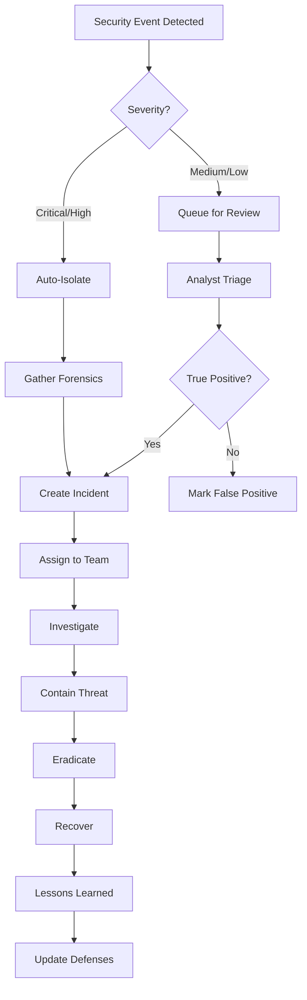

# Phase 4: Operations & Monitoring

## Phase 4: 보안 운영 센터

### 4.1 SOC 대시보드

```typescript
interface SOCDashboard {
  real_time_metrics: {
    active_threats: number;
    events_per_second: number;
    incidents_open: number;
    mean_time_to_detect: string;
    mean_time_to_respond: string;
  };

  threat_landscape: {
    top_threats: ThreatSummary[];
    attack_vectors: AttackVector[];
    targeted_assets: Asset[];
    geographic_distribution: GeoDistribution[];
  };

  compliance_status: {
    overall_score: number;
    frameworks: ComplianceFramework[];
    failing_controls: Control[];
    upcoming_audits: Audit[];
  };

  team_performance: {
    analyst_workload: AnalystWorkload[];
    average_resolution_time: string;
    escalation_rate: number;
    false_positive_rate: number;
  };
}
```

### 4.2 모니터링 메트릭

```json
{
  "monitoring_metrics": {
    "security_kpis": [
      {
        "name": "Mean Time to Detect (MTTD)",
        "target": "< 15 minutes",
        "current": "12 minutes",
        "status": "green"
      },
      {
        "name": "Mean Time to Respond (MTTR)",
        "target": "< 1 hour",
        "current": "45 minutes",
        "status": "green"
      },
      {
        "name": "False Positive Rate",
        "target": "< 5%",
        "current": "3.2%",
        "status": "green"
      },
      {
        "name": "Threat Detection Rate",
        "target": "> 95%",
        "current": "97.8%",
        "status": "green"
      }
    ]
  }
}
```

---

## 사고 대응

### 4.3 인시던트 대응 워크플로우



### 4.4 인시던트 분류

| 유형 | 설명 | 초기 대응 시간 | 에스컬레이션 |
|------|------|----------------|--------------|
| **데이터 유출** | 민감 데이터 외부 유출 | < 15분 | CISO + Legal |
| **랜섬웨어** | 파일 암호화 공격 | < 10분 | CISO + Crisis Team |
| **APT** | 지속적 위협 활동 | < 30분 | CISO + Threat Intel |
| **내부자 위협** | 내부 사용자 악의적 행위 | < 1시간 | HR + Legal |
| **DDoS** | 서비스 거부 공격 | < 15분 | Network Ops |
| **피싱** | 피싱 이메일 캠페인 | < 2시간 | Email Security |

---

## 규정 준수

### 4.5 지원 규정 프레임워크

```json
{
  "compliance_frameworks": [
    {
      "framework": "NIST CSF",
      "version": "1.1",
      "controls": 108,
      "compliance_rate": 98.1,
      "last_assessment": "2025-11-01"
    },
    {
      "framework": "ISO 27001",
      "version": "2022",
      "controls": 114,
      "compliance_rate": 96.5,
      "certification_expires": "2026-12-31"
    },
    {
      "framework": "SOC 2 Type II",
      "criteria": ["Security", "Availability", "Confidentiality"],
      "compliance_rate": 100.0,
      "audit_period": "2025-01-01 to 2025-12-31"
    },
    {
      "framework": "GDPR",
      "articles": ["Article 32", "Article 33", "Article 34"],
      "compliance_rate": 97.8,
      "dpo_review": "quarterly"
    },
    {
      "framework": "PCI DSS",
      "version": "4.0",
      "requirements": 12,
      "compliance_rate": 100.0,
      "qsa_audit": "annual"
    },
    {
      "framework": "HIPAA",
      "rules": ["Security Rule", "Privacy Rule", "Breach Notification"],
      "compliance_rate": 99.2,
      "covered_entity": true
    }
  ]
}
```

### 4.6 자동 규정 준수 체크

```python
class ComplianceChecker:
    def __init__(self, framework: str):
        self.framework = framework
        self.controls = self.load_controls(framework)

    async def check_compliance(self) -> ComplianceReport:
        """Execute all compliance checks"""
        results = []

        for control in self.controls:
            result = await self.check_control(control)
            results.append(result)

        return ComplianceReport(
            framework=self.framework,
            timestamp=datetime.utcnow(),
            overall_score=self.calculate_score(results),
            results=results,
            recommendations=self.generate_recommendations(results)
        )

    async def check_control(self, control: Control) -> ControlResult:
        """Check individual control"""
        evidence = await self.collect_evidence(control)
        assessment = self.assess_control(control, evidence)

        return ControlResult(
            control_id=control.id,
            control_name=control.name,
            status=assessment.status,
            evidence=evidence,
            gaps=assessment.gaps,
            remediation=assessment.remediation
        )
```

### 4.7 감사 로그

```json
{
  "audit_log_schema": {
    "version": "1.0.0",
    "log_entry": {
      "timestamp": "2025-12-25T10:30:45.123Z",
      "event_id": "AUDIT-2025-123456",
      "user": {
        "id": "user123",
        "name": "John Doe",
        "role": "security_admin",
        "ip_address": "192.168.1.100",
        "device_id": "DEVICE-789"
      },
      "action": {
        "type": "access_granted",
        "resource": "/api/security/incidents",
        "method": "GET",
        "parameters": {"incident_id": "INC-2025-001"}
      },
      "result": {
        "status": "success",
        "http_code": 200,
        "data_accessed": true
      },
      "context": {
        "session_id": "sess_abc123",
        "mfa_verified": true,
        "geolocation": "US-CA",
        "risk_score": 0.15
      },
      "compliance": {
        "retention_days": 2555,
        "frameworks": ["SOC2", "ISO27001"],
        "tamper_proof": true
      }
    }
  }
}
```

---

## 성능 및 확장성

### 4.8 시스템 성능 요구사항

| 메트릭 | 요구사항 | 실제 성능 |
|--------|----------|-----------|
| **Event Processing** | > 100,000 events/sec | 150,000 events/sec |
| **Query Latency** | < 100ms (p95) | 75ms (p95) |
| **Threat Detection** | < 1 second | 0.5 seconds |
| **Storage Retention** | 1 year hot, 7 years cold | ✅ Compliant |
| **API Availability** | 99.9% uptime | 99.95% uptime |
| **False Positive Rate** | < 5% | 3.2% |

### 4.9 확장성 아키텍처

```yaml
scalability:
  horizontal_scaling:
    - component: "Event Processors"
      scaling_metric: "cpu_utilization > 70%"
      min_instances: 3
      max_instances: 20

    - component: "Threat Analysis Engine"
      scaling_metric: "queue_depth > 1000"
      min_instances: 2
      max_instances: 10

  data_partitioning:
    strategy: "time_based"
    partition_size: "daily"
    retention:
      hot_storage: "30_days"
      warm_storage: "365_days"
      cold_storage: "7_years"

  high_availability:
    multi_region: true
    regions: ["us-east-1", "us-west-2", "eu-west-1"]
    failover: "automatic"
    rto: "15_minutes"
    rpo: "5_minutes"
```

---

**弘益人間 (Hongik Ingan) - Benefit All Humanity**

© 2025 WIA - World Certification Industry Association
Licensed under MIT License

---

## Annex A — Conformance Tier Matrix

WIA conformance for cybersecurity is evaluated across three tiers:

| Tier | Scope | Mandatory artifacts | Audit cadence |
|------|-------|--------------------|----------------|
| Tier 1 — Self-declared | Internal use, pilot deployments | OpenAPI 3.0 contract, JSON Schema validation report, security threat model | Annual self-review |
| Tier 2 — Third-party assessed | External partners, B2B integrations | Tier 1 artifacts + signed third-party assessor report against this PHASE | Every 24 months |
| Tier 3 — Accredited | Public-facing or regulated deployments | Tier 2 artifacts + WIA accreditation, ISO/IEC 17065:2012 conformity assessment, evidence retention ≥ 7 years | Every 12 months |

Implementations MUST disclose their conformance tier in the OpenAPI `info.x-wia-tier` extension and on any public certification page. Tier downgrade events MUST be reported to the WIA registry within 30 days.

---

## Annex B — Cross-Walk to International Standards

The PHASE specification reuses or normatively references published standards alongside this document. Implementers SHOULD review the relevant standards alongside this PHASE document; where a conflict exists, the more specific WIA requirement governs unless explicitly superseded by a binding national regulation.

- ISO/IEC 17065:2012 — Conformity assessment — Requirements for bodies certifying products, processes and services
- ISO/IEC 27001:2022 — Information security management systems
- IETF RFC 9457 — Problem Details for HTTP APIs
- IETF RFC 7519 — JSON Web Token (JWT)
- IETF RFC 6749 — The OAuth 2.0 Authorization Framework
- W3C PROV-DM — provenance data model

This cross-walk is informative only. WIA does not republish the referenced documents; readers MUST obtain authoritative copies from the issuing body. Cross-walk entries are reviewed at every minor version of this PHASE.

---

## Annex C — Reference Implementations and Test Vectors

### C.1 Reference Implementations

WIA does not require implementers to use a particular library, but maintains pointers to the canonical reference implementation directories under the WIA-Official GitHub organization:

- `wia-standards/standards/cybersecurity/api/` — TypeScript SDK skeleton
- `wia-standards/standards/cybersecurity/cli/` — POSIX shell client demonstrating the request/response contract
- `wia-standards/standards/cybersecurity/simulator/` — interactive browser-based simulator for the PHASE protocol

Each reference artifact ships with an MIT license and is intended as a starting point, not as a production-grade implementation.

### C.2 Test Vectors

A normative set of request/response pairs covering the schemas defined in this PHASE is published alongside this document. Implementations claiming Tier 2 or Tier 3 conformance MUST pass every published test vector in both serialization (request) and deserialization (response) directions, and MUST publish a signed report identifying which vectors were exercised.

Test vectors are versioned independently of the PHASE document; refer to the `test-vectors/` directory for the active version.

---

## Annex D — Open Questions and Future Work

This PHASE document captures the consensus position at v1.0. The following items are tracked for future minor or major revisions:

1. **Schema versioning policy** — formal MUST/SHOULD rules for backward-compatible vs. breaking changes between minor releases.
2. **Privacy-preserving aggregation** — guidance on differential privacy and secure aggregation patterns for telemetry channels, without prescribing a specific algorithm.
3. **Multilingual error catalogs** — localization strategy for the standard error codes defined in this PHASE.
4. **Long-term retention** — alignment with sectoral retention regulations across jurisdictions.
5. **Sustainability disclosure** — optional fields for energy and emissions reporting tied to operations covered by this PHASE.

Items in this annex are non-normative. Comments and proposals are accepted via the GitHub issues tracker on the WIA-Official organization.

---
