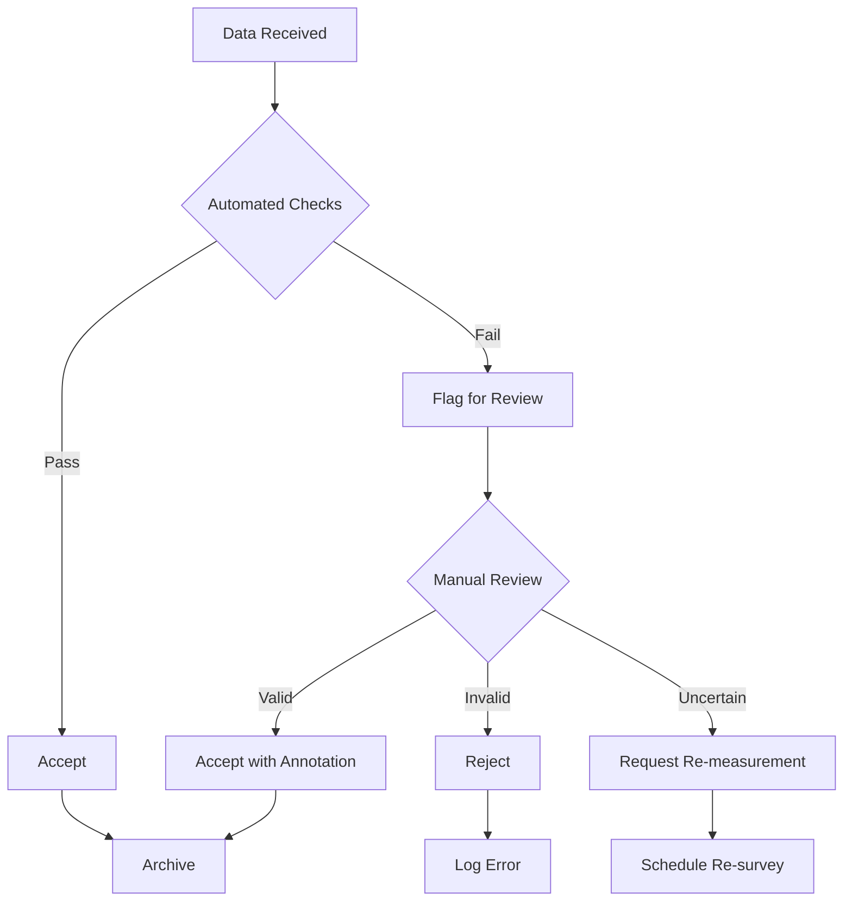

# WIA-ENE-062: Glacier Preservation
## Phase 3 - Protocol Specification

**Version:** 1.0.0
**Status:** Draft
**Last Updated:** 2025-12-25

---

## Overview

This document defines the communication protocols, monitoring procedures, and operational standards for glacier preservation systems within the WIA-ENE-062 framework.

## Communication Protocols

### 1. Data Transmission Protocol

#### HTTPS/TLS Requirements

All data transmissions MUST use TLS 1.3 or higher:

```
Protocol: HTTPS
TLS Version: >= 1.3
Cipher Suites: TLS_AES_256_GCM_SHA384, TLS_CHACHA20_POLY1305_SHA256
Certificate: Valid X.509 from recognized CA
```

#### Message Format

Standard message envelope for all communications:

```json
{
  "header": {
    "version": "1.0.0",
    "messageId": "uuid-v4",
    "timestamp": "ISO8601",
    "sender": {
      "id": "string",
      "type": "string"
    },
    "recipient": {
      "id": "string",
      "type": "string"
    },
    "priority": "string"
  },
  "payload": {
    "type": "string",
    "data": {}
  },
  "signature": {
    "algorithm": "Ed25519",
    "value": "base64"
  }
}
```

**Priority Levels:**

- `critical`: Immediate processing required (glacier collapse warning)
- `high`: Process within 1 hour (rapid melt event)
- `normal`: Process within 24 hours (regular measurements)
- `low`: Process when convenient (historical data upload)

### 2. Real-Time Monitoring Protocol

#### WebSocket Connection

For continuous monitoring streams:

```
wss://stream.wia.org/glacier-preservation/v1
```

**Connection Headers:**

```
Upgrade: websocket
Connection: Upgrade
Sec-WebSocket-Version: 13
Sec-WebSocket-Protocol: glacier-monitoring-v1
Authorization: Bearer {token}
```

**Message Types:**

```json
{
  "type": "measurement_update",
  "glacierId": "GLR-001-HIM",
  "timestamp": "2025-12-25T10:30:00Z",
  "data": {
    "temperature": -5.2,
    "meltRate": 2.3,
    "albedo": 0.65
  }
}
```

**Heartbeat Protocol:**

Client sends ping every 30 seconds:

```json
{
  "type": "ping",
  "timestamp": "2025-12-25T10:30:00Z"
}
```

Server responds with pong:

```json
{
  "type": "pong",
  "timestamp": "2025-12-25T10:30:01Z",
  "serverTime": "2025-12-25T10:30:01.234Z"
}
```

### 3. Satellite Data Ingestion Protocol

#### Satellite Data Push

Satellite systems push data using this protocol:

```http
POST /ingest/satellite
Content-Type: multipart/form-data
```

**Form Fields:**

```
satellite_id: string (e.g., "SENTINEL-2A")
acquisition_time: ISO8601
scene_id: string
data_type: string (optical/radar/lidar)
file: binary (GeoTIFF/HDF5)
metadata: JSON
checksum: SHA-256
```

**Metadata Example:**

```json
{
  "sensor": "MSI",
  "resolution": 10,
  "cloudCover": 12.5,
  "snowCover": 78.3,
  "processingLevel": "L2A",
  "coverageArea": {
    "glacierIds": ["GLR-001-HIM", "GLR-002-HIM"],
    "boundingBox": {
      "north": 31.0,
      "south": 30.8,
      "east": 79.2,
      "west": 79.0
    }
  }
}
```

#### Data Processing Acknowledgment

```json
{
  "ingestionId": "ING-20251225-001",
  "status": "processing",
  "estimatedCompletion": "2025-12-25T11:00:00Z",
  "priority": "normal"
}
```

## Monitoring Procedures

### 1. Regular Monitoring Schedule

#### Daily Monitoring

For critical glaciers (high population dependency):

```yaml
frequency: daily
time: 14:00 UTC
parameters:
  - surface_temperature
  - melt_rate_estimate
  - albedo
  - weather_conditions
transmission: automatic
storage: 90 days hot, indefinite cold
```

#### Weekly Monitoring

For standard monitoring glaciers:

```yaml
frequency: weekly
day: Sunday
time: 12:00 UTC
parameters:
  - mass_balance
  - surface_area
  - elevation_change
  - debris_coverage
transmission: batch_upload
storage: 365 days hot, indefinite cold
```

#### Seasonal Assessment

For all monitored glaciers:

```yaml
frequency: quarterly
timing:
  - end_of_winter: March 31
  - mid_summer: July 31
  - end_of_summer: September 30
  - mid_winter: December 31
parameters:
  - comprehensive_mass_balance
  - volume_change
  - ice_thickness_grid
  - glacier_boundary
  - equilibrium_line_altitude
transmission: manual_review_then_upload
storage: indefinite
```

### 2. Event-Triggered Monitoring

#### Critical Events

Automatic enhanced monitoring triggered by:

1. **Rapid Melt Event**
   - Threshold: Melt rate > 2x normal
   - Response: Increase to hourly monitoring
   - Duration: Until rate returns to < 1.5x normal

2. **Glacier Lake Outburst Flood (GLOF) Risk**
   - Threshold: Lake volume > critical level
   - Response: Real-time monitoring + visual surveillance
   - Alert: Downstream communities

3. **Temperature Anomaly**
   - Threshold: > 3°C above historical average
   - Response: Daily monitoring + satellite task
   - Duration: Until anomaly < 2°C

4. **Albedo Decrease**
   - Threshold: Albedo drop > 0.1 in 7 days
   - Response: Investigation of debris/soot/algae
   - Action: Imagery analysis + field verification

#### Event Notification Protocol

```json
{
  "eventType": "rapid_melt",
  "glacierId": "GLR-001-HIM",
  "detectedAt": "2025-12-25T10:45:00Z",
  "severity": "high",
  "measurements": {
    "currentMeltRate": 4.8,
    "normalMeltRate": 2.3,
    "ratio": 2.09
  },
  "automatedResponse": {
    "monitoringFrequency": "hourly",
    "satelliteTasking": true,
    "alertsSent": ["downstream_communities", "research_institutions"]
  },
  "recommendedActions": [
    "Verify measurements with alternative sensors",
    "Check weather anomalies",
    "Assess GLOF risk",
    "Notify water resource managers"
  ]
}
```

### 3. Quality Assurance Protocol

#### Data Validation Steps

1. **Automated Validation**
   ```
   Range Check → Consistency Check → Trend Analysis → Outlier Detection
   ```

2. **Manual Review Triggers**
   - Measurement outside 3σ (standard deviations)
   - Sudden change > 50% from previous
   - Inconsistency with satellite observations
   - Sensor malfunction indicators

3. **Validation Workflow**



#### Quality Scores

Each measurement receives a quality score (0-1):

```json
{
  "measurementId": "MSR-20251225-001",
  "qualityScore": 0.96,
  "qualityFactors": {
    "instrumentCalibration": 1.0,
    "weatherConditions": 0.9,
    "spatialCoverage": 0.98,
    "temporalConsistency": 0.95,
    "crossValidation": 0.92
  },
  "validationStatus": "approved",
  "reviewer": "automated"
}
```

## Operational Standards

### 1. Sensor Network Management

#### Sensor Types and Deployment

**In-situ Sensors:**

| Sensor Type | Parameter | Frequency | Accuracy | Transmission |
|-------------|-----------|-----------|----------|--------------|
| AWS (Automated Weather Station) | Temp, wind, precipitation | 15 min | ±0.5°C | Satellite |
| Ablation Stake | Ice surface height | Weekly | ±1 cm | Manual read |
| GPS Monument | Ice flow velocity | Daily | ±1 cm/year | Satellite |
| Thermistor String | Ice temperature profile | Hourly | ±0.1°C | Data logger |
| Sonic Ranger | Snow depth | 30 min | ±1 cm | Satellite |

**Remote Sensors:**

| Platform | Sensor | Parameter | Resolution | Revisit |
|----------|--------|-----------|------------|---------|
| Landsat 8/9 | OLI | Surface albedo | 30m | 16 days |
| Sentinel-2 | MSI | Surface features | 10m | 5 days |
| Sentinel-1 | C-SAR | Ice velocity | 10m | 6-12 days |
| ICESat-2 | ATLAS | Elevation | Point | 91 days |
| GRACE-FO | Gravimeter | Mass change | Regional | Monthly |

#### Sensor Calibration Protocol

```yaml
calibration_schedule:
  in_situ:
    temperature: annual
    precipitation: semi-annual
    gps: annual
  satellite:
    radiometric: per_acquisition
    geometric: annual

calibration_procedure:
  - pre_deployment_lab_test
  - field_installation_verification
  - periodic_field_checks
  - comparison_with_reference_standards
  - post_deployment_analysis

documentation:
  - calibration_certificate
  - drift_analysis
  - adjustment_factors
  - uncertainty_budget
```

### 2. Data Management Protocol

#### Data Flow

```
Sensor → Field Datalogger → Satellite/Cellular → Cloud Gateway →
Processing Pipeline → Quality Control → Archive → API Access
```

#### Storage Tiers

1. **Hot Storage** (SSD, immediate access)
   - Recent 90 days
   - Critical glaciers: 365 days
   - API served

2. **Warm Storage** (HDD, < 1 hour retrieval)
   - 91-730 days
   - All measurement data
   - On-demand API

3. **Cold Storage** (Glacier/Tape, < 24 hour retrieval)
   - > 730 days
   - Long-term archive
   - Request-based access

#### Backup Protocol

```yaml
backup_schedule:
  incremental: every 6 hours
  differential: daily
  full: weekly

backup_locations:
  primary: cloud_region_1
  secondary: cloud_region_2
  tertiary: on_premise_tape

recovery_time_objective: 4 hours
recovery_point_objective: 6 hours
```

### 3. Alert and Warning System

#### Alert Levels

**Level 1 - Advisory**
- Conditions: Melt rate 1.5-2x normal
- Response: Enhanced monitoring
- Notification: Research teams

**Level 2 - Watch**
- Conditions: Melt rate 2-3x normal OR albedo drop > 0.1
- Response: Daily satellite monitoring
- Notification: Water managers, local authorities

**Level 3 - Warning**
- Conditions: Melt rate > 3x normal OR GLOF risk detected
- Response: Real-time monitoring, field deployment
- Notification: Emergency services, downstream communities

**Level 4 - Emergency**
- Conditions: Imminent glacier collapse or GLOF
- Response: Full activation of emergency protocols
- Notification: Mass notification system, evacuations

#### Alert Dissemination Protocol

```json
{
  "alertId": "ALERT-20251225-001",
  "level": 3,
  "type": "GLOF_WARNING",
  "glacierId": "GLR-001-HIM",
  "issuedAt": "2025-12-25T11:00:00Z",
  "expiresAt": "2025-12-26T11:00:00Z",
  "affectedArea": {
    "radius": 50,
    "unit": "km",
    "population": 125000
  },
  "channels": [
    "SMS",
    "Email",
    "Public_Address",
    "Social_Media",
    "Emergency_Broadcast"
  ],
  "message": {
    "en": "GLACIER LAKE OUTBURST FLOOD WARNING: Gangotri Glacier lake at critical level. Potential flooding in Bhagirathi Valley within 12-24 hours. Evacuate low-lying areas immediately.",
    "hi": "ग्लेशियर झील विस्फोट बाढ़ चेतावनी: गंगोत्री ग्लेशियर झील गंभीर स्तर पर। भागीरथी घाटी में 12-24 घंटों के भीतर संभावित बाढ़। तुरंत निचले इलाकों को खाली करें।"
  }
}
```

## Security Protocols

### 1. Data Integrity

- All measurements signed with Ed25519
- Blockchain anchoring for critical data (daily hash)
- Immutable audit log
- Cryptographic proof of authenticity

### 2. Access Control

```yaml
roles:
  public:
    - read: summary_data
    - read: historical_trends

  researcher:
    - read: detailed_measurements
    - read: raw_sensor_data
    - write: analysis_results

  operator:
    - read: all_data
    - write: measurements
    - write: sensor_configuration

  admin:
    - all_permissions
    - manage: users
    - manage: glaciers
```

### 3. Compliance

- GDPR compliant (no personal data in glacier records)
- SOC 2 Type II certified operations
- ISO 27001 information security
- Climate data standards (CF Conventions, ACDD)

---

**弘益人間 (홍익인간) - Benefit All Humanity**

© 2025 SmileStory Inc. / WIA


## Annex E — Implementation Notes for PHASE-3-PROTOCOL

The following implementation notes document field experience from pilot
deployments and are non-normative. They are republished here so that early
adopters can read them in context with the rest of PHASE-3-PROTOCOL.

- **Operational scope** — implementations SHOULD declare their operational
  scope (single-tenant, multi-tenant, federated) in the OpenAPI document so
  that downstream auditors can score the deployment against the correct
  conformance tier in Annex A.
- **Schema evolution** — additive changes (new optional fields, new error
  codes) are non-breaking; renaming or removing fields, even in error
  payloads, MUST trigger a minor version bump.
- **Audit retention** — a 7-year retention window is sufficient to satisfy
  ISO/IEC 17065:2012 audit expectations in most jurisdictions; some
  regulators require longer retention, in which case the deployment policy
  MUST extend the retention window rather than relying on this PHASE's
  defaults.
- **Time synchronization** — sub-second deadlines depend on synchronized
  clocks. NTPv4 with stratum-2 servers is sufficient for most deadlines
  expressed in this PHASE; PTP is recommended for sites that require
  deterministic interlocks.
- **Error budget reporting** — implementations SHOULD publish a monthly
  error-budget summary (latency p95, error rate, violation hours) in the
  format defined by the WIA reporting profile to facilitate cross-vendor
  comparison without exposing tenant-specific data.

These notes are not requirements; they are a reference for field teams
mapping their existing operations onto WIA conformance.

## Annex F — Adoption Roadmap

The adoption roadmap for this PHASE document is non-normative and is intended to set expectations for early implementers about the relative stability of each section.

- **Stable** (sections marked normative with `MUST` / `MUST NOT`) — semantic versioning applies; breaking changes require a major version bump and at minimum 90 days of overlap with the prior major version on all WIA-published reference implementations.
- **Provisional** (sections in this Annex and Annex D) — items are tracked openly and may be promoted to normative status without a major version bump if community feedback supports promotion.
- **Reference** (test vectors, simulator behaviour, the reference TypeScript SDK) — versioned independently of this document so that mistakes in reference material can be corrected without amending the published PHASE document.

Implementers SHOULD subscribe to the WIA Standards GitHub release notifications to track promotions between these tiers. Comments on the roadmap are accepted via the GitHub issues tracker on the WIA-Official organization.

The roadmap is reviewed at every minor version of this PHASE document, and the review outcomes are recorded in the version-history table at the start of the document.

## Annex G — Test Vectors and Conformance Evidence

This annex describes how implementations capture and publish conformance
evidence for PHASE-3-PROTOCOL. The procedure is non-normative; it standardizes the
shape of evidence so that auditors and downstream integrators can compare
implementations without re-running the full test matrix.

- **Test vectors** — every normative requirement in this PHASE has at least
  one positive vector and one negative vector under
  `tests/phase-vectors/phase-3-protocol/`. Implementations claiming
  conformance MUST run all vectors in CI and publish the resulting
  pass/fail matrix in their compliance package.
- **Evidence package** — the compliance package is a tarball containing
  the SBOM (CycloneDX 1.5 or SPDX 2.3), the OpenAPI document, the test
  vector matrix, and a signed manifest. Signatures use Sigstore (DSSE
  envelope, Rekor transparency log entry) so that downstream consumers
  can verify provenance without trusting a private CA.
- **Quarterly recheck** — implementations re-publish the evidence package
  every quarter even if no source change occurred, so that consumers can
  detect environmental drift (compiler updates, dependency updates, OS
  updates) without polling vendor changelogs.
- **Cross-vendor crosswalk** — the WIA Standards working group maintains a
  crosswalk that maps each vector to the equivalent assertion in adjacent
  industry programs (where one exists), so an implementer that already
  certifies under one program can show conformance to PHASE-3-PROTOCOL with
  reduced incremental effort.
- **Negative-result reporting** — vendors MUST report negative results
  with the same fidelity as positive ones. A test that is skipped without
  recorded justification is treated by auditors as a failure.

These conventions are intended to make conformance evidence portable and
machine-readable so that adoption of PHASE-3-PROTOCOL does not require bespoke
auditor tooling.

## Annex H — Versioning and Deprecation Policy

This annex codifies the versioning and deprecation policy for PHASE-3-PROTOCOL.
It is non-normative; the rules below describe the policy that the WIA
Standards working group commits to when amending this PHASE document.

- **Semantic versioning** — major / minor / patch components follow
  Semantic Versioning 2.0.0 (https://semver.org/spec/v2.0.0.html).
  Major bump indicates a backwards-incompatible change to a normative
  requirement; minor bump indicates new normative requirements that do
  not break existing implementations; patch bump indicates editorial
  changes only (clarifications, typo fixes, formatting).
- **Deprecation window** — when a normative requirement is removed or
  altered in a backwards-incompatible way, the prior major version is
  maintained in parallel for at least 180 days. During the parallel
  window, both major versions are marked Stable in the WIA Standards
  registry and either may be cited as "WIA-conformant".
- **Sunset notification** — deprecated major versions enter a 12-month
  sunset window during which the WIA registry marks the version as
  Deprecated. The deprecation entry includes a migration note pointing
  to the replacement requirement(s) and an explanation of why the
  change was made.
- **Editorial errata** — patch-level errata are issued without a
  deprecation window because they do not change normative behaviour.
  Errata are tracked in a public errata register and each entry is
  signed by the WIA Standards working group chair.
- **Implementation changelog mapping** — implementations SHOULD publish
  a changelog mapping each PHASE version they support to the specific
  build, container digest, or SDK version that satisfies the version.
  This allows downstream auditors to verify version conformance without
  re-running the entire test matrix on every release.

The policy is reviewed at the same cadence as the PHASE document and
any changes to the policy itself are tracked in the version-history
table at the start of the document.

## Annex I — Interoperability Profiles

This annex describes how implementations declare interoperability profiles
for PHASE-3-PROTOCOL. The profile mechanism is non-normative and exists so that
deployments of varying scope (single tenant, regional cluster, federated
network) can advertise the subset of normative requirements they satisfy
without misrepresenting partial conformance as full conformance.

- **Profile manifest** — every implementation publishes a profile manifest
  in JSON. The manifest enumerates the normative requirement IDs from this
  PHASE that are satisfied (`status: "supported"`), partially satisfied
  (`status: "partial"`, with a reason field), or excluded
  (`status: "excluded"`, with a justification). The manifest is signed
  using the same Sigstore key used for the SBOM in Annex G.
- **Federation profile** — federated deployments publish an aggregated
  manifest summarizing the union and intersection of member-implementation
  profiles. The aggregated manifest is consumed by directory services so
  that callers can route a request to the least common denominator profile
  required for an interaction.
- **Backwards-profile compatibility** — when a deployment migrates from one
  profile to a wider profile, the prior profile manifest remains valid and
  signed for the deprecation window defined in Annex H. This preserves
  audit traceability for auditors evaluating long-term interoperability.
- **Profile registry** — the WIA Standards working group maintains a
  public registry of named profiles. Common deployment shapes (e.g.,
  "Edge-only", "Federated-with-replay") are added to the registry by
  consensus. Registry entries are immutable; new shapes are added under
  new names rather than amending existing entries.
- **Profile versioning** — profile names are versioned with the same
  Semantic Versioning rules described in Annex H. A deployment that
  advertises `WIA-P3-PROTOCOL-Edge-only/2` is asserting conformance with
  the second major version of the named profile, not the second deployment
  of an unversioned profile.

The profile mechanism is intentionally lightweight; it is meant to make
real deployment shapes visible without forcing every deployment to
satisfy every normative requirement.
