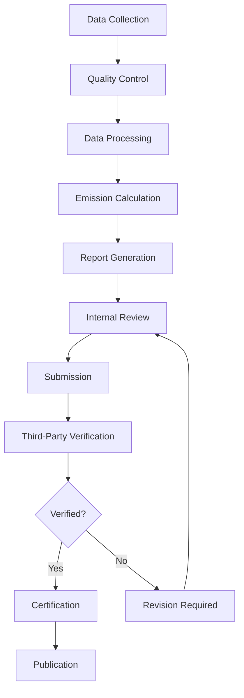

# WIA-ENE-051: Greenhouse Gas Monitoring Standard
## Phase 3: Protocol Specification

---

**Version**: 1.0.0
**Status**: Complete
**Date**: 2025-01
**Authors**: WIA Standards Committee
**License**: MIT
**Primary Color**: #EF4444 (Red)

---

## Table of Contents

1. [Overview](#overview)
2. [MRV Protocol](#mrv-protocol)
3. [Measurement Protocols](#measurement-protocols)
4. [Reporting Protocols](#reporting-protocols)
5. [Verification Protocols](#verification-protocols)
6. [Quality Assurance/Quality Control](#quality-assurancequality-control)
7. [Data Submission Workflows](#data-submission-workflows)
8. [API Specifications](#api-specifications)
9. [Security & Privacy](#security--privacy)
10. [Compliance Validation](#compliance-validation)

---

## Overview

### 1.1 Purpose

This specification defines the operational protocols for greenhouse gas monitoring, reporting, and verification (MRV), ensuring consistent, transparent, and verifiable climate data collection and reporting.

**Protocol Coverage**:
- Measurement standard operating procedures (SOPs)
- Reporting templates and submission workflows
- Verification and audit procedures
- QA/QC protocols
- API interfaces for data exchange

### 1.2 Protocol Hierarchy

```
MRV Framework
├── Measurement (M)
│   ├── Satellite observation protocols
│   ├── Ground station SOPs
│   ├── Emission calculation methods
│   └── QA/QC procedures
│
├── Reporting (R)
│   ├── Data formatting standards
│   ├── Submission workflows
│   ├── Transparency requirements
│   └── Uncertainty quantification
│
└── Verification (V)
    ├── Third-party audit procedures
    ├── Validation checks
    ├── Compliance certification
    └── Dispute resolution
```

---

## MRV Protocol

### 2.1 MRV Lifecycle



### 2.2 MRV Roles & Responsibilities

| Role | Responsibility | Qualifications |
|------|----------------|----------------|
| **Data Provider** | Collect measurements, ensure quality | Calibrated equipment, trained staff |
| **Inventory Compiler** | Calculate emissions, generate reports | IPCC methodology expertise |
| **Internal Reviewer** | QC checks, consistency review | Subject matter expert |
| **Third-Party Verifier** | Independent audit, certification | ISO 14065 accreditation |
| **Reporting Entity** | Submit to UNFCCC, publish data | National authority |

### 2.3 MRV Timeline (Annual Cycle)

```
Jan-Mar: Data collection & QC
Apr-Jun: Emission calculations
Jul-Sep: Report drafting & internal review
Oct-Dec: Verification & submission
Apr (Year+1): UNFCCC submission deadline
```

---

## Measurement Protocols

### 3.1 Satellite Measurement Protocol

**Standard Operating Procedure**:

1. **Data Acquisition**
   - Retrieve L1B radiances from data center
   - Download ancillary data (meteorology, surface properties)
   - Check data completeness and quality flags

2. **Retrieval Processing**
   - Apply retrieval algorithm (e.g., ACOS, RemoTeC)
   - Generate XCO2, XCH4 column estimates
   - Calculate uncertainty and quality flags

3. **Quality Filtering**
   - Apply cloud screening (cloud fraction < 0.1)
   - Filter by solar zenith angle (< 70°)
   - Remove high aerosol scenes (AOD < 0.3)
   - Validate surface pressure retrieval

4. **Validation**
   - Compare with TCCON ground truth
   - Check against model expectations
   - Cross-validate between satellites

**Quality Criteria**:
```yaml
satellite_qc:
  cloud_fraction: "<0.1"
  solar_zenith_angle: "<70 degrees"
  aerosol_optical_depth: "<0.3"
  surface_type: "land or ocean"
  retrieval_convergence: true
  xco2_uncertainty: "<1.5 ppm"
  surface_pressure_error: "<2 hPa"
```

### 3.2 Ground Station Protocol

**NOAA Flask Sampling SOP**:

1. **Sample Collection**
   - Use clean, pre-evacuated flasks
   - Sample at designated times (local afternoon)
   - Record meteorological conditions
   - Duplicate samples for QC

2. **Chain of Custody**
   - Seal and label flasks immediately
   - Log sample ID, time, conditions
   - Ship to analysis lab within 7 days

3. **Laboratory Analysis**
   - Analyze within 30 days of collection
   - Run against WMO-traceable standards
   - Repeat measurements for precision check
   - Record instrument status and calibration

4. **Data Validation**
   - Check for outliers (±3σ)
   - Compare with climatology
   - Flag suspicious data
   - Document any issues

**Calibration Requirements**:
- Frequency: Monthly for in-situ, per flask for sampling
- Standards: WMO-traceable reference gases
- Traceability: Documented calibration hierarchy
- Uncertainty: ±0.1 ppm (CO2), ±2 ppb (CH4)

### 3.3 Emission Calculation Protocol

**IPCC Tier System**:

| Tier | Method | Data Requirements | Uncertainty |
|------|--------|-------------------|-------------|
| **Tier 1** | Default IPCC factors | Activity data only | ±50% |
| **Tier 2** | Country-specific factors | National factors, good AD | ±20% |
| **Tier 3** | Detailed models | Facility-level data, models | ±10% |

**Calculation Workflow**:

```python
# Tier 1 Example: Energy Sector CO2
def calculate_emissions_tier1(activity_data_TJ, fuel_type):
    """
    Calculate CO2 emissions using IPCC Tier 1 method

    Args:
        activity_data_TJ: Fuel consumption in TJ
        fuel_type: "coal", "natural_gas", "oil", etc.

    Returns:
        emissions_tCO2: CO2 emissions in tonnes
    """
    # IPCC 2006 default emission factors (kg CO2/TJ)
    emission_factors = {
        "coal": 94600,
        "natural_gas": 56100,
        "oil": 73300
    }

    ef = emission_factors[fuel_type]
    emissions_tCO2 = (activity_data_TJ * ef) / 1000  # Convert kg to tonnes

    return emissions_tCO2

# Example usage
coal_consumption_TJ = 100000  # TJ
emissions = calculate_emissions_tier1(coal_consumption_TJ, "coal")
print(f"CO2 emissions: {emissions:,.0f} tonnes")
# Output: CO2 emissions: 9,460,000 tonnes
```

**Uncertainty Estimation**:
```python
import math

def calculate_combined_uncertainty(uncertainties):
    """
    Calculate combined uncertainty using error propagation

    Args:
        uncertainties: List of individual uncertainties (as decimals)

    Returns:
        combined_uncertainty: Combined uncertainty (%)
    """
    sum_of_squares = sum(u**2 for u in uncertainties)
    combined = math.sqrt(sum_of_squares)
    return combined * 100  # Convert to percentage

# Example
activity_data_uncertainty = 0.05  # 5%
emission_factor_uncertainty = 0.10  # 10%
combined = calculate_combined_uncertainty([activity_data_uncertainty, emission_factor_uncertainty])
print(f"Combined uncertainty: ±{combined:.1f}%")
# Output: Combined uncertainty: ±11.2%
```

---

## Reporting Protocols

### 4.1 National Inventory Report Structure

**Required Sections**:

1. **Executive Summary**
   - Total emissions and trends
   - Key categories
   - Methodological overview

2. **Trends and Drivers**
   - Time series (1990-present)
   - Sectoral breakdown
   - Explanation of trends

3. **Methodology**
   - Tier levels by category
   - Data sources
   - Emission factors
   - QA/QC procedures

4. **Sector Details** (for each sector)
   - Activity data
   - Emission factors
   - Calculations
   - Uncertainty

5. **Uncertainty Assessment**
   - Category-level uncertainty
   - Combined uncertainty
   - Sensitivity analysis

6. **QA/QC**
   - Checks performed
   - Recalculations
   - Improvements planned

7. **Annexes**
   - Detailed data tables
   - References
   - Supporting documentation

### 4.2 Reporting Template (JSON)

```json
{
  "@context": "https://wiastandards.com/context/ghg-report/v1",
  "@type": "NationalGHGInventoryReport",
  "id": "urn:wia:report:KOR:2024",
  "reportingEntity": {
    "country": "Republic of Korea",
    "iso3": "KOR",
    "reportingAuthority": "Ministry of Environment",
    "contactEmail": "ghg@env.go.kr"
  },
  "reportingPeriod": {
    "inventoryYear": 2024,
    "baseYear": 1990,
    "submissionDate": "2025-04-15"
  },
  "executiveSummary": {
    "totalEmissions": {
      "value": 600000000,
      "unit": "tCO2e",
      "uncertainty": 8
    },
    "trendVsBaseYear": "-5%",
    "trendVsPreviousYear": "-2%",
    "keyCategories": [
      "Energy - Electricity and Heat",
      "Energy - Transport",
      "Industrial Processes - Cement"
    ]
  },
  "sectoralEmissions": [
    {
      "sector": "Energy",
      "subsectors": [
        {
          "name": "Electricity and Heat Production",
          "co2": 245000000,
          "ch4": 50000,
          "n2o": 100000,
          "total_co2e": 248500000,
          "methodology": {
            "approach": "IPCC 2006",
            "tier": 2
          },
          "uncertainty": 5
        }
      ],
      "sectorTotal": 450000000,
      "percentOfTotal": 75
    }
  ],
  "methodology": {
    "guidelines": "IPCC 2006 (2019 Refinement)",
    "gwpValues": "IPCC AR5 (100-year)",
    "tierApproach": {
      "tier1": ["Agriculture - Rice", "Waste - Wastewater"],
      "tier2": ["Energy - All", "Industrial Processes"],
      "tier3": ["Energy - Major Plants"]
    }
  },
  "uncertaintyAssessment": {
    "overallUncertainty": 8,
    "approach1_uncertainty": 10,
    "approach2_uncertainty": 7,
    "monteCarlo": true
  },
  "qaQc": {
    "categoricalChecks": "Complete",
    "timeSeriesConsistency": "Verified",
    "recalculations": ["Energy sector 2020-2023"],
    "externalReview": "Completed"
  },
  "verification": {
    "status": "VERIFIED",
    "verifier": "Third Party Auditor Inc.",
    "verificationDate": "2025-03-15",
    "certificateId": "VER-2025-KOR-001"
  }
}
```

### 4.3 Submission Workflow

**Steps**:

1. **Prepare Report**
   - Compile all data and calculations
   - Generate required tables (CRF, NIR)
   - Perform internal QC

2. **Internal Review**
   - Technical review by experts
   - Consistency checks
   - Uncertainty validation

3. **Submit for Verification**
   - Engage third-party verifier
   - Provide documentation
   - Address verifier questions

4. **Revise (if needed)**
   - Respond to verifier findings
   - Update calculations
   - Document changes

5. **Obtain Certification**
   - Receive verification statement
   - Incorporate into final report

6. **Submit to UNFCCC**
   - Upload to UNFCCC portal
   - Submit CRF tables (XML)
   - Submit NIR (PDF)
   - Notify national focal point

7. **Publish**
   - Post on national website
   - Make data publicly available
   - Archive for future reference

---

## Verification Protocols

### 5.1 Third-Party Verification Process

**Verification Scope**:
- Review of methodologies and data sources
- Recalculation of key categories (sample)
- Assessment of uncertainty
- Evaluation of QA/QC procedures
- Site visits (optional)

**Verification Steps**:

1. **Planning**
   - Define scope and materiality
   - Request documentation
   - Schedule interviews

2. **Document Review**
   - Check methodology against IPCC
   - Verify data sources
   - Review calculations
   - Assess uncertainty

3. **Validation**
   - Recalculate emissions (10% sample)
   - Cross-check activity data
   - Validate emission factors
   - Test data flows

4. **Site Visits** (if applicable)
   - Inspect measurement equipment
   - Interview staff
   - Review records
   - Observe procedures

5. **Findings & Recommendations**
   - Identify non-conformances
   - Recommend improvements
   - Categorize by severity

6. **Verification Opinion**
   - Issue verification statement
   - Provide assurance level
   - Attach certificate

**Verification Criteria**:
```yaml
verification_checklist:
  completeness: "All required categories included"
  consistency: "Time series consistent, recalculations documented"
  comparability: "IPCC methodology followed"
  transparency: "Methods and data sources documented"
  accuracy: "Calculations verified, uncertainty reasonable"
  materiality: "Errors < 5% of total emissions"
```

### 5.2 Verification Statement Template

```
VERIFICATION STATEMENT

Report: National GHG Inventory - Republic of Korea, 2024
Verifier: Third Party Auditor Inc. (ISO 14065 Accredited)
Verification Date: March 15, 2025

SCOPE:
Complete verification of GHG inventory for the year 2024, covering all
six Kyoto Protocol gases and all IPCC sectors.

METHODOLOGY:
- Document review
- Recalculation of 10% of emission estimates
- Data validation
- QA/QC assessment

OPINION:
Based on our verification, we conclude with reasonable assurance that the
GHG inventory report is:
✓ Complete
✓ Consistent
✓ Transparent
✓ Accurate

Total emissions: 600 Mt CO2e (±8% uncertainty)

We found no material misstatements. Minor recommendations for improvement
are provided in the detailed verification report.

Signed: [Verifier]
Date: March 15, 2025
Certificate ID: VER-2025-KOR-001
```

---

## Quality Assurance/Quality Control

### 6.1 QA/QC Framework

**Quality Assurance (QA)**:
- Planned system of procedures
- Training and documentation
- Periodic audits
- Management oversight

**Quality Control (QC)**:
- Routine checks on data and calculations
- Validation against external sources
- Peer review
- Uncertainty analysis

### 6.2 QC Checks

**Tier 1 QC Checks** (All data):
```yaml
tier1_qc:
  - check: "Unit consistency"
    description: "Verify all units are correct"

  - check: "Calculation accuracy"
    description: "Recalculate 10% of estimates"

  - check: "Time series consistency"
    description: "Check for unexplained jumps"

  - check: "Completeness"
    description: "All categories covered"

  - check: "Comparison with previous year"
    description: "Explain changes > ±10%"
```

**Tier 2 QC Checks** (Key categories):
```yaml
tier2_qc:
  - check: "Cross-validation"
    description: "Compare with external data (IEA, FAO)"

  - check: "Emission factor validation"
    description: "Check against literature"

  - check: "Activity data verification"
    description: "Validate with original sources"

  - check: "Uncertainty assessment"
    description: "Quantify and document"
```

### 6.3 Automated QC Script

```python
def perform_qc_checks(emissions_data):
    """
    Automated QC checks for emission data

    Args:
        emissions_data: DataFrame with columns [year, sector, gas, emissions]

    Returns:
        qc_report: Dictionary of QC results
    """
    qc_report = {}

    # Check 1: Unit consistency
    if emissions_data['emissions'].dtype != float:
        qc_report['unit_check'] = "FAIL: Non-numeric emissions"
    else:
        qc_report['unit_check'] = "PASS"

    # Check 2: Completeness
    required_sectors = ['Energy', 'Industrial', 'Agriculture', 'Waste', 'LULUCF']
    missing_sectors = set(required_sectors) - set(emissions_data['sector'].unique())
    if missing_sectors:
        qc_report['completeness'] = f"FAIL: Missing sectors {missing_sectors}"
    else:
        qc_report['completeness'] = "PASS"

    # Check 3: Time series outliers
    for sector in emissions_data['sector'].unique():
        sector_data = emissions_data[emissions_data['sector'] == sector]
        year_changes = sector_data.sort_values('year')['emissions'].pct_change()
        outliers = year_changes[abs(year_changes) > 0.20]  # >20% change
        if not outliers.empty:
            qc_report[f'outlier_{sector}'] = f"WARNING: Large change detected"

    return qc_report
```

---

## Data Submission Workflows

### 7.1 API Submission Workflow

**Endpoint**: `POST /api/v1/ghg/inventory/submit`

**Authentication**: OAuth 2.0 bearer token

**Request**:
```http
POST /api/v1/ghg/inventory/submit HTTP/1.1
Host: api.wiastandards.com
Authorization: Bearer {access_token}
Content-Type: application/json

{
  "reportingEntity": "KOR",
  "inventoryYear": 2024,
  "data": {
    ... (full inventory data)
  },
  "attachments": [
    {
      "type": "NIR",
      "url": "https://storage/nir_2024.pdf"
    },
    {
      "type": "CRF",
      "url": "https://storage/crf_2024.xml"
    }
  ]
}
```

**Response**:
```json
{
  "status": "SUCCESS",
  "submissionId": "SUB-2025-KOR-001",
  "timestamp": "2025-04-15T10:00:00Z",
  "validationResults": {
    "passed": true,
    "checks": {
      "schemaValidation": "PASS",
      "completeness": "PASS",
      "consistency": "PASS"
    }
  },
  "nextSteps": "Await verification",
  "estimatedVerificationDate": "2025-05-15"
}
```

### 7.2 Batch Upload Protocol

For large datasets (satellite, ground network):

**Endpoint**: `POST /api/v1/ghg/data/batch`

**Format**: Multipart form with JSON metadata + NetCDF/CSV files

**Process**:
1. Upload data files
2. System validates format
3. QC checks run automatically
4. Results published to data portal

---

## API Specifications

### 8.1 RESTful API Endpoints

| Method | Endpoint | Description |
|--------|----------|-------------|
| `GET` | `/api/v1/ghg/concentration` | Query GHG concentration data |
| `GET` | `/api/v1/ghg/emissions/{country}/{year}` | Get national emissions |
| `POST` | `/api/v1/ghg/data/submit` | Submit new measurement |
| `POST` | `/api/v1/ghg/inventory/submit` | Submit national inventory |
| `GET` | `/api/v1/ghg/report/{submissionId}` | Get report status |
| `POST` | `/api/v1/ghg/verify` | Request verification |
| `GET` | `/api/v1/ghg/download/{datasetId}` | Download dataset |

### 8.2 Query API Example

**Request**:
```http
GET /api/v1/ghg/concentration?gas=CO2&region=bbox:35,125,38,130&date_start=2025-01-01&date_end=2025-01-31 HTTP/1.1
Host: api.wiastandards.com
Authorization: Bearer {token}
```

**Response**:
```json
{
  "query": {
    "gas": "CO2",
    "region": "bbox(35,125,38,130)",
    "dateRange": "2025-01-01 to 2025-01-31",
    "count": 1523
  },
  "data": [
    {
      "timestamp": "2025-01-15T12:00:00Z",
      "location": [126.9780, 37.5665],
      "xco2": 420.5,
      "uncertainty": 0.5,
      "source": "OCO-2"
    },
    ...
  ],
  "pagination": {
    "page": 1,
    "perPage": 100,
    "totalPages": 16
  }
}
```

---

## Security & Privacy

### 9.1 Data Security

**Requirements**:
- TLS 1.3 for all API communications
- OAuth 2.0 authentication
- Role-based access control (RBAC)
- API rate limiting
- Audit logging

### 9.2 Data Privacy

**Public Data**: Aggregated national/regional emissions
**Restricted Data**: Facility-level data (only with permission)
**Personal Data**: None (emissions data is non-personal)

---

## Compliance Validation

### 10.1 Automated Compliance Checks

```python
def validate_unfccc_compliance(inventory_report):
    """
    Validate inventory report against UNFCCC requirements
    """
    checks = {}

    # Check 1: Base year included (1990)
    if 1990 in inventory_report['years']:
        checks['base_year'] = "PASS"
    else:
        checks['base_year'] = "FAIL"

    # Check 2: All six gases covered
    required_gases = ['CO2', 'CH4', 'N2O', 'HFC', 'PFC', 'SF6']
    if set(required_gases).issubset(inventory_report['gases']):
        checks['gas_coverage'] = "PASS"
    else:
        checks['gas_coverage'] = "FAIL"

    # Check 3: Uncertainty reported
    if 'uncertainty' in inventory_report:
        checks['uncertainty'] = "PASS"
    else:
        checks['uncertainty'] = "FAIL"

    # Check 4: IPCC methodology
    if 'IPCC' in inventory_report['methodology']:
        checks['methodology'] = "PASS"
    else:
        checks['methodology'] = "FAIL"

    return checks
```

---

**Document Status**: ✅ Phase 3 Complete
**Next Phase**: [PHASE-4-INTEGRATION.md](PHASE-4-INTEGRATION.md)
**Maintained by**: WIA Standards Committee
**弘益人間** · Benefit All Humanity

---

© 2025 WIA - World Certification Industry Association
Licensed under MIT License
