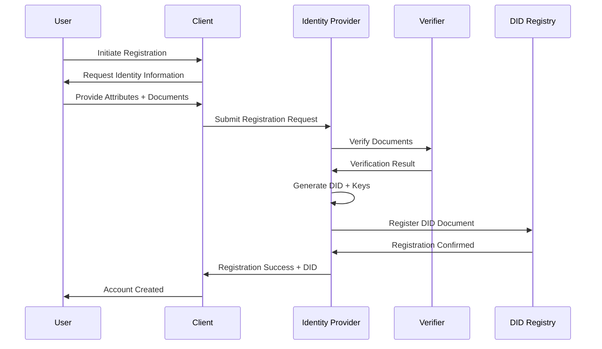

# Phase 3: Identity Management Protocols

## WIA-SEC-009 Identity Management - Protocol Specification

**Version**: 1.0.0
**Date**: 2025-12-25
**Status**: Active
**Standard ID**: WIA-SEC-009-PHASE3-003
**Primary Color**: #8B5CF6 (Purple)

---

## 1. Overview

This phase defines identity lifecycle protocols including registration, verification, authentication, authorization, provisioning, and revocation processes.

---

## 2. Identity Registration Protocol

### 2.1 User Registration Flow



### 2.2 Registration Request

```http
POST /api/v1/identity/register HTTP/1.1
Host: idp.example.com
Content-Type: application/json
Authorization: Bearer <api_key>

{
  "registrationId": "reg-550e8400-e29b-41d4-a716-446655440000",
  "profile": {
    "givenName": "Alice",
    "familyName": "Smith",
    "dateOfBirth": "1990-05-15",
    "nationality": "US",
    "email": "alice@example.com",
    "phoneNumber": "+1-555-0100"
  },
  "verificationDocuments": [
    {
      "type": "passport",
      "number": "X12345678",
      "issuingCountry": "US",
      "issuedDate": "2020-01-15",
      "expiryDate": "2030-01-15",
      "documentImage": "data:image/jpeg;base64,/9j/4AAQSkZJRg..."
    }
  ],
  "biometricSamples": {
    "face": "data:image/jpeg;base64,/9j/4AAQSkZJRg...",
    "fingerprint": "data:application/octet-stream;base64,..."
  },
  "consentGiven": true,
  "timestamp": "2025-01-15T10:00:00Z"
}
```

### 2.3 Registration Response

```http
HTTP/1.1 201 Created
Content-Type: application/json

{
  "registrationId": "reg-550e8400-e29b-41d4-a716-446655440000",
  "status": "pending_verification",
  "userId": "usr-2819c223-7f76-453a-919d-413861904646",
  "did": "did:web:example.com:users:alice",
  "didDocument": {
    "@context": ["https://www.w3.org/ns/did/v1"],
    "id": "did:web:example.com:users:alice",
    "verificationMethod": [
      {
        "id": "did:web:example.com:users:alice#key-1",
        "type": "Ed25519VerificationKey2020",
        "controller": "did:web:example.com:users:alice",
        "publicKeyMultibase": "z6MkhaXgBZDvotDkL5257faiztiGiC2QtKLGpbnnEGta2doK"
      }
    ],
    "authentication": ["did:web:example.com:users:alice#key-1"]
  },
  "verificationRequired": true,
  "nextSteps": [
    {
      "step": "document_verification",
      "estimatedCompletion": "2-5 business days"
    },
    {
      "step": "biometric_verification",
      "estimatedCompletion": "immediately"
    }
  ],
  "timestamp": "2025-01-15T10:00:05Z"
}
```

---

## 3. Identity Verification Protocol

### 3.1 Document Verification

```http
POST /api/v1/identity/verify/document HTTP/1.1
Host: verifier.example.com
Content-Type: application/json
Authorization: Bearer <access_token>

{
  "verificationId": "ver-f47ac10b-58cc-4372-a567-0e02b2c3d479",
  "userId": "usr-2819c223-7f76-453a-919d-413861904646",
  "documentType": "passport",
  "documentData": {
    "number": "X12345678",
    "issuingCountry": "US",
    "givenName": "Alice",
    "familyName": "Smith",
    "dateOfBirth": "1990-05-15",
    "expiryDate": "2030-01-15"
  },
  "documentImage": "data:image/jpeg;base64,/9j/4AAQSkZJRg...",
  "selfieImage": "data:image/jpeg;base64,/9j/4AAQSkZJRg...",
  "timestamp": "2025-01-15T10:05:00Z"
}
```

### 3.2 Verification Response

```json
{
  "verificationId": "ver-f47ac10b-58cc-4372-a567-0e02b2c3d479",
  "status": "verified",
  "confidenceScore": 0.95,
  "checks": {
    "documentAuthenticity": {
      "passed": true,
      "score": 0.98,
      "method": "ocr_and_security_features"
    },
    "facialMatch": {
      "passed": true,
      "score": 0.92,
      "method": "deep_learning_face_recognition"
    },
    "livenessDetection": {
      "passed": true,
      "score": 0.96,
      "method": "active_liveness"
    },
    "documentExpiry": {
      "passed": true,
      "expiryDate": "2030-01-15"
    },
    "dataConsistency": {
      "passed": true,
      "score": 1.0
    }
  },
  "extractedData": {
    "givenName": "Alice",
    "familyName": "Smith",
    "dateOfBirth": "1990-05-15",
    "documentNumber": "X12345678",
    "nationality": "US"
  },
  "assuranceLevel": "high",
  "verifier": "did:web:verifier.example.com",
  "timestamp": "2025-01-15T10:05:30Z"
}
```

---

## 4. Authentication Protocol

### 4.1 DID Authentication (DID-Auth)

```http
# Step 1: Authentication Challenge Request
GET /api/v1/auth/challenge?did=did:web:example.com:users:alice HTTP/1.1
Host: idp.example.com

# Response
HTTP/1.1 200 OK
Content-Type: application/json

{
  "challenge": "eyJhbGciOiJFZERTQSIsInR5cCI6IkpXVCJ9...",
  "challengeId": "chal-a1b2c3d4-e5f6-4a7b-8c9d-0e1f2a3b4c5d",
  "expiresIn": 300,
  "nonce": "n-550e8400-e29b-41d4-a716-446655440000"
}
```

```http
# Step 2: Sign Challenge and Submit
POST /api/v1/auth/verify HTTP/1.1
Host: idp.example.com
Content-Type: application/json

{
  "challengeId": "chal-a1b2c3d4-e5f6-4a7b-8c9d-0e1f2a3b4c5d",
  "did": "did:web:example.com:users:alice",
  "proof": {
    "type": "Ed25519Signature2020",
    "created": "2025-01-15T10:10:00Z",
    "verificationMethod": "did:web:example.com:users:alice#key-1",
    "proofPurpose": "authentication",
    "challenge": "eyJhbGciOiJFZERTQSIsInR5cCI6IkpXVCJ9...",
    "proofValue": "z3FXQjecWufY46...signature..."
  }
}

# Response
HTTP/1.1 200 OK
Content-Type: application/json

{
  "authenticated": true,
  "accessToken": "eyJhbGciOiJSUzI1NiIsInR5cCI6IkpXVCJ9...",
  "tokenType": "Bearer",
  "expiresIn": 3600,
  "refreshToken": "rt_a1b2c3d4e5f6...",
  "scope": "openid profile email",
  "idToken": "eyJhbGciOiJSUzI1NiIsInR5cCI6IkpXVCJ9..."
}
```

### 4.2 OAuth 2.0 + OpenID Connect Flow

```http
# Step 1: Authorization Request
GET /authorize?
    response_type=code&
    client_id=app123&
    redirect_uri=https://app.example.com/callback&
    scope=openid+profile+email&
    state=abc123&
    nonce=xyz789 HTTP/1.1
Host: idp.example.com

# Step 2: User authenticates and consents

# Step 3: Authorization Code Response
HTTP/1.1 302 Found
Location: https://app.example.com/callback?
    code=auth_code_a1b2c3d4e5f6&
    state=abc123
```

```http
# Step 4: Token Request
POST /token HTTP/1.1
Host: idp.example.com
Content-Type: application/x-www-form-urlencoded
Authorization: Basic Base64(client_id:client_secret)

grant_type=authorization_code&
code=auth_code_a1b2c3d4e5f6&
redirect_uri=https://app.example.com/callback

# Response
HTTP/1.1 200 OK
Content-Type: application/json

{
  "access_token": "eyJhbGciOiJSUzI1NiIsInR5cCI6IkpXVCJ9...",
  "token_type": "Bearer",
  "expires_in": 3600,
  "refresh_token": "rt_a1b2c3d4e5f6...",
  "id_token": "eyJhbGciOiJSUzI1NiIsInR5cCI6IkpXVCJ9...",
  "scope": "openid profile email"
}
```

### 4.3 Multi-Factor Authentication

```http
POST /api/v1/auth/mfa/challenge HTTP/1.1
Host: idp.example.com
Content-Type: application/json
Authorization: Bearer <partial_access_token>

{
  "userId": "usr-2819c223-7f76-453a-919d-413861904646",
  "primaryAuthMethod": "password",
  "requestedMethod": "totp"
}

# Response
HTTP/1.1 200 OK
Content-Type: application/json

{
  "challengeId": "mfa-550e8400-e29b-41d4-a716-446655440000",
  "method": "totp",
  "expiresIn": 120
}
```

```http
POST /api/v1/auth/mfa/verify HTTP/1.1
Host: idp.example.com
Content-Type: application/json
Authorization: Bearer <partial_access_token>

{
  "challengeId": "mfa-550e8400-e29b-41d4-a716-446655440000",
  "code": "123456"
}

# Response
HTTP/1.1 200 OK
Content-Type: application/json

{
  "verified": true,
  "accessToken": "eyJhbGciOiJSUzI1NiIsInR5cCI6IkpXVCJ9...",
  "tokenType": "Bearer",
  "expiresIn": 3600
}
```

---

## 5. User Provisioning Protocol (SCIM 2.0)

### 5.1 Create User

```http
POST /scim/v2/Users HTTP/1.1
Host: idp.example.com
Content-Type: application/scim+json
Authorization: Bearer <access_token>

{
  "schemas": ["urn:ietf:params:scim:schemas:core:2.0:User"],
  "userName": "alice",
  "name": {
    "givenName": "Alice",
    "familyName": "Smith",
    "formatted": "Alice Smith"
  },
  "emails": [
    {
      "value": "alice@example.com",
      "type": "work",
      "primary": true
    }
  ],
  "active": true
}

# Response
HTTP/1.1 201 Created
Content-Type: application/scim+json
Location: https://idp.example.com/scim/v2/Users/2819c223-7f76-453a-919d-413861904646

{
  "schemas": ["urn:ietf:params:scim:schemas:core:2.0:User"],
  "id": "2819c223-7f76-453a-919d-413861904646",
  "meta": {
    "resourceType": "User",
    "created": "2025-01-15T10:00:00Z",
    "lastModified": "2025-01-15T10:00:00Z",
    "location": "https://idp.example.com/scim/v2/Users/2819c223-7f76-453a-919d-413861904646"
  },
  "userName": "alice",
  "name": {
    "givenName": "Alice",
    "familyName": "Smith",
    "formatted": "Alice Smith"
  },
  "emails": [
    {
      "value": "alice@example.com",
      "type": "work",
      "primary": true
    }
  ],
  "active": true
}
```

### 5.2 Update User (PATCH)

```http
PATCH /scim/v2/Users/2819c223-7f76-453a-919d-413861904646 HTTP/1.1
Host: idp.example.com
Content-Type: application/scim+json
Authorization: Bearer <access_token>

{
  "schemas": ["urn:ietf:params:scim:api:messages:2.0:PatchOp"],
  "Operations": [
    {
      "op": "replace",
      "path": "name.familyName",
      "value": "Johnson"
    },
    {
      "op": "add",
      "path": "phoneNumbers",
      "value": [
        {
          "value": "+1-555-0100",
          "type": "work"
        }
      ]
    }
  ]
}
```

### 5.3 Deactivate User

```http
PATCH /scim/v2/Users/2819c223-7f76-453a-919d-413861904646 HTTP/1.1
Host: idp.example.com
Content-Type: application/scim+json
Authorization: Bearer <access_token>

{
  "schemas": ["urn:ietf:params:scim:api:messages:2.0:PatchOp"],
  "Operations": [
    {
      "op": "replace",
      "path": "active",
      "value": false
    }
  ]
}
```

---

## 6. Credential Issuance Protocol

### 6.1 Request Verifiable Credential

```http
POST /api/v1/credentials/issue HTTP/1.1
Host: issuer.example.com
Content-Type: application/json
Authorization: Bearer <access_token>

{
  "credentialType": "IdentityCredential",
  "subject": {
    "did": "did:web:example.com:users:alice"
  },
  "claims": {
    "givenName": "Alice",
    "familyName": "Smith",
    "dateOfBirth": "1990-05-15",
    "nationality": "US"
  },
  "expirationDate": "2030-01-15T00:00:00Z"
}
```

### 6.2 Issue Credential Response

```json
{
  "@context": [
    "https://www.w3.org/2018/credentials/v1",
    "https://wia.global/contexts/identity/v1"
  ],
  "id": "https://issuer.example.com/credentials/3732",
  "type": ["VerifiableCredential", "IdentityCredential"],
  "issuer": {
    "id": "did:web:issuer.example.com",
    "name": "Example Identity Issuer"
  },
  "issuanceDate": "2025-01-15T10:00:00Z",
  "expirationDate": "2030-01-15T00:00:00Z",
  "credentialSubject": {
    "id": "did:web:example.com:users:alice",
    "givenName": "Alice",
    "familyName": "Smith",
    "dateOfBirth": "1990-05-15",
    "nationality": "US"
  },
  "credentialStatus": {
    "id": "https://issuer.example.com/status/3732",
    "type": "StatusList2021"
  },
  "proof": {
    "type": "Ed25519Signature2020",
    "created": "2025-01-15T10:00:00Z",
    "proofPurpose": "assertionMethod",
    "verificationMethod": "did:web:issuer.example.com#key-1",
    "proofValue": "z3FXQjecWufY46...signature...2EjFZrhTkRBKDV"
  }
}
```

---

## 7. Credential Presentation Protocol

### 7.1 Presentation Request

```http
POST /api/v1/presentations/request HTTP/1.1
Host: verifier.example.com
Content-Type: application/json

{
  "presentationId": "pres-550e8400-e29b-41d4-a716-446655440000",
  "requestedCredentials": [
    {
      "type": "IdentityCredential",
      "requiredClaims": ["givenName", "familyName", "dateOfBirth"],
      "trustedIssuers": [
        "did:web:issuer.example.com",
        "did:web:gov.example:identity"
      ]
    }
  ],
  "challenge": "nonce-a1b2c3d4-e5f6-4a7b-8c9d-0e1f2a3b4c5d",
  "domain": "verifier.example.com",
  "expiresAt": "2025-01-15T10:15:00Z"
}
```

### 7.2 Verifiable Presentation

```http
POST /api/v1/presentations/submit HTTP/1.1
Host: verifier.example.com
Content-Type: application/json

{
  "@context": [
    "https://www.w3.org/2018/credentials/v1"
  ],
  "type": "VerifiablePresentation",
  "verifiableCredential": [
    {
      "@context": [...],
      "id": "https://issuer.example.com/credentials/3732",
      "type": ["VerifiableCredential", "IdentityCredential"],
      "issuer": {...},
      "credentialSubject": {...},
      "proof": {...}
    }
  ],
  "proof": {
    "type": "Ed25519Signature2020",
    "created": "2025-01-15T10:12:00Z",
    "challenge": "nonce-a1b2c3d4-e5f6-4a7b-8c9d-0e1f2a3b4c5d",
    "domain": "verifier.example.com",
    "proofPurpose": "authentication",
    "verificationMethod": "did:web:example.com:users:alice#key-1",
    "proofValue": "z58DAdFfa9SkqZMVPxAQp...signature..."
  }
}
```

---

## 8. Credential Revocation Protocol

### 8.1 Revoke Credential

```http
POST /api/v1/credentials/revoke HTTP/1.1
Host: issuer.example.com
Content-Type: application/json
Authorization: Bearer <issuer_token>

{
  "credentialId": "https://issuer.example.com/credentials/3732",
  "reason": "credential_compromised",
  "revokedBy": "did:web:issuer.example.com",
  "revocationDate": "2025-01-20T15:00:00Z"
}

# Response
HTTP/1.1 200 OK
Content-Type: application/json

{
  "revoked": true,
  "credentialId": "https://issuer.example.com/credentials/3732",
  "revocationDate": "2025-01-20T15:00:00Z",
  "statusListUpdated": true,
  "statusListUrl": "https://issuer.example.com/status/list/2025-01"
}
```

### 8.2 Check Revocation Status

```http
GET /api/v1/credentials/3732/status HTTP/1.1
Host: issuer.example.com

# Response
HTTP/1.1 200 OK
Content-Type: application/json

{
  "credentialId": "https://issuer.example.com/credentials/3732",
  "status": "revoked",
  "revocationDate": "2025-01-20T15:00:00Z",
  "reason": "credential_compromised",
  "statusListUrl": "https://issuer.example.com/status/list/2025-01"
}
```

---

## 9. Identity Deletion & Right to be Forgotten

### 9.1 Request Identity Deletion

```http
POST /api/v1/identity/delete HTTP/1.1
Host: idp.example.com
Content-Type: application/json
Authorization: Bearer <user_access_token>

{
  "userId": "usr-2819c223-7f76-453a-919d-413861904646",
  "reason": "user_request",
  "deleteAllData": true,
  "keepAuditLogs": true,
  "confirmation": "I confirm deletion of my identity"
}
```

### 9.2 Deletion Response

```json
{
  "deletionId": "del-550e8400-e29b-41d4-a716-446655440000",
  "status": "scheduled",
  "scheduledDate": "2025-02-14T00:00:00Z",
  "gracePeriod": "30 days",
  "affectedResources": {
    "userProfile": "will_be_deleted",
    "credentials": "will_be_revoked",
    "didDocument": "will_be_deactivated",
    "auditLogs": "will_be_retained"
  },
  "cancellationDeadline": "2025-02-13T23:59:59Z"
}
```

---

**Next Phase**: [PHASE-4-INTEGRATION.md](PHASE-4-INTEGRATION.md) - System Integration

© 2025 WIA (World Certification Industry Association)
**弘益人間 (홍익인간)** - Benefit All Humanity
