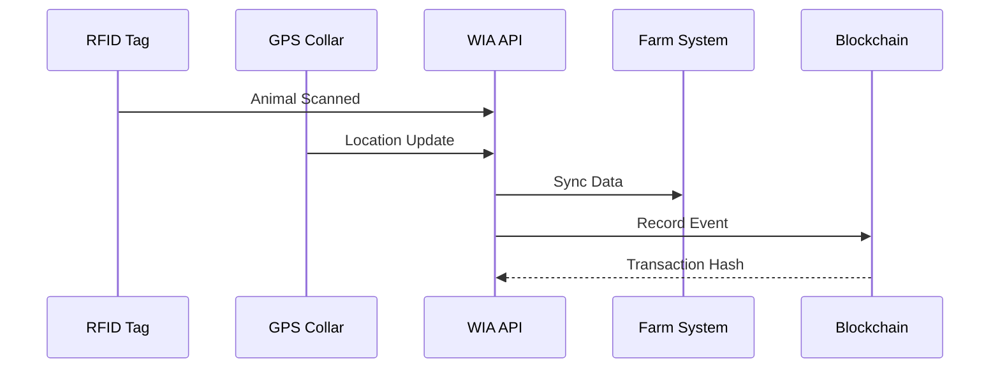

# WIA Livestock Tracking Integration Standard
## Phase 4 Specification

---

**Version**: 1.0.0
**Status**: Draft
**Date**: 2025-01
**License**: MIT

---

## Table of Contents

1. [System Architecture](#system-architecture)
2. [Farm Management Integration](#farm-management-integration)
3. [Veterinary System Integration](#veterinary-system-integration)
4. [Slaughterhouse Integration](#slaughterhouse-integration)
5. [Retail & Consumer Integration](#retail-consumer-integration)
6. [Government Compliance](#government-compliance)
7. [Implementation Guide](#implementation-guide)

---

## System Architecture

### 1.1 High-Level Architecture

```
┌─────────────────┐
│  RFID Readers   │
│  GPS Collars    │
│  IoT Sensors    │
└────────┬────────┘
         │
         ▼
┌─────────────────┐
│  LoRaWAN/LTE    │
│  Gateway        │
└────────┬────────┘
         │
         ▼
┌─────────────────┐
│  WIA Livestock  │
│  API Platform   │
└────────┬────────┘
         │
    ┌────┴────┬────────┬─────────┬──────────┐
    ▼         ▼        ▼         ▼          ▼
┌──────┐ ┌──────┐ ┌────────┐ ┌──────┐ ┌──────────┐
│ FMS  │ │ VET  │ │SLAUGHT.│ │RETAIL│ │GOVERNMENT│
└──────┘ └──────┘ └────────┘ └──────┘ └──────────┘
```

### 1.2 Data Flow



---

## Farm Management Integration

### 2.1 Supported Systems

| FMS System | Integration Type | Protocol |
|------------|------------------|----------|
| Agrivi | REST API | JSON |
| FarmLogic | REST API | JSON |
| CattleMax | SOAP/REST | XML/JSON |
| HerdMASTER | REST API | JSON |
| Custom Systems | Webhook | JSON |

### 2.2 Integration Example

**Syncing Animals to FMS:**

```javascript
// Node.js Example
const axios = require('axios');

async function syncAnimalToFMS(animal) {
  const response = await axios.post('https://api.farmlogic.com/v1/animals', {
    external_id: animal.animal_id,
    rfid: animal.rfid_tag,
    species: animal.species,
    birth_date: animal.birth_date,
    current_weight: animal.current_weight_kg,
    location: {
      latitude: animal.location.lat,
      longitude: animal.location.lng
    }
  }, {
    headers: {
      'Authorization': `Bearer ${FMS_API_KEY}`,
      'Content-Type': 'application/json'
    }
  });

  return response.data;
}
```

### 2.3 Real-time Synchronization

**Webhook Configuration:**
```json
{
  "webhook_url": "https://farm.example.com/wia-webhook",
  "events": [
    "ANIMAL_REGISTERED",
    "LOCATION_UPDATE",
    "HEALTH_RECORD_ADDED",
    "WEIGHT_UPDATE"
  ],
  "authentication": {
    "type": "HMAC-SHA256",
    "secret": "SHARED_SECRET_KEY"
  }
}
```

**Webhook Payload:**
```json
{
  "event": "WEIGHT_UPDATE",
  "timestamp": "2025-01-15T14:22:00Z",
  "animal_id": "CATTLE-KR-2025-001234",
  "data": {
    "previous_weight_kg": 445.0,
    "current_weight_kg": 450.5,
    "measurement_date": "2025-01-15"
  },
  "signature": "sha256=1a2b3c4d5e6f..."
}
```

---

## Veterinary System Integration

### 3.1 HL7 FHIR Integration

**FHIR Resource: Animal Patient**

```json
{
  "resourceType": "Patient",
  "id": "CATTLE-KR-2025-001234",
  "identifier": [
    {
      "system": "urn:iso:std:iso:11784",
      "value": "982-000123456789"
    }
  ],
  "species": {
    "coding": [
      {
        "system": "http://hl7.org/fhir/animal-species",
        "code": "125097000",
        "display": "Cattle"
      }
    ]
  },
  "gender": "female",
  "birthDate": "2023-03-15",
  "extension": [
    {
      "url": "http://wia.com/fhir/breed",
      "valueString": "HANWOO"
    }
  ]
}
```

**FHIR Resource: Immunization**

```json
{
  "resourceType": "Immunization",
  "status": "completed",
  "vaccineCode": {
    "coding": [
      {
        "system": "http://wia.com/vaccines",
        "code": "FMD-001",
        "display": "Foot and Mouth Disease Vaccine"
      }
    ]
  },
  "patient": {
    "reference": "Patient/CATTLE-KR-2025-001234"
  },
  "occurrenceDateTime": "2025-01-15T10:00:00Z",
  "performer": [
    {
      "actor": {
        "reference": "Practitioner/VET-KR-12345"
      }
    }
  ],
  "doseQuantity": {
    "value": 2.0,
    "unit": "ml"
  }
}
```

### 3.2 Veterinary Clinic Integration

**Appointment Booking:**
```http
POST /veterinary/appointments
```

```json
{
  "animal_id": "CATTLE-KR-2025-001234",
  "clinic_id": "CLINIC-KR-001",
  "appointment_type": "ROUTINE_CHECKUP",
  "scheduled_date": "2025-02-01T10:00:00Z",
  "reason": "Annual health examination",
  "veterinarian": "Dr. Kim"
}
```

---

## Slaughterhouse Integration

### 4.1 Pre-Slaughter Information

**Animal Transfer Record:**
```json
{
  "animal_id": "CATTLE-KR-2025-001234",
  "transfer_from": "FARM-KR-001",
  "transfer_to": "SLAUGHTERHOUSE-KR-001",
  "transport": {
    "truck_id": "TRUCK-001",
    "driver_name": "Park Driver",
    "departure_time": "2025-01-20T06:00:00Z",
    "arrival_time": "2025-01-20T09:00:00Z",
    "distance_km": 150
  },
  "pre_slaughter_rest_hours": 24,
  "health_certificate": {
    "issued_by": "Dr. Kim",
    "issue_date": "2025-01-19",
    "valid_until": "2025-01-25",
    "certificate_number": "HEALTH-2025-001234"
  }
}
```

### 4.2 Post-Slaughter Data

**Carcass Grading:**
```json
{
  "animal_id": "CATTLE-KR-2025-001234",
  "slaughter_date": "2025-01-21T08:00:00Z",
  "carcass": {
    "hot_weight_kg": 380.0,
    "cold_weight_kg": 374.1,
    "dressing_percentage": 62.3,
    "grade": "1++",
    "marbling_score": 9,
    "meat_color": "BRIGHT_CHERRY_RED",
    "fat_color": "WHITE"
  },
  "inspector": {
    "name": "Inspector Lee",
    "license": "INSPECTOR-KR-567",
    "inspection_time": "2025-01-21T10:00:00Z"
  },
  "cuts": [
    {
      "cut_type": "SIRLOIN",
      "weight_kg": 45.2,
      "barcode": "8801234567890"
    },
    {
      "cut_type": "RIBEYE",
      "weight_kg": 38.5,
      "barcode": "8801234567891"
    }
  ],
  "blockchain_hash": "0x1a2b3c4d5e6f7g8h9i0j1k2l3m4n5o6p"
}
```

---

## Retail & Consumer Integration

### 5.1 Product Labeling

**QR Code on Retail Package:**
```json
{
  "product": {
    "barcode": "8801234567890",
    "product_name": "Premium Hanwoo Sirloin",
    "weight_kg": 0.5,
    "price_krw": 45000,
    "origin": {
      "animal_id": "CATTLE-KR-2025-001234",
      "farm": "Green Valley Ranch",
      "region": "Gangwon-do, Korea",
      "slaughter_date": "2025-01-21",
      "grade": "1++"
    }
  },
  "traceability": {
    "qr_url": "https://trace.wia.com/CATTLE-KR-2025-001234",
    "verification_code": "WIA-2025-001234-VERIFY",
    "blockchain_proof": "0x1a2b3c4d5e6f..."
  },
  "certifications": [
    "Organic",
    "Animal Welfare Approved",
    "HACCP"
  ]
}
```

### 5.2 Consumer Verification

**Public Verification API:**
```http
GET /public/verify/CATTLE-KR-2025-001234
```

**Response:**
```json
{
  "animal_id": "CATTLE-KR-2025-001234",
  "species": "CATTLE",
  "breed": "HANWOO",
  "farm": {
    "name": "Green Valley Ranch",
    "location": "Gangwon-do, Korea",
    "certifications": ["Organic", "Animal Welfare Approved"]
  },
  "birth_date": "2023-03-15",
  "slaughter_date": "2025-01-21",
  "meat_grade": "1++",
  "blockchain_verified": true,
  "supply_chain": [
    {
      "stage": "Farm",
      "date": "2023-03-15 to 2025-01-20",
      "duration_days": 676
    },
    {
      "stage": "Transport",
      "date": "2025-01-20",
      "duration_hours": 3
    },
    {
      "stage": "Slaughterhouse",
      "date": "2025-01-21",
      "inspector": "Inspector Lee"
    },
    {
      "stage": "Retail",
      "date": "2025-01-23",
      "store": "Lotte Mart Gangnam"
    }
  ]
}
```

---

## Government Compliance

### 6.1 South Korea Regulations

**축산물이력제 (Livestock Traceability System):**

```json
{
  "reporting_authority": "축산물품질평가원 (KAPE)",
  "report_type": "MONTHLY_LIVESTOCK_INVENTORY",
  "farm_id": "FARM-KR-001",
  "reporting_period": "2025-01",
  "cattle_inventory": {
    "total_count": 125,
    "by_age_group": {
      "calf_0_6_months": 15,
      "young_6_24_months": 45,
      "adult_24_plus_months": 65
    },
    "movements": {
      "births": 5,
      "purchases": 2,
      "sales": 8,
      "deaths": 1,
      "slaughtered": 3
    }
  },
  "submission_date": "2025-02-05T09:00:00Z",
  "submitter": {
    "name": "Kim Farmer",
    "business_number": "123-45-67890"
  }
}
```

**가축전염병예방법 (Animal Disease Prevention):**

```json
{
  "disease_report": {
    "type": "SUSPECTED_CASE",
    "disease": "Foot and Mouth Disease (FMD)",
    "animal_id": "CATTLE-KR-2025-001234",
    "symptoms": [
      "Fever",
      "Blisters on mouth",
      "Lameness"
    ],
    "onset_date": "2025-01-15",
    "veterinarian": "Dr. Kim",
    "immediate_actions": [
      "Animal quarantined",
      "Samples collected",
      "Authorities notified"
    ],
    "report_time": "2025-01-15T10:30:00Z",
    "authority_notified": "Animal Disease Control Division"
  }
}
```

### 6.2 International Compliance

**EU Regulation (EC) No 1760/2000:**
- Mandatory cattle identification
- Individual cattle passport
- Database registration
- Movement tracking

**USDA Regulations:**
- APHIS Animal Disease Traceability
- NAIS (National Animal Identification System)
- Premises ID + Animal ID

---

## Implementation Guide

### 7.1 Step-by-Step Integration

**Step 1: API Setup**
```bash
# Register for API access
curl -X POST https://api.livestock.wia.com/v1/register \
  -H "Content-Type: application/json" \
  -d '{
    "farm_name": "Green Valley Ranch",
    "email": "farmer@example.com",
    "country": "KR"
  }'
```

**Step 2: Install RFID Reader**
```python
# Python example for RFID reading
import serial

def read_rfid_tag():
    ser = serial.Serial('/dev/ttyUSB0', 9600)
    while True:
        data = ser.readline().decode('utf-8').strip()
        if data.startswith('982'):  # ISO 11784/11785
            return data

tag_id = read_rfid_tag()
print(f"RFID Tag Read: {tag_id}")
```

**Step 3: Configure GPS Tracker**
```javascript
// LoRaWAN GPS tracker configuration
const device = {
  dev_eui: '0018B20000000001',
  app_key: 'YOUR_APP_KEY',
  frequency_plan: 'AS923-1',
  update_interval: 15  // minutes
};

// Send configuration to device
configureDevice(device);
```

**Step 4: Enable Webhooks**
```bash
curl -X POST https://api.livestock.wia.com/v1/webhooks \
  -H "Authorization: Bearer YOUR_API_KEY" \
  -H "Content-Type: application/json" \
  -d '{
    "url": "https://your-farm-system.com/webhook",
    "events": ["LOCATION_UPDATE", "HEALTH_ALERT"]
  }'
```

### 7.2 SDK Libraries

**Node.js:**
```bash
npm install @wia/livestock-tracking
```

```javascript
const WIALivestock = require('@wia/livestock-tracking');

const client = new WIALivestock({
  apiKey: 'YOUR_API_KEY'
});

// Register new animal
const animal = await client.animals.create({
  rfid_tag: '982-000123456789',
  species: 'CATTLE',
  breed: 'HANWOO',
  birth_date: '2025-01-15'
});
```

**Python:**
```bash
pip install wia-livestock
```

```python
from wia_livestock import LivestockClient

client = LivestockClient(api_key='YOUR_API_KEY')

# Update animal location
client.update_location(
    animal_id='CATTLE-KR-2025-001234',
    lat=37.566535,
    lng=126.977969
)
```

---

**弘益人間 (Hongik Ingan) - Benefit All Humanity**

*WIA-AGRI-009 Livestock Tracking Standard*
*© 2025 WIA - MIT License*
