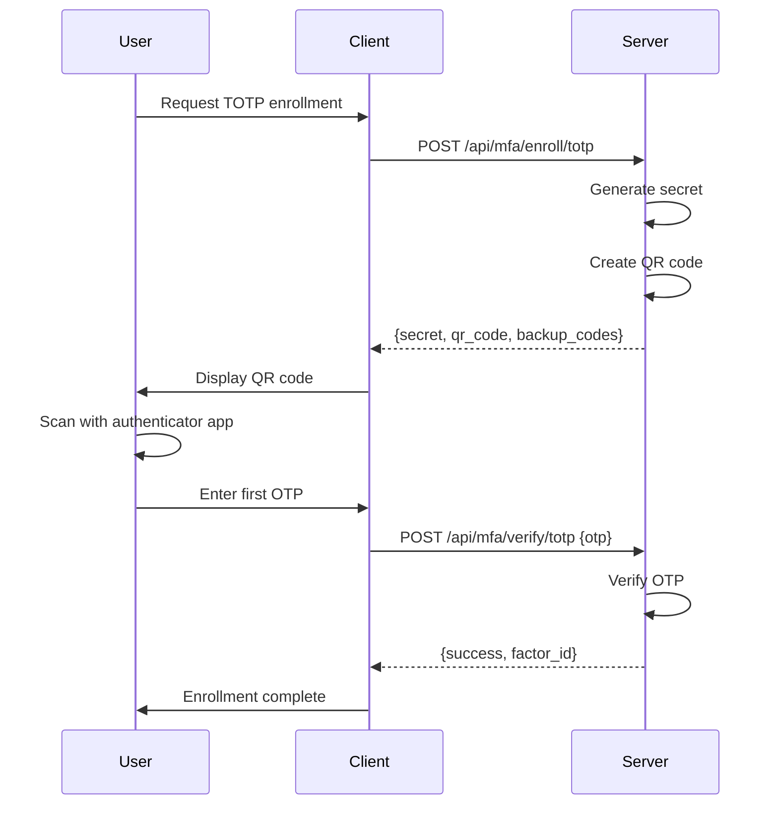
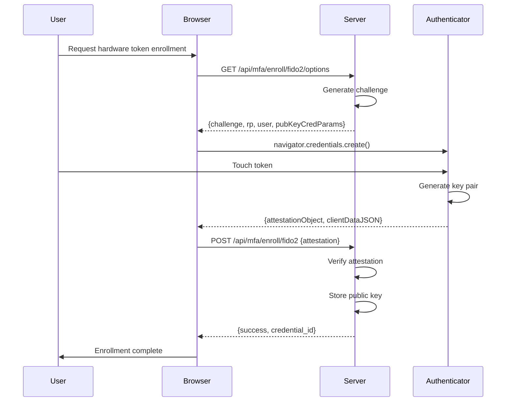
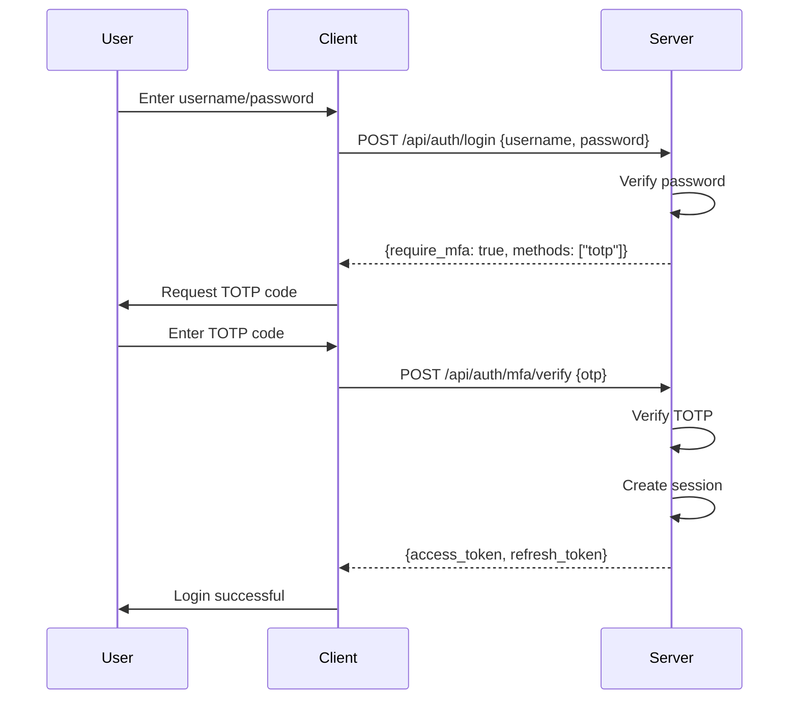
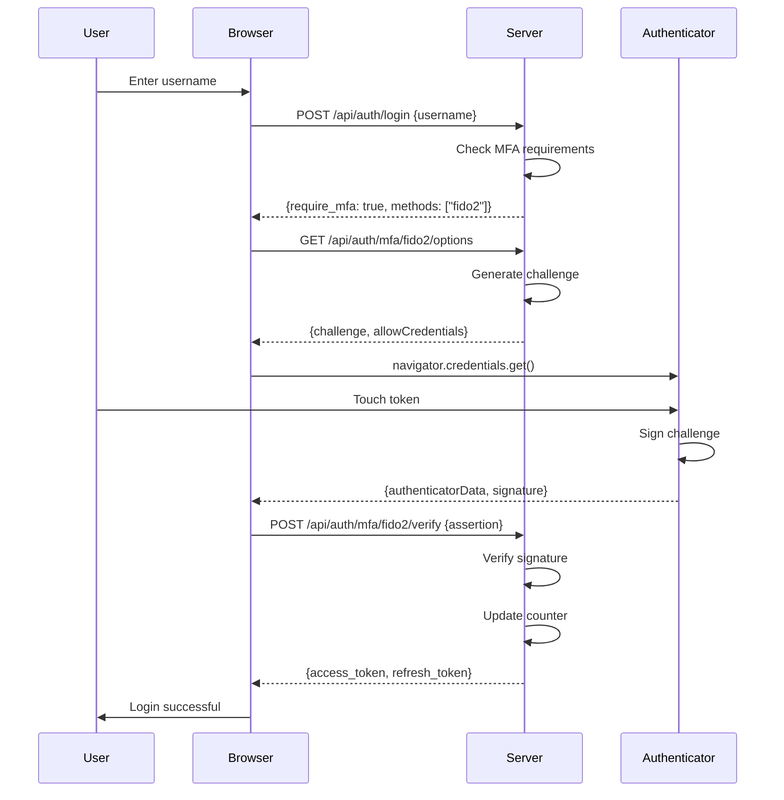
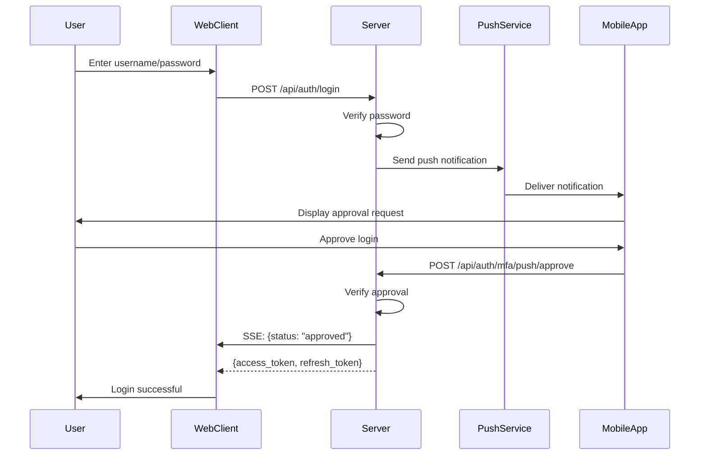
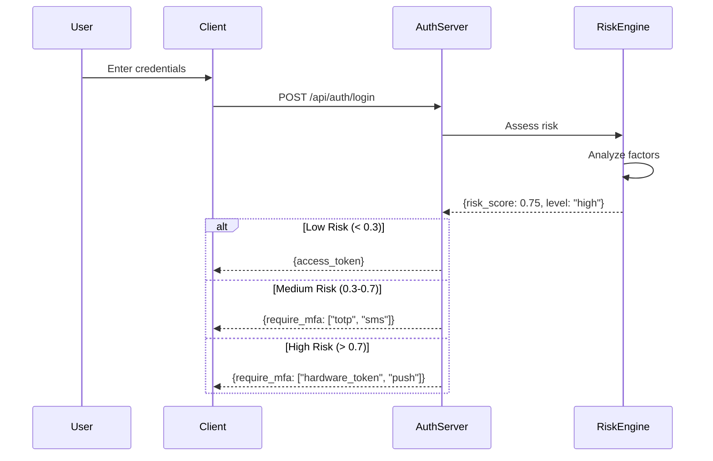
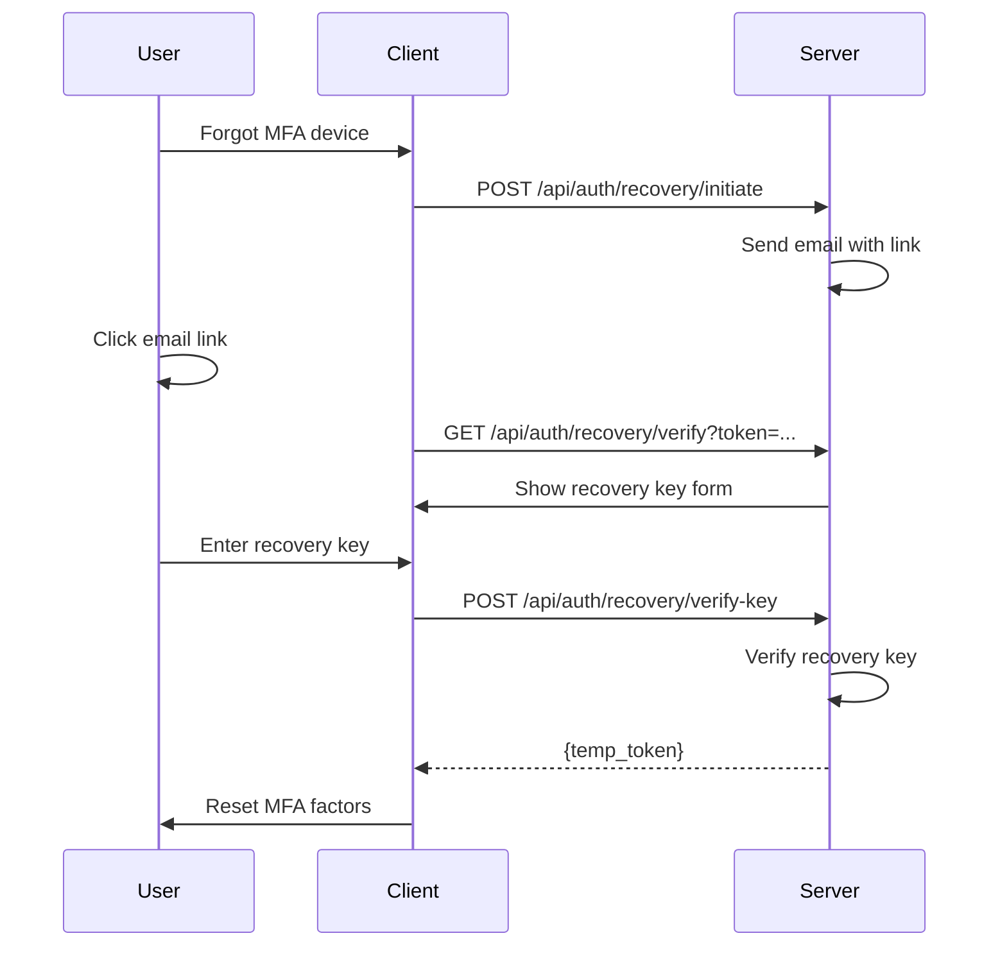

# WIA-SEC-008: Multi-Factor Authentication - PHASE 3 PROTOCOL

**Version:** 1.0.0
**Status:** Draft
**Last Updated:** 2025-12-25
**Category:** Security (SEC)

---

## 1. Overview

This phase defines authentication protocols, flows, and challenge-response mechanisms for Multi-Factor Authentication.

### Philosophy: 弘益人間 (Benefit All Humanity)

Secure and standardized authentication protocols protect users and organizations from unauthorized access, benefiting all of humanity.

---

## 2. Enrollment Protocols

### 2.1 TOTP Enrollment Flow



**API Request:**
```http
POST /api/mfa/enroll/totp HTTP/1.1
Host: auth.example.com
Authorization: Bearer ACCESS_TOKEN
Content-Type: application/json

{
  "user_id": "user123",
  "algorithm": "SHA256",
  "digits": 6,
  "period": 30
}
```

**API Response:**
```json
{
  "factor_id": "totp_abc123",
  "secret": "JBSWY3DPEHPK3PXP",
  "qr_code": "data:image/png;base64,...",
  "otpauth_url": "otpauth://totp/Example:user@example.com?...",
  "backup_codes": [
    "ABC123-DEF456",
    "GHI789-JKL012"
  ]
}
```

### 2.2 Hardware Token Enrollment (FIDO2)



**WebAuthn Creation Options:**
```json
{
  "challenge": "BASE64_CHALLENGE",
  "rp": {
    "name": "Example Corp",
    "id": "example.com"
  },
  "user": {
    "id": "BASE64_USER_ID",
    "name": "user@example.com",
    "displayName": "John Doe"
  },
  "pubKeyCredParams": [
    {"type": "public-key", "alg": -7},
    {"type": "public-key", "alg": -257}
  ],
  "authenticatorSelection": {
    "authenticatorAttachment": "cross-platform",
    "requireResidentKey": false,
    "userVerification": "preferred"
  },
  "timeout": 60000,
  "attestation": "direct"
}
```

### 2.3 Biometric Enrollment

```http
POST /api/mfa/enroll/biometric HTTP/1.1
Host: auth.example.com
Authorization: Bearer ACCESS_TOKEN
Content-Type: application/json

{
  "user_id": "user123",
  "modality": "fingerprint",
  "template_hash": "SHA256_HASH",
  "quality_score": 0.95,
  "liveness_detected": true,
  "device_id": "device_123"
}
```

---

## 3. Authentication Protocols

### 3.1 Password + TOTP Flow



**Password Verification:**
```http
POST /api/auth/login HTTP/1.1
Host: auth.example.com
Content-Type: application/json

{
  "username": "user@example.com",
  "password": "SecurePassword123!",
  "device_fingerprint": "fp_abc123"
}
```

**Response:**
```json
{
  "status": "mfa_required",
  "session_id": "sess_temp_123",
  "mfa_methods": ["totp", "sms", "push"],
  "expires_in": 300
}
```

**TOTP Verification:**
```http
POST /api/auth/mfa/verify HTTP/1.1
Host: auth.example.com
Content-Type: application/json

{
  "session_id": "sess_temp_123",
  "method": "totp",
  "code": "123456"
}
```

**Success Response:**
```json
{
  "access_token": "eyJhbGciOiJSUzI1NiIsInR5cCI6IkpXVCJ9...",
  "refresh_token": "REFRESH_TOKEN",
  "token_type": "Bearer",
  "expires_in": 3600,
  "scope": "openid profile email",
  "session_id": "sess_abc123"
}
```

### 3.2 Hardware Token Authentication (FIDO2)



**WebAuthn Get Options:**
```json
{
  "challenge": "BASE64_CHALLENGE",
  "timeout": 60000,
  "rpId": "example.com",
  "allowCredentials": [
    {
      "type": "public-key",
      "id": "BASE64_CREDENTIAL_ID"
    }
  ],
  "userVerification": "preferred"
}
```

### 3.3 Push Notification Authentication



---

## 4. Challenge-Response Protocols

### 4.1 HMAC-Based Challenge

```http
GET /api/auth/challenge HTTP/1.1
Host: auth.example.com

Response:
{
  "challenge": "RANDOM_BASE64_STRING",
  "algorithm": "HMAC-SHA256",
  "expires_at": "2025-12-25T12:05:00Z"
}

POST /api/auth/response HTTP/1.1
Host: auth.example.com
Content-Type: application/json

{
  "challenge": "RANDOM_BASE64_STRING",
  "response": "HMAC_SHA256(secret, challenge)",
  "credential_id": "cred_abc123"
}
```

### 4.2 Time-Window Validation

**TOTP Validation Logic:**
```python
def validate_totp(secret, user_code, current_time, window=1):
    """
    Validate TOTP with time window tolerance
    window: number of time steps to check (default ±1 = ±30 seconds)
    """
    time_step = 30
    t = int(current_time / time_step)

    for i in range(-window, window + 1):
        expected_code = generate_totp(secret, t + i)
        if user_code == expected_code:
            return True

    return False
```

---

## 5. Risk-Based Authentication Protocol

### 5.1 Risk Assessment Flow



**Risk Assessment Request:**
```http
POST /api/risk/assess HTTP/1.1
Host: auth.example.com
Content-Type: application/json

{
  "user_id": "user123",
  "ip_address": "192.168.1.1",
  "device_fingerprint": "fp_abc123",
  "geolocation": {"lat": 37.7749, "lon": -122.4194},
  "user_agent": "Mozilla/5.0...",
  "timestamp": "2025-12-25T12:00:00Z"
}
```

**Risk Assessment Response:**
```json
{
  "risk_score": 0.75,
  "risk_level": "high",
  "factors": [
    {"factor": "unknown_device", "score": 0.9},
    {"factor": "unusual_location", "score": 0.8}
  ],
  "recommended_actions": [
    "require_step_up_auth",
    "notify_user",
    "log_event"
  ]
}
```

---

## 6. Session Management Protocol

### 6.1 Session Creation

```http
POST /api/session/create HTTP/1.1
Host: auth.example.com
Authorization: Bearer ACCESS_TOKEN
Content-Type: application/json

{
  "user_id": "user123",
  "factors_used": ["password", "totp"],
  "device_fingerprint": "fp_abc123",
  "ip_address": "192.168.1.1",
  "ttl": 3600
}
```

### 6.2 Session Refresh

```http
POST /api/session/refresh HTTP/1.1
Host: auth.example.com
Content-Type: application/json

{
  "refresh_token": "REFRESH_TOKEN"
}

Response:
{
  "access_token": "NEW_ACCESS_TOKEN",
  "refresh_token": "NEW_REFRESH_TOKEN",
  "expires_in": 3600
}
```

### 6.3 Session Revocation

```http
POST /api/session/revoke HTTP/1.1
Host: auth.example.com
Authorization: Bearer ACCESS_TOKEN
Content-Type: application/json

{
  "session_id": "sess_abc123"
}

Response:
{
  "success": true,
  "revoked_at": "2025-12-25T12:00:00Z"
}
```

---

## 7. Recovery Protocols

### 7.1 Backup Code Authentication

```http
POST /api/auth/mfa/backup-code HTTP/1.1
Host: auth.example.com
Content-Type: application/json

{
  "session_id": "sess_temp_123",
  "backup_code": "ABC123-DEF456"
}

Response:
{
  "success": true,
  "access_token": "ACCESS_TOKEN",
  "remaining_codes": 9,
  "warning": "Only 9 backup codes remaining. Generate new codes."
}
```

### 7.2 Recovery Key Flow



---

## 8. Security Protocols

### 8.1 Rate Limiting

```yaml
Rate Limits:
  /api/auth/login:
    window: 15 minutes
    max_attempts: 5
    action: temporary_lockout
    lockout_duration: 30 minutes

  /api/auth/mfa/verify:
    window: 5 minutes
    max_attempts: 3
    action: escalate_security

  /api/mfa/enroll:
    window: 1 hour
    max_enrollments: 10
```

### 8.2 Replay Attack Prevention

- All challenges MUST include timestamp
- Challenges MUST expire after 5 minutes
- Used challenges MUST be marked as consumed
- Server MUST reject duplicate requests

### 8.3 Man-in-the-Middle Protection

- TLS 1.3 REQUIRED for all API calls
- Certificate pinning RECOMMENDED
- HSTS headers REQUIRED
- Signed responses for critical operations

---

## 9. Error Handling

### 9.1 Error Response Format

```json
{
  "error": "invalid_otp",
  "error_description": "The provided OTP code is invalid or expired",
  "error_code": "MFA_001",
  "remaining_attempts": 2,
  "lockout_in": null
}
```

### 9.2 Common Error Codes

| Code | Error | Description |
|------|-------|-------------|
| MFA_001 | invalid_otp | OTP code is invalid or expired |
| MFA_002 | factor_not_enrolled | User has not enrolled this MFA factor |
| MFA_003 | max_attempts_exceeded | Too many failed attempts |
| MFA_004 | session_expired | Temporary session expired |
| MFA_005 | invalid_challenge | Challenge is invalid or expired |

---

## 10. References

- [OAuth 2.0 - RFC 6749](https://datatracker.ietf.org/doc/html/rfc6749)
- [OpenID Connect Core 1.0](https://openid.net/specs/openid-connect-core-1_0.html)
- [FIDO2 CTAP](https://fidoalliance.org/specs/fido-v2.0-ps-20190130/fido-client-to-authenticator-protocol-v2.0-ps-20190130.html)

---

**Copyright © 2025 SmileStory Inc. / WIA**
**弘益人間 (홍익인간) · Benefit All Humanity**
