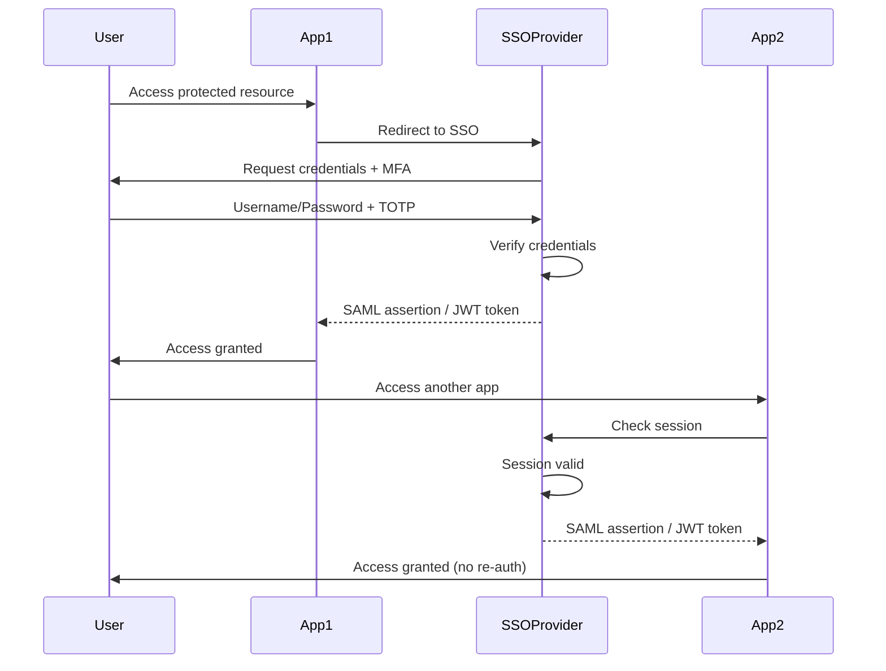
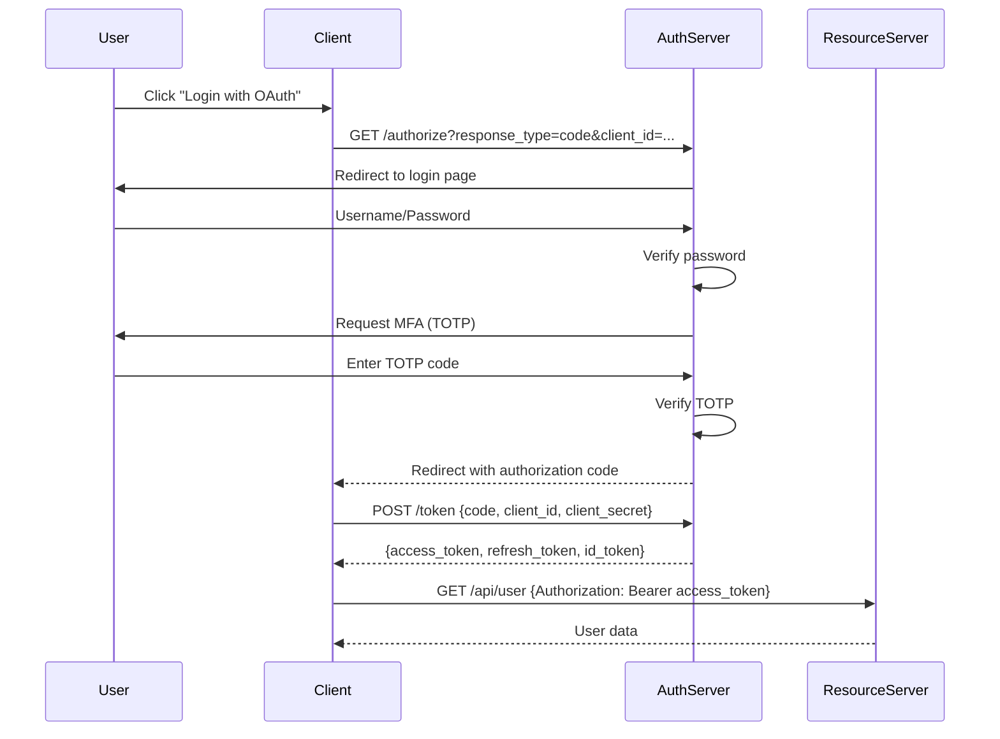
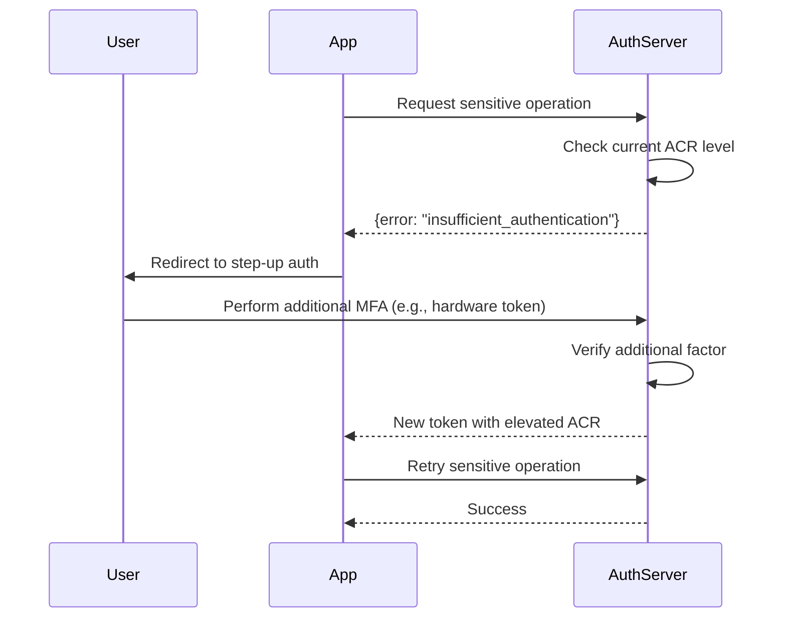

# WIA-SEC-008: Multi-Factor Authentication - PHASE 4 INTEGRATION

**Version:** 1.0.0
**Status:** Draft
**Last Updated:** 2025-12-25
**Category:** Security (SEC)

---

## 1. Overview

This phase defines integration patterns for Multi-Factor Authentication with SSO, OAuth2, SAML, OpenID Connect, and third-party authenticator applications.

### Philosophy: 弘익人間 (Benefit All Humanity)

Seamless MFA integration across platforms and services protects users everywhere, benefiting all of humanity through universal security.

---

## 2. SSO Integration

### 2.1 Single Sign-On with MFA

**Flow Diagram:**


**SSO Session Token:**
```json
{
  "session_id": "sso_sess_abc123",
  "user_id": "user123",
  "issued_at": "2025-12-25T12:00:00Z",
  "expires_at": "2025-12-25T20:00:00Z",
  "auth_methods": ["password", "totp"],
  "auth_time": "2025-12-25T12:00:05Z",
  "amr": ["pwd", "otp"],
  "acr": "urn:mace:incommon:iap:silver"
}
```

---

## 3. OAuth 2.0 Integration

### 3.1 OAuth 2.0 Authorization Code Flow with MFA



**Authorization Request:**
```http
GET /oauth/authorize?
  response_type=code&
  client_id=CLIENT_ID&
  redirect_uri=https://app.example.com/callback&
  scope=openid profile email&
  state=RANDOM_STATE&
  nonce=RANDOM_NONCE&
  acr_values=urn:mace:incommon:iap:silver HTTP/1.1
Host: auth.example.com
```

**Token Response with MFA Claims:**
```json
{
  "access_token": "ACCESS_TOKEN",
  "token_type": "Bearer",
  "expires_in": 3600,
  "refresh_token": "REFRESH_TOKEN",
  "scope": "openid profile email",
  "id_token": "ID_TOKEN"
}
```

**Decoded ID Token:**
```json
{
  "iss": "https://auth.example.com",
  "sub": "user123",
  "aud": "CLIENT_ID",
  "exp": 1735142400,
  "iat": 1735135200,
  "auth_time": 1735135205,
  "nonce": "RANDOM_NONCE",
  "amr": ["pwd", "otp"],
  "acr": "urn:mace:incommon:iap:silver",
  "email": "user@example.com",
  "email_verified": true
}
```

### 3.2 Step-Up Authentication

**Trigger Step-Up:**
```http
GET /api/sensitive-operation HTTP/1.1
Host: api.example.com
Authorization: Bearer ACCESS_TOKEN

Response (403):
{
  "error": "insufficient_authentication",
  "error_description": "This operation requires step-up authentication",
  "acr_values": "urn:mace:incommon:iap:gold",
  "auth_url": "https://auth.example.com/step-up?..."
}
```

**Step-Up Flow:**


---

## 4. SAML 2.0 Integration

### 4.1 SAML Authentication with MFA

```xml
<samlp:AuthnRequest
    xmlns:samlp="urn:oasis:names:tc:SAML:2.0:protocol"
    ID="_abc123"
    Version="2.0"
    IssueInstant="2025-12-25T12:00:00Z"
    Destination="https://idp.example.com/saml/sso">

    <saml:Issuer>https://sp.example.com</saml:Issuer>

    <samlp:RequestedAuthnContext Comparison="minimum">
        <saml:AuthnContextClassRef>
            urn:oasis:names:tc:SAML:2.0:ac:classes:PasswordProtectedTransport
        </saml:AuthnContextClassRef>
        <saml:AuthnContextClassRef>
            urn:oasis:names:tc:SAML:2.0:ac:classes:TimeSyncToken
        </saml:AuthnContextClassRef>
    </samlp:RequestedAuthnContext>
</samlp:AuthnRequest>
```

**SAML Response with MFA:**
```xml
<samlp:Response
    xmlns:samlp="urn:oasis:names:tc:SAML:2.0:protocol"
    ID="_xyz789"
    InResponseTo="_abc123"
    Version="2.0"
    IssueInstant="2025-12-25T12:00:10Z">

    <saml:Assertion>
        <saml:Subject>
            <saml:NameID>user@example.com</saml:NameID>
        </saml:Subject>

        <saml:AuthnStatement
            AuthnInstant="2025-12-25T12:00:05Z"
            SessionIndex="sess_abc123">
            <saml:AuthnContext>
                <saml:AuthnContextClassRef>
                    urn:oasis:names:tc:SAML:2.0:ac:classes:TimeSyncToken
                </saml:AuthnContextClassRef>
            </saml:AuthnContext>
        </saml:AuthnStatement>

        <saml:AttributeStatement>
            <saml:Attribute Name="mfa_verified">
                <saml:AttributeValue>true</saml:AttributeValue>
            </saml:Attribute>
            <saml:Attribute Name="mfa_methods">
                <saml:AttributeValue>password,totp</saml:AttributeValue>
            </saml:Attribute>
        </saml:AttributeStatement>
    </saml:Assertion>
</samlp:Response>
```

---

## 5. OpenID Connect Integration

### 5.1 OIDC Discovery

```http
GET /.well-known/openid-configuration HTTP/1.1
Host: auth.example.com

Response:
{
  "issuer": "https://auth.example.com",
  "authorization_endpoint": "https://auth.example.com/oauth/authorize",
  "token_endpoint": "https://auth.example.com/oauth/token",
  "userinfo_endpoint": "https://auth.example.com/oauth/userinfo",
  "jwks_uri": "https://auth.example.com/.well-known/jwks.json",
  "response_types_supported": ["code", "token", "id_token"],
  "subject_types_supported": ["public"],
  "id_token_signing_alg_values_supported": ["RS256"],
  "scopes_supported": ["openid", "profile", "email"],
  "claims_supported": ["sub", "name", "email", "email_verified", "amr", "acr"],
  "acr_values_supported": [
    "urn:mace:incommon:iap:bronze",
    "urn:mace:incommon:iap:silver",
    "urn:mace:incommon:iap:gold"
  ]
}
```

### 5.2 ACR (Authentication Context Class Reference) Values

**MFA Assurance Levels:**
```yaml
Bronze (Password only):
  acr: urn:mace:incommon:iap:bronze
  methods: [password]

Silver (Password + OTP):
  acr: urn:mace:incommon:iap:silver
  methods: [password, totp|sms|push]

Gold (Password + Hardware Token):
  acr: urn:mace:incommon:iap:gold
  methods: [password, hardware_token|biometric]
```

---

## 6. Third-Party Authenticator Integration

### 6.1 Google Authenticator

**QR Code Generation:**
```javascript
const otpauth_url = `otpauth://totp/${encodeURIComponent(issuer)}:${encodeURIComponent(account)}?secret=${secret}&issuer=${encodeURIComponent(issuer)}&algorithm=SHA256&digits=6&period=30`;

const qr_code = await QRCode.toDataURL(otpauth_url);
```

**Verification:**
```javascript
const speakeasy = require('speakeasy');

const verified = speakeasy.totp.verify({
  secret: user.totp_secret,
  encoding: 'base32',
  token: user_provided_otp,
  window: 1 // Allow ±30 seconds time drift
});
```

### 6.2 Authy Integration

**API Request:**
```http
POST https://api.authy.com/protected/json/users/new
X-Authy-API-Key: API_KEY
Content-Type: application/json

{
  "user": {
    "email": "user@example.com",
    "cellphone": "555-1234",
    "country_code": "1"
  }
}

Response:
{
  "user": {
    "id": 12345
  }
}
```

**Send Push:**
```http
POST https://api.authy.com/onetouch/json/users/{authy_id}/approval_requests
X-Authy-API-Key: API_KEY
Content-Type: application/json

{
  "message": "Login to Example App",
  "details": {
    "Location": "San Francisco, CA",
    "Device": "Chrome on macOS"
  },
  "seconds_to_expire": 300
}
```

### 6.3 Microsoft Authenticator

**TOTP Setup:**
- Standard TOTP protocol (RFC 6238)
- SHA1/SHA256 algorithm support
- 6-8 digit codes
- 30-60 second time steps

**Push Notification (via Azure AD):**
```http
POST https://graph.microsoft.com/v1.0/me/authentication/phoneMethods
Authorization: Bearer ACCESS_TOKEN
Content-Type: application/json

{
  "phoneNumber": "+1 555-1234",
  "phoneType": "mobile"
}
```

---

## 7. Mobile App Integration

### 7.1 iOS Integration (Native)

**LocalAuthentication Framework:**
```swift
import LocalAuthentication

let context = LAContext()
var error: NSError?

if context.canEvaluatePolicy(.deviceOwnerAuthenticationWithBiometrics, error: &error) {
    context.evaluatePolicy(
        .deviceOwnerAuthenticationWithBiometrics,
        localizedReason: "Authenticate to access your account"
    ) { success, error in
        if success {
            // Biometric authentication successful
            // Proceed with TOTP or other MFA
        }
    }
}
```

### 7.2 Android Integration (Native)

**BiometricPrompt API:**
```kotlin
import androidx.biometric.BiometricPrompt

val promptInfo = BiometricPrompt.PromptInfo.Builder()
    .setTitle("Biometric Authentication")
    .setSubtitle("Authenticate to access your account")
    .setNegativeButtonText("Cancel")
    .build()

biometricPrompt.authenticate(promptInfo)
```

### 7.3 React Native Integration

**expo-local-authentication:**
```javascript
import * as LocalAuthentication from 'expo-local-authentication';

const authenticate = async () => {
  const hasHardware = await LocalAuthentication.hasHardwareAsync();
  const isEnrolled = await LocalAuthentication.isEnrolledAsync();

  if (hasHardware && isEnrolled) {
    const result = await LocalAuthentication.authenticateAsync({
      promptMessage: 'Authenticate to continue',
      fallbackLabel: 'Use passcode'
    });

    if (result.success) {
      // Proceed with MFA
    }
  }
};
```

---

## 8. WebAuthn / FIDO2 Integration

### 8.1 Browser Support

**Check WebAuthn Availability:**
```javascript
if (window.PublicKeyCredential) {
  // WebAuthn is supported
  const available = await PublicKeyCredential.isUserVerifyingPlatformAuthenticatorAvailable();

  if (available) {
    // Platform authenticator (TouchID, FaceID, Windows Hello) available
  }
}
```

### 8.2 Registration

```javascript
const publicKeyCredentialCreationOptions = {
  challenge: Uint8Array.from(challengeBase64, c => c.charCodeAt(0)),
  rp: {
    name: "Example Corp",
    id: "example.com",
  },
  user: {
    id: Uint8Array.from(userIdBase64, c => c.charCodeAt(0)),
    name: "user@example.com",
    displayName: "John Doe",
  },
  pubKeyCredParams: [{alg: -7, type: "public-key"}],
  authenticatorSelection: {
    authenticatorAttachment: "cross-platform",
    userVerification: "required"
  },
  timeout: 60000,
  attestation: "direct"
};

const credential = await navigator.credentials.create({
  publicKey: publicKeyCredentialCreationOptions
});
```

### 8.3 Authentication

```javascript
const publicKeyCredentialRequestOptions = {
  challenge: Uint8Array.from(challengeBase64, c => c.charCodeAt(0)),
  allowCredentials: [{
    id: Uint8Array.from(credentialIdBase64, c => c.charCodeAt(0)),
    type: 'public-key',
    transports: ['usb', 'nfc', 'ble']
  }],
  timeout: 60000,
  userVerification: "required"
};

const assertion = await navigator.credentials.get({
  publicKey: publicKeyCredentialRequestOptions
});
```

---

## 9. API Integration Examples

### 9.1 REST API with MFA

**Protected Endpoint:**
```javascript
app.get('/api/protected', authenticateToken, checkMFA, (req, res) => {
  if (!req.user.mfa_verified) {
    return res.status(403).json({
      error: 'mfa_required',
      mfa_methods: ['totp', 'hardware_token']
    });
  }

  res.json({ data: 'Protected data' });
});
```

### 9.2 GraphQL with MFA

**Schema:**
```graphql
type Query {
  sensitiveData: SensitiveData @requireMFA(methods: ["totp", "hardware_token"])
}

type Mutation {
  transferMoney(amount: Float!): Transaction @requireMFA(methods: ["hardware_token"])
}
```

**Resolver:**
```javascript
const resolvers = {
  Query: {
    sensitiveData: async (parent, args, context) => {
      if (!context.user.mfa_verified) {
        throw new AuthenticationError('MFA required');
      }
      return getSensitiveData();
    }
  }
};
```

---

## 10. Cloud Platform Integration

### 10.1 AWS Cognito

```javascript
const AWS = require('aws-sdk');
const cognito = new AWS.CognitoIdentityServiceProvider();

// Enable MFA
const enableMFA = async (username) => {
  await cognito.setUserMFAPreference({
    UserPoolId: 'us-east-1_abc123',
    Username: username,
    SoftwareTokenMfaSettings: {
      Enabled: true,
      PreferredMfa: true
    }
  }).promise();
};
```

### 10.2 Azure AD B2C

```json
{
  "policies": {
    "B2C_1A_signup_signin_with_mfa": {
      "tenant": "example.onmicrosoft.com",
      "policy": "B2C_1A_signup_signin_with_mfa",
      "mfa": {
        "type": "totp",
        "required": true
      }
    }
  }
}
```

### 10.3 Google Cloud Identity Platform

```javascript
const admin = require('firebase-admin');

// Enroll TOTP
const enrollTOTP = async (uid) => {
  const mfaInfo = await admin.auth().createUser({
    uid: uid,
    multiFactor: {
      enrolledFactors: [{
        phoneNumber: '+1 555-1234',
        displayName: 'Work phone'
      }]
    }
  });
};
```

---

## 11. Testing & Validation

### 11.1 Integration Test Example

```javascript
describe('MFA Integration Tests', () => {
  it('should require MFA for protected endpoints', async () => {
    const response = await request(app)
      .get('/api/protected')
      .set('Authorization', `Bearer ${accessToken}`);

    expect(response.status).toBe(403);
    expect(response.body.error).toBe('mfa_required');
  });

  it('should allow access after MFA verification', async () => {
    const otpCode = generateTOTP(secret);

    await request(app)
      .post('/api/auth/mfa/verify')
      .send({ code: otpCode });

    const response = await request(app)
      .get('/api/protected')
      .set('Authorization', `Bearer ${accessToken}`);

    expect(response.status).toBe(200);
  });
});
```

---

## 12. Migration Strategies

### 12.1 Legacy System Migration

```yaml
Phase 1: Assessment (Week 1-2)
  - Audit existing authentication
  - Identify users and systems
  - Plan MFA rollout

Phase 2: Pilot (Week 3-4)
  - Enable MFA for admin users
  - Test integration
  - Gather feedback

Phase 3: Gradual Rollout (Week 5-8)
  - Enable for 10% users
  - Monitor issues
  - Increase to 50%
  - Full rollout

Phase 4: Enforcement (Week 9+)
  - Make MFA mandatory
  - Disable legacy auth
  - Monitor compliance
```

---

## 13. References

- [OAuth 2.0 - RFC 6749](https://datatracker.ietf.org/doc/html/rfc6749)
- [OpenID Connect Core 1.0](https://openid.net/specs/openid-connect-core-1_0.html)
- [SAML 2.0](http://docs.oasis-open.org/security/saml/v2.0/)
- [WebAuthn Level 2](https://www.w3.org/TR/webauthn-2/)

---

**Copyright © 2025 SmileStory Inc. / WIA**
**弘益人間 (홍익인간) · Benefit All Humanity**
