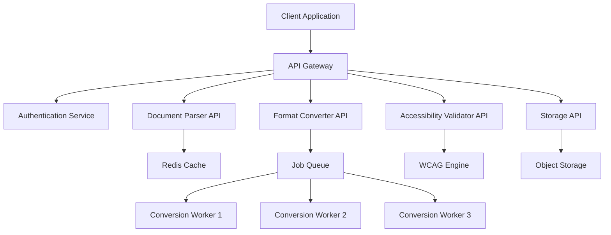

# WIA PubScript API Interface Specification

**Phase 2: API Interface Standard**

**Version**: 1.0.0
**Status**: Draft
**Date**: 2025-01
**Primary Color**: #8B5CF6 (Violet)

---

## Overview

### 1.1 Purpose

WIA PubScript API Interface defines RESTful APIs for document parsing, format conversion, accessibility validation, and publishing workflows. This specification enables developers to integrate PubScript functionality into content management systems, publishing platforms, and authoring tools.

### 1.2 Design Goals

1. **RESTful Architecture**: Standard HTTP methods and status codes
2. **Format Agnostic**: Support all PubScript output formats
3. **Real-time Validation**: Instant accessibility and quality checks
4. **Batch Processing**: Handle large-scale conversions
5. **Extensible**: Plugin architecture for custom formats
6. **Performance**: Optimized for speed and scalability

### 1.3 API Architecture



---

## Authentication

### 2.1 API Authentication

```http
POST /v1/auth/token
Content-Type: application/json

{
  "client_id": "your-client-id",
  "client_secret": "your-client-secret",
  "grant_type": "client_credentials",
  "scope": "read write convert validate"
}
```

**Response:**
```json
{
  "access_token": "eyJhbGciOiJSUzI1NiIsInR5cCI6IkpXVCJ9...",
  "token_type": "Bearer",
  "expires_in": 3600,
  "scope": "read write convert validate"
}
```

### 2.2 API Key Authentication

```http
GET /v1/documents
X-API-Key: your-api-key-here
```

### 2.3 OAuth 2.0 Flow

```typescript
interface OAuth2Config {
  authorization_endpoint: string;  // /oauth/authorize
  token_endpoint: string;          // /oauth/token
  scopes: string[];
  response_types: ['code', 'token'];
  grant_types: ['authorization_code', 'refresh_token', 'client_credentials'];
}
```

---

## Document Parser API

### 3.1 Parse Document

Parse a document into PubScript format.

```http
POST /v1/parser/parse
Authorization: Bearer {token}
Content-Type: multipart/form-data

{
  "file": <binary>,
  "source_format": "docx",
  "options": {
    "extract_images": true,
    "extract_tables": true,
    "preserve_formatting": true,
    "detect_headings": true,
    "generate_alt_text": true
  }
}
```

**Response:**
```json
{
  "success": true,
  "data": {
    "document_id": "doc-20250115-001",
    "status": "parsed",
    "document": {
      "wia_version": "1.0.0",
      "document_id": "doc-20250115-001",
      "document_info": {
        "title": "Extracted Document Title",
        "language": "en-US",
        "created": "2025-01-15T10:00:00Z"
      },
      "structure": {
        "type": "document",
        "chapters": 5,
        "sections": 24
      }
    },
    "warnings": [
      {
        "type": "missing_alt_text",
        "count": 3,
        "severity": "warning"
      }
    ]
  }
}
```

### 3.2 Parse from URL

```http
POST /v1/parser/parse-url
Authorization: Bearer {token}
Content-Type: application/json

{
  "url": "https://example.com/document.html",
  "source_format": "html",
  "options": {
    "extract_metadata": true,
    "follow_links": false
  }
}
```

### 3.3 Batch Parse

```http
POST /v1/parser/batch
Authorization: Bearer {token}
Content-Type: application/json

{
  "documents": [
    {
      "file_url": "s3://bucket/doc1.docx",
      "source_format": "docx"
    },
    {
      "file_url": "s3://bucket/doc2.pdf",
      "source_format": "pdf"
    }
  ],
  "callback_url": "https://your-app.com/webhook/parse-complete"
}
```

**Response:**
```json
{
  "success": true,
  "data": {
    "batch_id": "batch-20250115-001",
    "status": "processing",
    "total_documents": 2,
    "estimated_time": "5 minutes",
    "status_url": "/v1/parser/batch/batch-20250115-001/status"
  }
}
```

---

## Format Converter API

### 4.1 Convert Document

```http
POST /v1/converter/convert
Authorization: Bearer {token}
Content-Type: application/json

{
  "document_id": "doc-20250115-001",
  "target_format": "epub3",
  "options": {
    "include_images": true,
    "include_css": true,
    "compression": "standard",
    "accessibility": {
      "wcag_level": "AA",
      "include_aria": true,
      "include_alt_text": true
    }
  }
}
```

**Response:**
```json
{
  "success": true,
  "data": {
    "conversion_id": "conv-20250115-001",
    "status": "completed",
    "output": {
      "format": "epub3",
      "file_url": "https://cdn.pubscript.org/conversions/conv-20250115-001.epub",
      "file_size_bytes": 2457600,
      "expires_at": "2025-01-22T10:00:00Z"
    },
    "metadata": {
      "pages": 145,
      "words": 35000,
      "images": 12,
      "tables": 5
    }
  }
}
```

### 4.2 Supported Conversions

```http
GET /v1/converter/formats
Authorization: Bearer {token}
```

**Response:**
```json
{
  "success": true,
  "data": {
    "input_formats": [
      "pubscript",
      "docx",
      "html",
      "markdown",
      "latex",
      "pdf"
    ],
    "output_formats": [
      "html",
      "pdf",
      "epub3",
      "mobi",
      "braille",
      "daisy",
      "audio",
      "plain_text"
    ],
    "conversion_matrix": {
      "pubscript": ["html", "pdf", "epub3", "braille", "daisy", "audio"],
      "docx": ["pubscript", "html", "pdf", "epub3"],
      "html": ["pubscript", "pdf", "epub3"],
      "markdown": ["pubscript", "html", "pdf", "epub3"]
    }
  }
}
```

### 4.3 Multi-Format Batch Conversion

```http
POST /v1/converter/batch-multi
Authorization: Bearer {token}
Content-Type: application/json

{
  "document_id": "doc-20250115-001",
  "target_formats": ["html", "pdf", "epub3", "braille", "audio"],
  "options": {
    "parallel_processing": true,
    "priority": "high"
  },
  "callback_url": "https://your-app.com/webhook/conversion-complete"
}
```

---

## Accessibility Validator API

### 5.1 Validate Document

```http
POST /v1/validator/validate
Authorization: Bearer {token}
Content-Type: application/json

{
  "document_id": "doc-20250115-001",
  "validation_level": "WCAG21-AA",
  "checks": {
    "alt_text": true,
    "heading_hierarchy": true,
    "color_contrast": true,
    "keyboard_navigation": true,
    "aria_attributes": true,
    "semantic_structure": true,
    "reading_order": true
  }
}
```

**Response:**
```json
{
  "success": true,
  "data": {
    "validation_id": "val-20250115-001",
    "document_id": "doc-20250115-001",
    "wcag_level": "AA",
    "wcag_version": "2.1",
    "overall_status": "pass_with_warnings",
    "score": 92,

    "summary": {
      "total_checks": 87,
      "passed": 80,
      "warnings": 7,
      "errors": 0,
      "critical": 0
    },

    "results": [
      {
        "check_id": "alt-text-001",
        "guideline": "1.1.1 Non-text Content",
        "level": "A",
        "status": "warning",
        "severity": "medium",
        "element": "img#figure-01-03",
        "message": "Alternative text is generic. Consider more descriptive text.",
        "location": {
          "chapter": "chapter-01",
          "section": "section-01-03",
          "line": 45
        },
        "suggestion": "Describe the specific content and purpose of the image.",
        "auto_fix_available": false
      },
      {
        "check_id": "heading-002",
        "guideline": "1.3.1 Info and Relationships",
        "level": "A",
        "status": "pass",
        "element": "h2#section-title-01",
        "message": "Heading hierarchy is correct."
      }
    ],

    "recommendations": [
      "Add long descriptions for complex diagrams",
      "Ensure all interactive elements have focus indicators",
      "Test with screen readers for optimal experience"
    ]
  }
}
```

### 5.2 Real-time Validation

```http
POST /v1/validator/validate-live
Authorization: Bearer {token}
Content-Type: application/json

{
  "content": {
    "type": "section",
    "html": "",
    "context": {
      "document_id": "doc-20250115-001",
      "section_id": "section-01-05"
    }
  },
  "checks": ["alt_text", "aria_attributes"]
}
```

**Response (WebSocket streaming):**
```json
{
  "type": "validation_result",
  "timestamp": "2025-01-15T10:00:00Z",
  "results": [
    {
      "check": "alt_text",
      "status": "warning",
      "message": "Alt text 'diagram' is not descriptive enough"
    }
  ]
}
```

### 5.3 Automated Fixing

```http
POST /v1/validator/auto-fix
Authorization: Bearer {token}
Content-Type: application/json

{
  "document_id": "doc-20250115-001",
  "validation_id": "val-20250115-001",
  "fix_types": ["generate_alt_text", "fix_heading_hierarchy", "add_aria_labels"],
  "ai_assisted": true
}
```

---

## Document Management API

### 6.1 Create Document

```http
POST /v1/documents
Authorization: Bearer {token}
Content-Type: application/json

{
  "document_info": {
    "title": "New Publication",
    "language": "en-US",
    "authors": [
      {
        "name": "Jane Smith",
        "role": "primary_author"
      }
    ]
  },
  "template": "academic-paper"
}
```

### 6.2 Get Document

```http
GET /v1/documents/{document_id}
Authorization: Bearer {token}
```

### 6.3 Update Document

```http
PATCH /v1/documents/{document_id}
Authorization: Bearer {token}
Content-Type: application/json

{
  "document_info": {
    "title": "Updated Title"
  },
  "sections": [
    {
      "section_id": "section-01-01",
      "content": "Updated content"
    }
  ]
}
```

### 6.4 Delete Document

```http
DELETE /v1/documents/{document_id}
Authorization: Bearer {token}
```

### 6.5 List Documents

```http
GET /v1/documents?page=1&per_page=20&status=published
Authorization: Bearer {token}
```

---

## Version Control API

### 7.1 Create Version

```http
POST /v1/documents/{document_id}/versions
Authorization: Bearer {token}
Content-Type: application/json

{
  "version": "1.1.0",
  "changes": "Updated chapter 2, fixed accessibility issues",
  "status": "draft"
}
```

### 7.2 Get Version

```http
GET /v1/documents/{document_id}/versions/{version}
Authorization: Bearer {token}
```

### 7.3 Compare Versions

```http
GET /v1/documents/{document_id}/versions/compare?from=1.0.0&to=1.1.0
Authorization: Bearer {token}
```

**Response:**
```json
{
  "success": true,
  "data": {
    "from_version": "1.0.0",
    "to_version": "1.1.0",
    "changes": {
      "sections_added": 3,
      "sections_modified": 5,
      "sections_deleted": 1,
      "images_added": 2,
      "word_count_change": 1500
    },
    "diff": [
      {
        "type": "section_modified",
        "section_id": "section-02-01",
        "old_content": "Original text...",
        "new_content": "Updated text..."
      }
    ]
  }
}
```

### 7.4 Rollback Version

```http
POST /v1/documents/{document_id}/versions/{version}/rollback
Authorization: Bearer {token}
```

---

## Translation API

### 8.1 Request Translation

```http
POST /v1/translations
Authorization: Bearer {token}
Content-Type: application/json

{
  "document_id": "doc-20250115-001",
  "source_language": "en-US",
  "target_languages": ["ko-KR", "ja-JP", "es-ES"],
  "translation_method": "human",
  "preserve_formatting": true,
  "callback_url": "https://your-app.com/webhook/translation-complete"
}
```

**Response:**
```json
{
  "success": true,
  "data": {
    "translation_job_id": "trans-20250115-001",
    "status": "processing",
    "estimated_completion": "2025-01-20T10:00:00Z",
    "target_languages": ["ko-KR", "ja-JP", "es-ES"],
    "status_url": "/v1/translations/trans-20250115-001/status"
  }
}
```

### 8.2 Machine Translation

```http
POST /v1/translations/machine
Authorization: Bearer {token}
Content-Type: application/json

{
  "document_id": "doc-20250115-001",
  "target_language": "ko-KR",
  "engine": "neural_mt",
  "post_editing": false
}
```

### 8.3 Translation Memory

```http
GET /v1/translations/memory?source_lang=en-US&target_lang=ko-KR&query=accessible
Authorization: Bearer {token}
```

**Response:**
```json
{
  "success": true,
  "data": {
    "matches": [
      {
        "source": "accessible publishing",
        "target": "접근 가능한 출판",
        "score": 100,
        "context": "document_title",
        "last_used": "2025-01-10T10:00:00Z"
      },
      {
        "source": "accessibility features",
        "target": "접근성 기능",
        "score": 85,
        "context": "section_heading"
      }
    ]
  }
}
```

---

## Asset Management API

### 9.1 Upload Image

```http
POST /v1/assets/images
Authorization: Bearer {token}
Content-Type: multipart/form-data

{
  "file": <binary>,
  "document_id": "doc-20250115-001",
  "metadata": {
    "alt_text": "Accessibility workflow diagram",
    "caption": "Figure 1: The complete accessibility workflow",
    "copyright": "© 2025 Author Name",
    "license": "CC BY-SA 4.0"
  }
}
```

**Response:**
```json
{
  "success": true,
  "data": {
    "asset_id": "img-20250115-001",
    "url": "https://cdn.pubscript.org/assets/img-20250115-001.png",
    "formats": {
      "original": "https://cdn.pubscript.org/assets/img-20250115-001.png",
      "thumbnail": "https://cdn.pubscript.org/assets/img-20250115-001-thumb.jpg",
      "webp": "https://cdn.pubscript.org/assets/img-20250115-001.webp"
    },
    "metadata": {
      "width": 1200,
      "height": 800,
      "format": "png",
      "size_bytes": 245760
    }
  }
}
```

### 9.2 Generate Alt Text (AI)

```http
POST /v1/assets/images/{image_id}/generate-alt-text
Authorization: Bearer {token}
Content-Type: application/json

{
  "context": "scientific diagram showing workflow",
  "detail_level": "detailed"
}
```

**Response:**
```json
{
  "success": true,
  "data": {
    "alt_text_short": "Accessibility workflow diagram with five stages",
    "alt_text_long": "Flowchart showing the accessibility workflow with five connected stages: Content Creation at top, flowing to Accessibility Review, then to Multi-format Conversion, Quality Assurance, and finally Publication. Each stage is represented by a rounded rectangle with arrows indicating the process flow.",
    "confidence": 0.92,
    "suggestions": [
      "Consider adding specific details about each stage",
      "Mention color coding if relevant to understanding"
    ]
  }
}
```

---

## Collaboration API

### 10.1 Create Comment

```http
POST /v1/documents/{document_id}/comments
Authorization: Bearer {token}
Content-Type: application/json

{
  "section_id": "section-01-03",
  "text": "Consider adding more examples here",
  "thread_id": null,
  "mentions": ["@editor-001"]
}
```

### 10.2 Track Changes

```http
GET /v1/documents/{document_id}/changes?since=2025-01-15T00:00:00Z
Authorization: Bearer {token}
```

**Response:**
```json
{
  "success": true,
  "data": {
    "changes": [
      {
        "change_id": "chg-001",
        "timestamp": "2025-01-15T10:30:00Z",
        "user": "author-002",
        "type": "content_edit",
        "section_id": "section-01-02",
        "action": "modified",
        "diff": {
          "before": "Original content",
          "after": "Modified content"
        },
        "status": "pending_review"
      }
    ]
  }
}
```

### 10.3 Approve/Reject Changes

```http
POST /v1/documents/{document_id}/changes/{change_id}/approve
Authorization: Bearer {token}
Content-Type: application/json

{
  "comment": "Looks good, approved"
}
```

---

## Export API

### 11.1 Export Package

```http
POST /v1/export/package
Authorization: Bearer {token}
Content-Type: application/json

{
  "document_id": "doc-20250115-001",
  "formats": ["html", "pdf", "epub3"],
  "include_assets": true,
  "include_metadata": true,
  "compression": "zip"
}
```

**Response:**
```json
{
  "success": true,
  "data": {
    "package_id": "pkg-20250115-001",
    "download_url": "https://cdn.pubscript.org/packages/pkg-20250115-001.zip",
    "expires_at": "2025-01-22T10:00:00Z",
    "size_bytes": 5242880,
    "contents": {
      "formats": ["html", "pdf", "epub3"],
      "assets": 15,
      "metadata_files": 3
    }
  }
}
```

---

## Webhook API

### 12.1 Register Webhook

```http
POST /v1/webhooks
Authorization: Bearer {token}
Content-Type: application/json

{
  "url": "https://your-app.com/webhook/pubscript",
  "events": [
    "document.created",
    "document.updated",
    "conversion.completed",
    "validation.completed",
    "translation.completed"
  ],
  "secret": "your-webhook-secret"
}
```

### 12.2 Webhook Payload Example

```json
{
  "event": "conversion.completed",
  "timestamp": "2025-01-15T10:00:00Z",
  "data": {
    "conversion_id": "conv-20250115-001",
    "document_id": "doc-20250115-001",
    "format": "epub3",
    "status": "success",
    "output_url": "https://cdn.pubscript.org/conversions/conv-20250115-001.epub"
  },
  "signature": "sha256=..."
}
```

---

## Rate Limits

### 13.1 Rate Limit Headers

```http
HTTP/1.1 200 OK
X-RateLimit-Limit: 1000
X-RateLimit-Remaining: 995
X-RateLimit-Reset: 1642248000
```

### 13.2 Rate Limit Tiers

| Tier | Requests/Hour | Conversions/Day | Storage |
|------|---------------|-----------------|---------|
| Free | 100 | 10 | 1 GB |
| Basic | 1,000 | 100 | 10 GB |
| Professional | 10,000 | 1,000 | 100 GB |
| Enterprise | Unlimited | Unlimited | Unlimited |

---

## Error Handling

### 14.1 Error Response Format

```json
{
  "success": false,
  "error": {
    "code": "VALIDATION_FAILED",
    "message": "Document validation failed",
    "details": [
      {
        "field": "document_info.title",
        "issue": "Title is required"
      }
    ],
    "request_id": "req-20250115-001",
    "documentation_url": "https://docs.pubscript.org/errors/VALIDATION_FAILED"
  }
}
```

### 14.2 Common Error Codes

| Code | HTTP Status | Description |
|------|-------------|-------------|
| `UNAUTHORIZED` | 401 | Invalid or missing authentication |
| `FORBIDDEN` | 403 | Insufficient permissions |
| `NOT_FOUND` | 404 | Resource not found |
| `VALIDATION_FAILED` | 422 | Input validation failed |
| `RATE_LIMIT_EXCEEDED` | 429 | Too many requests |
| `INTERNAL_ERROR` | 500 | Server error |
| `SERVICE_UNAVAILABLE` | 503 | Service temporarily unavailable |

---

## TypeScript SDK

```typescript
import { PubScriptClient } from '@wia/pubscript-sdk';

const client = new PubScriptClient({
  apiKey: 'your-api-key',
  baseUrl: 'https://api.pubscript.org/v1'
});

// Parse document
const parsed = await client.parser.parse({
  file: documentFile,
  sourceFormat: 'docx',
  options: {
    extractImages: true,
    generateAltText: true
  }
});

// Convert to EPUB
const conversion = await client.converter.convert({
  documentId: parsed.document_id,
  targetFormat: 'epub3',
  options: {
    accessibility: {
      wcagLevel: 'AA'
    }
  }
});

// Validate accessibility
const validation = await client.validator.validate({
  documentId: parsed.document_id,
  validationLevel: 'WCAG21-AA'
});

console.log(`Validation score: ${validation.score}/100`);
```

---

## Python SDK

```python
from pubscript import PubScriptClient

client = PubScriptClient(
    api_key='your-api-key',
    base_url='https://api.pubscript.org/v1'
)

# Parse document
parsed = client.parser.parse(
    file=open('document.docx', 'rb'),
    source_format='docx',
    options={
        'extract_images': True,
        'generate_alt_text': True
    }
)

# Convert to multiple formats
conversions = client.converter.batch_multi(
    document_id=parsed['document_id'],
    target_formats=['html', 'pdf', 'epub3', 'braille'],
    options={
        'parallel_processing': True
    }
)

# Validate accessibility
validation = client.validator.validate(
    document_id=parsed['document_id'],
    validation_level='WCAG21-AA'
)

print(f"Validation score: {validation['score']}/100")
print(f"Issues found: {validation['summary']['warnings']}")
```

---

## Version History

| Version | Date | Changes |
|---------|------|---------|
| 1.0.0 | 2025-01 | Initial specification |

---

**Document Version**: 1.0.0
**Last Updated**: 2025-01-15
**Author**: WIA PubScript Working Group

---

弘益人間 - *Benefit All Humanity*
