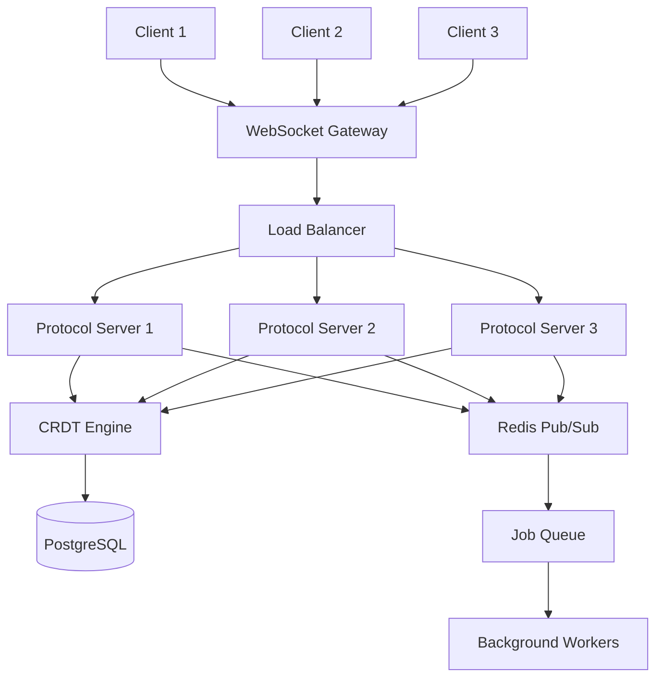

# WIA PubScript Protocol Specification

**Phase 3: Communication Protocol Standard**

**Version**: 1.0.0
**Status**: Draft
**Date**: 2025-01
**Primary Color**: #8B5CF6 (Violet)

---

## Overview

### 1.1 Purpose

WIA PubScript Protocol defines real-time communication standards for document processing pipelines, collaborative editing, and distributed publishing workflows. This specification enables multiple users, systems, and services to work together seamlessly on document creation, editing, and publishing.

### 1.2 Design Goals

1. **Real-time Collaboration**: Multiple users editing simultaneously
2. **Operational Transformation**: Conflict-free concurrent editing
3. **Event-Driven**: Reactive architecture for instant updates
4. **Scalable**: Support for large documents and many collaborators
5. **Resilient**: Graceful handling of network issues
6. **Secure**: End-to-end encryption for sensitive documents

### 1.3 Protocol Architecture



---

## WebSocket Protocol

### 2.1 Connection Establishment

```javascript
const socket = new WebSocket('wss://pubscript.org/v1/ws');

socket.onopen = () => {
  socket.send(JSON.stringify({
    type: 'auth',
    token: 'Bearer eyJhbGciOiJSUzI1NiIsInR5cCI6IkpXVCJ9...',
    protocol_version: '1.0.0'
  }));
};
```

**Server Response:**
```json
{
  "type": "auth_success",
  "session_id": "sess-20250115-001",
  "server_time": "2025-01-15T10:00:00.000Z",
  "capabilities": ["editing", "commenting", "presence", "notifications"]
}
```

### 2.2 Message Format

```typescript
interface WebSocketMessage {
  type: MessageType;
  message_id: string;
  timestamp: number;
  session_id: string;
  payload: any;
  signature?: string;
}

type MessageType =
  | 'auth'
  | 'auth_success'
  | 'join_document'
  | 'leave_document'
  | 'edit_operation'
  | 'cursor_position'
  | 'selection'
  | 'comment'
  | 'presence_update'
  | 'notification'
  | 'error';
```

### 2.3 Heartbeat Protocol

```json
{
  "type": "ping",
  "message_id": "msg-001",
  "timestamp": 1642248000000
}
```

**Server Response:**
```json
{
  "type": "pong",
  "message_id": "msg-001",
  "timestamp": 1642248001000,
  "server_time": 1642248001000
}
```

---

## Collaborative Editing Protocol

### 3.1 Join Document Session

```json
{
  "type": "join_document",
  "message_id": "msg-002",
  "timestamp": 1642248000000,
  "payload": {
    "document_id": "doc-20250115-001",
    "user_id": "user-001",
    "user_name": "Sarah Chen",
    "permissions": ["read", "write", "comment"],
    "cursor_color": "#8B5CF6"
  }
}
```

**Server Response:**
```json
{
  "type": "document_joined",
  "message_id": "msg-002",
  "timestamp": 1642248001000,
  "payload": {
    "document_id": "doc-20250115-001",
    "document_version": "1.2.0",
    "current_state": {
      "sections": [...],
      "metadata": {...}
    },
    "active_users": [
      {
        "user_id": "user-002",
        "user_name": "James Wilson",
        "cursor_color": "#10B981",
        "last_active": "2025-01-15T09:58:00Z"
      }
    ],
    "pending_operations": []
  }
}
```

### 3.2 Edit Operation

```json
{
  "type": "edit_operation",
  "message_id": "msg-003",
  "timestamp": 1642248002000,
  "payload": {
    "operation_id": "op-001",
    "document_id": "doc-20250115-001",
    "section_id": "section-01-02",
    "operation": {
      "type": "insert",
      "position": 125,
      "content": "New paragraph text.",
      "attributes": {
        "bold": false,
        "italic": false,
        "font_size": 12
      }
    },
    "user_id": "user-001",
    "parent_operation_id": null,
    "vector_clock": {
      "user-001": 5,
      "user-002": 3
    }
  }
}
```

### 3.3 Operation Types

```typescript
interface Operation {
  type: OperationType;
  position: number;
  content?: string;
  length?: number;
  attributes?: Record<string, any>;
}

type OperationType =
  | 'insert'
  | 'delete'
  | 'replace'
  | 'format'
  | 'move'
  | 'split'
  | 'merge';

// Examples:
const insertOp: Operation = {
  type: 'insert',
  position: 100,
  content: 'New text',
  attributes: { bold: true }
};

const deleteOp: Operation = {
  type: 'delete',
  position: 100,
  length: 10
};

const formatOp: Operation = {
  type: 'format',
  position: 100,
  length: 20,
  attributes: { italic: true }
};
```

### 3.4 Operational Transformation

```typescript
interface OperationalTransform {
  // Transform operation A against operation B
  transform(opA: Operation, opB: Operation): [Operation, Operation];

  // Compose two operations
  compose(op1: Operation, op2: Operation): Operation;

  // Invert an operation
  invert(op: Operation): Operation;
}

// Example transformation
function transformInsertInsert(
  op1: Insert,
  op2: Insert
): [Insert, Insert] {
  if (op1.position < op2.position) {
    return [op1, { ...op2, position: op2.position + op1.content.length }];
  } else if (op1.position > op2.position) {
    return [{ ...op1, position: op1.position + op2.content.length }, op2];
  } else {
    // Tie-breaker using user_id
    if (op1.user_id < op2.user_id) {
      return [op1, { ...op2, position: op2.position + op1.content.length }];
    } else {
      return [{ ...op1, position: op1.position + op2.content.length }, op2];
    }
  }
}
```

---

## CRDT (Conflict-free Replicated Data Type)

### 4.1 CRDT Implementation

```typescript
interface CRDTDocument {
  id: string;
  version: string;
  content: CRDTString;
  metadata: Map<string, CRDTRegister>;
  sections: Map<string, CRDTSection>;
}

interface CRDTString {
  characters: CRDTChar[];

  insert(position: number, char: string, siteId: string, clock: number): void;
  delete(position: number): void;
  toString(): string;
}

interface CRDTChar {
  id: CharId;
  value: string;
  visible: boolean;
  attributes: Map<string, any>;
}

interface CharId {
  siteId: string;
  clock: number;
  offset: number;
}
```

### 4.2 CRDT Operations

```json
{
  "type": "crdt_operation",
  "message_id": "msg-004",
  "timestamp": 1642248003000,
  "payload": {
    "document_id": "doc-20250115-001",
    "operation": {
      "type": "insert_char",
      "char_id": {
        "site_id": "user-001",
        "clock": 5,
        "offset": 0
      },
      "position_after": {
        "site_id": "user-001",
        "clock": 4,
        "offset": 0
      },
      "position_before": {
        "site_id": "user-002",
        "clock": 3,
        "offset": 0
      },
      "value": "A",
      "attributes": {
        "bold": true
      }
    }
  }
}
```

---

## Presence Protocol

### 5.1 Cursor Position

```json
{
  "type": "cursor_position",
  "message_id": "msg-005",
  "timestamp": 1642248004000,
  "payload": {
    "document_id": "doc-20250115-001",
    "user_id": "user-001",
    "section_id": "section-01-02",
    "position": 125,
    "cursor_color": "#8B5CF6"
  }
}
```

### 5.2 Selection

```json
{
  "type": "selection",
  "message_id": "msg-006",
  "timestamp": 1642248005000,
  "payload": {
    "document_id": "doc-20250115-001",
    "user_id": "user-001",
    "section_id": "section-01-02",
    "start": 125,
    "end": 150,
    "selection_color": "#8B5CF666"
  }
}
```

### 5.3 Presence Update

```json
{
  "type": "presence_update",
  "message_id": "msg-007",
  "timestamp": 1642248006000,
  "payload": {
    "document_id": "doc-20250115-001",
    "user_id": "user-001",
    "status": "active",
    "last_active": "2025-01-15T10:00:06Z",
    "current_section": "section-01-02",
    "activity": "editing"
  }
}
```

---

## Comment Protocol

### 6.1 Add Comment

```json
{
  "type": "comment",
  "message_id": "msg-008",
  "timestamp": 1642248007000,
  "payload": {
    "action": "create",
    "comment_id": "comment-001",
    "document_id": "doc-20250115-001",
    "section_id": "section-01-02",
    "thread_id": null,
    "position": {
      "start": 125,
      "end": 150
    },
    "user_id": "user-002",
    "user_name": "James Wilson",
    "text": "Consider adding more examples here",
    "mentions": ["@user-001"],
    "attachments": []
  }
}
```

### 6.2 Reply to Comment

```json
{
  "type": "comment",
  "message_id": "msg-009",
  "timestamp": 1642248008000,
  "payload": {
    "action": "reply",
    "comment_id": "comment-002",
    "thread_id": "comment-001",
    "document_id": "doc-20250115-001",
    "user_id": "user-001",
    "user_name": "Sarah Chen",
    "text": "Good idea, I'll add them now",
    "mentions": ["@user-002"]
  }
}
```

### 6.3 Resolve Comment

```json
{
  "type": "comment",
  "message_id": "msg-010",
  "timestamp": 1642248009000,
  "payload": {
    "action": "resolve",
    "comment_id": "comment-001",
    "document_id": "doc-20250115-001",
    "user_id": "user-001",
    "resolved": true
  }
}
```

---

## Notification Protocol

### 7.1 Document Change Notification

```json
{
  "type": "notification",
  "message_id": "msg-011",
  "timestamp": 1642248010000,
  "payload": {
    "notification_type": "document_changed",
    "document_id": "doc-20250115-001",
    "user_id": "user-002",
    "user_name": "James Wilson",
    "action": "edited",
    "section_id": "section-02-01",
    "summary": "James Wilson edited Introduction section"
  }
}
```

### 7.2 Mention Notification

```json
{
  "type": "notification",
  "message_id": "msg-012",
  "timestamp": 1642248011000,
  "payload": {
    "notification_type": "mention",
    "document_id": "doc-20250115-001",
    "comment_id": "comment-001",
    "user_id": "user-002",
    "user_name": "James Wilson",
    "mentioned_user_id": "user-001",
    "text": "Consider adding more examples here @Sarah"
  }
}
```

### 7.3 Version Published Notification

```json
{
  "type": "notification",
  "message_id": "msg-013",
  "timestamp": 1642248012000,
  "payload": {
    "notification_type": "version_published",
    "document_id": "doc-20250115-001",
    "version": "1.3.0",
    "published_by": "user-001",
    "formats": ["html", "pdf", "epub3"],
    "download_urls": {
      "html": "https://cdn.pubscript.org/doc-001/v1.3.0/index.html",
      "pdf": "https://cdn.pubscript.org/doc-001/v1.3.0/document.pdf",
      "epub3": "https://cdn.pubscript.org/doc-001/v1.3.0/document.epub"
    }
  }
}
```

---

## Sync Protocol

### 8.1 Request Full Sync

```json
{
  "type": "sync_request",
  "message_id": "msg-014",
  "timestamp": 1642248013000,
  "payload": {
    "document_id": "doc-20250115-001",
    "last_known_version": "1.2.0",
    "last_operation_id": "op-042"
  }
}
```

**Server Response:**
```json
{
  "type": "sync_response",
  "message_id": "msg-014",
  "timestamp": 1642248014000,
  "payload": {
    "document_id": "doc-20250115-001",
    "current_version": "1.3.0",
    "missing_operations": [
      {
        "operation_id": "op-043",
        "type": "insert",
        "section_id": "section-01-03",
        "position": 200,
        "content": "Additional text"
      },
      {
        "operation_id": "op-044",
        "type": "delete",
        "section_id": "section-02-01",
        "position": 50,
        "length": 10
      }
    ],
    "checksum": "a1b2c3d4e5f6"
  }
}
```

### 8.2 Incremental Sync

```json
{
  "type": "incremental_sync",
  "message_id": "msg-015",
  "timestamp": 1642248015000,
  "payload": {
    "document_id": "doc-20250115-001",
    "operations": [
      {
        "operation_id": "op-045",
        "type": "insert",
        "section_id": "section-01-04",
        "position": 300,
        "content": "More content",
        "user_id": "user-001",
        "timestamp": 1642248015000
      }
    ]
  }
}
```

---

## Conflict Resolution

### 9.1 Conflict Detection

```json
{
  "type": "conflict_detected",
  "message_id": "msg-016",
  "timestamp": 1642248016000,
  "payload": {
    "document_id": "doc-20250115-001",
    "conflict_id": "conflict-001",
    "operation_a": {
      "operation_id": "op-046",
      "user_id": "user-001",
      "type": "delete",
      "position": 100,
      "length": 20
    },
    "operation_b": {
      "operation_id": "op-047",
      "user_id": "user-002",
      "type": "format",
      "position": 110,
      "length": 15,
      "attributes": { "bold": true }
    },
    "resolution_strategy": "operational_transformation"
  }
}
```

### 9.2 Conflict Resolution

```typescript
interface ConflictResolver {
  // Strategy pattern for conflict resolution
  resolve(opA: Operation, opB: Operation): Resolution;
}

interface Resolution {
  strategy: 'ot' | 'crdt' | 'last_write_wins' | 'manual';
  operations: Operation[];
  metadata: {
    resolved_at: string;
    resolved_by?: string;
    strategy_used: string;
  };
}

// Operational Transformation strategy
class OTResolver implements ConflictResolver {
  resolve(opA: Operation, opB: Operation): Resolution {
    const [transformedA, transformedB] = this.transform(opA, opB);
    return {
      strategy: 'ot',
      operations: [transformedA, transformedB],
      metadata: {
        resolved_at: new Date().toISOString(),
        strategy_used: 'operational_transformation'
      }
    };
  }

  private transform(opA: Operation, opB: Operation): [Operation, Operation] {
    // OT algorithm implementation
    // ...
  }
}
```

---

## Document Processing Pipeline

### 10.1 Pipeline Event

```json
{
  "type": "pipeline_event",
  "message_id": "msg-017",
  "timestamp": 1642248017000,
  "payload": {
    "pipeline_id": "pipeline-001",
    "document_id": "doc-20250115-001",
    "stage": "conversion",
    "status": "processing",
    "progress": 45,
    "eta_seconds": 30,
    "current_step": "Generating EPUB3 file",
    "total_steps": 5
  }
}
```

### 10.2 Pipeline Stages

```typescript
type PipelineStage =
  | 'parsing'
  | 'validation'
  | 'conversion'
  | 'optimization'
  | 'publishing';

interface PipelineStatus {
  pipeline_id: string;
  document_id: string;
  stages: StageStatus[];
  overall_progress: number;
  estimated_completion: string;
}

interface StageStatus {
  stage: PipelineStage;
  status: 'pending' | 'processing' | 'completed' | 'failed';
  started_at?: string;
  completed_at?: string;
  error?: string;
}
```

---

## Error Handling Protocol

### 11.1 Error Message

```json
{
  "type": "error",
  "message_id": "msg-018",
  "timestamp": 1642248018000,
  "payload": {
    "error_code": "OPERATION_FAILED",
    "error_message": "Failed to apply operation: invalid position",
    "details": {
      "operation_id": "op-048",
      "section_id": "section-01-02",
      "position": 9999,
      "max_position": 500
    },
    "recoverable": true,
    "suggested_action": "Sync document and retry operation"
  }
}
```

### 11.2 Reconnection Protocol

```typescript
interface ReconnectionStrategy {
  maxAttempts: number;
  backoff: 'exponential' | 'linear' | 'constant';
  baseDelay: number;
  maxDelay: number;
}

class WebSocketClient {
  private reconnectionStrategy: ReconnectionStrategy = {
    maxAttempts: 10,
    backoff: 'exponential',
    baseDelay: 1000,
    maxDelay: 30000
  };

  private async reconnect(attempt: number): Promise<void> {
    if (attempt > this.reconnectionStrategy.maxAttempts) {
      throw new Error('Max reconnection attempts reached');
    }

    const delay = this.calculateDelay(attempt);
    await this.sleep(delay);

    try {
      await this.connect();
      await this.syncDocument();
    } catch (error) {
      await this.reconnect(attempt + 1);
    }
  }

  private calculateDelay(attempt: number): number {
    const { backoff, baseDelay, maxDelay } = this.reconnectionStrategy;

    if (backoff === 'exponential') {
      return Math.min(baseDelay * Math.pow(2, attempt), maxDelay);
    } else if (backoff === 'linear') {
      return Math.min(baseDelay * attempt, maxDelay);
    } else {
      return baseDelay;
    }
  }
}
```

---

## Security Protocol

### 12.1 Message Signing

```typescript
interface SignedMessage {
  type: MessageType;
  payload: any;
  signature: string;
  timestamp: number;
}

function signMessage(message: any, privateKey: string): SignedMessage {
  const payload = JSON.stringify(message);
  const signature = crypto
    .createSign('RSA-SHA256')
    .update(payload)
    .sign(privateKey, 'base64');

  return {
    ...message,
    signature,
    timestamp: Date.now()
  };
}

function verifyMessage(message: SignedMessage, publicKey: string): boolean {
  const { signature, ...payload } = message;
  const payloadString = JSON.stringify(payload);

  return crypto
    .createVerify('RSA-SHA256')
    .update(payloadString)
    .verify(publicKey, signature, 'base64');
}
```

### 12.2 End-to-End Encryption

```json
{
  "type": "encrypted_message",
  "message_id": "msg-019",
  "timestamp": 1642248019000,
  "payload": {
    "encrypted_data": "AES256_ENCRYPTED_BASE64_STRING",
    "encryption_algorithm": "AES-256-GCM",
    "key_id": "key-001",
    "iv": "INITIALIZATION_VECTOR_BASE64",
    "auth_tag": "AUTHENTICATION_TAG_BASE64"
  }
}
```

---

## Performance Monitoring

### 13.1 Performance Metrics

```json
{
  "type": "performance_metrics",
  "message_id": "msg-020",
  "timestamp": 1642248020000,
  "payload": {
    "session_id": "sess-20250115-001",
    "metrics": {
      "latency_ms": 45,
      "operations_per_second": 12,
      "bandwidth_kbps": 128,
      "memory_usage_mb": 256,
      "active_connections": 5,
      "queue_depth": 3
    }
  }
}
```

---

## TypeScript Client Implementation

```typescript
import { WebSocket } from 'ws';
import { EventEmitter } from 'events';

class PubScriptClient extends EventEmitter {
  private ws: WebSocket;
  private sessionId: string;
  private documentId: string;
  private operationQueue: Operation[] = [];

  constructor(private config: ClientConfig) {
    super();
  }

  async connect(): Promise<void> {
    this.ws = new WebSocket(this.config.url);

    this.ws.on('open', () => {
      this.authenticate();
    });

    this.ws.on('message', (data) => {
      const message = JSON.parse(data.toString());
      this.handleMessage(message);
    });

    this.ws.on('close', () => {
      this.emit('disconnected');
      this.reconnect();
    });
  }

  async joinDocument(documentId: string): Promise<void> {
    this.documentId = documentId;

    this.send({
      type: 'join_document',
      payload: {
        document_id: documentId,
        user_id: this.config.userId,
        user_name: this.config.userName
      }
    });
  }

  async sendOperation(operation: Operation): Promise<void> {
    const message = {
      type: 'edit_operation',
      payload: {
        operation_id: this.generateOperationId(),
        document_id: this.documentId,
        operation,
        user_id: this.config.userId
      }
    };

    this.send(message);
  }

  private handleMessage(message: WebSocketMessage): void {
    switch (message.type) {
      case 'edit_operation':
        this.handleEditOperation(message.payload);
        break;
      case 'cursor_position':
        this.handleCursorPosition(message.payload);
        break;
      case 'comment':
        this.handleComment(message.payload);
        break;
      // ... more handlers
    }
  }

  private send(message: any): void {
    this.ws.send(JSON.stringify({
      ...message,
      message_id: this.generateMessageId(),
      timestamp: Date.now(),
      session_id: this.sessionId
    }));
  }
}
```

---

## Python Client Implementation

```python
import asyncio
import websockets
import json
from typing import Dict, Callable, Any

class PubScriptClient:
    def __init__(self, config: Dict[str, Any]):
        self.config = config
        self.ws = None
        self.session_id = None
        self.document_id = None
        self.handlers: Dict[str, Callable] = {}

    async def connect(self):
        self.ws = await websockets.connect(self.config['url'])
        await self.authenticate()

        # Start message handler loop
        asyncio.create_task(self.message_loop())

    async def join_document(self, document_id: str):
        self.document_id = document_id

        await self.send({
            'type': 'join_document',
            'payload': {
                'document_id': document_id,
                'user_id': self.config['user_id'],
                'user_name': self.config['user_name']
            }
        })

    async def send_operation(self, operation: Dict[str, Any]):
        message = {
            'type': 'edit_operation',
            'payload': {
                'operation_id': self.generate_operation_id(),
                'document_id': self.document_id,
                'operation': operation,
                'user_id': self.config['user_id']
            }
        }
        await self.send(message)

    async def message_loop(self):
        async for message in self.ws:
            data = json.loads(message)
            await self.handle_message(data)

    async def handle_message(self, message: Dict[str, Any]):
        msg_type = message.get('type')

        if msg_type in self.handlers:
            await self.handlers[msg_type](message['payload'])

    async def send(self, message: Dict[str, Any]):
        message.update({
            'message_id': self.generate_message_id(),
            'timestamp': int(time.time() * 1000),
            'session_id': self.session_id
        })
        await self.ws.send(json.dumps(message))
```

---

## Version History

| Version | Date | Changes |
|---------|------|---------|
| 1.0.0 | 2025-01 | Initial specification |

---

**Document Version**: 1.0.0
**Last Updated**: 2025-01-15
**Author**: WIA PubScript Working Group

---

弘益人間 - *Benefit All Humanity*
