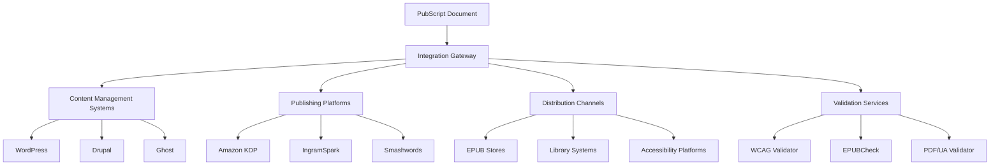

# WIA PubScript Integration Specification

**Phase 4: Publishing Platform Integration Standard**

**Version**: 1.0.0
**Status**: Draft
**Date**: 2025-01
**Primary Color**: #8B5CF6 (Violet)

---

## Overview

### 1.1 Purpose

WIA PubScript Integration defines standards for integrating with publishing platforms, content management systems, EPUB3 ecosystems, and accessibility compliance frameworks. This specification enables seamless deployment of PubScript documents across the publishing industry while maintaining WCAG 2.1 AA compliance and multi-format support.

### 1.2 Design Goals

1. **Platform Agnostic**: Work with any CMS or publishing platform
2. **Standards Compliant**: EPUB3, PDF/UA, WCAG 2.1 AA, ONIX
3. **Extensible**: Plugin architecture for custom integrations
4. **Automated**: Streamlined publishing workflows
5. **Quality Assured**: Built-in validation and certification
6. **Cloud Native**: Support for modern cloud infrastructure

### 1.3 Integration Architecture



---

## Content Management System Integration

### 2.1 WordPress Integration

#### 2.1.1 WordPress Plugin

```php
<?php
/**
 * Plugin Name: WIA PubScript
 * Description: Accessible multi-format publishing with PubScript
 * Version: 1.0.0
 * Author: WIA
 */

class WIA_PubScript_Plugin {
    public function __construct() {
        add_action('init', [$this, 'register_post_type']);
        add_action('add_meta_boxes', [$this, 'add_meta_boxes']);
        add_action('save_post', [$this, 'save_document']);
        add_filter('the_content', [$this, 'render_pubscript']);
    }

    public function register_post_type() {
        register_post_type('pubscript_doc', [
            'label' => 'PubScript Documents',
            'public' => true,
            'supports' => ['title', 'editor', 'author'],
            'menu_icon' => 'dashicons-book',
            'capability_type' => 'post',
        ]);
    }

    public function add_meta_boxes() {
        add_meta_box(
            'pubscript_metadata',
            'PubScript Metadata',
            [$this, 'render_metadata_box'],
            'pubscript_doc',
            'normal',
            'high'
        );

        add_meta_box(
            'pubscript_accessibility',
            'Accessibility Settings',
            [$this, 'render_accessibility_box'],
            'pubscript_doc',
            'side',
            'default'
        );

        add_meta_box(
            'pubscript_export',
            'Export Formats',
            [$this, 'render_export_box'],
            'pubscript_doc',
            'side',
            'default'
        );
    }

    public function save_document($post_id) {
        if (get_post_type($post_id) !== 'pubscript_doc') {
            return;
        }

        $pubscript_data = [
            'wia_version' => '1.0.0',
            'document_id' => 'doc-wp-' . $post_id,
            'document_info' => [
                'title' => get_the_title($post_id),
                'language' => get_post_meta($post_id, '_pubscript_language', true),
                'created' => get_the_date('c', $post_id),
                'modified' => get_the_modified_date('c', $post_id),
            ],
            'accessibility' => [
                'wcag_level' => get_post_meta($post_id, '_wcag_level', true),
                'wcag_version' => '2.1',
            ],
        ];

        update_post_meta($post_id, '_pubscript_data', $pubscript_data);

        // Trigger validation
        $this->validate_accessibility($post_id);
    }

    public function render_pubscript($content) {
        global $post;

        if (get_post_type() !== 'pubscript_doc') {
            return $content;
        }

        $pubscript_data = get_post_meta($post->ID, '_pubscript_data', true);

        // Render with accessibility features
        return $this->render_accessible_content($content, $pubscript_data);
    }
}

new WIA_PubScript_Plugin();
```

#### 2.1.2 Gutenberg Block

```javascript
import { registerBlockType } from '@wordpress/blocks';
import { RichText, InspectorControls } from '@wordpress/block-editor';
import { PanelBody, TextControl, SelectControl } from '@wordpress/components';

registerBlockType('wia/pubscript-section', {
  title: 'PubScript Section',
  icon: 'book',
  category: 'text',

  attributes: {
    content: {
      type: 'string',
      source: 'html',
      selector: 'div',
    },
    sectionId: {
      type: 'string',
    },
    semanticRole: {
      type: 'string',
      default: 'paragraph',
    },
    ariaLabel: {
      type: 'string',
    },
  },

  edit: ({ attributes, setAttributes }) => {
    return (
      <>
        <InspectorControls>
          <PanelBody title="Accessibility Settings">
            <TextControl
              label="Section ID"
              value={attributes.sectionId}
              onChange={(sectionId) => setAttributes({ sectionId })}
            />
            <SelectControl
              label="Semantic Role"
              value={attributes.semanticRole}
              options={[
                { label: 'Paragraph', value: 'paragraph' },
                { label: 'Introduction', value: 'introduction' },
                { label: 'Note', value: 'note' },
                { label: 'Warning', value: 'warning' },
              ]}
              onChange={(semanticRole) => setAttributes({ semanticRole })}
            />
            <TextControl
              label="ARIA Label"
              value={attributes.ariaLabel}
              onChange={(ariaLabel) => setAttributes({ ariaLabel })}
            />
          </PanelBody>
        </InspectorControls>

        <RichText
          tagName="div"
          value={attributes.content}
          onChange={(content) => setAttributes({ content })}
          placeholder="Enter section content..."
        />
      </>
    );
  },

  save: ({ attributes }) => {
    return (
      <div
        id={attributes.sectionId}
        role={attributes.semanticRole}
        aria-label={attributes.ariaLabel}
      >
        <RichText.Content value={attributes.content} />
      </div>
    );
  },
});
```

### 2.2 Drupal Integration

```php
<?php
/**
 * @file
 * Contains \Drupal\pubscript\Plugin\Field\FieldFormatter\PubScriptFormatter.
 */

namespace Drupal\pubscript\Plugin\Field\FieldFormatter;

use Drupal\Core\Field\FormatterBase;
use Drupal\Core\Field\FieldItemListInterface;

/**
 * Plugin implementation of the 'pubscript' formatter.
 *
 * @FieldFormatter(
 *   id = "pubscript",
 *   label = @Translation("PubScript Formatter"),
 *   field_types = {
 *     "text_long",
 *     "text_with_summary"
 *   }
 * )
 */
class PubScriptFormatter extends FormatterBase {

  /**
   * {@inheritdoc}
   */
  public function viewElements(FieldItemListInterface $items, $langcode) {
    $elements = [];

    foreach ($items as $delta => $item) {
      $pubscript_data = json_decode($item->value, true);

      $elements[$delta] = [
        '#theme' => 'pubscript_document',
        '#document' => $pubscript_data,
        '#attached' => [
          'library' => [
            'pubscript/pubscript-renderer',
          ],
        ],
      ];
    }

    return $elements;
  }
}
```

---

## Publishing Platform Integration

### 3.1 Amazon Kindle Direct Publishing (KDP)

```typescript
interface KDPExport {
  // Export PubScript to KDP-ready format
  exportToKDP(document: PubScriptDocument): Promise<KDPPackage>;
}

class KDPExporter implements KDPExport {
  async exportToKDP(document: PubScriptDocument): Promise<KDPPackage> {
    // Convert to KDP format
    const mobi = await this.convertToMOBI(document);
    const epub = await this.convertToEPUB3(document);

    // Generate KDP metadata
    const metadata = this.generateKDPMetadata(document);

    // Create package
    return {
      formats: {
        mobi: mobi,
        epub: epub,
      },
      metadata: metadata,
      cover: await this.generateCover(document),
      preview: await this.generatePreview(document),
    };
  }

  private generateKDPMetadata(document: PubScriptDocument): KDPMetadata {
    return {
      title: document.document_info.title,
      subtitle: document.document_info.subtitle,
      authors: document.authors.map((a) => a.name),
      description: this.extractDescription(document),
      language: document.document_info.language,
      keywords: this.extractKeywords(document),
      categories: this.mapToKDPCategories(document),
      publish_date: document.document_info.created,
      isbn: document.rights.doi,
      drm_enabled: false,
      pricing: {
        usd: 9.99,
        territories: 'WORLDWIDE',
      },
    };
  }
}
```

### 3.2 IngramSpark Integration

```json
{
  "ingram_spark_export": {
    "format": "epub3",
    "print_ready": true,
    "metadata": {
      "title": "Accessible Publishing in the Digital Age",
      "contributors": [
        {
          "name": "Sarah Chen",
          "role": "author",
          "sequence": 1
        }
      ],
      "bisac_codes": [
        "COM060000",
        "LAN025000"
      ],
      "onix_feed": true,
      "isbn_13": "978-1-234567-89-0"
    },
    "print_specifications": {
      "trim_size": "6x9",
      "binding": "perfect_bound",
      "interior_color": "black_and_white",
      "paper_type": "white",
      "page_count": 256
    },
    "distribution": {
      "amazon": true,
      "barnes_noble": true,
      "libraries": true,
      "bookstores": true
    }
  }
}
```

### 3.3 Open Access Repository Integration

```python
from typing import Dict, Any
import requests

class OpenAccessExporter:
    """Export PubScript documents to open access repositories"""

    def __init__(self, repository_url: str, api_key: str):
        self.repository_url = repository_url
        self.api_key = api_key

    def export_to_zenodo(self, document: Dict[str, Any]) -> Dict[str, Any]:
        """Export to Zenodo repository"""

        # Create Zenodo metadata
        metadata = {
            "metadata": {
                "title": document["document_info"]["title"],
                "upload_type": "publication",
                "publication_type": "book",
                "description": self.extract_description(document),
                "creators": [
                    {
                        "name": author["name"],
                        "affiliation": author.get("affiliation", ""),
                        "orcid": author.get("orcid", "")
                    }
                    for author in document["authors"]
                ],
                "access_right": "open",
                "license": document["rights"]["license"],
                "keywords": self.extract_keywords(document),
                "language": document["document_info"]["language"],
            }
        }

        # Upload files
        files = {
            "html": self.convert_to_html(document),
            "pdf": self.convert_to_pdf(document),
            "epub": self.convert_to_epub(document),
        }

        # Create deposition
        response = requests.post(
            f"{self.repository_url}/api/deposit/depositions",
            headers={"Authorization": f"Bearer {self.api_key}"},
            json=metadata
        )

        deposition_id = response.json()["id"]

        # Upload files
        for format_type, file_data in files.items():
            requests.put(
                f"{self.repository_url}/api/deposit/depositions/{deposition_id}/files",
                data=file_data,
                headers={"Authorization": f"Bearer {self.api_key}"}
            )

        # Publish
        requests.post(
            f"{self.repository_url}/api/deposit/depositions/{deposition_id}/actions/publish",
            headers={"Authorization": f"Bearer {self.api_key}"}
        )

        return response.json()
```

---

## EPUB3 Ecosystem Integration

### 4.1 EPUB3 Generation

```typescript
import { EPUBGenerator } from '@wia/pubscript-epub';

class EPUB3Generator {
  async generate(document: PubScriptDocument): Promise<EPUBPackage> {
    const epub = new EPUBPackage();

    // Add metadata
    epub.setMetadata({
      title: document.document_info.title,
      language: document.document_info.language,
      identifier: document.document_id,
      creators: document.authors.map((a) => ({
        name: a.name,
        role: a.role,
      })),
      publisher: document.rights.copyright,
      rights: document.rights.license,
      // EPUB Accessibility metadata
      accessibility: {
        conformsTo: 'EPUB Accessibility 1.1 - WCAG 2.1 Level AA',
        certifiedBy: 'WIA PubScript',
        accessMode: ['textual', 'visual'],
        accessModeSufficient: ['textual', 'visual'],
        accessibilityFeature: [
          'alternativeText',
          'readingOrder',
          'structuralNavigation',
          'tableOfContents',
          'MathML',
          'describedMath',
          'longDescription',
        ],
        accessibilityHazard: ['noFlashingHazard', 'noSoundHazard', 'noMotionSimulationHazard'],
        accessibilitySummary:
          'This publication meets WCAG 2.1 Level AA standards and includes complete alternative text, proper semantic structure, and navigation aids.',
      },
    });

    // Generate content documents
    for (const chapter of document.structure.outline) {
      const xhtml = await this.generateXHTML(chapter);
      epub.addContentDocument(chapter.id, xhtml);
    }

    // Generate navigation document
    const nav = this.generateNavigation(document);
    epub.setNavigationDocument(nav);

    // Add CSS
    epub.addStylesheet('styles.css', this.generateCSS(document));

    // Add images with alt text
    for (const image of this.extractImages(document)) {
      epub.addImage(image.id, image.data, {
        alt: image.alt_text,
        longdesc: image.long_description,
      });
    }

    // Package and validate
    await epub.package();
    const validation = await this.validateEPUB(epub);

    if (!validation.valid) {
      throw new Error(`EPUB validation failed: ${validation.errors}`);
    }

    return epub;
  }

  private generateXHTML(chapter: Chapter): string {
    return `<?xml version="1.0" encoding="UTF-8"?>
<!DOCTYPE html>
<html xmlns="http://www.w3.org/1999/xhtml" xmlns:epub="http://www.idpf.org/2007/ops" xml:lang="en" lang="en">
<head>
  <meta charset="UTF-8"/>
  <title>${chapter.title}</title>
  <link rel="stylesheet" type="text/css" href="../styles/styles.css"/>
</head>
<body>
  <section epub:type="chapter" role="doc-chapter" aria-labelledby="chapter-title">
    <h1 id="chapter-title">${chapter.title}</h1>
    ${this.renderSections(chapter.sections)}
  </section>
</body>
</html>`;
  }

  private async validateEPUB(epub: EPUBPackage): Promise<ValidationResult> {
    const { exec } = require('child_process');
    const { promisify } = require('util');
    const execAsync = promisify(exec);

    // Run EPUBCheck
    const { stdout, stderr } = await execAsync(`epubcheck ${epub.path}`);

    return {
      valid: !stderr,
      errors: stderr ? stderr.split('\n') : [],
      warnings: stdout ? stdout.split('\n').filter((line) => line.includes('WARNING')) : [],
    };
  }
}
```

### 4.2 DAISY Audio Book Generation

```typescript
class DAISYGenerator {
  async generate(document: PubScriptDocument): Promise<DAISYPackage> {
    const daisy = new DAISYPackage();

    // Generate NCC (Navigation Control Center)
    daisy.setNCC({
      title: document.document_info.title,
      creator: document.authors[0].name,
      language: document.document_info.language,
      totalTime: await this.calculateTotalTime(document),
    });

    // Generate SMIL files (Synchronized Multimedia Integration Language)
    for (const chapter of document.structure.outline) {
      const audio = await this.synthesizeSpeech(chapter);
      const smil = this.generateSMIL(chapter, audio);

      daisy.addChapter({
        text: chapter,
        audio: audio,
        smil: smil,
      });
    }

    return daisy;
  }

  private async synthesizeSpeech(chapter: Chapter): Promise<AudioBuffer> {
    // Use neural TTS for high-quality audio
    const tts = new NeuralTTS({
      voice: 'en-US-Neural2-D',
      rate: 'medium',
      pitch: 'default',
    });

    const text = this.extractPlainText(chapter);
    return await tts.synthesize(text);
  }

  private generateSMIL(chapter: Chapter, audio: AudioBuffer): string {
    return `<?xml version="1.0" encoding="UTF-8"?>
<smil xmlns="http://www.w3.org/2001/SMIL20/">
  <head>
    <meta name="dc:format" content="Daisy 2.02"/>
  </head>
  <body>
    <seq dur="${audio.duration}s">
      ${this.generateSMILSequence(chapter, audio)}
    </seq>
  </body>
</smil>`;
  }
}
```

---

## WCAG Compliance Integration

### 5.1 Automated WCAG Validation

```typescript
import { WCAGValidator } from '@wia/wcag-validator';

interface WCAGValidationResult {
  level: 'A' | 'AA' | 'AAA';
  passed: boolean;
  score: number;
  violations: Violation[];
  warnings: Warning[];
  recommendations: Recommendation[];
}

class AccessibilityValidator {
  private validator: WCAGValidator;

  constructor() {
    this.validator = new WCAGValidator({
      level: 'AA',
      version: '2.1',
    });
  }

  async validate(document: PubScriptDocument): Promise<WCAGValidationResult> {
    const results = {
      level: 'AA' as const,
      passed: true,
      score: 100,
      violations: [] as Violation[],
      warnings: [] as Warning[],
      recommendations: [] as Recommendation[],
    };

    // Check 1.1.1 - Non-text Content
    await this.checkAltText(document, results);

    // Check 1.3.1 - Info and Relationships
    await this.checkSemanticStructure(document, results);

    // Check 1.3.2 - Meaningful Sequence
    await this.checkReadingOrder(document, results);

    // Check 1.4.3 - Contrast (Minimum)
    await this.checkColorContrast(document, results);

    // Check 2.1.1 - Keyboard
    await this.checkKeyboardAccessibility(document, results);

    // Check 2.4.1 - Bypass Blocks
    await this.checkSkipLinks(document, results);

    // Check 2.4.2 - Page Titled
    await this.checkPageTitles(document, results);

    // Check 2.4.6 - Headings and Labels
    await this.checkHeadingHierarchy(document, results);

    // Check 3.1.1 - Language of Page
    await this.checkLanguage(document, results);

    // Check 3.1.2 - Language of Parts
    await this.checkLanguageOfParts(document, results);

    // Check 4.1.2 - Name, Role, Value
    await this.checkARIA(document, results);

    // Calculate final score
    results.score = this.calculateScore(results);
    results.passed = results.violations.length === 0;

    return results;
  }

  private async checkAltText(
    document: PubScriptDocument,
    results: WCAGValidationResult
  ): Promise<void> {
    const images = this.extractImages(document);

    for (const image of images) {
      if (!image.alt_text || image.alt_text.trim() === '') {
        results.violations.push({
          guideline: '1.1.1',
          level: 'A',
          element: image.id,
          message: 'Image missing alternative text',
          fix: 'Add descriptive alt text to the image',
        });
      } else if (image.alt_text.length < 10 && !image.decorative) {
        results.warnings.push({
          guideline: '1.1.1',
          level: 'A',
          element: image.id,
          message: 'Alternative text may be too short',
          suggestion: 'Consider providing more detailed description',
        });
      }

      // Check for complex images
      if (this.isComplexImage(image) && !image.long_description) {
        results.recommendations.push({
          guideline: '1.1.1',
          element: image.id,
          message: 'Complex image should have long description',
          priority: 'high',
        });
      }
    }
  }

  private async checkHeadingHierarchy(
    document: PubScriptDocument,
    results: WCAGValidationResult
  ): Promise<void> {
    const headings = this.extractHeadings(document);
    let previousLevel = 0;

    for (const heading of headings) {
      // Check for skipped levels
      if (heading.level > previousLevel + 1) {
        results.violations.push({
          guideline: '2.4.6',
          level: 'AA',
          element: heading.id,
          message: `Heading hierarchy skips from h${previousLevel} to h${heading.level}`,
          fix: `Use h${previousLevel + 1} instead of h${heading.level}`,
        });
      }

      // Check for multiple h1
      if (heading.level === 1 && previousLevel === 1) {
        results.warnings.push({
          guideline: '2.4.6',
          level: 'AA',
          element: heading.id,
          message: 'Multiple h1 headings found',
          suggestion: 'Use only one h1 per page',
        });
      }

      previousLevel = heading.level;
    }
  }
}
```

---

## Library System Integration

### 6.1 MARC Record Generation

```typescript
interface MARCRecord {
  leader: string;
  fields: MARCField[];
}

class MARCGenerator {
  generate(document: PubScriptDocument): MARCRecord {
    return {
      leader: '00000nam a2200000 a 4500',
      fields: [
        // 001 - Control Number
        { tag: '001', value: document.document_id },

        // 003 - Control Number Identifier
        { tag: '003', value: 'WIA' },

        // 005 - Date and Time of Latest Transaction
        { tag: '005', value: this.formatMARCDate(new Date()) },

        // 008 - Fixed-Length Data Elements
        { tag: '008', value: this.generate008Field(document) },

        // 020 - ISBN
        { tag: '020', indicators: '  ', subfields: [{ code: 'a', value: document.rights.doi }] },

        // 040 - Cataloging Source
        {
          tag: '040',
          indicators: '  ',
          subfields: [
            { code: 'a', value: 'WIA' },
            { code: 'c', value: 'WIA' },
          ],
        },

        // 100 - Main Entry - Personal Name
        {
          tag: '100',
          indicators: '1 ',
          subfields: [
            { code: 'a', value: document.authors[0].name },
            { code: 'e', value: 'author' },
          ],
        },

        // 245 - Title Statement
        {
          tag: '245',
          indicators: '10',
          subfields: [
            { code: 'a', value: document.document_info.title },
            { code: 'b', value: document.document_info.subtitle || '' },
            { code: 'c', value: this.formatAuthors(document.authors) },
          ],
        },

        // 264 - Production, Publication, Distribution
        {
          tag: '264',
          indicators: ' 1',
          subfields: [
            { code: 'a', value: 'Online' },
            { code: 'b', value: 'WIA Press' },
            { code: 'c', value: document.document_info.created.substring(0, 4) },
          ],
        },

        // 300 - Physical Description
        {
          tag: '300',
          indicators: '  ',
          subfields: [{ code: 'a', value: `${document.structure.chapters} chapters` }],
        },

        // 506 - Restrictions on Access
        {
          tag: '506',
          indicators: '0 ',
          subfields: [{ code: 'a', value: 'Open access' }],
        },

        // 520 - Summary
        {
          tag: '520',
          indicators: '  ',
          subfields: [{ code: 'a', value: this.extractSummary(document) }],
        },

        // 538 - System Details Note
        {
          tag: '538',
          indicators: '  ',
          subfields: [{ code: 'a', value: 'Available in HTML, PDF, EPUB, Braille, and Audio formats' }],
        },

        // 540 - Terms Governing Use
        {
          tag: '540',
          indicators: '  ',
          subfields: [{ code: 'a', value: document.rights.license }],
        },

        // 546 - Language Note
        {
          tag: '546',
          indicators: '  ',
          subfields: [{ code: 'a', value: this.languageName(document.document_info.language) }],
        },

        // 588 - Accessibility Note
        {
          tag: '588',
          indicators: '  ',
          subfields: [
            {
              code: 'a',
              value: `WCAG ${document.accessibility.wcag_version} Level ${document.accessibility.wcag_level} compliant`,
            },
          ],
        },

        // 856 - Electronic Location and Access
        {
          tag: '856',
          indicators: '40',
          subfields: [
            { code: 'u', value: `https://pubscript.org/documents/${document.document_id}` },
            { code: 'z', value: 'Access online version' },
          ],
        },
      ],
    };
  }
}
```

---

## Certification Framework

### 7.1 PubScript Certification Levels

#### Bronze Level Certification

**Requirements:**
- [x] Valid PubScript JSON format
- [x] Complete document metadata
- [x] Author information present
- [x] Language specification
- [x] Basic structure (chapters/sections)

**Accessibility:**
- [x] WCAG 2.1 Level A compliance
- [x] Alternative text for all images
- [x] Basic heading hierarchy
- [x] Language attributes

**Output Formats:**
- [x] HTML export functional
- [x] PDF export functional

**Validation:**
- [x] No critical errors
- [x] Document structure valid

#### Silver Level Certification

**Requirements:**
- [x] All Bronze requirements
- [x] Complete Dublin Core metadata
- [x] Version control enabled
- [x] Reading order defined
- [x] Semantic markup throughout

**Accessibility:**
- [x] WCAG 2.1 Level AA compliance
- [x] Long descriptions for complex images
- [x] Proper ARIA labels
- [x] Keyboard navigation support
- [x] Color contrast meets AA standards
- [x] Skip navigation links

**Output Formats:**
- [x] HTML, PDF, EPUB3 exports
- [x] Responsive design
- [x] Print-optimized PDF

**Validation:**
- [x] No accessibility violations
- [x] EPUBCheck passes
- [x] Valid semantic structure

#### Gold Level Certification

**Requirements:**
- [x] All Silver requirements
- [x] Complete ONIX metadata
- [x] Multi-language support
- [x] Collaborative editing metadata
- [x] Translation workflow data

**Accessibility:**
- [x] WCAG 2.1 Level AA+ compliance
- [x] Braille output available
- [x] DAISY audio book available
- [x] Tactile graphics for complex diagrams
- [x] Screen reader tested and optimized
- [x] Keyboard shortcuts documented

**Output Formats:**
- [x] All formats (HTML, PDF, EPUB3, Braille, Audio)
- [x] Multiple device optimization
- [x] Offline reading support
- [x] PDF/UA compliant

**Quality:**
- [x] Professional editing
- [x] Comprehensive testing
- [x] User testing with assistive technologies
- [x] Performance optimized

#### Platinum Level Certification

**Requirements:**
- [x] All Gold requirements
- [x] Published in open access repository
- [x] DOI registered
- [x] MARC record generated
- [x] Library system integration

**Accessibility:**
- [x] WCAG 2.1 Level AAA for key content
- [x] Multiple accessibility modes
- [x] Certified by independent auditor
- [x] User testing across disability types
- [x] Accessibility statement published
- [x] Continuous accessibility monitoring

**Output Formats:**
- [x] All formats with multiple quality levels
- [x] Adaptive format selection
- [x] Offline-first progressive web app
- [x] Mobile apps (iOS/Android)
- [x] Voice assistant integration

**Quality & Distribution:**
- [x] Professional indexing
- [x] Distributed via major platforms
- [x] Library systems integrated
- [x] Analytics and usage tracking
- [x] Community feedback incorporated
- [x] Regular updates and maintenance

**Innovation:**
- [x] Advanced features (AR/VR, interactive)
- [x] AI-powered enhancements
- [x] Custom accessibility innovations

---

## Integration Checklist

### 8.1 Pre-Integration Checklist

**Document Preparation:**
- [ ] Document structure validated
- [ ] All metadata fields complete
- [ ] Author information verified
- [ ] Rights and licensing clear
- [ ] Version control initialized
- [ ] Content proofread and edited

**Accessibility Preparation:**
- [ ] All images have alt text
- [ ] Complex images have long descriptions
- [ ] Heading hierarchy validated
- [ ] Reading order defined
- [ ] ARIA labels added where needed
- [ ] Color contrast checked
- [ ] Keyboard navigation tested
- [ ] Screen reader tested

**Format Preparation:**
- [ ] HTML template configured
- [ ] PDF layout designed
- [ ] EPUB3 styles defined
- [ ] Braille translation table selected
- [ ] Audio voice selected
- [ ] Cover image designed
- [ ] Metadata verified

### 8.2 Integration Testing Checklist

**Platform Integration:**
- [ ] CMS plugin installed
- [ ] API credentials configured
- [ ] Webhook endpoints set up
- [ ] Storage configured
- [ ] CDN configured
- [ ] Backup system in place

**Format Testing:**
- [ ] HTML renders correctly
- [ ] PDF layout correct
- [ ] EPUB3 validates with EPUBCheck
- [ ] Braille output verified
- [ ] Audio synthesis quality checked
- [ ] All formats downloadable

**Accessibility Testing:**
- [ ] WCAG validator passes
- [ ] Screen reader testing (JAWS)
- [ ] Screen reader testing (NVDA)
- [ ] Screen reader testing (VoiceOver)
- [ ] Keyboard navigation works
- [ ] High contrast mode works
- [ ] Text resize works (up to 200%)
- [ ] Focus indicators visible

**Cross-Platform Testing:**
- [ ] Desktop browsers (Chrome, Firefox, Safari, Edge)
- [ ] Mobile browsers (iOS Safari, Android Chrome)
- [ ] E-readers (Kindle, Kobo, Apple Books)
- [ ] Tablet devices
- [ ] Screen readers on all platforms
- [ ] Braille displays

**Performance Testing:**
- [ ] Page load time < 3 seconds
- [ ] Large documents handle well
- [ ] Concurrent users supported
- [ ] CDN serving correctly
- [ ] Caching working
- [ ] Mobile performance optimized

### 8.3 Post-Integration Checklist

**Publishing:**
- [ ] Document published to CMS
- [ ] All formats generated
- [ ] Distribution channels configured
- [ ] Analytics tracking enabled
- [ ] SEO metadata added
- [ ] Social media cards configured

**Validation:**
- [ ] Final WCAG validation
- [ ] EPUBCheck validation
- [ ] PDF/UA validation
- [ ] Link checking complete
- [ ] Spell checking complete
- [ ] Accessibility audit complete

**Distribution:**
- [ ] Uploaded to Amazon KDP
- [ ] Uploaded to IngramSpark
- [ ] Submitted to EPUB stores
- [ ] Added to library systems
- [ ] Registered with DOI provider
- [ ] Submitted to open access repository

**Monitoring:**
- [ ] Analytics dashboard configured
- [ ] Error monitoring active
- [ ] User feedback system in place
- [ ] Accessibility monitoring active
- [ ] Performance monitoring active
- [ ] Update schedule defined

---

## API Integration Examples

### 9.1 REST API Integration

```typescript
import axios from 'axios';

class PubScriptAPI {
  private baseURL = 'https://api.pubscript.org/v1';
  private apiKey: string;

  constructor(apiKey: string) {
    this.apiKey = apiKey;
  }

  async publishToPlatform(
    documentId: string,
    platform: string
  ): Promise<PublishResult> {
    const response = await axios.post(
      `${this.baseURL}/publish`,
      {
        document_id: documentId,
        platform: platform,
        formats: ['html', 'pdf', 'epub3'],
      },
      {
        headers: {
          Authorization: `Bearer ${this.apiKey}`,
          'Content-Type': 'application/json',
        },
      }
    );

    return response.data;
  }

  async getCertificationStatus(
    documentId: string
  ): Promise<CertificationStatus> {
    const response = await axios.get(
      `${this.baseURL}/certification/${documentId}`,
      {
        headers: {
          Authorization: `Bearer ${this.apiKey}`,
        },
      }
    );

    return response.data;
  }
}
```

---

## Version History

| Version | Date | Changes |
|---------|------|---------|
| 1.0.0 | 2025-01 | Initial specification |

---

**Document Version**: 1.0.0
**Last Updated**: 2025-01-15
**Author**: WIA PubScript Working Group

---

弘益人間 - *Benefit All Humanity*
